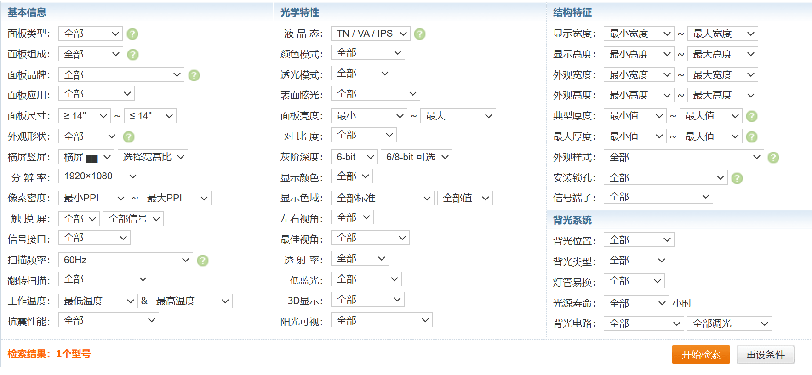

# 第一步：挑选合适的面板

首先在[屏库](https://www.panelook.cn)挑选自己喜欢的屏幕，以下是各种可供挑选的参数

主要的几个就是：尺寸、分辨率、频率、TN/VA/IPS、亮度、对比度、灰阶深度、色域

# 第二步：选择驱动板

一般的笔记本屏幕用的都是LVDS和eDP接口，TTL和TMDS接口使用的很少，且均已停产。

>- eDP：https://www.panelook.cn/appmodlist_cn.php?st=&pl=&applications[]=120&signal_type_category=70
>- LVDS：https://www.panelook.cn/appmodlist_cn.php?st=&pl=&applications[]=120&signal_type_category=90
>- TMDS：https://www.panelook.cn/appmodlist_cn.php?st=&pl=&applications[]=120&signal_type_category=216
>- TTL：https://www.panelook.cn/appmodlist_cn.php?st=&pl=&applications[]=120&signal_type_category=220

专业显示器中，除了LVDS、eDP接口和部分V-by-One接口，其他均已停产
>- Analog：https://www.panelook.cn/appmodlist_cn.php?st=&pl=&applications[]=41&signal_type_category=10
>
>- Analog + Digital：https://www.panelook.cn/appmodlist_cn.php?st=&pl=&applications[]=41&signal_type_category=13
>
>- eDP：https://www.panelook.cn/appmodlist_cn.php?st=&pl=&applications[]=41&signal_type_category=70
>
>- LVDS：https://www.panelook.cn/appmodlist_cn.php?st=&pl=&applications[]=41&signal_type_category=90
>
>- Mini LVDS：https://www.panelook.cn/appmodlist_cn.php?st=&pl=&applications[]=41&signal_type_category=135
>
>- OpenLDI：https://www.panelook.cn/appmodlist_cn.php?st=&pl=&applications[]=41&signal_type_category=156
>
>- RSDS：https://www.panelook.cn/appmodlist_cn.php?st=&pl=&applications[]=41&signal_type_category=173
>
>- TMDS：https://www.panelook.cn/appmodlist_cn.php?st=&pl=&applications[]=41&signal_type_category=216
>
>- TTL：https://www.panelook.cn/appmodlist_cn.php?st=&pl=&applications[]=41&signal_type_category=220
>
>- TTL/RSDS：https://www.panelook.cn/appmodlist_cn.php?st=&pl=&applications[]=41&signal_type_category=223
>
>- V-by-One：https://www.panelook.cn/appmodlist_cn.php?st=&pl=&applications[]=41&signal_type_category=240

所以，在选择驱动板时，仅需要注意LVDS和eDP两种接口类型，如果选择了比较冷门的面板，那就要花钱定制驱动板，或者去找拆机的驱动板了。

再确定接口类型后，按自己的需求选择HDMI、DP、Type-c、VGA等接口类型。

# 第三步：组装

可以定制外壳，也可以使用积木组装，看个人喜好，