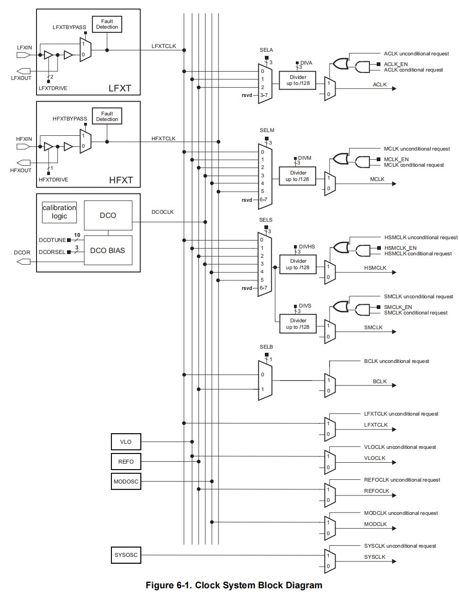

## 一、时钟简介

技术手册.pdf的Page380



两个外部时钟源：

- LFXT：外部低速时钟
- HFXT：外部高速时钟

5个内部时钟源：

- DCO数控时钟：默认时钟频率为3MHz。使用内部电阻时，精度不高，可以外接高精度电阻提高时钟精度。可以使用软件调节时钟频率，最高可以达到64MHz，是默认最大频率48MHz的1.33333倍。
- VLO：超低功耗低频时钟源，输出典型时钟频率为9.4KHz。
- REFO：低频时钟源，一个典型输出时钟频率为32768Hz，一个典型输出时钟频率为128KHz。
- MODOSC：模块振荡器，典型频率为25MHz。
- SYSOSC：系统振荡器，典型频率为5MHz。

梯形的是选择器，右上三个选择器后面连接着四个分频器

- 第一个分频器分出来的是ACLK（辅助时钟），可以选择LFXT、VLO、REFO作为时钟源。可以给各个外设提供时钟。最大频率为128kHz
- 第二个分频器分出来的是MCLK（主时钟），六个时钟源都可以用。CPU和滴答定时器连在这个时钟，外设也可以使用这个时钟。
- 第三个和第四个分频器分出来的是HSMCLK（子系统时钟）和SMCLK（低速子系统时钟），6个时钟源都可以使用。都是给外设使用的。

右上六个选择器连接的时钟依次是BCLK、LFXT时钟、VLO时钟、REFO时钟、MOD时钟、SYSOSC时钟

- BCLK是低速被用时钟，可以选择LFXT和REFO作为时钟源。最大频率被限制在32768Hz。

默认时钟频率（技术手册.pdf的Page381）：

- 不配置时，进入内核等级电压0。等级0时，内核的最大频率只有24MHz。ACLK和BCLK是连接到外部低速晶振的，但此时外部晶振被禁用，因为它的引脚被设置为通用IO口，要启用必须要复用。所以系统将REFO开启并连接到ACLK和BCLK 。 此时ACLK和BCLK的频率为32768Hz。
- 不配置时，外部高速晶振也是默认不启用的。此时，MCLK、HSMCLK、SMCLK都连接到DCO数控时钟源。此时，他们的频率都为3MHz。

时钟故障机制（芯片数据手册Page122）：

- LFXT故障时，REFO时钟接管
- HFXT故障时，SYSOSC时钟会接管
- DCO数控时钟外部电阻故障（开路或短路）时，会使用内部电阻。

## 二、配置外部晶振

> 配置时钟频率：
>
> > CS_setExternalClockSourceFrequency(lfxtFreq, hfxtFreq);
>
> 配置驱动模式：
>
> > CS_startHFXTWithTimeout(bypassMode,timeout);
> > CS_startLFXTWithTimeout(bypassMode,timeout);
> > CS_startHFXT(bypassMode);	//这两条函数是类似上面两条函数，timeout=0
> > CS_startLFXT(bypassMode);	
>
> 我们需要配置内核电压等级为1，此时内核频率有48MHz。但是此时Flash的工作频率不匹配了，所以我们要设置Flash的等待状态为1。
> 最后，我们还需要将MCLK、SMCLK、HSMCLK连接上外部高速晶振。
>
> 配置内核电压等级：芯片数据手册Page29
>
> > PCM_setCoreVoltageLevel(voltageLevel);
>
> 设置Flash等待状态：芯片数据手册Page30
>
> > FlashCtl_setWaitState(bank, waitState);
>
> 初始化时钟：
>
> > CS_initClockSignal(clk,clkSource,clkSourceDiv);
>
> 获取时钟频率：
>
> > CS_getACLK();
> > CS_getMCLK();
> > CS_getSMCLK();
> > CS_getHSMCLK();

配置外部晶振部分代码：

```c
	//将GPIO复用为主功能（PIN0、PIN1、PIN2、PIN3）
	GPIO_setAsPeripheralModuleFunctionInputPin(GPIO_PORT_PJ, GPIO_PIN0, GPIO_PRIMARY_MODULE_FUNCTION);
	GPIO_setAsPeripheralModuleFunctionInputPin(GPIO_PORT_PJ, GPIO_PIN1, GPIO_PRIMARY_MODULE_FUNCTION);
	GPIO_setAsPeripheralModuleFunctionInputPin(GPIO_PORT_PJ, GPIO_PIN2, GPIO_PRIMARY_MODULE_FUNCTION);
	GPIO_setAsPeripheralModuleFunctionInputPin(GPIO_PORT_PJ, GPIO_PIN3, GPIO_PRIMARY_MODULE_FUNCTION);
	//设置外部时钟频率，低速外部时钟设置为32768，高速外部时钟设置为48M
	CS_setExternalClockSourceFrequency(32768, 48000000);
	//设置内核电压等级为1
	PCM_setCoreVoltageLevel(PCM_VCORE1);
	//设置Flash等待状态为1
	FlashCtl_setWaitState(FLASH_BANK0, 1);
	FlashCtl_setWaitState(FLASH_BANK1, 1);
	//关于驱动等级的选择，可以看芯片数据手册Page45
	//外部高速时钟是无源的，所以设置为false；设置外部低速时钟为驱动等级3
	CS_startHFXT(false);
	CS_startLFXT(CS_LFXT_DRIVE3);
	//将MCLK、HSMCLK、SMCLK连接到外部晶振，其中HSMCLK、SMCLK是一起的，所以设置一个就行
	CS_initClockSignal(CS_MCLK, CS_HFXTCLK_SELECT, CS_CLOCK_DIVIDER_1);
	CS_initClockSignal(CS_SMCLK, CS_HFXTCLK_SELECT, CS_CLOCK_DIVIDER_1);
```


