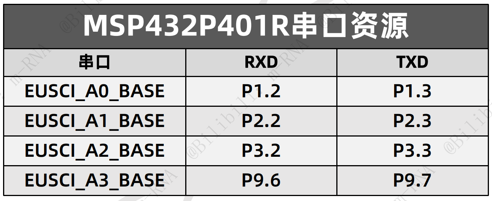

## 一、串口简介

参考资料：

技术手册Page904
开发板手册Page38
芯片数据手册Page6

有4个串口，其中A0是通过跳线帽传到调试器的



eUSCI_A模块可以支持串口模式和SPI模式

eUSCI_B模块可以支持SPI模式和IIC模式

eUSCI_A模块支持的串口模式特性包括：（通过配置结构体实现）

- 7/8个数据位、1个奇/偶/无奇偶校验位;
- 独立的发送和接收移位寄存器;
- 独立的发送和接收缓冲寄存器;
- LSB优先/MSB优先的数据发送和接收;
- 为多处理器系统内置空闲线和地址位通信协议;
- 支持分数波特率的可编程调制波特率;
- 用于错误检测和抑制的状态标志;
- 针对地址检测的状态标志;
- 针对接收、发送,起始位接收和发送完成的独立中断能力。 

## 二、相关库函数

> ## uart.h
>
> 初始化串口模块：
>
> > UART_initModule(EUSCI_Ax_BASE, &uartConfig);
> >
> > 参数：对应的串口，配置好的结构体
>
> 使能串口模块：
>
> > UART_enableModule(EUSCI_Ax_BASE);
>
> 开启串口相关中断：
>
> > UART_enableInterrupt(EUSCI_Ax_BASE, EUSCI_x_INTERRUPT);
>
> 获取数据：
>
> > UART_receiveData(EUSCI_Ax_BASE);
>
> 发送数据：
>
> > UART_transmitData(EUSCI_Ax_BASE，Data_8bit);
>
> ## interrupt.h
>
> 开启端口中断：
>
> > Interrupt_enableInterrupt(INT_EUSCIAx);
>
> 开启总中断：
>
> > Interrupt_enableMaster(void);

## 三、配置串口收发

- 配置时钟
- 配置GPIO复用
- 配置结构体
- 初始化串口
- 开启串口
- 开启串口相关中断
- 开启串口端口中断
- 开启总中断
- 编写UART ISR（串口中断函数）

不清除中断标志位的原因：系统会自动清除

结构体配置：

```c
const eUSCI_UART_ConfigV1 uartConfig =
{
        EUSCI_A_UART_CLOCKSOURCE_SMCLK,						// 时钟源选择SMCLK
        26, 												// BRDIV = 78
        0,													// UCxBRF = 2
        111,													// UCxBRS = 0
        EUSCI_A_UART_NO_PARITY,								 // 不进行奇偶校验
        EUSCI_A_UART_LSB_FIRST,									//低位在前
        EUSCI_A_UART_ONE_STOP_BIT,							//一位停止位
        EUSCI_A_UART_MODE,									 // UART模式
        EUSCI_A_UART_OVERSAMPLING_BAUDRATE_GENERATION,		// Oversampling
        EUSCI_A_UART_8_BIT_LEN,									//8位数据长
};
//http://software-dl.ti.com/msp430/msp430_public_sw/mcu/msp430/MSP430BaudRateConverter/index.html
第4、5、6、11行的数据由链接中的计算器得出
```

## 四、对接标准输入输出函数

参考资料：

[GETKEY.C（从串口读取输入）](assets\GETKEY.C)
[PUTCHAR.C（输出）](assets\PUTCHAR.C)
[STC15单片机串口printf函数重定向（第一个函数的讲解）](https://www.bilibili.com/video/BV1kS4y1w7Qj?spm_id_from=333.880.my_history.page.click&vd_source=ba89c885857d57586a8c5ab992d5927d) 
[C51也能printf_哔哩哔哩_bilibili](https://www.bilibili.com/video/BV1av411T7E8?p=1) 
 [cloud的MSP432入门教程_哔哩哔哩_bilibili](https://www.bilibili.com/video/BV1z4411u76P?p=7&spm_id_from=333.880.my_history.page.click&vd_source=ba89c885857d57586a8c5ab992d5927d) 

```c
//这个两个函数是对接的printf输出
char putchar(char c)
{
    Uart_1SendChar(c);	//将输出重定向到串口。官方的输出函数（PUTCHAR.C）中是将c的值给SBUF寄存器。
    return c;
}
//将输出重定向到串口。
void Uart1_SendChar(unsigned char Udat)
{
    SBUF = Udat;	//将需要输出的数据赋值给SBUF寄存器
    while(!TI);		//等待输出完成，并将TI置1
    TI=0;			//将TI置0
}
```

```c
#include "stdio.h"
//这个函数是对接的printf输出
//官方文件里写的是将输出的数据传输给SBUF寄存器
int fputc(int ch, FILE *f)//“FILE *f”可以不使用，仅用于传输标准输出文件
{
  UART_transmitData(EUSCI_A0_BASE, ch & 0xFF);//“ch & 0xFF”将ch限定到一个字节，通过“EUSCI_A0_BASE”模块输出
  return ch;
}

//这个函数对接的是scanf读取函数，首先等待接收数据完成，然后返回接收的数据
int fgetc(FILE *f)
{
  while (EUSCI_A_UART_RECEIVE_INTERRUPT_FLAG !=
         UART_getInterruptStatus(EUSCI_A0_BASE, EUSCI_A_UART_RECEIVE_INTERRUPT_FLAG));
  //等待接收中断成立
  return UART_receiveData(EUSCI_A0_BASE);	//返回接收的数据
}
```

