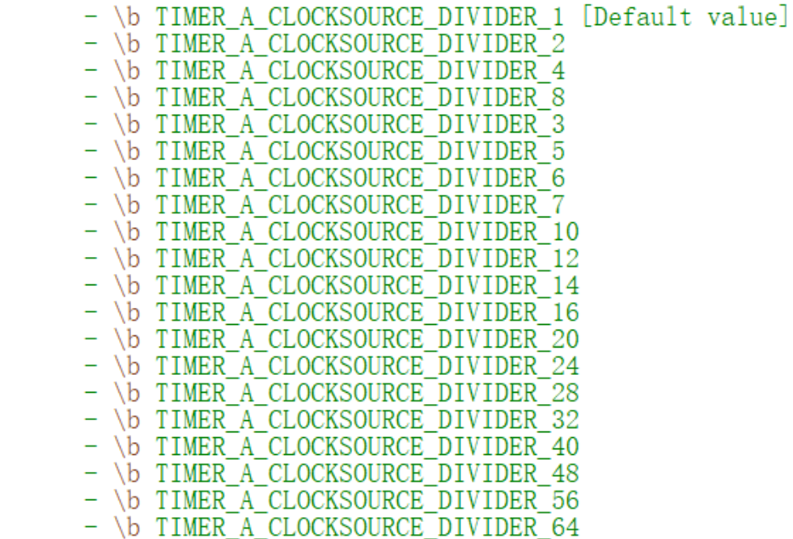

## 一、定时器A中断

四个定时器，每个定时器有5个通道（芯片数据手册Page6）

Timer_A的特性包括：（技术手册Page783 ）

- 具有4种操作模式的异步16位定时/计数器;
- 可选择和可配置的时钟源;
- 最多达7个可配置的捕获/比较模块;
- 具有PWM 功能的可配置输出;
- 异步输入和输出锁存。 

三种计数模式：连续计数模式、增计数模式、上下计数模式

连续计数模式：从0计数到0FFFFh
增计数模式：从0计数到设定值CCR0，计数值为CCR0+1，和STM32的ARR（自动重装载值类似）
先从0开始向上计数到CCR0，再向下计数到0

## 二、相关库函数

>## timer_a.h
>
>初始化定时器模块：
>
>> Timer_A_configureUpMode(TIMER_Ax_BASE, &upConfig);
>>
>> 入口参数：定时器、配置好的结构体地址
>
>选择计数模式开始计数：
>
>>Timer_A_startCounter(TIMER_Ax_BASE, TIMER_A_UP_MODE);
>>
>>入口参数：定时器、计数模式
>
>清除中断比较标志：
>
>>Timer_A_clearCaptureCompareInterrupt(TIMER_Ax, REGISTER_0);
>>
>>入口参数：定时器、定时器通道
>
>## interrupt.h
>
>开启定时器A端口中断：
>
>>Interrupt_enableInterrupt(INT_TAx_0);
>
>开启总中断：
>
>>Interrupt_enableMaster(void);

## 三、配置定时器中断

- 配置时钟
- 配置结构体
- 初始化定时器A
- 选择模式开始计数
- 清除比较中断标志位
- 开启定时器端口中断
- 开启总中断
- 编写TIMA ISR

配置结构体：

```c
    Timer_A_UpModeConfig upConfig;
    upConfig.clockSource = TIMER_A_CLOCKSOURCE_SMCLK;                                      //时钟源（可用ACLK、SMCLK）
    upConfig.clockSourceDivider = psc;                                                     //时钟分频 范围1-64
    upConfig.timerPeriod = ccr0;                                                           //自动重装载值（ARR）
    upConfig.timerInterruptEnable_TAIE = TIMER_A_TAIE_INTERRUPT_DISABLE;                   //禁用 tim溢出中断
    upConfig.captureCompareInterruptEnable_CCR0_CCIE = TIMER_A_CCIE_CCR0_INTERRUPT_ENABLE; //启用 ccr0更新中断
    upConfig.timerClear = TIMER_A_DO_CLEAR;                                                // 清零
```

时钟分频范围



## 四、定时器A的PWM输出功能

有7种输出模式，但常用的只有两种，模式2和模式6。CCR0确定整个输出的周期，CCR1/CCR2确定PWM的占空比。模式2和模式6是极性相反的PWM输出。输出方式类似于STM32中的PWM输出。

四个定时器：（芯片手册Page7）


## 五、相关库函数

> ## timer_a.h
>
> 初始化定时器为PWM模式
>
> > Timer_A_generatePWM(TIMER_Ax_BASE, &TimAx_PWMConfig);
> >
> > 入口参数：定时器、配置好的结构体地址 
>
> 改变比较值（占空比/周期）
>
> > Timer_A_setCompareValue(TIMER_Ax, COMPARE_REGISTER_x, CCR);
> >
> > 入口参数：定时器、定时器通道、比较值

## 六、配置PWM输出

- 配置时钟
- 配置GPIO复用
- 配置初始化结构体
- 初始化定时器

结构体

```c
    Timer_A_PWMConfig TimA1_PWMConfig;
    TimA1_PWMConfig.clockSource = TIMER_A_CLOCKSOURCE_SMCLK;             //时钟源
    TimA1_PWMConfig.clockSourceDivider = 48;                             //时钟分频 范围1-64
    TimA1_PWMConfig.timerPeriod = 19999;                                 //自动重装载值（ARR）
    TimA1_PWMConfig.compareRegister = TIMER_A_CAPTURECOMPARE_REGISTER_1; //通道一 （引脚定义）
    TimA1_PWMConfig.compareOutputMode = TIMER_A_OUTPUTMODE_TOGGLE_SET;   //输出模式，模式6
    TimA1_PWMConfig.dutyCycle = 9999;                                    //这里是改变占空比的地方
```

## 七、定时器A捕获

使用连续计数模式，即从0计数到0FFFFh，不断循环。

支持上升沿捕获和下降沿捕获

## 八、相关库函数

>## timer_a.h 
>
>初始化定时器为连续计数模式
>
>> Timer_A_configureContinuousMode(TIMER_Ax, &continuousModeConfig);
>>
>> 入口参数：定时器、配置好的结构体地址
>
>配置定时器的捕获模式
>
>> Timer_A_initCapture(TIMER_Ax_BASE，&captureModeConfig);
>
>选择模式开始计数
>
>> Timer_A_startCounter(TIMER_Ax_BASE, TIMER_A_CONTINUOUS_MODE);
>>
>> 入口参数：定时器、计数模式
>
>清除定时器溢出中断标志位
>
>> Timer_A_clearInterruptFlag(TIMER_Ax_BASE);
>
>清除定时器捕获中断标志位
>
>> Timer_A_clearCaptureCompareInterrupt(TIMER_Ax, REGISTER_N);
>
>获取定时器溢出中断状态
>
>> Timer_A_getEnabledInterruptStatus(TIMER_Ax_BASE);
>
>获取定时器捕获中断状态
>
>> Timer_A_getCaptureCompareEnabledInterruptStatus(TIMER_Ax, REGISTER_N);
>
>获取定时器捕获电平状态
>
>> Timer_A_getSynchronizedCaptureCompareInput(TIMER_Ax, REGISTER_N, Setting);
>>
>> 返回值：
>> TIMER_A_OUTPUTMODE_OUTBITVALUE_LOW
>> TIMER_A_OUTPUTMODE_OUTBITVALUE_HIGH
>
>## interrupt.h
>
>开启定时器A端口中断
>
>> Interrupt_enableInterrupt(INT_TAx_N);
>
>开启总中断
>
>> Interrupt_enableMaster(void);

## 九、配置定时器捕获

- 配置时钟
- 复用引脚
- 配置连续计数结构体
- 初始化定时器连续计数（初始化结构体）
- 配置捕获结构体
- 初始化定时器为捕获
- 选择模式开始计数
- 清除中断标志位
- 开启定时器端口中断
- 开启总中断
- 编写TIMA ISR

配置连续计数结构体

```c
Timer_A_ContinuousModeConfig continuousModeConfig = {
        TIMER_A_CLOCKSOURCE_SMCLK,      // SMCLK Clock Source
        TIMER_A_CLOCKSOURCE_DIVIDER_48, // SMCLK/48 = 1MHz
        TIMER_A_TAIE_INTERRUPT_ENABLE,  // 开启定时器溢出中断
        TIMER_A_DO_CLEAR                // Clear Counter
    };
```

配置捕获结构体

```c
    const Timer_A_CaptureModeConfig captureModeConfig_TA2 = {
        CAP_REGISTER_SELECTION,                      //在这里改引脚
        TIMER_A_CAPTUREMODE_RISING_AND_FALLING_EDGE, //上升下降沿捕获
        TIMER_A_CAPTURE_INPUTSELECT_CCIxA,           //CCIxA:外部引脚输入  （CCIxB:与内部ACLK连接(手册)
        TIMER_A_CAPTURE_SYNCHRONOUS,                 //同步捕获
        TIMER_A_CAPTURECOMPARE_INTERRUPT_ENABLE,     //开启CCRN捕获中断
        TIMER_A_OUTPUTMODE_OUTBITVALUE               //输出位值
    };
```

