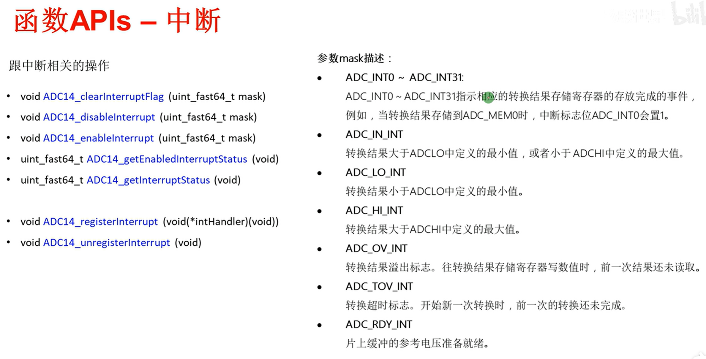

## 一、ADC模块简介

（1）基本概述

精密ADC（模数转换器）模块可以通过软件过采样实现高达16位的精度，采用差分和单端输入，采样率高达1Mbps。该模块包含14位SAR内核、采样/保持电路、参考电压源和转换结果输出寄存器。

- 最大分辨率为14位，转换速率高达1Mbps
- 可编程的采样和保持时间，由软件和定时器控制
- 软件或定时器启动转换
- 软件可选的内部参考源或外部参考源
- 片内参考电压源可选择1.2V、1.45V或4.5V，还可以输出对外使用（对外输出使用时，采样速率会限制在200k以内）
- 有24个单独配置的外部输入通道（A0~A23），可选单端输入或差分输入。单端是一个通道采集。差分输入是两个采集通道组成一组来采集。
- 用于内部温度传感器和1/2的VCC的两个内部转换通道、
- 可选择的转换时钟源
- 单通道单次、单通道多次、序列通道的单次和序列通道多次的转换模式
- 中断向量寄存器，用于快速解码38个ADC中断
- 32个转换结果寄存器
- 窗口比较器，在低功耗模式下监视转换结果寄存器的输入信号

（2）AD转换的原理

14位采样，所以根据2的14次方等于16384可知，采集的数据会被转换成0 ~ 16383中的任意一个。所以模拟量$V_{in}$转化成数据量$N_{ADC}$的公式为，其中$V_{R+}$为参考电压正，$V_{R-}$为参考电压负：

$N_{ADC} = 16384 \times {\frac{V_{in} - V_{R-}} {V_{R+} - V_{R-}}}$

（3）功能框图

 

简化后：


（4）输入选择（432P401R）

24个外部通道，两个内部通道。其中，A22和A23引脚是复用的，A22复用到温度传感器通道，A23复用到1/2Vcc。

内部通道，一个是温度传感器、一个是1/2Vcc。

（5）ADC时序

- 选择不同的功耗模式会影响ADC时钟
- 不同的分辨率转换类型对应的时钟周期不同
- 模数转换分别需要9、11、14和16个时钟周期，分别用于8位、10位、12位和14位的分辨率。

（6）MSP432P01R可用的触发源

| 指令 | 序号 |  触发源  |
| :--: | :--: | :------: |
| 000  |  0   | 软件触发 |
| 001  |  1   |  TA_0C1  |
| 010  |  2   |  TA_0C2  |
| 011  |  3   |  TA_1C1  |
| 100  |  4   |  TA_1C2  |
| 101  |  5   |  TA_2C1  |
| 110  |  6   |  TA_2C2  |
| 111  |  7   |  TA_3C1  |

（7）参考电压

ADC14模块可以使用片上的参考电压模块，有1.2V、1.45V和4.5V可选电压。
参考电压提供VR+和VR-；也可以输出到外部引脚供外部使用。
也可以通过引脚VREF+/VeREF+和VeREF-为VR+和VR-提供外部参考电压。

```c#
#define ADC_VREFPOS_AVCC_VREFNEG_VSS       (ADC14_MCTLN_VRSEL_0)		//电源电压3.3V
#define ADC_VREFPOS_INTBUF_VREFNEG_VSS     (ADC14_MCTLN_VRSEL_1)		//内部电压有1.2V、1.45V和4.5V可选电压
#define ADC_VREFPOS_EXTPOS_VREFNEG_EXTNEG  (ADC14_MCTLN_VRSEL_14)	//外部电压
#define ADC_VREFPOS_EXTBUF_VREFNEG_EXTNEG  (ADC14_MCTLN_VRSEL_15)		//外部电压，带缓冲（BUF）
    
#define ADC14_MCTLN_VRSEL_0                      ((uint32_t)0x00000000)          /*!< V(R+) = AVCC, V(R-) = AVSS */
#define ADC14_MCTLN_VRSEL_1                      ((uint32_t)0x00000100)          /*!< V(R+) = VREF buffered, V(R-) = AVSS */
#define ADC14_MCTLN_VRSEL_14                     ((uint32_t)0x00000E00)          /*!< V(R+) = VeREF+, V(R-) = VeREF- */
#define ADC14_MCTLN_VRSEL_15                     ((uint32_t)0x00000F00)          /*!< V(R+) = VeREF+ buffered, V(R-) = VeREF */
```

注：
当参考电压源选择外部参考时，建议将VeREF-连接到板载地
但内部参考电压与BUF_EXT（ADC14VRSEL = 0001b和REFOUT =1） 一起使用时，ADC14的最大采样率被限制为200ksps。在其他所有参考设置中，ADC14采样率最高可达1Msps。

（8）采样时间的设定与考虑*

（9）结果存储寄存器和窗口比较寄存器

窗口比较器允许监视模拟信号，而无需进行任何CPU交互。涉及3个中断：

- 当前值小于ADC14LO中设置的最低值，ADC14LOIFG中断标志置1。ADC14LO中断标志。
- 当前值大于ADC14HI中设置的最大值，ADC14HIIFG中断标志置1。ADC14HI中断标志。
- 当前值处于设定值之间时，ADC14INIFG置1。AD14INIFG中断标志。
- 这些中断是独立于转换模式生成的。窗口比较器中断标志的更新发生在ADC14IFGx之后。

（10）中断描述

ADC14IFG0 ~ ADCIFG31

- ADC13MEMx存储寄存器加载结果时，相应的中断标志置1
- 如果启用窗口比较器，则写入结果时也会影响到ADC14LOIFG中断、ADC14HIIFG中断、AD14INIFG中断。

ADC14OV：ADC13MEMx存储寄存器存储溢出

- 存储寄存器中前一次的转换结果未被读取，而又有新的数据写入时，数据溢出，此时ADC14OV中断标志置1。

ADC14TOV：ADC14转换时间溢出

- 在当前转换未完成而又发起另一次转换时，ADC14TOV中断标志置1。
- 单次转换模式下转换完成和序列通道单次转换模式下完成后，DMA被触发时，中断标志位置１。

ADC14LOIFG、ADC14HIIFG、AD14INIFG

- 当前值小于ADC14LO中设置的最低值，ADC14LOIFG中断标志置1。ADC14LO中断标志。
- 当前值大于ADC14HI中设置的最低值，ADC14HIIFG中断标志置1。ADC14HI中断标志。
- 当前值处于设定值之间时，ADC14INIFG置1。AD14INIFG中断标志。

ADC14RDYIFG带缓冲的本地参考电压准备就绪

- 本地缓冲参考电压准备就绪时，标志位置1。

（11）转换模式

单通道单次转换

序列通道单次转换模式：只能设置序列的开头和结尾

单通道多次转换模式

序列通道多次转换模式：只能设置序列的开头和结尾

## 二、库函数

（1）寄存器列表


（2）库函数


（3）讲解部分库函数


和功耗有关




## 三、例程讲解

（1）内部温度传感器测温，单通道多次转换，软件触发

计算原理：


```c
int main(void)
{
    /* 停用看门狗 */
    WDT_A_holdTimer();
    /* 通过中断退出低功耗模式，配合死循环里的睡眠模式使用，降低功耗 */
    Interrupt_enableSleepOnIsrExit();

    /* 使能FPU（浮点处理单元），减少中断响应延迟和OS环境下的上下文切换时间，启动stacking（在中断中使用） */
    FPU_enableModule();
    FPU_enableLazyStacking();

    /* 使能ADC */
    ADC14_enableModule();
    /* ADC初始化 (MCLK/预分频1/分频1) 启用内部温度传感器通道 */
    ADC14_initModule(ADC_CLOCKSOURCE_MCLK, ADC_PREDIVIDER_1, ADC_DIVIDER_1,ADC_TEMPSENSEMAP);

    /* 配置单通道模式（数据存放在ADC_MEM0），ture代表多次转换，false代表单次转换 */
    ADC14_configureSingleSampleMode(ADC_MEM0, true);
    
    /* 输入通道A22（依数据手册，该通道为内部温度传感器），数据->ADC_MEM0，采用内部参考电压，false代表非差分输入 */
    /* ture代表差分输入，也可以使用 ADC_DIFFERENTIAL_INPUTS 表示 */
    /* false代表非差分输入，也可以使用 ADC_NONDIFFERENTIAL_INPUTS 表示 */
    ADC14_configureConversionMemory(ADC_MEM0, ADC_VREFPOS_INTBUF_VREFNEG_VSS,  ADC_INPUT_A22, false);

    /* 配置采样时间为192个ADC  CLK，根据手册，采样时间必须大于5us */
    ADC14_setSampleHoldTime(ADC_PULSE_WIDTH_192,ADC_PULSE_WIDTH_192);

    /* 设置采样定时器为自动模式*/
    ADC14_enableSampleTimer(ADC_AUTOMATIC_ITERATION);
    /* 使能通道0的中断 */
    ADC14_enableInterrupt(ADC_INT0);

    /* 设置参考电压为2.5，使能温度传感器 */
    REF_A_enableTempSensor();
    REF_A_setReferenceVoltage(REF_A_VREF2_5V);
    REF_A_enableReferenceVoltage();
    /* 读取芯片上的温度校准值 */
    cal30 = SysCtl_getTempCalibrationConstant(SYSCTL_2_5V_REF, SYSCTL_30_DEGREES_C);
    cal85 = SysCtl_getTempCalibrationConstant(SYSCTL_2_5V_REF, SYSCTL_85_DEGREES_C);
    calDifference = cal85 - cal30;

    /* 使能模块中断，使能全局中断 */
    Interrupt_enableInterrupt(INT_ADC14);
    Interrupt_enableMaster();

    /* 允许转换，软件触发第一次转换 */
    ADC14_enableConversion();
    ADC14_toggleConversionTrigger();

    /* 睡眠模式 */
    while (1)
    {
        PCM_gotoLPM0();
    }
}

void ADC14_IRQHandler(void)
{
    uint64_t status;
    int16_t conRes;

    status = ADC14_getEnabledInterruptStatus();
    ADC14_clearInterruptFlag(status);

    if(status & ADC_INT0)
    {
        conRes = ((ADC14_getResult(ADC_MEM0) - cal30) * 55);
        tempC = (conRes / calDifference) + 30.0f;
        tempF = tempC * 9.0f / 5.0f + 32.0f;
    }

}
```

（2）单通道多次转换，使用外部参考电压源

```c
int main(void)
{
    /* 停用看门狗 */
    WDT_A_holdTimer();
    /* 通过中断退出低功耗模式，配合死循环里的睡眠模式使用，降低功耗 */
    Interrupt_enableSleepOnIsrExit();
    
    /* 使能ADC */
    ADC14_enableModule();
    /* ADC初始化 (MCLK/预分频1/分频1) 不使用内部通道 */
    /* 0代表不使用内部通道，也可用 ADC_NOROUTE 表示 */
    ADC14_initModule(ADC_CLOCKSOURCE_MCLK, ADC_PREDIVIDER_1, ADC_DIVIDER_1,0);

    /* 配置单通道模式（数据存放在ADC_MEM0），ture代表多次转换，false代表单次转换 */
    ADC14_configureSingleSampleMode(ADC_MEM0, true);
    /* 输入通道A0，数据->ADC_MEM0，使用外部基准电压，false代表非差分输入 */
    ADC14_configureConversionMemory(ADC_MEM0, ADC_VREFPOS_EXTPOS_VREFNEG_EXTNEG, ADC_INPUT_A0, false);

    /* 配置GPIO5用作模拟端口引脚（AD输入和基准引脚） */
    GPIO_setAsPeripheralModuleFunctionInputPin(GPIO_PORT_P5,GPIO_PIN7 | GPIO_PIN6 | GPIO_PIN5 | GPIO_PIN4, GPIO_TERTIARY_MODULE_FUNCTION);

    /* 设置采样定时器为自动模式*/
    ADC14_enableSampleTimer(ADC_AUTOMATIC_ITERATION);
    /* 使能通道0的中断 */
    ADC14_enableInterrupt(ADC_INT0);

    /* 使能模块中断，使能全局中断 */
    Interrupt_enableInterrupt(INT_ADC14);
    Interrupt_enableMaster();

    /* 允许转换，软件触发第一次转换 */
    ADC14_enableConversion();
    ADC14_toggleConversionTrigger();

    /* 进入睡眠模式 */
    while (1)
    {
        PCM_gotoLPM0();
    }
}

void ADC14_IRQHandler(void)
{
    uint64_t status;

    status = ADC14_getEnabledInterruptStatus();
    ADC14_clearInterruptFlag(status);

    if(status & ADC_INT0)
    {
        adcResult = ADC14_getResult(ADC_MEM0);
    }

}
```

（3）单通道多次转换，采用手动触发转换结束后使用软件手动触发下一次转换，转换结果储存在变量中，可以通过中断设置断点查看

```c
int main(void)
{
    /* Halting the Watchdog  */
    MAP_WDT_A_holdTimer();

    /* 初始化变量 */
    curADCResult = 0;

    /* 设置Flash等待状态为1，因为下面配置了了48MHz */
    MAP_FlashCtl_setWaitState(FLASH_BANK0, 1);
    MAP_FlashCtl_setWaitState(FLASH_BANK1, 1);
    
    /* 配置DOC时钟为48MHz  */
    MAP_PCM_setPowerState(PCM_AM_LDO_VCORE1);
    MAP_CS_setDCOCenteredFrequency(CS_DCO_FREQUENCY_48);

    /* 使能FPU，同时启用中断内使用浮点运算 */
    MAP_FPU_enableModule();
    MAP_FPU_enableLazyStacking();

    /* 初始化 ADC (MCLK/1/4) */
    MAP_ADC14_enableModule();
    MAP_ADC14_initModule(ADC_CLOCKSOURCE_MCLK, ADC_PREDIVIDER_1, ADC_DIVIDER_4,0);
            
    /* 配置 GPIO5用作模拟引脚 (5.5 A0) */
    MAP_GPIO_setAsPeripheralModuleFunctionInputPin(GPIO_PORT_P5, GPIO_PIN5,GPIO_TERTIARY_MODULE_FUNCTION);

    /* 配置单通道模式（数据存放在ADC_MEM0），ture代表多次转换，false代表单次转换 */
    MAP_ADC14_configureSingleSampleMode(ADC_MEM0, true);
    /* 输入通道A0，数据->ADC_MEM0，使用系统电源电压，false代表非差分输入 */
    MAP_ADC14_configureConversionMemory(ADC_MEM0, ADC_VREFPOS_AVCC_VREFNEG_VSS,ADC_INPUT_A0, false);

    /* 设置为手动触发方式 */
    MAP_ADC14_enableSampleTimer(ADC_MANUAL_ITERATION);

    /* 允许转换，软件触发第一次转换 */
    MAP_ADC14_enableConversion();
    MAP_ADC14_toggleConversionTrigger();
    
    /* 使能通道0的中断 */
    MAP_ADC14_enableInterrupt(ADC_INT0);
    /* 使能模块中断，使能全局中断 */
    MAP_Interrupt_enableInterrupt(INT_ADC14);
    MAP_Interrupt_enableMaster();

    while (1)
    {
        MAP_PCM_gotoLPM0();
    }
    
}

void ADC14_IRQHandler(void)
{
    uint64_t status = MAP_ADC14_getEnabledInterruptStatus();
    MAP_ADC14_clearInterruptFlag(status);

    if (ADC_INT0 & status)
    {
        curADCResult = MAP_ADC14_getResult(ADC_MEM0);
        normalizedADCRes = (curADCResult * 3.3) / 16384;

        MAP_ADC14_toggleConversionTrigger();	//软件触发中断
    }
}
```

（4）单通道多次转换，使用TimeA CCR1的输出作为触发

```c
/* 定时器A的增计数模式的参数配置 */
const Timer_A_UpModeConfig upModeConfig =
{
        TIMER_A_CLOCKSOURCE_ACLK,            // ACLK 作为时钟源
        TIMER_A_CLOCKSOURCE_DIVIDER_1,       //不分频 ACLK/1 = 32.768Khz
        16384,							//16384/32768 = 0.5s
        TIMER_A_TAIE_INTERRUPT_DISABLE,      // 禁用Timer ISR
        TIMER_A_CCIE_CCR0_INTERRUPT_DISABLE, // 禁用CCR0
        TIMER_A_DO_CLEAR                     // 清零
};

/* 定时器A比较器的参数设置 */
const Timer_A_CompareModeConfig compareConfig =
{
        TIMER_A_CAPTURECOMPARE_REGISTER_1,          // 使用CCR1
        TIMER_A_CAPTURECOMPARE_INTERRUPT_DISABLE,   // 禁用CCR中断
        TIMER_A_OUTPUTMODE_SET_RESET,               //取反输出
        16384                                       // 16384/32768 = 0.5s
};

int main(void)
{
    /* Halting WDT  */
    MAP_WDT_A_holdTimer();
    MAP_Interrupt_enableSleepOnIsrExit();
    resPos = 0;

    /* 使用默认时钟
     * MCLK = MCLK = 3MHz
     * ACLK = REFO = 32.768Khz */
    MAP_CS_initClockSignal(CS_ACLK, CS_REFOCLK_SELECT, CS_CLOCK_DIVIDER_1);

    /* ADC初始化 ADC (MCLK/1/1) */
    MAP_ADC14_enableModule();
    MAP_ADC14_initModule(ADC_CLOCKSOURCE_MCLK, ADC_PREDIVIDER_1, ADC_DIVIDER_1, 0);

    /* 配置 GPIO5引脚复用 (5.5 A0) */
    MAP_GPIO_setAsPeripheralModuleFunctionInputPin(GPIO_PORT_P5, GPIO_PIN5,GPIO_TERTIARY_MODULE_FUNCTION);

    /* 配置ADC存储 */
    MAP_ADC14_configureSingleSampleMode(ADC_MEM0, true);
    MAP_ADC14_configureConversionMemory(ADC_MEM0, ADC_VREFPOS_AVCC_VREFNEG_VSS,ADC_INPUT_A0, false);

    /* 配置Time_A0为向上计数模式 */
    MAP_Timer_A_configureUpMode(TIMER_A0_BASE, &upModeConfig);

    /* 初始化Time_A0比较模式 */
    MAP_Timer_A_initCompare(TIMER_A0_BASE, &compareConfig);

    /* 配置触发源来自TA0_CH1 */
    MAP_ADC14_setSampleHoldTrigger(ADC_TRIGGER_SOURCE1, false);

    /* 使能通道0中断 */
    MAP_ADC14_enableInterrupt(ADC_INT0);
    /* 允许转换 */
    MAP_ADC14_enableConversion();

    /* 使能模块的中断，使能全局中断 */
    MAP_Interrupt_enableInterrupt(INT_ADC14);
    MAP_Interrupt_enableMaster();

    /* 开启定时器 */
    MAP_Timer_A_startCounter(TIMER_A0_BASE, TIMER_A_UP_MODE);

    /* 睡眠模式 */
    while (1)
    {
        MAP_PCM_gotoLPM0();
    }
}

void ADC14_IRQHandler(void)
{
    uint64_t status;

    status = MAP_ADC14_getEnabledInterruptStatus();
    MAP_ADC14_clearInterruptFlag(status);


    if (status & ADC_INT0)
    {
        if(resPos == UINT8_MAX)
        {
           resPos = 0; 
        }
        
        resultsBuffer[resPos++] = MAP_ADC14_getResult(ADC_MEM0);
    }

}
```

（5）单通道多次转换，软件触发，差分模式采样，转换中将值转换成浮点型

```c
int main(void)
{
    /* Halting WDT */
    MAP_WDT_A_holdTimer();
    MAP_Interrupt_enableSleepOnIsrExit();

    /* Enabling the FPU with stacking enabled (for use within ISR) */
    MAP_FPU_enableModule();
    MAP_FPU_enableLazyStacking();

    /* 初始化 ADC (MCLK/1/1) */
    MAP_ADC14_enableModule();
    MAP_ADC14_initModule(ADC_CLOCKSOURCE_MCLK, ADC_PREDIVIDER_1, ADC_DIVIDER_1,0);

    /* Configuring ADC Memory (ADC_MEM0 A0/A1 差分输入) in repeat mode */
    MAP_ADC14_configureSingleSampleMode(ADC_MEM0, true);
    MAP_ADC14_configureConversionMemory(ADC_MEM0, ADC_VREFPOS_AVCC_VREFNEG_VSS, ADC_INPUT_A0, true);

    /* Setting up GPIO pins as analog inputs */
    MAP_GPIO_setAsPeripheralModuleFunctionInputPin(GPIO_PORT_P5, GPIO_PIN5 | GPIO_PIN4, GPIO_TERTIARY_MODULE_FUNCTION);

    /* 修改ADC转换结果的数据格式 */
    /* 入口参数 */
    /* ADC_SIGNED_BINARY	有符号 */
    /* ADC_UNSIGNED_BINARY	无符号（默认） */
    MAP_ADC14_setResultFormat(ADC_SIGNED_BINARY);

    /* Enabling sample timer in auto iteration mode and interrupts*/
    MAP_ADC14_enableSampleTimer(ADC_AUTOMATIC_ITERATION);
    MAP_ADC14_enableInterrupt(ADC_INT0);

    /* Enabling Interrupts */
    MAP_Interrupt_enableInterrupt(INT_ADC14);
    MAP_Interrupt_enableMaster();

    /* Triggering the start of the sample */
    MAP_ADC14_enableConversion();
    MAP_ADC14_toggleConversionTrigger();

    /* Going to sleep */
    while (1)
    {
        MAP_PCM_gotoLPM0();
    }
}

void ADC14_IRQHandler(void)
{
    uint64_t status;

    status = MAP_ADC14_getEnabledInterruptStatus();
    MAP_ADC14_clearInterruptFlag(status);

    if(status & ADC_INT0)
    {
        adcResult = convertToFloat(MAP_ADC14_getResult(ADC_MEM0));
    }

}

static float convertToFloat(uint16_t result)
{
    int32_t temp;

        if(0x8000 & result)
        {
            temp = (result >> 2) | 0xFFFFC000;
            return ((temp * 3.3f) / 8191);
        }
        else
            return ((result >> 2)*3.3f) / 8191;
}
```

（6）单通道多次转换，启用窗口比较器

```c
int main(void)
{
    /* Halting WDT  */
    MAP_WDT_A_holdTimer();
    MAP_Interrupt_enableSleepOnIsrExit();

    /* Setting Flash wait state */
    MAP_FlashCtl_setWaitState(FLASH_BANK0, 1);
    MAP_FlashCtl_setWaitState(FLASH_BANK1, 1);
    
    /* Setting DCO to 48MHz  */
    MAP_PCM_setPowerState(PCM_AM_LDO_VCORE1);
    MAP_CS_setDCOCenteredFrequency(CS_DCO_FREQUENCY_48);

    /* 设置内部参考点电压源，启用内部参考电压源 */
    MAP_REF_A_setReferenceVoltage(REF_A_VREF2_5V);
    MAP_REF_A_enableReferenceVoltage();

    /* Initializing ADC (MCLK/1/4) */
    MAP_ADC14_enableModule();
    MAP_ADC14_initModule(ADC_CLOCKSOURCE_MCLK, ADC_PREDIVIDER_1, ADC_DIVIDER_4,0);

    /* Configuring GPIOs (1.0 out), (5.5 A0) */
    MAP_GPIO_setAsOutputPin(GPIO_PORT_P1, GPIO_PIN0);	//灯
    MAP_GPIO_setAsPeripheralModuleFunctionInputPin(GPIO_PORT_P5, GPIO_PIN5, GPIO_TERTIARY_MODULE_FUNCTION);

    /* Configuring ADC Memory */
    MAP_ADC14_configureSingleSampleMode(ADC_MEM0, true);
    MAP_ADC14_configureConversionMemory(ADC_MEM0,ADC_VREFPOS_INTBUF_VREFNEG_VSS,ADC_INPUT_A0, false);
    /* 设置采样保持/保持时间 */
    MAP_ADC14_setSampleHoldTime(ADC_PULSE_WIDTH_128, ADC_PULSE_WIDTH_128);
    
    /* 设置窗口比较值的上限和下限 */
    /* 2^14 = 16384---2.5V，9830---1.5V，6553---1.0V */
    /*ADC14_setComparatorWindowValue(ADC_COMP_WINDOW0, 6553, 9830);  */
    MAP_ADC14_setComparatorWindowValue(ADC_COMP_WINDOW0, 6553, 6553);
    /* 启用窗口比较器的功能 */
    MAP_ADC14_enableComparatorWindow(ADC_MEM0, ADC_COMP_WINDOW0);
    /* 使能中断 */
    MAP_ADC14_enableInterrupt(ADC_HI_INT | ADC_LO_INT);
    /* 开启中断标志位 */
    MAP_ADC14_clearInterruptFlag(ADC_HI_INT | ADC_LO_INT);

    /* Configuring Sample Timer with automatic iterations*/
    MAP_ADC14_enableSampleTimer(ADC_AUTOMATIC_ITERATION);

    /* Enabling/Toggling Conversion */
    MAP_ADC14_enableConversion();
    MAP_ADC14_toggleConversionTrigger();

    /* Enabling Interrupts */
    MAP_Interrupt_enableInterrupt(INT_ADC14);
    MAP_Interrupt_enableMaster();

    /* 保持在活动模式，以便用户可以通过调试器查看上述寄存器中的值 */
    while (1)
    {
        MAP_PCM_gotoLPM0();
    }
}

void ADC14_IRQHandler(void)
{
    uint64_t status;

    status = MAP_ADC14_getEnabledInterruptStatus();
    MAP_ADC14_clearInterruptFlag(ADC_HI_INT | ADC_LO_INT);

    if(status & ADC_LO_INT)
    {
        MAP_GPIO_setOutputLowOnPin(GPIO_PORT_P1, GPIO_PIN0);
        MAP_ADC14_enableInterrupt(ADC_HI_INT);
        MAP_ADC14_disableInterrupt(ADC_LO_INT);
    }

    if(status & ADC_HI_INT)
    {
        MAP_GPIO_setOutputHighOnPin(GPIO_PORT_P1, GPIO_PIN0);
        MAP_ADC14_enableInterrupt(ADC_LO_INT);
        MAP_ADC14_disableInterrupt(ADC_HI_INT);
    }

}
```

（7）序列通道单次转换，自动触发

```c
int main(void)
{
    /* Halting WDT  */
    MAP_WDT_A_holdTimer();
    MAP_Interrupt_enableSleepOnIsrExit();

    /* 数组填充清零 */
    memset(resultsBuffer, 0x00, 8 * sizeof(uint16_t));

    //![Simple REF Example]
    /* Setting reference voltage to 2.5  and enabling reference */
    MAP_REF_A_setReferenceVoltage(REF_A_VREF2_5V);
    MAP_REF_A_enableReferenceVoltage();

    /* Initializing ADC (MCLK/1/1) */
    MAP_ADC14_enableModule();
    MAP_ADC14_initModule(ADC_CLOCKSOURCE_MCLK, ADC_PREDIVIDER_1, ADC_DIVIDER_1,0);

    /* Configuring GPIOs for Analog In */
    MAP_GPIO_setAsPeripheralModuleFunctionInputPin(GPIO_PORT_P5,GPIO_PIN5 | GPIO_PIN4 | GPIO_PIN3 | GPIO_PIN2 | GPIO_PIN1| GPIO_PIN0, GPIO_TERTIARY_MODULE_FUNCTION);
    MAP_GPIO_setAsPeripheralModuleFunctionInputPin(GPIO_PORT_P4,GPIO_PIN7 | GPIO_PIN6, GPIO_TERTIARY_MODULE_FUNCTION);


    /* Configuring ADC Memory (ADC_MEM0 - ADC_MEM7 (A0 - A7)  with no repeat)
     * with internal 2.5v reference */
    MAP_ADC14_configureMultiSequenceMode(ADC_MEM0, ADC_MEM7, false);
    MAP_ADC14_configureConversionMemory(ADC_MEM0,ADC_VREFPOS_INTBUF_VREFNEG_VSS, ADC_INPUT_A0, false);
    MAP_ADC14_configureConversionMemory(ADC_MEM1,ADC_VREFPOS_INTBUF_VREFNEG_VSS,ADC_INPUT_A1, false);
    MAP_ADC14_configureConversionMemory(ADC_MEM2,ADC_VREFPOS_INTBUF_VREFNEG_VSS,ADC_INPUT_A2, false);
    MAP_ADC14_configureConversionMemory(ADC_MEM3,ADC_VREFPOS_INTBUF_VREFNEG_VSS,ADC_INPUT_A3, false);
    MAP_ADC14_configureConversionMemory(ADC_MEM4,ADC_VREFPOS_INTBUF_VREFNEG_VSS,ADC_INPUT_A4, false);
    MAP_ADC14_configureConversionMemory(ADC_MEM5,ADC_VREFPOS_INTBUF_VREFNEG_VSS,ADC_INPUT_A5, false);
    MAP_ADC14_configureConversionMemory(ADC_MEM6,ADC_VREFPOS_INTBUF_VREFNEG_VSS,ADC_INPUT_A6, false);
    MAP_ADC14_configureConversionMemory(ADC_MEM7,ADC_VREFPOS_INTBUF_VREFNEG_VSS,ADC_INPUT_A7, false);

    /* Enabling the interrupt when a conversion on channel 7 (end of sequence)
     *  is complete and enabling conversions */
    MAP_ADC14_enableInterrupt(ADC_INT7);

    /* Enabling Interrupts */
    MAP_Interrupt_enableInterrupt(INT_ADC14);
    MAP_Interrupt_enableMaster();

    /* Setting up the sample timer to automatically step through the sequence
     * convert.
     */
    MAP_ADC14_enableSampleTimer(ADC_AUTOMATIC_ITERATION);

    /* Triggering the start of the sample */
    MAP_ADC14_enableConversion();
    MAP_ADC14_toggleConversionTrigger();

    /* Going to sleep */
    while (1)
    {
        MAP_PCM_gotoLPM0();
    }
}

void ADC14_IRQHandler(void)
{
    uint64_t status;

    status = MAP_ADC14_getEnabledInterruptStatus();
    MAP_ADC14_clearInterruptFlag(status);

    if(status & ADC_INT7)
    {
        MAP_ADC14_getMultiSequenceResult(resultsBuffer);
    }

}
```

