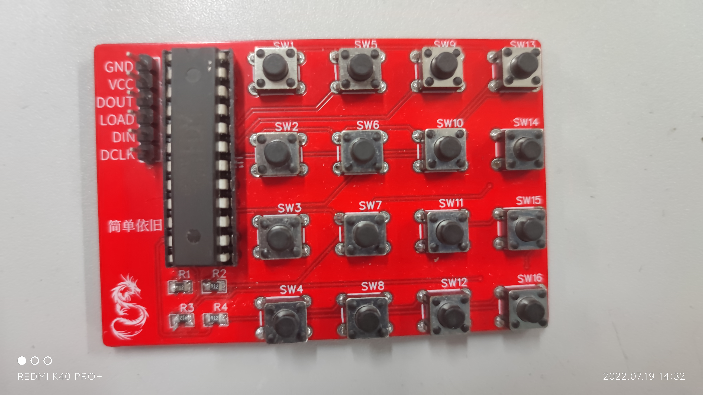
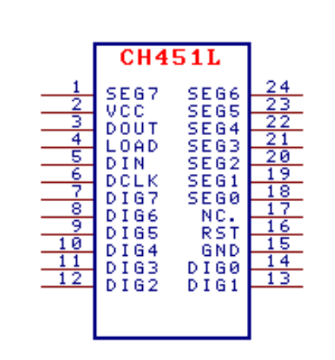
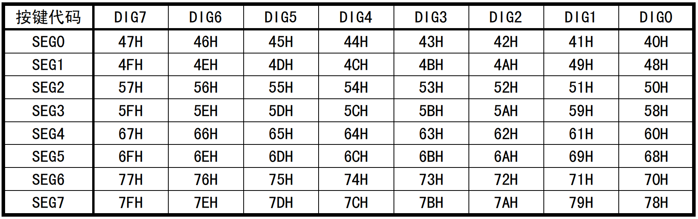

## 矩阵键盘模块

GND：接地

VCC：电源+5V

四线串行接口：

- DOUT：串行口的数据输出和键盘中断
- LOAD：串行口的数据加载，内置上拉电阻
- DIN：串行口的数据输入，内置上拉电阻 
- DCLK：串行接口的数据时钟，内置上拉电阻，也可用于看门狗的清除输入

参考资料：[数码管驱动及键盘控制芯片 CH451.pdf](assets/数码管驱动及键盘控制芯片 CH451.pdf)

### 一、CH451L芯片简要说明

CH451L的引脚封装

其中DIG0 ~ DIG7为键盘扫描输出，SEG0 ~ SEG7为键盘扫描输入

键盘控制特点：

- 内置 64 键键盘控制器，基于 8×8 矩阵键盘扫描。 
- 内置按键状态输入的下拉电阻，内置去抖动电路。 
- 键盘中断，低电平有效输出。 
- 提供按键释放标志位，可供查询按键按下与释放。

芯片特点：

- 时钟速度从 0 到 10MHz。
- 内置时钟振荡电路
- 支持 3V～5V 电源电压

### 二、CH451L芯片+4*4矩阵键盘的使用

1. 扫描方式

   - DIG7～DIG0 引脚按照 DIG0至 DIG7 的顺序依次输出高电平，其余 7 个引脚输出低电平；
   - SEG7～SEG0 引脚的输出被禁止，当没有键被按下时，SEG7～SEG0 都被下拉为低电平；
   - 当有键被按下时，例如连接 DIG3 与 SEG4 的键被按下，则当 DIG3 输出高电平时 SEG4 检测到高电平；
   - 为了防止因为按键抖动或者外界干扰而产生误码，CH451实行两次扫描，只有当两次键盘扫描的结果相同时，按键才会被确认有效。

2. 按键中断

   - 如果 CH451 检测到有效的按键，则记录下该按键代码，并通过 DOUT 引脚产生低电平有效的键盘中断，此时单片机可以通过串行接口读取按键代码；
   - 在没有检测到新的有效按键之前，CH451 不再产生任何键盘中断。
   - CH451 不支持组合键，也就是说，同一时刻，不能有两个或者更多的键被按下；如果多个键同时按下，那么按键代码较小的按键优先。 

3. 按键代码

   CH451 所提供的按键代码为 7 位，位 2～位 0 是列扫描码，位 5～位 3 是行扫描码，位 6 是状态码（键按下为 1，键释放为 0）。

   |  7   |   6    |  5   |   4    |  3   |  2   |   1    |  0   |
   | :--: | :----: | :--: | :----: | :--: | :--: | :----: | :--: |
   |  0   | 状态码 |      | 行扫描 |      |      | 列扫描 |      |

   若按下DIG3 与 SEG4，即第三列、第四行被按下，状态码为01	100	011
   通过中断读取的按键代码，状态码总是为1。除非定时读取，且读取时按键释放。

   下表是连接在 DIG7～DIG0 与 SEG7～SEG0 之间的键被按下时，CH451 所提供的按键代码。这些按键代码具有一定的规律，如果需要键被释放时的按键代码，则将表中的按键代码的位 6 置 0，也就是将表中的按键代码减去 40H。

   

4. 时序

   DIN、DCLK、LOAD 是带上拉的输入信号线，默认是高电平
   DOUT 在未启用键盘扫描功能时作为串行数据输出线，在启用键盘扫描功能后作为键盘中断和数据输出线，默认是高电平。

   DIN 用于提供串行数据——12位的命令。在刚启动时，MCU需要输出一个低电平信号（由高电平变为低电平再恢复为高电平平），通知CH451L使能 4 线串行接口。

   DCLK：提供时钟信号，上升沿读取DOUT的传来的输入数据，下降沿输出DOUT传来的输出数据。在 DCLK 的上升沿，DIN 上的位数据被移入移位寄存器的最高位寄存器，以此类推，原次低位数据移入最低位寄存器，在该上升沿后的第一个下降沿，原次低位数据从 DOUT输出。（此时DOUT不用做数据输出）

   当启用键盘扫描功能时，DOUT默认为高电平，用于键盘中断和按键代码

   >==单片机向 CH451 发送命令并接收按键代码==
   >按键按下后：
   >
   >- 单片机收到DOUT传出的中断信号，发送读取按键代码指令。
   >- 命令最后一位B11送达后，单片机将LOAD拉低，并迅速拉高，产生上升沿，命令被CH451L读取。之后使LOAD保持高电平。
   >- LOAD拉高后，DOUT输出７位按键代码的最高位K６，输出完成后，DIN回到高电平。
   >- CH451L在时钟的每个下降沿输出按键代码。输出完成后，回到高电平。

   

5. 指令（部分）

   高位--------12------>低位

   空指令：0000	xxxx	xxxx

   复位指令：0010	0000	0001

   设定系统参数：0100	000{CKHF}	{DPRL}{WDOG}{KEYB}{DISP}

   - 输出高频时钟 CKHF（1 ：启用；0：关闭）
   - 字驱动输出极性 DPLR（0=低电平有效；1=高电平有效）
   - 看门狗使能 WDOG（1 ：启用；0：关闭）
   - 键盘扫描使能 KEYB（1 ：启用；0：关闭）
   - 显示驱动使能 DISP（1 ：启用；0：关闭）

   	读取按键代码： 0111	xxxx		xxxx

### 三、代码思路

死循环中，扫描DOUT，当检测到低电平时，中断。

发出读取按键代码指令，发送完成后，拉低LOAD，再拉高LOAD。

拉高DIN，读取DOUT。

###  四、矩阵键盘时序分析

`DOUT`、`DIN`、`LOAD`、`DCLK`均默认为高电平

`DOUT`:启用键盘扫描功能后，作为键盘中断和数据输出线

`DIN`:提供串行数据，低位在前、高位在后。上电复位后，在DCLK之前输出一个低电平脉冲(高->低->高)以使能4线串行接口

`LOAD`:串行数据帧的帧完成标志，CH451L仅在LOAD的上升沿加载命令数据并处理

`DCLK`：时钟

上电复位后：DIN输出低电平脉冲,拉高所有

>DIN = 1;
>
>DIN = 0;
>
>DIN = 1;
>
>DOUT = 1;
>
>DCLK = 1;
>
>LOAD = 1;

输出一位数据

>DIN = data;
>
>DCLK = 0;
>
>DCLK = 1;

输出12位数据

>复位
>
>for(i=0,i<12,i++)
>
>​	输出一位数据;
>
>LOAD = 0;
>
>LOAD = 1;

中断时，`DOUT`拉低

读取一位数据

>GPIOx->IDR

读取12位数据

>

中断后读取数据

>中断，LOAD拉低，单片机外部中断启动
>
>
>
>运行一下程序读取键值：
>
>输出读取键值命令
>
>>for(i=0;i<12;i++)
>>
>>​	输出一位数据;
>>
>>LOAD = 0;
>>
>>LOAD = 1;
>
>在LOAD上升沿输出DOUT第七位
>
>> for(i=0;i<7;i++)
>>
>> ​	读取
>>
>> ​	//此后DCLK下降沿读取
>>
>> ​	DCLK = 0;
>>
>> ​	DCLK = 1
>
>数据分析
>
>
>
>清除中断标志位

数据换算成键值
