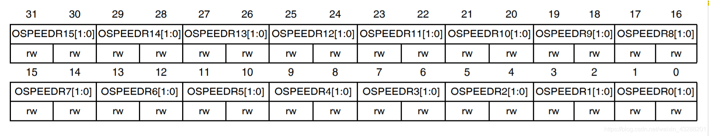

参考资料：

STM32F4开发指南-库函数版本_V1.1.pdf\6.1 STM32F4 IO 简介 

7，硬件资料\2，芯片资料\STM32F407ZGT6.pdf

8，STM32参考资料\STM32F4xx中文参考手册.pdf\第七章 通用 I/O  

###一、GPIO基本结构和工作方式

（1）STM32引脚说明

STM32F407ZGT6

- 一共有7组IO口
- 每组IO口有16个IO口
- 一共112个IO口
- 分别是GPIOA、GPIOB、GPIOC、GPIOE、......、GPIOG
- 每组可细分为GPIO_0、GPIO_1、GPIO_2、......、GPIO_15

==STM32大部分引脚除了当GPIO使用，还可以复用为外设功能引脚==

（2）M3与M4的IO口的区别

M4的上拉既可以影响输入也可以影响输出

M3只能影响输入

FT（five volt tolerant）：5V容忍。芯片手册出现代表可以FT代表引脚可以输入5V。F4大部分都支持。


（3）工作方式

- 4种工作模式

  关于上拉和下拉：https://www.bilibili.com/video/BV1W34y1579U

  输入浮空：不使用上拉电阻和下拉电阻

  

  输入上拉：仅使用上拉电阻

  

  输入下拉：仅使用下拉电阻

  

  模拟输入：TTL施密特触发器关闭，信号进入片上外设

  

- 4种输出模式

  开漏输出（带上拉或下拉）：

  写0芯片读0，写1不一定读1。因为写1时3处N-MOS关闭，芯片读取的是此时IO口的状态。

  

  开漏复用功能（带上拉或下拉）：
  与开漏输出特点一致，不过信号来源于复用功能模块

  

  推挽式输出（带上拉或下拉）：

  输出1时，P-MOS导通，N-MOS关闭，输出为1

  输出0时，P-MOS关闭，N-MOS导通，输出为0

  

  推挽式复用功能（带上拉或下拉）：

  与推挽式类似，信号来源来自复用功能模块

  

- 4种最大输出速度

  2MHz

  25MHz

  50MHz

  100MHz

推挽输出：可以输出强高低电平，连接数字器件

开漏输出：==只可以输出强低电平，高电平得靠外部的上拉电阻拉高。==输出端相当于三极管的集电极。要得到高电平状态需要上拉电阻才行。==适合于做电流型的驱动==，其吸收电流的能力相对较强（20mA以内）

### 二、GPIO寄存器说明

（1）每组GPIO端口寄存器包括：

4个32位配置寄存器 

- 一个端口模式寄存器(GPIOx_MODER)

  GPIO端口模式寄存器有32位。又分成了16组，每组有两位，每两位控制一个IO口。

  

  ```c
  这些位通过软件写入，用于配置 I/O 方向模式。
  00：输入（复位状态）
  01：通用输出模式
  10：复用功能模式
  11：模拟模式(AD)
  ```


- 一个端口输出类型寄存器(GPIOx_OTYPER)

  GPIO端口输出类型寄存器有32位但是只用了低16位。每位控制一个IO口。

  

  ```c
  位 31:16 保留，必须保持复位值。
  这些位通过软件写入，用于配置 I/O 端口的输出类型。
  0：输出推挽（复位状态）
  1：输出开漏
  ```

  

- 一个端口输出速度寄存器(GPIOx_OSPEEDR)

  GPIO端口输出速度寄存器有32位。又分成了16组，每组有两位，每两位控制一个IO口。 

  

  ```c
  这些位通过软件写入，用于配置 I/O 输出速度。
  00：2 MHz（低速）
  01：25 MHz（中速）
  10：50 MHz（快速）
  11：30 pF 时为 100 MHz（高速）（15 pF 时为 80 MHz 输出（最大速度））
  ```

  

- 一个端口上拉下拉寄存器(GPIOx_PUPDR)

  GPIO端口上拉下拉寄存器有32位。又分成了16组，每组有两位，每两位控制一个IO口。 

  

  ```c
  这些位通过软件写入，用于配置 I/O 上拉或下拉。
  00：无上拉或下拉（浮空状态）
  01：上拉
  10：下拉
  11：保留
  ```


2个32位数据寄存器 

- 一个端口输入数据寄存器（GPIOx_IDR）

  GPIO端口输入数据寄存器有32位但是只用了低16位。每位控制一个IO口。 

  

  ```c
  位 31:16 保留，必须保持复位值。
  这些位为只读形式，只能在字模式下访问。它们包含相应 I/O 端口的输入值。
  ```

  

- 一个端口输出数据寄存器(GPIOx_ODR)

  GPIO端口输出数据寄存器有32位但是只用了低16位。每位控制一个IO口。 

  

  ```c
  位 31:16 保留，必须保持复位值。
  		这些位可通过软件读取和写入。
  	注意：对于原子置位/复位，通过写入 GPIOx_BSRR 寄存器，可分别对 ODR 位进行置位和复位 (x = A..I/)。
  ```

  

一个端口置位/复位寄存器(GPIOx_BSRR)

这个寄存器和端口输出数据寄存器是比较相似
它把寄存器的32位分为了两组 低16位为一组，高16位为一组

```c
位 31:16 
	这些位为只写形式，只能在字、半字或字节模式下访问。读取这些位可返回值 0x0000。
	0：不会对相应的 ODRx 位执行任何操作
	1：对相应的 ODRx 位进行复位（值置为0）
  注意：如果同时对 BSx 和 BRx 置位，则 BSx 的优先级更高。
位 15:0
	这些位为只写形式，只能在字、半字或字节模式下访问。读取这些位可返回值 0x0000。
	0：不会对相应的 ODRx 位执行任何操作
	1：对相应的 ODRx 位进行置位（值置为1）
```


一个端口配置锁存寄存器(GPIOx_LCKR)


两个复用功能寄存器（低位GPIOx_AFRL&GPIOx_AFRH)

​	使用端口复用器最大限度利用端口资源

​	具体见16.IO引脚复用和映射

### 三、STM32F4xx GPIO引脚说明

所有的IO口都可以作为中断输入
