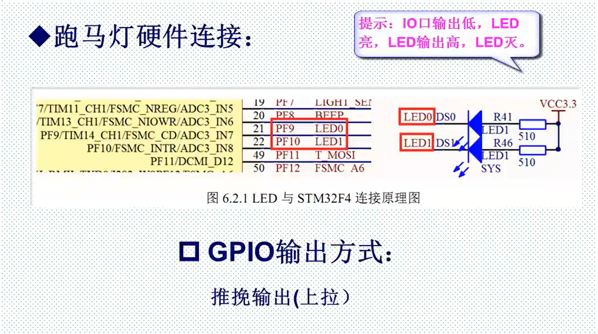

参考资料：

STM32F4开发指南-库函数版本_V1.1.pdf\第六章 跑马灯实验

8，STM32参考资料\STM32F4xx中文参考手册.pdf\第七章 通用 I/O  

### 一、跑马灯硬件连接



实物连接：

.png)

### 二、GPIO相关库函数说明

（1）实验中所需的重要头文件（固件库中，也就是FWLIB文件夹）：

- misc.c
- stm32f4xx_gpio.c（涉及GPIO）
- stm32f4xx_rcc.c（涉及时钟的使能）
- stm32f4xx_usart.c（涉及串口）

（2）重要函数

1. 一个初始化函数

   void GPIO_Init(GPIO_TypeDef* GPIOx, GPIO_InitTypeDef* GPIO_InitStruct)

   这个函数有两个参数，第一个参数是用来指定需要初始化的 GPIO 对应的 GPIO 组，取值范围 为 GPIOA~GPIOK。第二个参数为初始化参数结构体指针。

   通过初始化结构体初始化 GPIO 的常用格式是： 

   ```c
   GPIO_InitTypeDef GPIO_InitStructure;//两个结构体
    GPIO_InitStructure.GPIO_Pin = GPIO_Pin_9|GPIO_Pin_10//GPIOF9和GPIOF10
    GPIO_InitStructure.GPIO_Mode = GPIO_Mode_OUT;//普通输出模式
   GPIO_InitStructure.GPIO_Speed = GPIO_Speed_100MHz;//100MHz
    GPIO_InitStructure.GPIO_OType = GPIO_OType_PP;//推挽输出
    GPIO_InitStructure.GPIO_PuPd = GPIO_PuPd_UP;//上拉
    GPIO_Init(GPIOF, &GPIO_InitStructure);//初始化 GPIOF
   ```

   **可以一次配置一个IO口组下的多个IO口，前提是这些IO口配置方式一样**

   

2. 两个读取输入电平函数（操作的GPIO_ODR寄存器）

   uint8_t GPIO_ReadInputDataBit(GPIO_TypeDef* GPIOx, uint16_t GPIO_Pin); 

   作用：读取某个GPIO的输出电平

   例： GPIO_ReadInputDataBit(GPIOA，GPIO_Pin_5);//读取GPIOA.5

   

   uint16_t GPIO_ReadInputData(GPIO_TypeDef* GPIOx);

   作用：读取某组GPIO的输出电平

   例：GPIO_ReadInputData(GPIOA);//读取GPIO组

   

3. 四个设置输出电平函数

   void GPIO_SetBits(GPIO_TypeDef* GPIOx, uint16_t GPIO_Pin); 

   作用：设置某个IO口输出为低电平（操作的BSRRL寄存器）

   例：GPIO_ResetBits(GPIOB,GPIO_Pin_5);//GPIOB.5 输出低

   

   void GPIO_ResetBits(GPIO_TypeDef* GPIOx, uint16_t GPIO_Pin);

   作用：设置某个IO口输出为高电平（操作的BSRRH寄存器）

   例：GPIO_SetBits(GPIOB,GPIO_Pin_5);//GPIOB.5 输出高

   

   以下两个函数可设置输出电平，但不常用

   void GPIO_WriteBit(GPIO_TypeDef* GPIOx, uint16_t GPIO_Pin,BitAction BitVal);

   void GPIO_Write(GPIO_TypeDef* GPIOx, uint16_t PortVal);

### 三、写跑马灯实验

（1）程序组成

- 使能时钟。调用函数RCC_AHB1PeriphClockCmd():

  ==不同的外设调用的时钟使能函数可能不一样==

- 初始化IO口模式。调用GPIO_lnit();

- 操作IO口输出高低电平。

  GPIO_SetBits();

  GPIO_ResetBits();

（2）程序编写

看视频