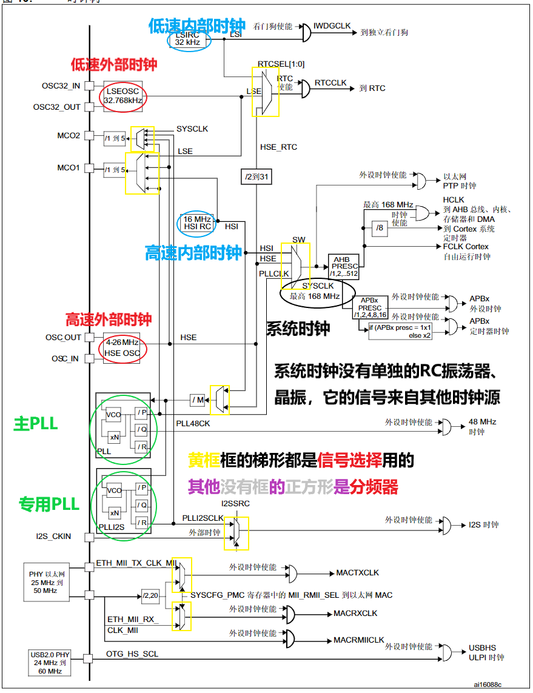
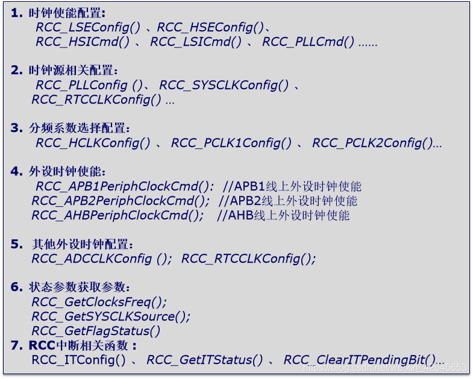

 参考资料：

STM32F4开发指南-库函数版本_V1.1.pdf\4.3 STM32F4 时钟系统

8，STM32参考资料\STM32F4xx中文参考手册.pdf\第六章 复位和时钟控制

### 一、时钟系统框图详解

图在：8，STM32参考资料\STM32F4xx中文参考手册.pdf\6.2时钟 

看视频讲解和参考资料

关于晶振如何工作，以及RC振荡器为什么可以作为时钟源：

[晶振！不到一块钱！性能再高的CPU都需要它！晶振的工作原理，晶振是如何起振的，有源晶振和无源晶振！_哔哩哔哩_bilibili](https://www.bilibili.com/video/BV1yS4y1k7EE?spm_id_from=333.999.0.0&vd_source=ba89c885857d57586a8c5ab992d5927d) 

小结：

1. STM32有5个时钟源：HSI、HSE、LSI、LSE、PLL。

   ①、HSI是高速内部时钟，RC振荡器组成，频率为16MHz,精度不高。可以直接作为系统时钟或者用作PLL时钟输入。

   ②、HSE是高速外部时钟，可接石英/陶瓷谐振器，或者接外部时钟源，频率范围为4MHz~26MHz.

   ③、LSI是低速内部时钟，RC振荡器组成，频率为32kH2,提供低功耗时钟。主要供独立看门狗和自动唤醒单元使用.

   ④、LSE是低速外部时钟，接频率为32.768kHz的石英晶体。可作为实时时钟外设 (RTC) 的时钟源来提供时钟/日历或其它定时功能。

   ⑤、PLL为锁相环倍频输出。STM32F4有两个PLL:

   ◆主PLL(PLL)由HSE或者HSI提供时钟信号，并具有两个不同的输出时钟。第一个输出PLLP用于生成高速的系统时钟（最高168MHz)

   第二个输出PLLQ用于生成USB OTG FS的时钟(48MHz),随机数发生器的时钟和SDIO时钟。

   ◆专用PLL(PLLI2S)用于生成精确时钟，从而在I2S接口实现高品质音频性能。

2. 系统时钟SYSCLK可来源于三个时钟源： 

   ①、HSI振荡器时钟 

   ②、HSE振荡器时钟 

   ③、PLL时钟

3. STM32F4时钟信号输出MCO1(PA8)和MCO2(PC9)。

   ◆MCO1:用户可以配置预分频器(1~5)向MCO1引脚PA8输出4个不同的时钟源：
   HIS
   LSE
   HSE
   PLL
   ◆MCO2:用户可以配置预分频器(1~5)向MCO2引脚PC9输出4个不同的时钟源：
   HSE 
   PLL
   SYSCLK
   PLLI2S
   MCO最大输出时钟不超过100MHz

   

4. 任何一个外设在使用之前必须首先使能其相应的时钟。

### 二、时钟配置相关函数

（1）常用寄存器

- RCC 时钟控制寄存器 (RCC_CR)

  作用：使能时钟源，等待时钟就绪

- RCC PLL 配置寄存器 (RCC_PLLCFGR)

  作用：配置PLL里分频器的数值

- RCC 时钟配置寄存器 (RCC_CFGR)

  作用：更改时钟源的选择和分频器的设置

- RCC AHB1 外设时钟使能寄存器 (RCC_AHB1ENR)

- RCC AHB2 外设时钟使能寄存器 (RCC_AHB2ENR)

- RCC AHB3 外设时钟使能寄存器 (RCC_AHB3ENR)

- 用于 STM32F405xx/07xx 和 STM32F415xx/17xx 的 RCC APB1 外设时钟 使能寄存器 (RCC_APB1ENR)

- 用于 STM32F405xx/07xx 和 STM32F415xx/17xx 的 RCC APB2 外设时钟 使能寄存器 (RCC_APB2ENR)

（2）RCC相关头文件和固件库源文件

头文件：stm32f4xx_rcc.h

源文件：stm32f4xx_rcc.c

==注：固件库里基本没有调用HSI、HSE等等时钟源配置函数，因为默认系统初始化是在SystemIint里面直接设置，他是直接操作寄存器来设置的。==

