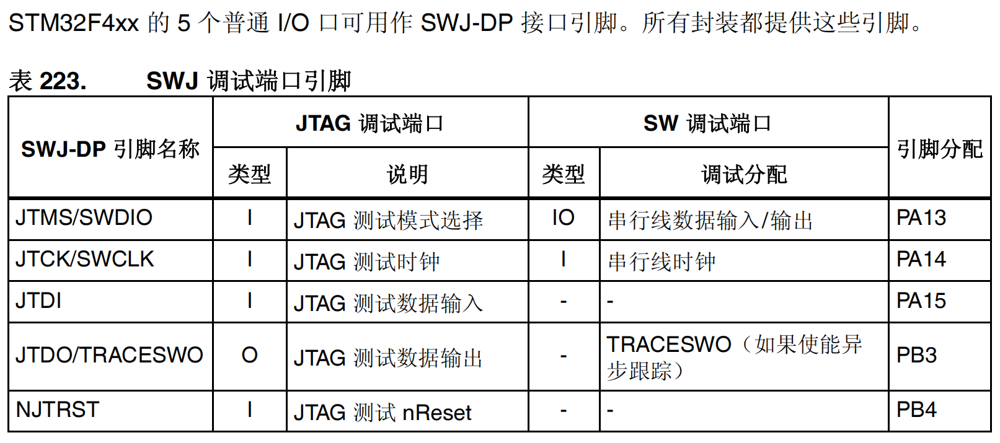
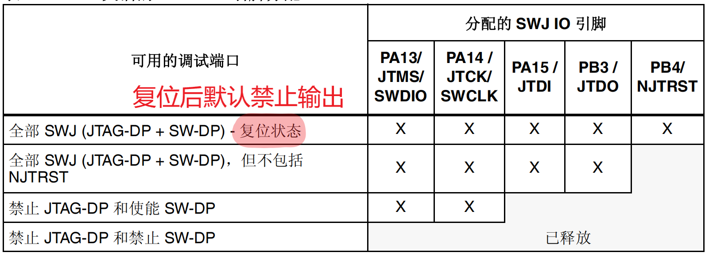
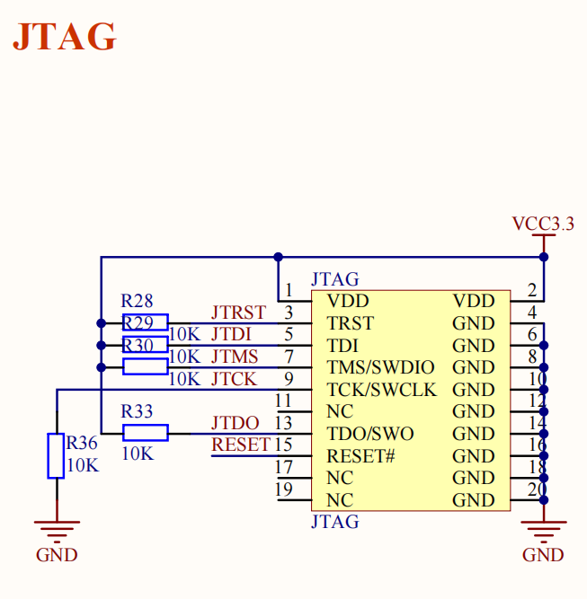

参考资料：

STM32F4开发指南-库函数版本_V1.1.pdf\3.4 程序下载与调试

8，STM32参考资料\STM32F4xx中文参考手册.pdf\第33章 调试支持 (DBG)

### 一、JTAG/SWD调试原理

（1）JTAG/SWD调试原理简析

STM32F4xx 的内核是 Cortex™-M4F，该内核包含用于高级调试功能的硬件。利用这些调试功能，可以在取指（指令断点）或取访问数据（数据断点）时停止内核内核停止时，可以查询内核的内部状态和系统的外部状态。查询完成后，将恢复内核和系统并恢复程序执行。当调试器与 STM32F4xx MCU 相连并进行调试时，将使用内核的硬件调试模块。 

提供两个调试接口：

- 串行接口
- JTAG 调试接口

JTAG 调试端口 (JTAG-DP) 提供用于连接到 AHP-AP 端口的 5 引脚标准 JTAG 接口。
串行线调试端口 (SW-DP) 提供用于连接到 AHP-AP 端口的 2 引脚（时钟 + 数据）接口。

（2）JTAG/SWD模式设置方法

在stm32f4xx_gpio.c中

void GPIO_PinAFConfig(GPIO_TypeDef* GPIOx, uint16_t GPIO_PinSource, uint8_t GPIO_AF)

留个坑，下次再写

### 二、实验中讲解如何调试

看视频

调试方法和keil4差不多

