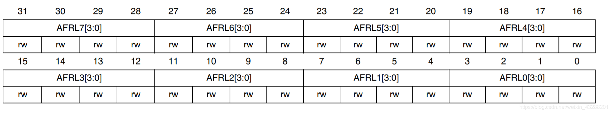
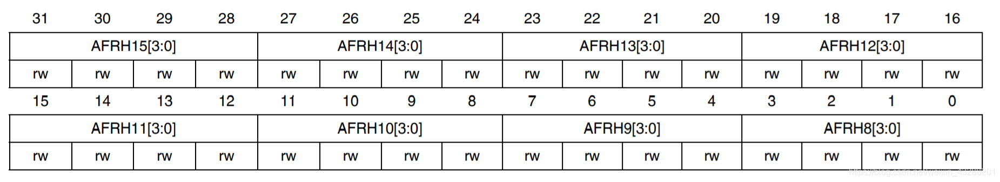
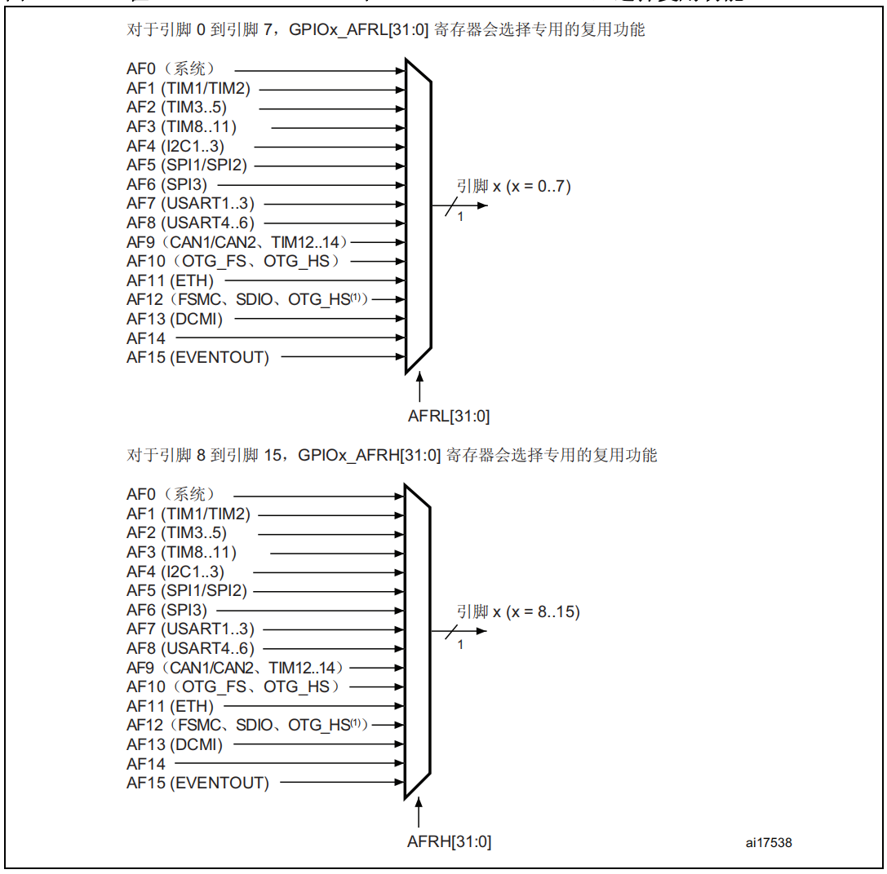

参考资料：

STM32F4开发指南-库函数版本_V1.1.pdf\4.4 IO 引脚复用器和映射 

8，STM32参考资料\STM32F4xx中文参考手册.pdf\7.3.2 I/O 引脚复用器和映射

### 一、端口复用

（1）什么是端口复用？

STM32F4 有很多的内置外设，这些外设的外部引脚都是与 GPIO 复用的。也就是说，一个 GPIO如果可以复用为内置外设的功能引脚，那么当这个 GPIO 作为内置外设使用的时候，就叫做复用。

（2）STM32的端口复用映射原理

STM32F4系列微控制器1O引脚通过一个复用器连接到内置外设或模块。该复用器一次只允许一个外设的复用功能(AF)连接到对应的IO口。这样可以确保共用同一IO引脚的外设之间不会发生冲突。
每个IO引脚都连接复用器，该复用器采用16路复用功能输入(AF0到AF15),可通过GPIOx_AFRL(针对引脚0-7)和GPIOX_AFRH(针对引脚8-15)寄存器对这些输入进配置，每四位控制一路复用。 

AFRL寄存器控制低8位引脚，对应关系如下：



```c
AFRL寄存器里的值与复用功能的对应关系：
0000：AF0			1000：AF8
0001：AF1			1001：AF9
0010：AF2			1010：AF10
0011：AF3			1011：AF11
0100：AF4			1100：AF12
0101：AF5			1101：AF13
0110：AF6			1110：AF14
0111：AF7			1111：AF15
```

AFRH寄存器控制低8位引脚，对应关系如下：



```c
AFRH寄存器里的值与复用功能的对应关系：
0000：AF0			1000：AF8
0001：AF1			1001：AF9
0010：AF2			1010：AF10
0011：AF3			1011：AF11
0100：AF4			1100：AF12
0101：AF5			1101：AF13
0110：AF6			1110：AF14
0111：AF7			1111：AF15
```

端口复用器



初始时，全部连接到AF0。此时AFRL0到AFRL7寄存器值全为0000。

我们将 IO 口连接到 AF0 之后，还要根据所用功能进行配置：

- JTAG/SWD:在器件复位之后，会将这些功能引脚指定为专用引脚。也就是说，这些引脚在复位后默认就是 JTAG/SWD 功能。如果我们要作为 GPIO 来使用，就需要对对应的 IO口复用器进行配置。
- RTC_REFIN:此引脚在系统复位之后要使用的话要配置为浮空输入模式。
- MCO1 和 MCO2：这些引脚在系统复位之后要使用的话要配置为复用功能模式。

对于外设复用功能的配置，除了 ADC 和 DAC 要将 IO 配置为模拟通道之外其他外设功能一律要配置为复用功能模式。

（3）示例详解——配置 GPOPA.9,GPIOA.10 口为串口 1 复用功能

- 首先,我们要使用 IO 复用功能外设，必须先打开对应的 IO 时钟和复用功能外设时钟。 

```c
/*使能 GPIOA 时钟*/
RCC_AHB1PeriphClockCmd(RCC_AHB1Periph_GPIOA,ENABLE); 
/*使能 USART1 时钟*/
RCC_APB2PeriphClockCmd(RCC_APB2Periph_USART1,ENABLE);
```

- 其次，我们在 GIPOx_MODER 寄存器中将所需 IO（对于串口 1 是 PA9,PA10）配置为复用功能（ADC 和 DAC 设置为模拟通道）。

- 再次,我们还需要对 IO 口的其他参数，例如类型，上拉/下拉以及输出速度。

```c
/*GPIOA9 与 GPIOA10 初始化*/
GPIO_InitStructure.GPIO_Pin = GPIO_Pin_9 | GPIO_Pin_10;
GPIO_InitStructure.GPIO_Mode = GPIO_Mode_AF;//复用功能
GPIO_InitStructure.GPIO_Speed = GPIO_Speed_50MHz;//速度 50MHz
GPIO_InitStructure.GPIO_OType = GPIO_OType_PP; //推挽复用输出
GPIO_InitStructure.GPIO_PuPd = GPIO_PuPd_UP; //上拉
GPIO_Init(GPIOA,&GPIO_InitStructure); //初始化 PA9，PA10
```

- 最后，我们配置 GPIOx_AFRL 或者 GPIOx_AFRH 寄存器，将 IO 连接到所需的 AFx。

```c
/*PA9 连接 AF7，复用为 USART1_TX */
GPIO_PinAFConfig(GPIOA,GPIO_PinSource9,GPIO_AF_USART1);
/* PA10 连接 AF7,复用为 USART1_RX*/
GPIO_PinAFConfig(GPIOA,GPIO_PinSource10,GPIO_AF_USART1);
```

