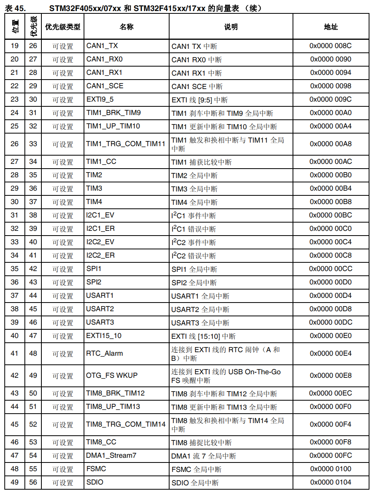
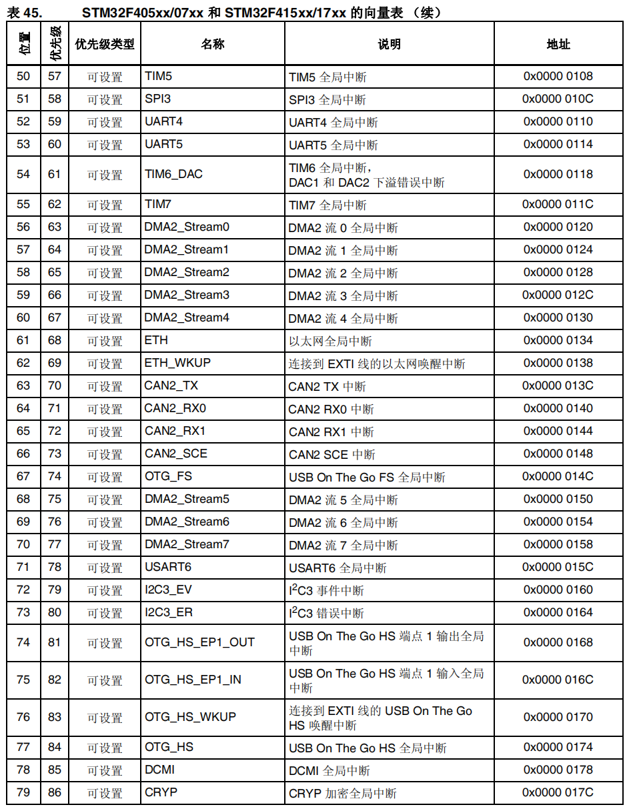
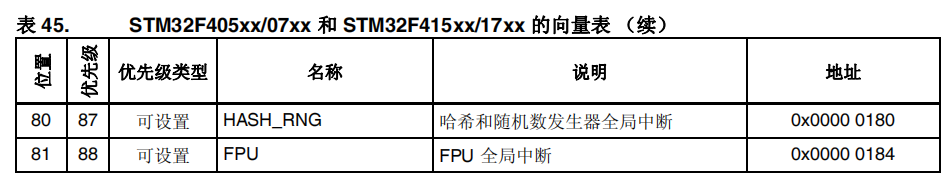
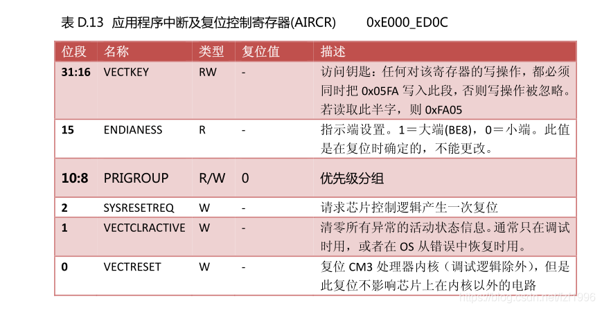

参考资料：

STM32F4开发指南-库函数版本_V1.1.pdf\4.5 STM32 NVIC 中断优先级管理

8，STM32参考资料\STM32F4xx中文参考手册.pdf\第十章 中断和事件 

### 一、NVIC中断寄存器

（1）介绍

- **NVIC** 是嵌套向量中断控制器
- CM4 内核支持 256 个中断，其中包含了 16 个内核中断和 240 个外部中断，并且具有256 级的可编程中断设置。
- 但 STM32F4 并没有使用 CM4 内核的全部东西，而是只用了它的一部分。
  - STM32F40xx/STM32F41xx 总共有 92 个中断
  - STM32F42xx/STM32F43xx 则总共有 96 个中断
- STM32F40xx/STM32F41xx 的 92 个中断里面，包括 10 个内核中断和 82 个可屏蔽中断，具有 16 级可编程的中断优先级，而我们常用的就是这 82 个可屏蔽中断。




 

 

（2）与中断有关的寄存器

ISER[8]：中断==使能==寄存器==组==

要使能某个中断，必须设置相应的 ISER 位为 1，使该中断被使能 

- CM4内核有256个中断，使用8个32位寄存器来控制。
- STM32F4只有82个可屏蔽中断，所以有用的只有ISER[0] ~ISER[2]。
- ISER[0]的 bit0~31 对应中断0 ~ 31
- ISER[1]的 bit0~32 对应中断 32 ~ 63
- ISER[2]的 bit0~17 对应中断64 ~ 81


ICER[8]：中断==除能==寄存器==组==

功能与ISER寄存器相反，每个位对应的中断和 ISER 是一样的。

这里要专门设置一个 ICER 来清除中断位，而不是向 ISER 写 0 来清除，是因为 ==NVIC 的这些寄存器都是写 1 有效的，写 0 是无效的。==

即要除能某个中断，必须设置相应的 ICER 位为 1，使该中断被除能


ISPR[8]：中断==挂起控制==寄存器==组==

每个位对应的中断和 ISER 是一样的。通过置 1，可以将正在进行的中断挂起，而执行同级或更高级别的中断。==写 0 是无效的==。


ICPR[8]：中断==解挂控制==寄存器==组==

对应位所代表的中断和 ISER 一样，如果为 1，则表示该位所对应的中断正在被执行。

这是一个==只读寄存器==，通过它可以知道当前在执行的中断是哪一个。在中断执行完了由硬件自动清零。


IABP[8]：中断==激活标志位==寄存器==组==

代表的中断和 ISER 一样，如果为 1，则表示该位所对应的中断正在被执行。

这是一个==只读寄存器==，通过它可以知道当前在执行的中断是哪一个。在中断执行完了由硬件自动清零。


==IP[240]：中断优先级控制寄存器组==

IP 寄存器组由 240 个 8bit的寄存器组成，每个可屏蔽中断占用 8bit。

STM32F4只用到了其中的 82 个。IP[81]~IP[0]分别对应中断 81~0。

而每个可屏蔽中断占用的 8bit 并没有全部使用，而是只用了高 4 位。即2^4 = 16 个可编程优先级。这 4 位，又分为抢占优先级和响应优先级。


==AIRCR：==

 

所以在这个寄存器中最重要的就是[10 : 8]


### 二、NVIC中断优先级分组和中断优先级设置

（1）中断优先级分组和中断优先级详解

抢占优先级&响应优先级的区别：

- 高优先级的抢占优先级是可以打断正在进行的低抢占优先级中断的
- 抢占优先级相同的中断，高优先级的响应优先级不可以打断低响应优先级的中断
- 抢占优先级相同的中断，，当两个中断同时发生时，哪个响应优先级高，哪个先执行
- 如果两个中断的抢占优先级和响应优先级都是一样的话，则看哪个中断先发生就先执行

==抢占优先级的级别高于响应优先级。而数值越小所代表的优先级就越高。==


对STM32中断进行分组，组0~4.同时，对每个中断设置一个抢占优先级和一个响应优先级。

分组配置是在寄存器SCB->AIRCR中配置：

|  组  | AIRCR[10 : 8] | IP bit[7 : 4] |           分配结果           |
| :--: | :-----------: | :-----------: | :--------------------------: |
|  0   |      111      |     0 : 4     | 0位抢占优先级，4位响应优先级 |
|  1   |      110      |     1 : 3     | 1位抢占优先级，3位响应优先级 |
|  2   |      101      |     2 : 2     | 2位抢占优先级，2位响应优先级 |
|  3   |      100      |     3 : 1     | 3位抢占优先级，1位响应优先级 |
|  4   |      011      |     4 : 0     | 4位抢占优先级，0位响应优先级 |

例如组设置为 3，那么此时所有的 82 个中断，每个中断的中断优先寄存器的高四位中的最高 3 位是抢占优先级，低 1 位是响应优先级。
每个中断，你可以设置抢占优先级为 0~7（2^3），响应优先级为 1 或 0（2^1）。

结合实例说明一下：假定设置中断优先级组为 2，然后设置中断 3(RTC_WKUP 中断)的抢占优先级为 2，响应优先级为 1。中断 6（外部中断 0）的抢占优先级为 3，响应优先级为 0。中断 7（外部中断 1）的抢占优先级为 2，响应优先级为 0。那么这 3 个中断的优先级顺序为：中断 7>中断 3>中断 6.

上面例子中的中断 3 和中断 7 都可以打断中断 6 的中断。而中断 7 和中断 3 却不可以相互打断！

==只设置一次中断优先级分组，设置好分组后一般不会再改变分组。== 

（2）代码部分

1. 中断优先级分组

   函数：

```c
void NVIC_PriorityGroupConfig(uint32_t NVIC_PriorityGroup)
{
  /* 检查参数 */
  assert_param(IS_NVIC_PRIORITY_GROUP(NVIC_PriorityGroup));
  
  /* 根据 NVIC_PriorityGroup 值设置 PRIGROUP[10:8] 位，即设置分组 */
  SCB->AIRCR = AIRCR_VECTKEY_MASK | NVIC_PriorityGroup;
}
```

​	实例：

```c
NVIC_PriorityGroupConfig(NVIC_PriorityGroup_2);
```


2. 中断优先级设置

   函数：

```c
void NVIC_Init(NVIC_InitTypeDef* NVIC_InitStruct)	//NVIC_InitTypeDef结构体定义如下
```

```c
typedef struct
{
 uint8_t NVIC_IRQChannel; 						//定义初始化的是哪个中断
 uint8_t NVIC_IRQChannelPreemptionPriority;		 //定义这个中断的抢占优先级别
 uint8_t NVIC_IRQChannelSubPriority; 			//定义这个中断的子优先级别,也叫响应优先级
 FunctionalState NVIC_IRQChannelCmd; 			//该中断通道是否使能
} NVIC_InitTypeDef
```

​	实例：

```c
//使能串口 1 的中断，同时设置抢占优先级为 1，响应优先级位 2
NVIC_InitTypeDef NVIC_InitStructure;
NVIC_InitStructure.NVIC_IRQChannel = USART1_IRQn;//串口 1 中断
NVIC_InitStructure.NVIC_IRQChannelPreemptionPriority=1 ;// 抢占优先级为 1
NVIC_InitStructure.NVIC_IRQChannelSubPriority = 2;// 响应优先级位 2
NVIC_InitStructure.NVIC_IRQChannelCmd = ENABLE; //IRQ 通道使能
NVIC_Init(&NVIC_InitStructure); //根据上面指定的参数初始化 NVIC 寄存器
```


### 三、NVIC总结

中断设置步骤：

- 系统运行开始的时候设置中断分组。调用函数为 NVIC_PriorityGroupConfig();

  整个系统执行过程中，只设置一次中断分组

- 设置所用到的中断的中断优先级别。对每个中断调用函数为 NVIC_Init();

- 如果需要挂起、解挂，查看中断当前激活状态，分别调用相关函数即可

  