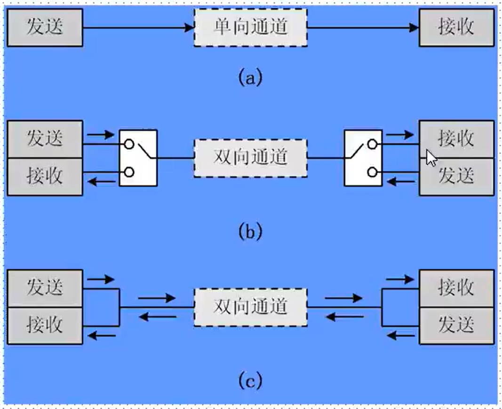
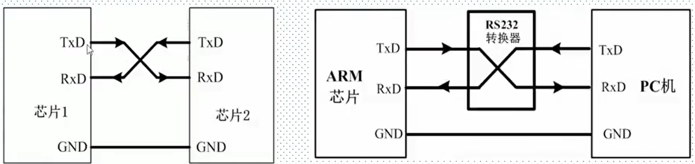
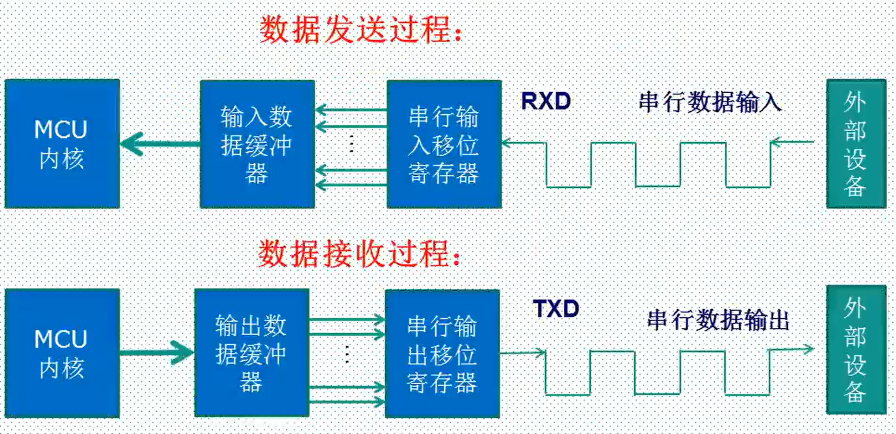
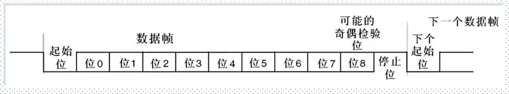
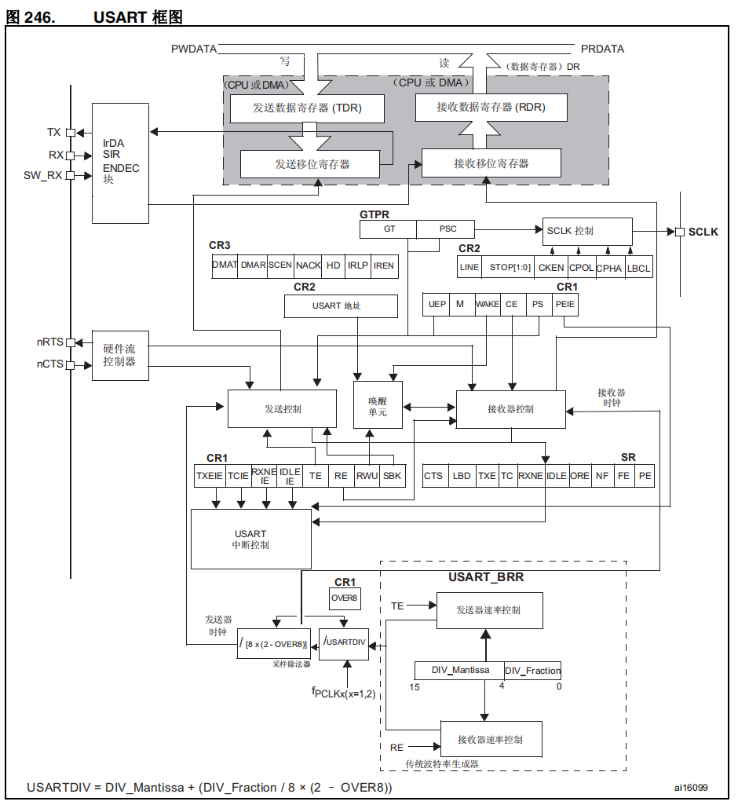

 参考资料：

STM32F4开发指南-库函数版本_V1.1.pdf\5.3 usart 文件夹介绍

STM32F4开发指南-库函数版本_V1.1.pdf\第九章 串口通信实验

8，STM32参考资料\STM32F4xx中文参考手册.pdf\第26章 通用同步异步收发器

### 一、串行通信接口背景知识

（1）处理器与外部设备通信的两种方式

- 并行通信
  - 传输原理：数据各个位同时传输
  - 优点：速度快
  - 缺点：占用引脚资源多
- 串行通信
  - 传输原理：数据按位顺序传输
  - 优点：占用引脚资源少
  - 缺点：速度相对较慢

（2）串行通信

1.按数据传输方向，分为：

- 单工

  数据传输只支持在一个方向上传输。

- 半双工

  允许数据在两个方向上传输，但是，在某一时刻，只允许数据在一个方向上传输。它实际上是一种切换方向的单工通信。

- 全双工

  允许数据在同时在两个方向上传输，因此，全双工通信是两个单工通信方式的结合，它要求发送设备和接收设备都有独立的接受和发送能力。

2.串行通信的通信方式：

- 同步通信：带时钟同步信号

  SPI、IIC通信接口

- 异步通信：不带时钟同步信号

  UART（通用异步收发器），单总线

3.常见的串行通信接口：

|        通信标准        | 引脚说明                                                     | 通信方式 | 通信方向 |
| :--------------------: | :----------------------------------------------------------- | :------: | :------: |
|          UART          | TXD：发送端 RXD：接收端 GND：公共地                    | 异步通信 |  全双工  |
| 单总线 （1-wire） | DQ：发送、接收端                                             | 异步通信 |  半双工  |
|          SPI           | SCK：同步时钟 MISO：主机输入，从机输出 MOSI：主机输出，从机输入 | 同步通信 |  全双工  |
|          I2C           | SCL:同步时钟 SDA：数据输入输出                          | 同步通信 |  半双工  |

### 二、STM32串口通信基础

1。STM32的串口通信接口

- UART：通用异步收发器
- USRAT：通用同步异步收发器

> STM32F4xx目前最多支持8个UART，STM32F407一般是6个。具体可以对照手册看。
>
> STM32F103目前最多支持5个UART

2.UART异步通信方式引脚连接方法

- RXD：数据输入引脚，数据接收。
- TXD：数据发送引脚，数据发送
- 对于STM32F407，每个串口和引脚对应关系，可以查看数据手册引脚对应表

3.UART异步通信方式引脚（STM32407ZGT6）

| 串口号 |      RXD       |      TXD       |
| :----: | :------------: | :------------: |
|   1    |   PA10(PB7)    |    PA9(PB6)    |
|   2    |    PA3(PD6)    |    PA2(PD5)    |
|   3    | PB11(PC11/PD9) | PB10(PC10/PD8) |
|   4    |   PC11(PA1)    |   PC11(PA1)    |
|   5    |      PD2       |      PC12      |
|   6    |    PC7(PG9)    |   PC6(PG14)    |

4.UART异步通信方式特点：

- 全双工异步通信。
- 小数波特率发生器系统，提供精确的波特率。
- 可配置的16倍过采样或8倍过采样，因而为速度容差与时钟容差的灵活配置提供了可能。
- 可编程的数据字长度(8位或者9位)
- 可配置的停止位（支持1或者2位停止位）
- 可配置的使用DMA多缓冲器通信。
- 单独的发送器和接收器使能位。
- 检测标志：①接受缓冲器②发送缓冲器空③传输结束标志
- 多个带标志的中断源。触发中断。
- 其他：校验控制，四个错误检测标志。

5.STM32串口通信过程

6.STM32串口异步通信需要定义的参数

- 起始位
- 数据位
- 奇偶校验位
- 停止位
- 波特率设置

### 三、STM32串口框图

接受数据后，将数据发送到接受移位寄存器，待数据位数足够了，发送给接受数据寄存器，CPU通过数据总线读取数据

CPU通过总线，将数据发送到发送数据寄存器，再发给发送移位寄存器，通过它将数据传出去

而接受数据寄存器和发送数据寄存器都受波特率控制

波特率的来源：

时钟$f_{PCLKx}$先通过USARTDIV分频，再通过/（8*（2-OVER8））分频，就得到了我们需要的波特率

波特率发给发送控制和接收控制，进而控制数据发送寄存器和数据接收寄存器

**1.$f_{PCLKx}$**为UART外设的运行频率，stm32f4中为主频的一半；

- $f_{PCLK1}$用于串口1和串口6
- $f_{PCLK2}$用于串口2 ~ 5

 **2.OVER8**是8倍过采样、16倍过采样的选择寄存位，当其设置为0时，表示使用16倍过采样，当其设置为1时，表示使用8倍过采样； 

**3.USARTDIV **是一个存放在 USART_BRR 寄存器中的无符号定点数。

计算的过程见下一节