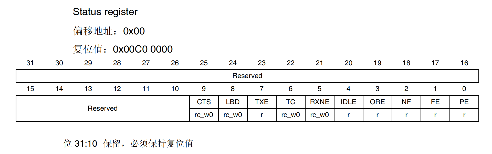
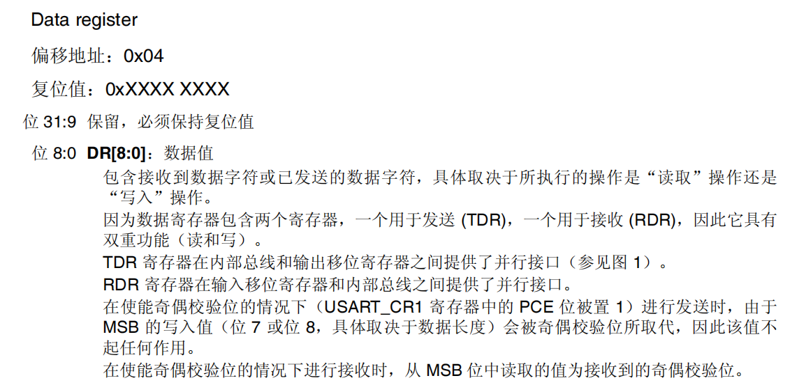
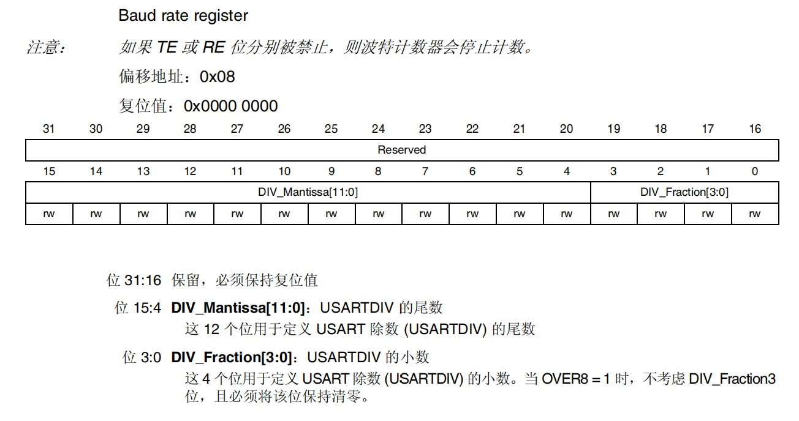
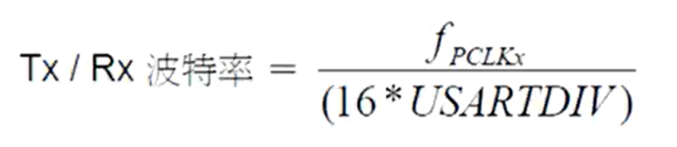

参考资料：

STM32F4开发指南-库函数版本_V1.1.pdf\5.3 usart 文件夹介绍

STM32F4开发指南-库函数版本_V1.1.pdf\第九章 串口通信实验

8，STM32参考资料\STM32F4xx中文参考手册.pdf\第26章 通用同步异步收发器

### 一、STM32串口常用寄存器和库函数

（1）常用的串口相关寄存器

- USART_SR状态寄存器

  对应函数：

  FlagStatus USART_GetFlagStatus(USART_TypeDef* USARTx, uint16_t USART_FLAG)

  

  位 9 CTS：CTS 标志

  位 8 LBD：LIN 断路检测标志

  位 7 TXE：发送数据寄存器为空

  位 6 TC：发送完成

  位 5 RXNE：读取数据寄存器不为空

  位 4 IDLE：检测到空闲线路

  位 3 ORE：上溢错误

  位 2 NF：检测到噪声标志

  位 1 FE：帧错误

  位 0 PE：奇偶校验错误

  

- USART_DR数据寄存器

  对应函数：

  void USART_SendData(USART_TypeDef* USARTx, uint16_t Data)

  uint16_t USART_ReceiveData(USART_TypeDef* USARTx)

  

- USART_BRR波特率寄存器

  对应函数：

  void USART_Init(USART_TypeDef* USARTx, USART_InitTypeDef* USART_InitStruct)

  

  波特率的计算(OVER8 = 0)：

  

  一般来说，我们知道波特率和时钟频率，要求的只有USARTDIV

  例如：

  ​	时钟频率为84M，波特率为115200

  ​	USARTDIV = 45.572

  ​	DIV_Fraction = 16*0.572 = 9 = 0X09

  ​	DIV_Mantissa = 45 = 0X2D

###  二、串口配置一般步骤

1. 串口时钟使能：RCC_APB2PeriphClockCmd(RCC_APB2Periph_USART1,ENABLE);

   GPIO时钟使能：

   RCC_AHB1PeriphClockCmd(RCC_AHB1Periph_GPIOA,ENABLE);

2. 引脚复用映射：

   GPIO_PinAFConfig(GPIOA,GPIO_PinSource9,GPIO_AF_USART1);

   GPIO_PinAFConfig(GPIOA,GPIO_PinSource10,GPIO_AF_USART1);

3. GPIO端口模式设置：

   GPIO_InitTypeDef  GPIO_InitStructure;

   

   GPIO_InitStructure.GPIO_Pin = GPIO_Pin_9 ;
   GPIO_InitStructure.GPIO_Mode = GPIO_Mode_AF;
   GPIO_InitStructure.GPIO_OType = GPIO_OType_PP;
   GPIO_InitStructure.GPIO_Speed = GPIO_Speed_100MHz;
   GPIO_InitStructure.GPIO_PuPd = GPIO_PuPd_UP;
   GPIO_Init(GPIOA, &GPIO_InitStructure); 

   

   GPIO_InitStructure.GPIO_Pin = GPIO_Pin_10 ;
   GPIO_InitStructure.GPIO_Mode = GPIO_Mode_AF;
   GPIO_InitStructure.GPIO_OType = GPIO_OType_PP;
   GPIO_InitStructure.GPIO_Speed = GPIO_Speed_100MHz;
   GPIO_InitStructure.GPIO_PuPd = GPIO_PuPd_UP;
   GPIO_Init(GPIOA, &GPIO_InitStructure); 

   

4. 使能串口并初始化串口参数：

   USART_InitTypeDef   USART_InitStructure;

   

   USART_InitStructure.USART_BaudRate=115200;
   USART_InitStructure.USART_HardwareFlowControl=USART_HardwareFlowControl_None;
   USART_InitStructure.USART_Mode=USART_Mode_Rx|USART_Mode_Tx;
   USART_InitStructure.USART_Parity=USART_Parity_No;
   USART_InitStructure.USART_StopBits=USART_StopBits_1;
   USART_InitStructure.USART_WordLength=USART_WordLength_8b;

   

   USART_Init(USART1,&USART_InitStructure);

   USART_Cmd(USART1,ENABLE);

   

   

5. 开启中断并且初始化NVIC：

   USART_ITConfig(USART1,USART_IT_RXNE,ENABLE);

   

   NVIC_InitTypeDef   NVIC_InitStructure;

   NVIC_InitStructure.NVIC_IRQChannel=USART1_IRQn;
   NVIC_InitStructure.NVIC_IRQChannelCmd=ENABLE;
   NVIC_InitStructure.NVIC_IRQChannelPreemptionPriority=1;
   NVIC_InitStructure.NVIC_IRQChannelSubPriority=1;

   NVIC_Init(&NVIC_InitStructure);

   

6. 编写中断处理函数:

   其中包含串口数据收发、串口传输状态传输

   void  USART1_IRQHandler(void)
   {
   	u8 res;
   	if(USART_GetITStatus(USART1,USART_IT_RXNE))

   ​	{	
   	res=USART_ReceiveData(USART1);
   	USART_SendData(USART1,res);
   	}
   }

7. 串口数据收发:

   res=USART_ReceiveData(USART1);
   USART_SendData(USART1,res);

8. 串口传输状态传输:

   (USART_GetITStatus(USART1,USART_IT_RXNE)；

完整代码：

```c
 void My_USART1_Init(void)
{
	GPIO_InitTypeDef  GPIO_InitStructure;
	USART_InitTypeDef   USART_InitStructure;
	NVIC_InitTypeDef   NVIC_InitStructure;
	
	RCC_APB2PeriphClockCmd(RCC_APB2Periph_USART1,ENABLE);
	RCC_AHB1PeriphClockCmd(RCC_AHB1Periph_GPIOA,ENABLE);
	
	GPIO_PinAFConfig(GPIOA,GPIO_PinSource9,GPIO_AF_USART1);
	GPIO_PinAFConfig(GPIOA,GPIO_PinSource10,GPIO_AF_USART1);
	
	GPIO_InitStructure.GPIO_Pin = GPIO_Pin_9;
  	GPIO_InitStructure.GPIO_Mode = GPIO_Mode_AF;
  	GPIO_InitStructure.GPIO_OType = GPIO_OType_PP;
  	GPIO_InitStructure.GPIO_Speed = GPIO_Speed_100MHz;
  	GPIO_InitStructure.GPIO_PuPd = GPIO_PuPd_UP;
  	GPIO_Init(GPIOA, &GPIO_InitStructure);
	
	GPIO_InitStructure.GPIO_Pin = GPIO_Pin_10;
  	GPIO_InitStructure.GPIO_Mode = GPIO_Mode_AF;
  	GPIO_InitStructure.GPIO_OType = GPIO_OType_PP;
  	GPIO_InitStructure.GPIO_Speed = GPIO_Speed_100MHz;
  	GPIO_InitStructure.GPIO_PuPd = GPIO_PuPd_UP;
  	GPIO_Init(GPIOA, &GPIO_InitStructure);
	
	USART_InitStructure.USART_BaudRate=115200;
	USART_InitStructure.USART_HardwareFlowControl=USART_HardwareFlowControl_None;
	USART_InitStructure.USART_Mode=USART_Mode_Rx|USART_Mode_Tx;
	USART_InitStructure.USART_Parity=USART_Parity_No;
	USART_InitStructure.USART_StopBits=USART_StopBits_1;
	USART_InitStructure.USART_WordLength=USART_WordLength_8b;
	
	USART_Cmd(USART1,ENABLE);
	
	
	USART_ITConfig(USART1,USART_IT_RXNE,ENABLE);
	
	NVIC_InitStructure.NVIC_IRQChannel=USART1_IRQn;
	NVIC_InitStructure.NVIC_IRQChannelCmd=ENABLE;
	NVIC_InitStructure.NVIC_IRQChannelPreemptionPriority=1;
	NVIC_InitStructure.NVIC_IRQChannelSubPriority=1;
	
	NVIC_Init(&NVIC_InitStructure);
}

void  USART1_IRQHandler(void)
{
	u8 res;
	if(USART_GetITStatus(USART1,USART_IT_RXNE)){	
	res=USART_ReceiveData(USART1);
	USART_SendData(USART1,res);
	}
}

int main(void)
{
	NVIC_PriorityGroupConfig(NVIC_PriorityGroup_2);
	My_USART1_Init();
	while(1);
}
```

