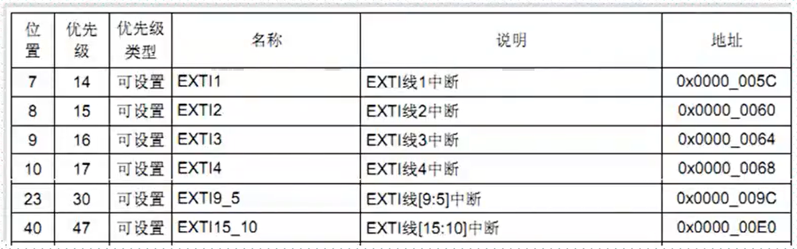

参考资料：

STM32F4开发指南-库函数版本_V1.1.pdf\第十章 外部中断实验

8，STM32参考资料\STM32F4xx中文参考手册.pdf\第十章 中断和事件 

### 一、外部中断概述

（1）概述

- STM32的每个IO口都可作为外部中断输入

- STM32F4的中断控制器支持22个外部中断/事件请求

  ==EXTI 线 0~15：对应外部 IO 口的输入中断。==

  EXTI 线 16：连接到 PVD 输出。

  EXTI 线 17：连接到 RTC 闹钟事件。

  EXTI 线 18：连接到 USB OTG FS 唤醒事件。

  EXTI 线 19：连接到以太网唤醒事件。

  EXTI 线 20：连接到 USB OTG HS(在 FS 中配置)唤醒事件。

  EXTI 线 21：连接到 RTC 入侵和时间戳事件。

  EXTI 线 22：连接到 RTC 唤醒事件。

- 每个外部中断线可以独立的配置触发方式（上升沿、下降沿、双边沿触发）、触发/屏蔽，专用的状态位

（2）IO口和16个中断线的映射方式

GPIOx.0映射到EXTI0
GPIOx.1映射到EXTI1
GPIOx.2映射到EXTI2
GPIOx.3映射到EXTI3
GPIOx.4映射到EXTI4
GPIOx.5映射到EXTI5
GPIOx.6映射到EXTI6
GPIOx.7映射到EXTI7
GPIOx.8映射到EXTI8
GPIOx.9映射到EXTI9
GPIOx.10映射到EXTI10
GPIOx.11映射到EXTI11
GPIOx.12映射到EXTI12
GPIOx.13映射到EXTI13
GPIOx.14映射到EXTI14
GPIOx.15映射到EXTI15

（3）16个中断线和中断向量的映射（中断服务函数）

IO口外部中断在中断向量分配表中只分配了7个中断向量，也就是只能使用7个中断服务函数



中断服务函数列表：

EXTI0_IRQHandler
EXTI1_IRQHandler
EXTI2_IRQHandler
EXTI3_IRQHandler
EXTI4_IRQHandler
EXTI9_5_IRQHandler
EXTI15_10_IRQHandler

### 二、外部中断常用库函数

（1）设置IO口和中断线的映射关系

void  SYSCFG_EXTILineConfig(uint8_t EXTI_PortSourceGPIOx, uint8_t EXTI_PinSourcex);

例：SYSCFG_EXTILineConfig(EXTI_PortSourceGPIOE, EXTI_PinSource2);//PE2连接到中断线2

（2）初始化中断线的触发方式

void EXTI_Init(EXTI_InitTypeDef* EXTI_InitStruct)；

typedef struct
{
uint32_t EXTI_Line;					//中断线选择
EXTIMode_TypeDef EXTI_Mode;		//模式设置，中断还是事件
EXTITrigger_TypeDef EXTI_Trigger;	//触发方式：上升沿、下降沿、边沿
FunctionalState EXTI_LineCmd;		//使能
}EXTI_InitTypeDef；

例：

EXTI_InitTypeDef   EXTI_InitStructure;

EXTI_InitStructure.EXTI_Line = EXTI_Line0;				//LINE0
EXTI_InitStructure.EXTI_Mode = EXTI_Mode_Interrupt;		//中断事件
EXTI_InitStructure.EXTI_Trigger = EXTI_Trigger_Rising;		//上升沿触发
EXTI_InitStructure.EXTI_LineCmd = ENABLE;				//中断线使能

EXTI_Init(&EXTI_InitStructure);

（3）判断中断线的中断状态

ITStatus EXTI_GetITStatus(uint32_t EXTI_Line)；

例：ITStatus EXTI_GetITStatus(EXTI_Line0)；	//判断LIINE0的中断状态

（4）清除中断线上的中断标志位

void EXTI_ClearITPendingBit(uint32_t EXTI_Line);

例：EXTI_ClearITPendingBit(EXTI_Line0);	//清除LINE0上的中断标志位

（5）使能SYSCFG时钟

void RCC_APB2PeriphClockCmd(uint32_t RCC_APB2Periph, FunctionalState NewState)；

例：RCC_APB2PeriphClockCmd(RCC_APB2Periph_SYSCFG, ENABLE);//使能SYSCFG时钟


### 三、外部中断写按键实验

（1）外部中断的一般配置步骤

- 使能SYSCFG时钟

  RCC_APB2PeriphClockCmd(uint32_t RCC_APB2Periph, FunctionalState NewState)；

- 初始化IO口为输入

  void GPIO_Init(GPIO_TypeDef* GPIOx, GPIO_InitTypeDef* GPIO_InitStruct)；

- 设置IO口和中断线的映射方式

  void  SYSCFG_EXTILineConfig(uint8_t EXTI_PortSourceGPIOx, uint8_t EXTI_PinSourcex);

- 初始化线上中断，初始化触发条件

  void EXTI_Init(EXTI_InitTypeDef* EXTI_InitStruct)；

- 配置中断分组（NVIC），并中断使能

  void NVIC_Init(NVIC_InitTypeDef* NVIC_InitStruct);

- 编写中断服务函数

  EXTIx_IRQHandler();

- 清除中断标志位

  void EXTI_ClearITPendingBit(uint32_t EXTI_Line);

（2）外部中断实验

看视频

外部中断配置代码：

```c
void EXTIX_Init(void)
{
	EXTI_InitTypeDef   EXTI_InitStructure;
	NVIC_InitTypeDef NVIC_InitStructure;

	RCC_APB2PeriphClockCmd(RCC_APB2Periph_SYSCFG, ENABLE);//使能SYSCFG时钟

	KEY_Init();

	SYSCFG_EXTILineConfig(EXTI_PortSourceGPIOE, EXTI_PinSource4);//PE4连接到中断线4

	EXTI_InitStructure.EXTI_Line = EXTI_Line4;				//LINE4
	EXTI_InitStructure.EXTI_Mode = EXTI_Mode_Interrupt;		//中断事件
	EXTI_InitStructure.EXTI_Trigger = EXTI_Trigger_Falling;		//下降沿触发
	EXTI_InitStructure.EXTI_LineCmd = ENABLE;			//中断线使能
	EXTI_Init(&EXTI_InitStructure);

	NVIC_InitStructure.NVIC_IRQChannel = EXTI4_IRQn;//串口 1 中断
	NVIC_InitStructure.NVIC_IRQChannelPreemptionPriority=1 ;// 抢占优先级为 1
	NVIC_InitStructure.NVIC_IRQChannelSubPriority = 1;// 响应优先级位 1
	NVIC_InitStructure.NVIC_IRQChannelCmd = ENABLE; //使能
	NVIC_Init(&NVIC_InitStructure); //根据上面指定的参数初始化 NVIC 寄存器
}
void EXTI4_IRQHandler(void)
{
    delay_ms(10);
    if(KEY==0)
    {
        LED0=!LED0;
        LED1=!LED1;
    }
    EXTI_ClearITPendingBit(EXTI_Line4);
}

```


