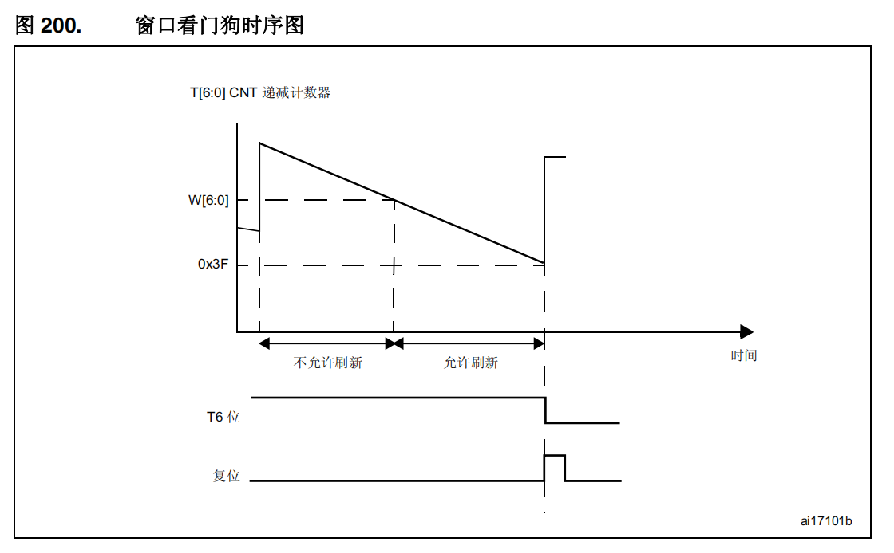
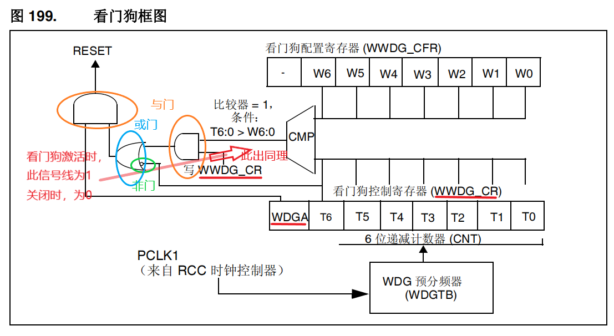
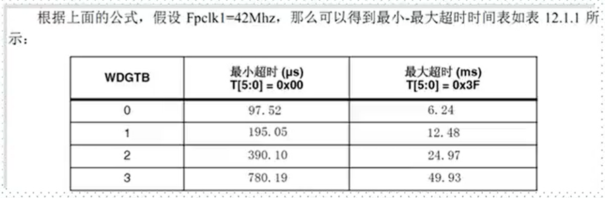
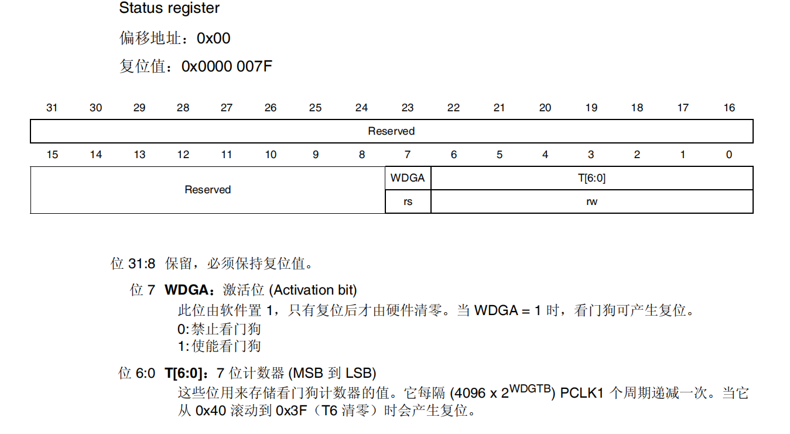
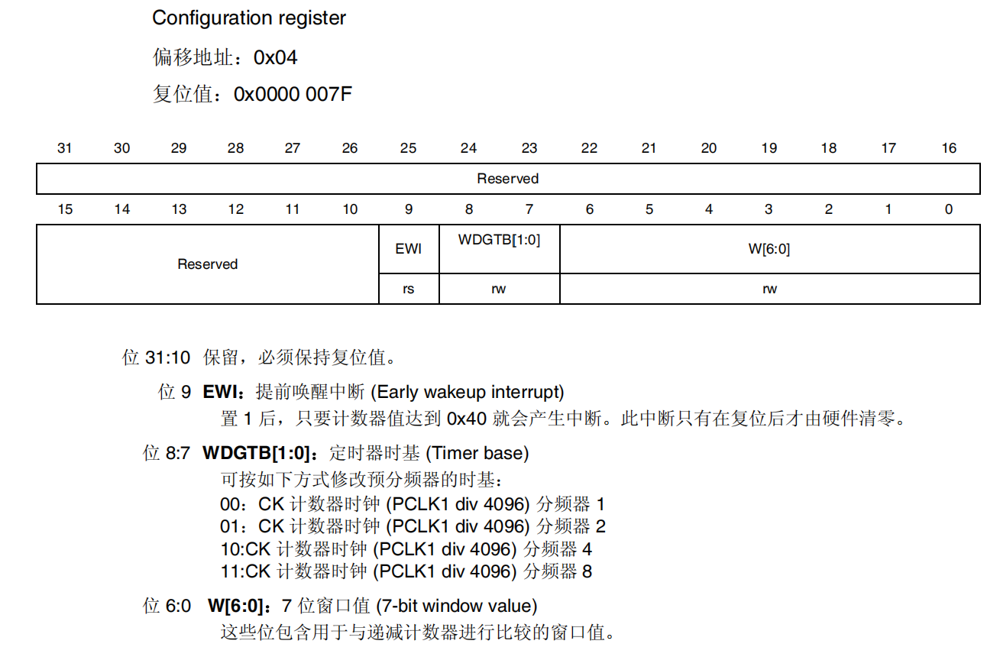
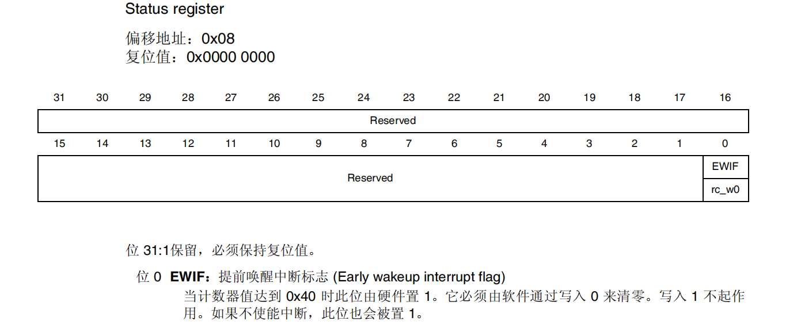

参考资料：

STM32F4开发指南-库函数版本_V1.1.pdf\第十二章 窗口门狗（WWDG）实验

8，STM32参考资料\STM32F4xx中文参考手册.pdf\第十九章 窗口看门狗 (WWDG)

### 一、窗口看门狗概述

（1）窗口看门狗作用和特点

对于一般的看门狗，程序可以在它产生复位前的任意时刻刷新看门狗，但这有一个隐患，有可能程序跑乱了又跑回到正常的地方，或跑乱的程序正好执行了刷新看门狗操作，这样的情况下一般的看门狗就检测不出来了。如果使用窗口看门狗，程序员可以根据程序正常执行的时间设置刷新看门狗的一个时间窗口，保证不会提前刷新看门狗也不会滞后刷新看门狗，这样可以检测出程序没有按照正常的路径运行非正常地跳过了某些程序段的情况。 

之所以称为窗口就是因为其喂狗时间是一个有上下限的范围内（窗口），你可以通过设定相关寄存器，设定其上限时间（下限固定）。喂狗的时间不能过早也不能过晚。
而独立看门狗限制喂狗时间在0-x内，x由相关寄存器决定。喂狗的时间不能过晚。

（2）看门狗工作原理

只有在W[6 : 0]d到0x3F这个区间内喂狗，看门狗才不会触发复位

如果激活看门狗（WWDG_CR 寄存器中的 WDGA 位置 1），则当 7 位递减计数器（T[6:0] 位）从 0x40 滚动到 0x3F（T6 已清零）时会引发复位。当计数器值大于窗口寄存器中所存储的值时，如果软件重载计数器，则会产生复位。

初始值：1111 111，逐个递减到1000 000 = 0x40，此时，可以产生早期唤醒中断（EWI），可用于喂狗
如果不喂，1000 000 -> 0111 111 = 0x3F，此时T6位由 1 变为 0 ，如果此时看门狗处于激活状态，则复位

STM32F的窗口看门狗中有一个7位的递减计数器T[6:0],它会在出现下述2种情况之一时产生看门狗复位：

- 当喂狗的时候如果计数器的值大于某一设定数值W[6:0]时，此设定数值在VWDG CFR寄存器定义。
- 当计数器的数值从0x40减到0x3F时【T6位跳变到0】。

==如果启动了看门狗并且允许中断，当递减计数器等于0x40时产生早期唤醒中断(EWI),它可以用于喂狗以避免WDG复位。==

（3）窗口看门狗超时时间

$T_{wwdg}$(超时时间) = （计数器低六位（IWDR_CR）+1）* 看门狗时间周期

看门狗时间周期 = 1/看门狗时钟频率 = 4096 * $2^{WDGTB}​$/$F_{pclk1}​$

看门狗时钟频率 = APB1的时钟频率 / 分频系数 = $F_{pclk1}$/4096 * $2^{WDGTB}$

分频系数 = 4096 * $2^{WDGTB}$（WDGTB为预分频器里的值，例如，11 = 4）
需要注意的是4096，由于APB1的时钟频率的时钟频率太高，所以我们需要将它先进行一次大的分频再使用

APB1的时钟频率大小可看时钟树的配置，为42MHz

所以，超时时间公式为$T_{out}$ = （（4096 * $2^{WDGTB}$）*（T[5 : 0] + 1））/$F_{pclk1}$

当$F_{pclk}$ = 42MHz 时，有

其他注意事项：

- ==上窗口值W[6:0]必须大于下窗口值0x40。否则就无窗口了。==
- ==窗口看门狗时钟来源PCLK1(APB1总线时钟)分频后，即除以4096后。== 

### 二、常用寄存器和库函数配置

（1）寄存器

1. 控制寄存器（WWDG_CR）

   

   启动并设置初始值：
   void WWDG_Enable(uint8_t Counter);		//初始值范围((COUNTER) >= 0x40) && ((COUNTER) <= 0x7F)
   例：

   - WWDG_Enable(0x7F);

   - WWDG_CNT = 0x7F;

     WWDG_Enable(WWDG_CNT);

   喂狗：
   void WWDG_SetCounter(uint8_t Counter);
   例：WWDG_SetCounter(0x7F);

   

2. 配置寄存器（WWDG_CFR）

   

   开启提前唤醒中断：
   void WWDG_EnableIT(void);
   例：WWDG_EnableIT();

   设置分频值：
   void WWDG_SetPrescaler(uint32_t WWDG_Prescaler);
   例：

   - WWDG_SetPrescaler(WWDG_Prescaler_4);		//分频器值为4

   - fprer = 

     WWDG_SetPrescaler(fprer);

   设置窗口值：
   void WWDG_SetWindowValue(uint8_t WindowValue);		//窗口值范围(VALUE) <= 0x7F
   例：

   - WWDG_SetWindowValue(0x6F);

   - wr = 0x6F

     WWDG_SetWindowValue(wr);

   

3. 状态寄存器（WWDG_SR）

   

   清除提前唤醒标志位：
   void WWDG_ClearFlag(void);
   例：WWDG_ClearFlag();

   检查是否设置了早期唤醒中断标志：
   FlagStatus WWDG_GetFlagStatus(void);

   

### 三、看门狗实验

（1）窗口看门狗配置过程

- 使能看门狗时钟

  RCC_APB1PeriphClockCmd(RCC_APB1Periph_WWDG,ENABLE);

- 设置分频系数

  WWDG_SetPrescaler();

- 开启提前唤醒中断并分组

  WWDG_EnableIT();
  NVIC_Init();

- 使能看门狗

  WWDG_Enable();

- 喂狗
  WWDG_SetCounter();

- 编写中断服务函数

  void WWDG_IRQHandler(void);

（2）代码

看视频