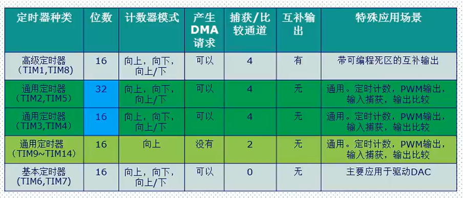
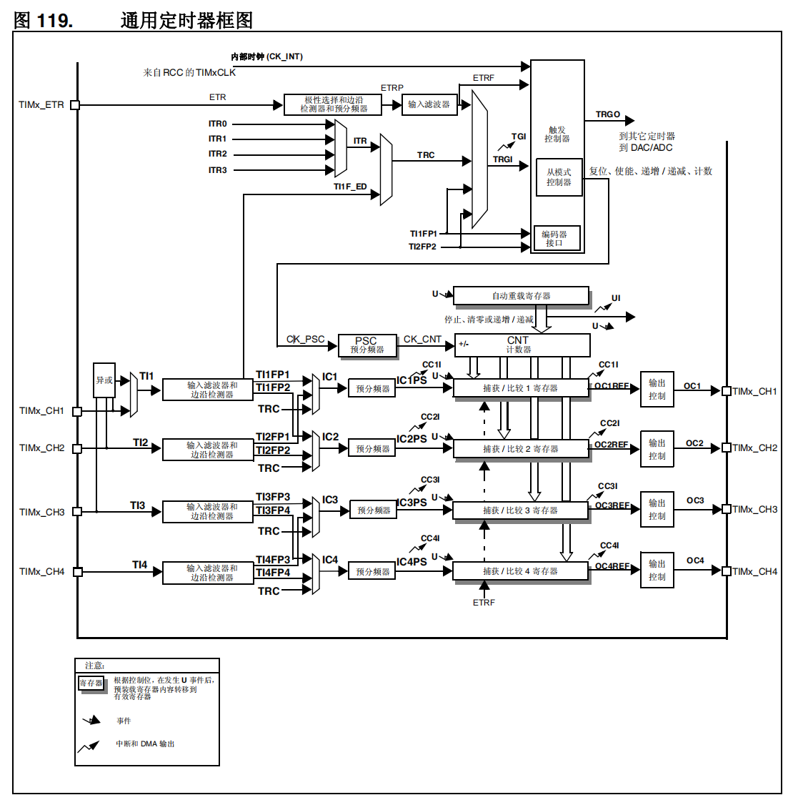
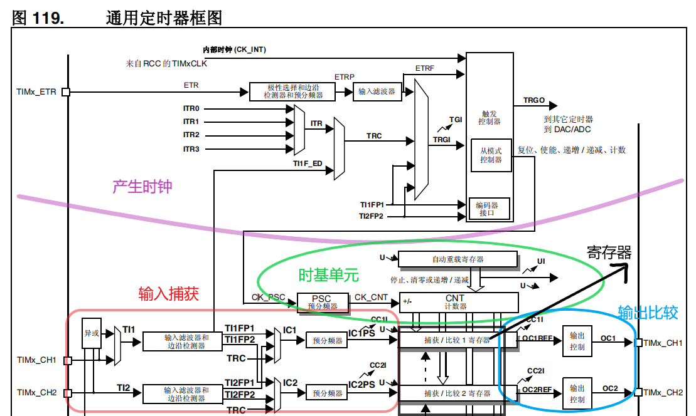

参考资料：

STM32F4开发指南-库函数版本_V1.1.pdf\第十三章 定时器中断实验、第十四章 PWM 输出实验、第十五章 输入捕获实验 

8，STM32参考资料\STM32F4xx中文参考手册.pdf\第十四章  高级控制定时器（TIM1 和 TIM8）、第十五章  通用定时器（TIM2 到 TIM5）

### 一、三种定时器区别

（1）STM32定时器

STM32F40x系列总共最多有14个定时器

（2）三种STM32定时器的区别

### 二、通用计时器特点

（1）特点描述

STM3F4的通用TIMx(TIM2、TIM3、TIM4和T1M5)定时器功能特点包括：

- 16/32位向上、向下、向上/向下（中心对齐）计数模式，自动装载计数器(TIMx_CNT)。 

- 16位可编程（可以实时修改）预分频器(TIMx_PSC),计数器时钟频率的分频系数为1~65535之间的任意数值。 

- 4个独立通道(TIMx_CH1~4),这些通道可以用来作为：

  输入捕获

  输出比较

  PWM生成（边缘或中间对齐模式）

  单脉冲模式输出

- 可使用外部信号(TIMX_ETR)控制定时器和定时器互连（可以用1个定时器控制另外一个定时器)的同步电路。

- 如下事件发生时产生中断DMA(6个独立的IRQ/DMA请求生成器)：

  更新：计数器向上溢出/向下溢出，计数器初始化（通过软件或者内部/外部触发）

  触发事件（计数器启动、停止、初始化或者由内部/外部触发计数）

  输入捕获

  输出比较

  支持针对定位的增量（正交）编码器和霍尔传感器电路

  触发输入作为外部时钟或者按周期的电流管理

- STM32的通用定时器可以被用于：测量输入信号的脉冲长度（输入捕获）或者产生输出波形（输出比较和PWM)等。

- 使用定时器预分频器和RCC时钟控制器预分频器，脉冲长度和波形周期可以在几个微秒到几个毫秒间调整。STM32的每个通用定时器都是完全独立的，没有互相共享的任何资源。

（2）计数器模式

==通用计时器可以向上计数、向下计数、向上/向下双向计数。==

- 向上计数模式：计数器从0计数到自动加载值（TIMx_ARR），然后重新从0开始计数并产生一个计数器溢出事件。
- 向下计数模式：计数器从自动装入的值（TIMx_ARR）开始向下计数到0，然后从自动装入的值重新开始，并产生一个计数器向下溢出事件。
- 中央对齐模式（向上/向下计数）：计数器从0开始计数到自动装入的值-1，产生一个计数器溢出时间，然后向下计数到1并且产生一个计数器溢出事件；然后再从0开始重新计数。

### 三、通用计时器（TIM2，3，4，5）工作过程

（1）计数器时钟可由下列时钟源提供：

- 内部时钟 (CK_INT)
- 外部时钟模式 1：外部输入引脚 (TIx)
- 外部时钟模式 2：外部触发输入 (ETR)，仅适用于 TIM2、TIM3 和 TIM4。
- 内部触发输入 (ITRx)：使用一个定时器作为另一个定时器的预分频器，例如可以将定时器1配置为定时器2的预分频器。

（2）时基单元

- 计数器寄存器 (TIMx_CNT)
- 预分频器寄存器 (TIMx_PSC)
- 自动重载寄存器 (TIMx_ARR)

（3）捕获/比较通道

每个捕获/比较通道均围绕一个捕获/比较寄存器（包括一个影子寄存器）、一个捕获输入阶段（数字滤波、多路复用和预分频器）和一个输出阶段（比较器和输出控制）构建而成。

现在不用具体了解，只用大概了解，之后的视频会仔细讲

