### 一、$I^2C$协议简介

（1）物理层

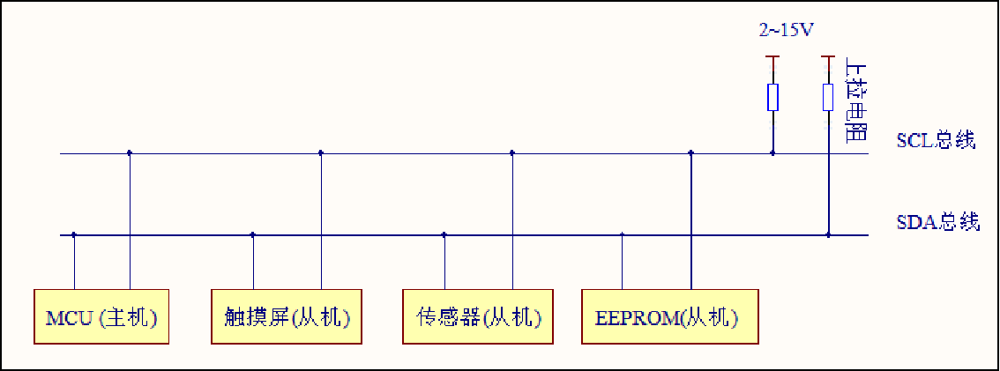

- 它是一个支持多设备的总线。“总线”指多个设备共用的信号线。在一个I2C通讯总线中，可连接多个I2C通讯设备，支持多个通讯主机及多个通讯从机。
- 一个I2C总线只使用两条总线线路，一条双向串行数据线(SDA) ，一条串行时钟线 (SCL)。数据线即用来表示数据，时钟线用于数据收发同步。通过时钟确定接收数据的频率，防止数据采集多或数据采集少。
- 每个连接到总线的设备都有一个独立的地址，主机可以利用这个地址进行不同设备之间的访问。（7位地址）
- ==总线通过上拉电阻接到电源。当I^2C设备空闲时，会输出高阻态，而当所有设备都空闲，都输出高阻态时，由上拉电阻把总线拉成高电平。（开漏输出才能有高阻态，所以所有的从机都必须配置成开漏输出）==
- 多个主机同时使用总线时，为了防止数据冲突，会利用仲裁方式决定由哪个设备占用总线。
- 具有三种传输模式：标准模式传输速率为100kbit/s ，快速模式为400kbit/s ，高速模式下可达 3.4Mbit/s，但目前大多I2C设备尚不支持高速模式。
- 连接到相同总线的 IC 数量受到总线的最大电容 400pF 限制  。

（2）协议层

$I^2C$的协议定义了通讯的起始信号、数据有效性、响应、仲裁、时钟同步、和地址广播等环节

1. 基本读写过程

   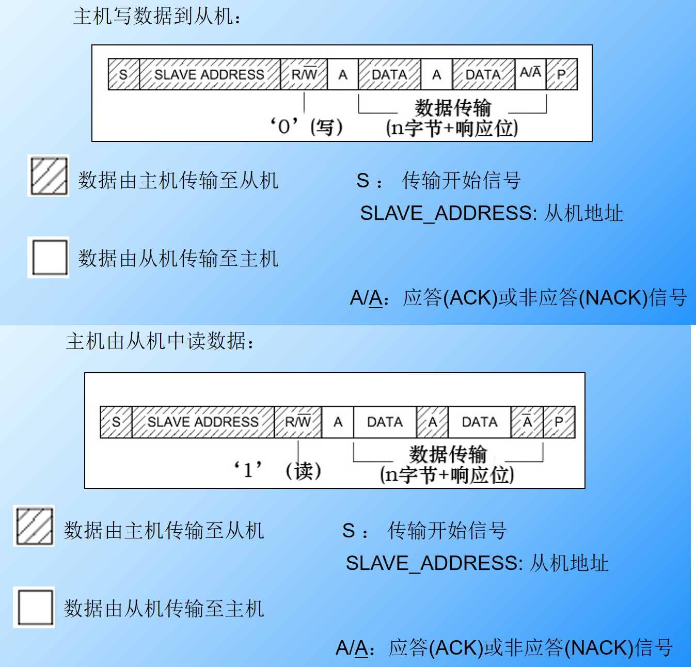

   通讯复合格式

   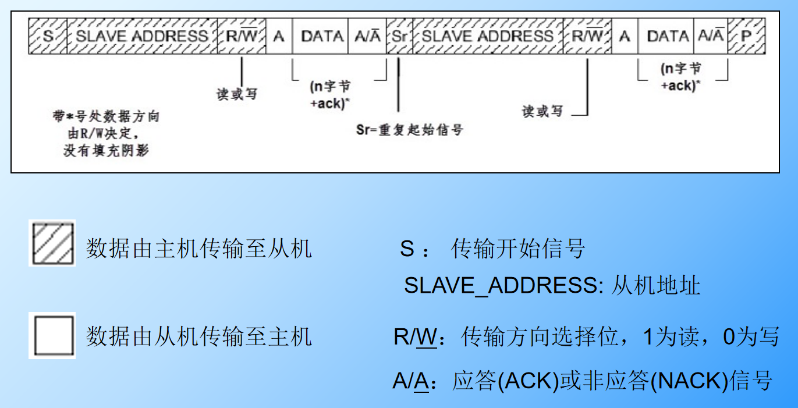

   第一步：往EEPROM写入我要读取的地址

   第二步：读取该地址内的内容

2. 通讯的起始和停止信号

   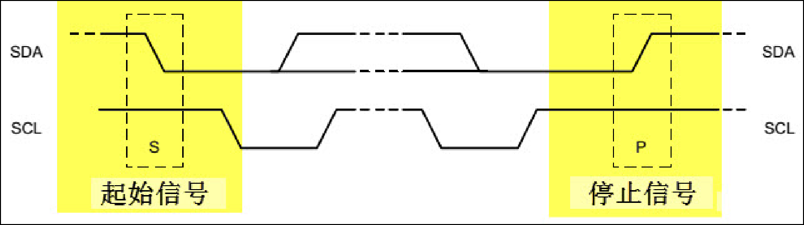

   - 当 SCL 线是高电平时 SDA 线从高电平向低电平切换，这个情况表示通讯的起始。

     总线在下降沿，时钟在高电平

   - 当 SCL 是高电平时 SDA 线由低电平向高电平切换，表示通讯的停止。

     总现在上升沿，时钟在高电平

   - 起始和停止信号一般由主机产生。

3. 数据有效性

   I2C使用SDA信号线来传输数据，使用SCL信号线进行数据同步。 SDA数据线在SCL的每个时钟周期传输一位数据。

   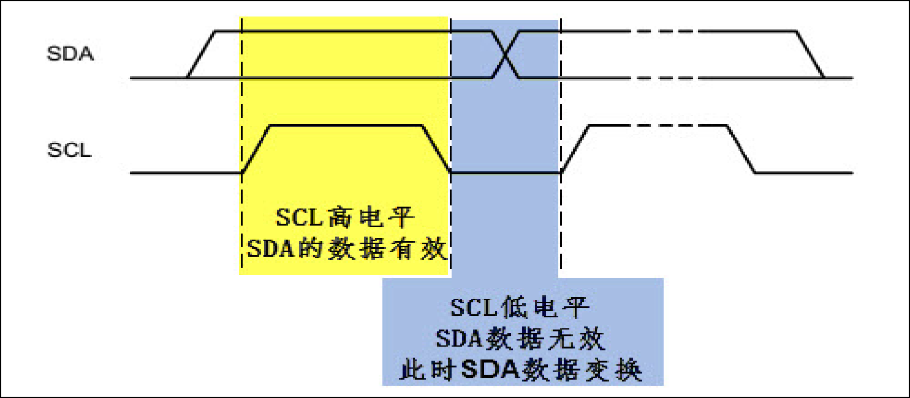

   - SCL为高电平的时候SDA表示的数据有效，即此时的SDA为高电平时表示数据“1”，为低电平时表示数据“0”。 
   - 当SCL为低电平时，SDA的数据无效，一般在这个时候SDA进行电平切换，为下一次表示数据做好准备。

4. 地址及数据方向

   - I2C总线上的每个设备都有自己的独立地址，主机发起通讯时，通过SDA信号线发送设备地址(SLAVE_ADDRESS)来查找从机。设备地址可以是7位或10位。（7位设备地址、加一位R/W，变成  设备读地址/设备写地址）
   - 紧跟设备地址的一个数据位R/W用来表示数据传输方向，数据方向位为“1”时表示主机由从机读数据，该位为“0”时表示主机向从机写数据。

5. 响应

   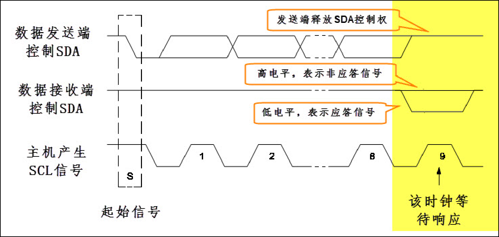

   - I2C的数据和地址传输都带响应。响应包括“应答(ACK)”和“非应答(NACK)”两种信号。
   - 传输时主机产生时钟，在第9个时钟时，数据发送端会释放SDA的控制权，由数据接收端控制SDA，若SDA为高电平，表示非应答信号(NACK)，低电平表示应答信号(ACK)。

### 二、STM32的$I^2C$特性和架构

（1）特性和架构

硬件实现协议：使用片上外设，只要配置好，就可以根据协议自动产生信号收发数据并缓存起来，CPU只用读取外设状态和数据寄存器即可。

软件实现协议：由CPU直接控制通讯引脚的电平。

STM32的I2C外设可用作通讯的主机及从机，支持100Kbit/s和400Kbit/s的速率，支持7位、10位设备地址，支持DMA数据传输，并具有数据校验功能。

1. STM32的I2C架构剖析

   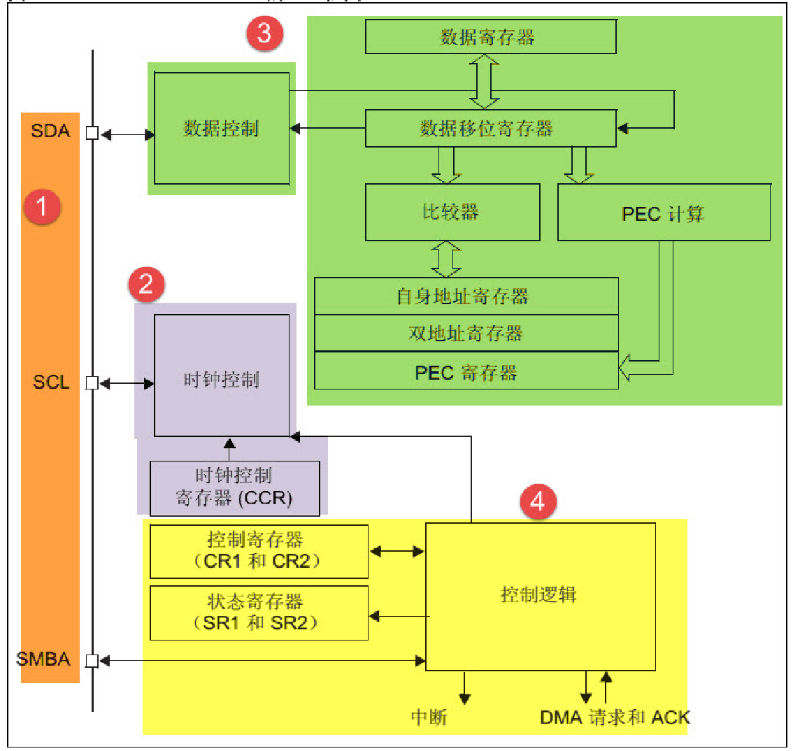

2. 通讯引脚

   STM32有多个$I^2C$外设，它们的I2C通讯信号引出到不同的GPIO引脚上，使用时必须配置到这些指定的引脚，以《STM32F4xx规格书》为准。

   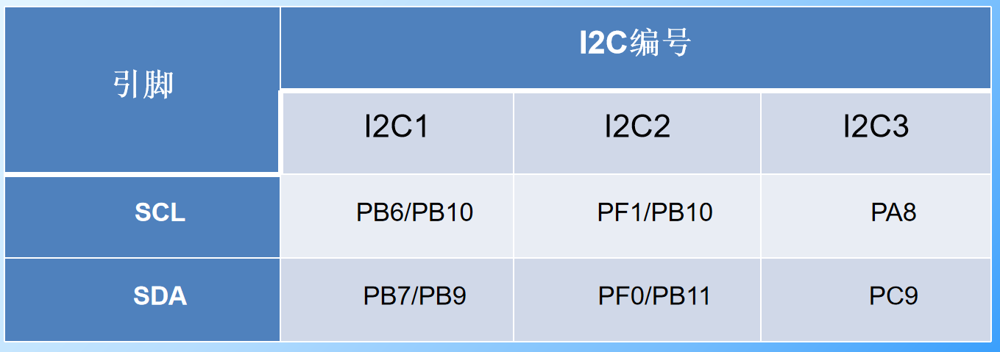

3. 时钟控制逻辑

   SCL线的时钟信号，由I2C接口根据时钟控制寄存器(CCR)控制，控制的参数主要为时钟频率。

   - 可选择I2C通讯的“标准/快速”模式，这两个模式分别I2C对应100/400Kbit/s的通讯速率。
   - 在快速模式下可选择SCL时钟的占空比，可选Tlow/Thigh=2或Tlow/Thigh=16/9模式。
   - CCR寄存器中12位的配置因子CCR，它与I2C外设的输入时钟源共同作用，产生SCL时钟。STM32的I2C外设输入时钟源为PCLK1。

   计算时钟频率：

   标准模式：	Thigh=CCR x TPCKL1		Tlow = CCR x TPCLK1
   快速模式中Tlow/Thigh=2时：	Thigh = CCR x PCKL1		Tlow  = 2 x CCR x TPCKL1
   快速模式中Tlow/Thigh=16/9时：	Thigh = 9 x CCR x TPCKL1		Tlow  = 16 x CCR x TPCKL1

   例如，我们的PCLK1=42MHz，想要配置400Kbit/s的速率，计算方式如下：
   PCLK时钟周期：			TPCLK1 = 1/42000000	
   目标SCL时钟周期：		TSCL = 1/400000	
   SCL时钟周期内的高电平时间：	THIGH = TSCL/3	
   SCL时钟周期内的低电平时间：	TLOW = 2*TSCL/3	
   计算CCR的值：			CCR  = THIGH/TPCLK1  = 35

4. 数据控制逻辑

   I2C的SDA信号主要连接到数据移位寄存器上，数据移位寄存器的数据来源及目标是数据寄存器(DR)、地址寄存器(OAR)、PEC寄存器以及SDA数据线。

   - 当向外发送数据的时候，数据移位寄存器以“数据寄存器”为数据源，把数据一位一位地通过1SDA信号线发送出去。
   - 当从外部接收数据的时候，数据移位寄存器把SDA信号线采样到的数据一位一位地存储到“数据寄存器”中。

5. 整体控制逻辑

   整体控制逻辑负责协调整个I2C外设，控制逻辑的工作模式根据我们配置的“控制寄存器(CR1/CR2)”的参数而改变。

   - 在外设工作时，控制逻辑会根据外设的工作状态修改“状态寄存器(SR1和SR2)”，只要读取这些寄存器相关的寄存器位，就可以了解I2C的工作状态。

（2）STM32的I2C通讯过程

1. 主发送器通讯过程

   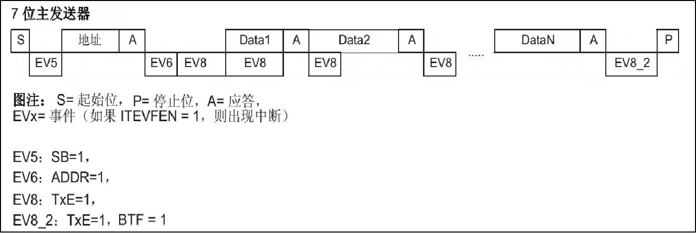

   - 控制产生起始信号(S)，当发生起始信号后，它产生事件“EV5”，并会对SR1寄存器的“SB”位置1，表示起始信号已经发送；
   - 发送设备地址并等待应答信号，若有从机应答，则产生事件“EV6”及“EV8”，这时SR1寄存器的“ADDR”位及“TXE”位被置1，ADDR 为1表示地址已经发送，TXE为1表示数据寄存器为空；
   - 往I2C的“数据寄存器DR”写入要发送的数据，这时TXE位会被重置0，表示数据寄存器非空，I2C外设通过SDA信号线一位位把数据发送出去后，又会产生“EV8”事件，即TXE位被置1，重复这个过程，可以发送多个字节数据；
   - 发送数据完成后，控制I2C设备产生一个停止信号(P)，这个时候会产生EV2事件，SR1的TXE位及BTF位都被置1，表示通讯结束。

2. 主接收器通讯过程

   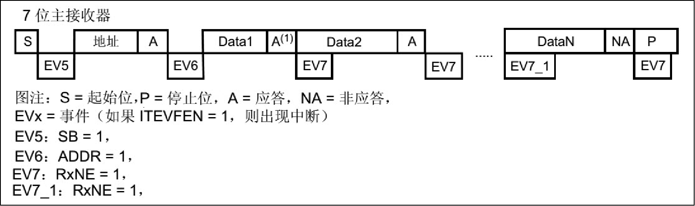

   - 起始信号(S)是由主机端产生的，控制发生起始信号后，它产生事件“EV5”，并会对SR1寄存器的“SB”位置1，表示起始信号已经发送；
   - 发送设备地址并等待应答信号，若有从机应答，则产生事件“EV6”这时SR1寄存器的“ADDR”位被置1，表示地址已经发送。
   - 从机端接收到地址后，开始向主机端发送数据。当主机接收到这些数据后，会产生“EV7”事件，SR1寄存器的RXNE被置1，表示接收数据寄存器非空，读取该寄存器后，可对数据寄存器清空，以便接收下一次数据。此时可以控制I2C发送应答信号(ACK)或非应答信号(NACK)，若应答，则重复以上步骤接收数据，若非应答，则停止传输；
   - 发送非应答信号后，产生停止信号(P)，结束传输。

### 三、$I^2C$读写实验——读写EEPROM

参考资料：[野火EmbedFire]《STM32库开发实战指南——基于野火霸天虎开发板》

（1）EEPROM芯片

EEPROM 是一种掉电后数据不丢失的存储器，常用来存储一些配置信息，以便系统重新上电的 时候加载之。EEPOM 芯片最常用的通讯方式就是 I2C 协议。

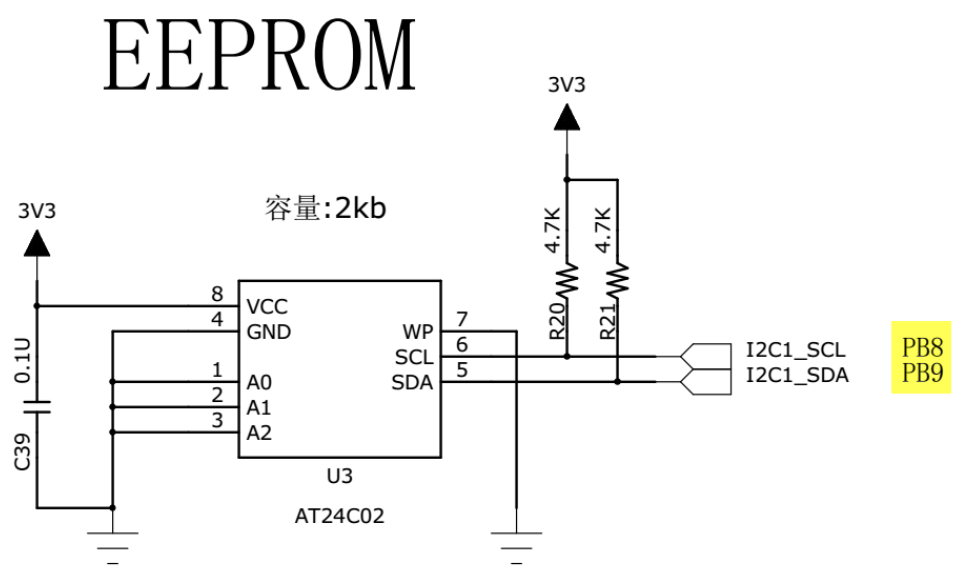

本实验板中的 EEPROM 芯片 (型号：AT24C02) 的 SCL 及 SDA 引脚连接到了 STM32 对应的 I2C 引脚中，结合上拉电阻，构成了 I2C 通讯总线，它们通过 I2C 总线交互。EEPROM 芯片的设备地址一共有 7 位，其中高 4 位固定为：1010 ，低 3 位则由 A0/A1/A2 信号线的电平决定，按照我们此处的连接，A0/A1/A2 均为 0，所以 EEPROM 的 7 位设备地址是：101 0000 。

EEPROM 芯片中还有一个 WP 引脚，具有写保护功能，当该引脚电平为高时，禁止写入数据，当引脚为低电平时，可写入数据，此处直接接地，不使用写保护功能。

（2）软件读写和硬件读写的区别

所谓硬件I2C对应芯片上的I2C外设，有相应I2C驱动电路，其所使用的I2C管脚也是专用的；软件I2C一般是用[GPIO](https://so.csdn.net/so/search?q=GPIO&spm=1001.2101.3001.7020)管脚，用软件控制管脚状态以模拟I2C通信波形。

硬件I2C的效率要远高于软件的，而软件I2C由于不受管脚限制，接口比较灵活。

模拟I2C 是通过GPIO，软件模拟寄存器的工作方式，而硬件（固件）I2C是直接调用内部寄存器进行配置。如果要从具体硬件上来看，可以去看下芯片手册。因为固件I2C的端口是固定的，所以会有所区别。

因为I2C是飞利浦公司的专利，STM32的硬件I2C为了规避专利，所以其硬件I2C可能会有问题，而且软件I2C移植更加方便，所以优先选择软件I2C。

（3）硬件$I^2C$实验

1. 初始化结构体

```
typedef struct
{
    uint32_t I2C_ClockSpeed;			//设置SCL时钟频率，此值要低于40 000
    uint16_t I2C_Mode;					//指定工作模式，可选I2C模式和SMBUS模式
    uint16_t I2C_DutyCycle;				//指定时钟占空比，可选low/hight = 2：1模式及16：8模式
    uint16_t I2C_OwnAddress1;			//指定自身的I2C设备地址
    uint16_t I2C_Ack;					//使能或关闭响应
    uint16_t I2C_AcknowledgedAddress; 	//指定地址长度，可为7位或10位
}I2C_InitTypeDef;
```

- I2C_ClockSpeed	
  设置I2C的传输速率，在调用初始化函数时，函数会根据我们输入的数值经过运算后把时钟因子写入到I2C的时钟控制寄存器CCR。而我们写入的这个参数值不得高于400KHz
  实际上由于CCR寄存器不能写入小数类型的时钟因子，影响到SCL的实际频率可能会低于本成员设置的参数值，这时除了通讯稍慢一点以外，不会对I2C的标准通讯造成其它影响。

- I2C_Mode 

  选择I2C的使用方式，有I2C模式(I2C_Mode_I2C )和SMBus主、从模式(I2C_Mode_SMBusHost、I2C_Mode_SMBusDevice)。

  I2C不需要在此处区分主从模式，直接设置I2C_Mode_I2C即可。

- I2C_DutyCycle

  设置I2C的SCL线时钟的占空比。该配置有两个选择，分别为低电平时间比高电平时间为2：1 ( I2C_DutyCycle_2)和16：9 (I2C_DutyCycle_16_9)。

  其实这两个模式的比例差别并不大，一般要求都不会如此严格，这里随便选就可以了。

- I2C_OwnAddress1

  配置STM32的I2C设备自己的地址，每个连接到I2C总线上的设备都要有一个自己的地址，作为主机也不例外。地址可设置为7位或10位(受下面I2C_AcknowledgeAddress成员决定)，只要该地址是I2C总线上唯一的即可。

  STM32的I2C外设可同时使用两个地址，即同时对两个地址作出响应，这个结构成员I2C_OwnAddress1配置的是默认的、OAR1寄存器存储的地址，若需要设置第二个地址寄存器OAR2，可使用I2C_OwnAddress2Config函数来配置，OAR2不支持10位地址。

- I2C_Ack_Enable

  配置I2C应答是否使能，设置为使能则可以发送响应信号。一般配置为允许应答(I2C_Ack_Enable)，这是绝大多数遵循I2C标准的设备的通讯要求，改为禁止应答(I2C_Ack_Disable)往往会导致通讯错误。

- I2C_AcknowledgeAddress

  选择I2C的寻址模式是7位还是10位地址。这需要根据实际连接到I2C总线上设备的地址进行选择，这个成员的配置也影响到I2C_OwnAddress1成员，只有这里设置成10位模式时，I2C_OwnAddress1才支持10位地址。

2. 读写实验

   - 把与 EEPROM 通讯使用的 I2C 号、引脚号、引脚源以及复用功能映射都以宏封装起来，并且定义了自身的 I2C 地址及通讯速率，以便配置模式的时候使用。（也可以不用配置，在函数中直接写也可以，不过封装后更加方便）

     封装后：

     ```c
      /* STM32 I2C 速率 */
     #define I2C_Speed 400000
     /* STM32 自身的 I2C 地址，这个地址只要与 STM32 外挂的 I2C 器件地址不一样即可 */
     #define I2C_OWN_ADDRESS7 0X0A
     /*I2C 接口 */
     #define EEPROM_I2C 						  I2C1
     #define EEPROM_I2C_CLK 					  RCC_APB1Periph_I2C1
     
     #define EEPROM_I2C_SCL_PIN 				   GPIO_Pin_8
     #define EEPROM_I2C_SCL_GPIO_PORT 		  GPIOB
     #define EEPROM_I2C_SCL_GPIO_CLK 		   RCC_AHB1Periph_GPIOB
     #define EEPROM_I2C_SCL_SOURCE 			 GPIO_PinSource8
     #define EEPROM_I2C_SCL_AF 				  GPIO_AF_I2C1
     
     #define EEPROM_I2C_SDA_PIN 				  GPIO_Pin_9
     #define EEPROM_I2C_SDA_GPIO_PORT 		 GPIOB
     #define EEPROM_I2C_SDA_GPIO_CLK 		  RCC_AHB1Periph_GPIOB
     #define EEPROM_I2C_SDA_SOURCE 			GPIO_PinSource9
     #define EEPROM_I2C_SDA_AF 				 GPIO_AF_I2C1
     ```

     

   - 初始化 I2C 的 GPIO 

     ```c
     static void I2C_GPIO_Config(void)  { 
     
     GPIO_InitTypeDef  GPIO_InitStructure;
     
     /* 使能 I2C 外设时钟 */
     RCC_APB1PeriphClockCmd(EEPROM_I2C_CLK, ENABLE);
     
     /* 使能 I2C 引脚的 GPIO 时钟 */
     RCC_AHB1PeriphClockCmd(EEPROM_I2C_SCL_GPIO_CLK |EEPROM_I2C_SDA_GPIO_CLK, ENABLE);
     
     /* 连接引脚源 PXx 到 I2C_SCL*/
     GPIO_PinAFConfig(EEPROM_I2C_SCL_GPIO_PORT, EEPROM_I2C_SCL_SOURCE,EEPROM_I2C_SCL_AF);
     /* 连接引脚源 PXx 到 to I2C_SDA*/
     GPIO_PinAFConfig(EEPROM_I2C_SDA_GPIO_PORT, EEPROM_I2C_SDA_SOURCE,EEPROM_I2C_SDA_AF);
     
     /* 配置 SCL 引脚 */
     GPIO_InitStructure.GPIO_Pin = EEPROM_I2C_SCL_PIN;
     GPIO_InitStructure.GPIO_Mode = GPIO_Mode_AF;
     GPIO_InitStructure.GPIO_Speed = GPIO_Speed_50MHz;
     GPIO_InitStructure.GPIO_OType = GPIO_OType_OD;
     GPIO_InitStructure.GPIO_PuPd = GPIO_PuPd_NOPULL;
     GPIO_Init(EEPROM_I2C_SCL_GPIO_PORT, &GPIO_InitStructure);
     
     /* 配置 SDA 引脚 */
     GPIO_InitStructure.GPIO_Pin = EEPROM_I2C_SDA_PIN;
     GPIO_Init(EEPROM_I2C_SDA_GPIO_PORT, &GPIO_InitStructure);
      }
     ```

   - 初始化I2C的模式

     ```c
     static void I2C_Mode_Config(void) {
     
     I2C_InitTypeDef I2C_InitStructure;
     
     /* I2C 配置 */
     /*I2C 模式 */
     I2C_InitStructure.I2C_Mode = I2C_Mode_I2C;
     /* 占空比 */
     I2C_InitStructure.I2C_DutyCycle = I2C_DutyCycle_2;
     /*I2C 自身地址 */
     I2C_InitStructure.I2C_OwnAddress1 =I2C_OWN_ADDRESS7;
     /* 使能响应 */
     I2C_InitStructure.I2C_Ack = I2C_Ack_Enable ;
     /* I2C 的寻址模式 */
     I2C_InitStructure.I2C_AcknowledgedAddress = I2C_AcknowledgedAddress_7bit;
     /* 通信速率 */
     I2C_InitStructure.I2C_ClockSpeed = I2C_Speed;
     /* 写入配置 */
     I2C_Init(EEPROM_I2C, &I2C_InitStructure);
     /* 使能 I2C */
     I2C_Cmd(EEPROM_I2C, ENABLE);
     }
     
     
     
     
     /**
     * @brief I2C 外设初始化，其就是调用上面定义的两个函数
     * @param 无
     * @retval 无
     */
     void I2C_EE_Init(void)
     {
     I2C_GPIO_Config();
     
     I2C_Mode_Config();
     }
     ```

     

   - 编写写函数

     ```c
     /* 通讯等待超时时间 */
     static uint32_t I2C_TIMEOUT_UserCallback(uint8_t errorCode)
     {
     /* 使用串口 printf 输出错误信息，方便调试 */
     EEPROM_ERROR("I2C 等待超时!errorCode = %d",errorCode);
     return 0;
     }
     
     
     //一个字节的收发函数
     uint32_t I2C_EE_ByteWrite(u8* pBuffer, u8 WriteAddr)
     {
     /* 产生 I2C 起始信号 */
     I2C_GenerateSTART(EEPROM_I2C, ENABLE);		//使用库函数 I2C_GenerateSTART 产生 I2C 起始信号
     
     /* 设置超时等待时间 */
     I2CTimeout = I2CT_FLAG_TIMEOUT;				//对 I2CTimeout 变量赋值为宏 I2CT_FLAG_TIMEOUT
     
     /* 检测 EV5 事件并清除标志 */
     /*这个 I2CTimeout 变量在下面的 while 循环中每次循环减 1，该循环通过调用库函数 I2C_CheckEvent 检测事件，若检测到事件，则进入通讯的下一阶段，若未检测到事件则停留在此处一直检测，当检测 I2CT_FLAG_TIMEOUT 次都还没等待到事件则认为通讯失败，调用前面的 I2C_TIMEOUT_UserCallback 输出调试信息，并退出通讯*/
     while (!I2C_CheckEvent(EEPROM_I2C, I2C_EVENT_MASTER_MODE_SELECT))
     {
     if ((I2CTimeout--) == 0) return I2C_TIMEOUT_UserCallback(0);
     }
     
     /* 发送 EEPROM 设备地址 */
     /*调用库函数 I2C_Send7bitAddress 发送 EEPROM 的设备地址，并把数据传输方向设置为I2C_Direction_Transmitter(即发送方向)，这个数据传输方向就是通过设置 I2C 通讯中紧跟地址后面的 R/W 位实现的。*/
     I2C_Send7bitAddress(EEPROM_I2C, EEPROM_ADDRESS,I2C_Direction_Transmitter);
     
     I2CTimeout = I2CT_FLAG_TIMEOUT;
     /* 检测 EV6 事件并清除标志 ，使用和上面相同的方式*/
     while (!I2C_CheckEvent(EEPROM_I2C,I2C_EVENT_MASTER_TRANSMITTER_MODE_SELECTED))
     {
     if ((I2CTimeout--) == 0) return I2C_TIMEOUT_UserCallback(1);
     }
     
     /* 发送要写入的 EEPROM 内部地址 (即 EEPROM 内部存储器的地址) */
     I2C_SendData(EEPROM_I2C, WriteAddr);
     /*调用库函数 I2C_SendData 向 EEPROM 发送要写入的内部地址，该地址是 I2C_EE_ByteWrite函数的输入参数，发送完毕后等待 EV8 事件。*/
     I2CTimeout = I2CT_FLAG_TIMEOUT;
     /* 检测 EV8 事件并清除标志 */
     
     while (!I2C_CheckEvent(EEPROM_I2C,
     I2C_EVENT_MASTER_BYTE_TRANSMITTED))
     {
     if ((I2CTimeout--) == 0) return I2C_TIMEOUT_UserCallback(2);
     }
     
     /* 发送一字节要写入的数据 */
     I2C_SendData(EEPROM_I2C, *pBuffer);
     /*调用库函数 I2C_SendData 向 EEPROM 发送要写入的数据，该数据是 I2C_EE_ByteWrite 函数的输入参数，发送完毕后等待 EV8 事件；*/
     I2CTimeout = I2CT_FLAG_TIMEOUT;
     /* 检测 EV8 事件并清除标志 */
     while (!I2C_CheckEvent(EEPROM_I2C,
     I2C_EVENT_MASTER_BYTE_TRANSMITTED))
     {
     if ((I2CTimeout--) == 0) return I2C_TIMEOUT_UserCallback(3);
     }
     
     /* 发送停止信号 */
     I2C_GenerateSTOP(EEPROM_I2C, ENABLE);		//一个 I2C 通讯过程完毕，调用 I2C_GenerateSTOP 发送停止信号。
     
     return 1;
     }
     //STM32 实际上通过 I2C 向 EEPROM 发送了两个数据，但为何第一个数据被解释为 EEPROM 的内存地址？
     //EEPROM 的单字节时序规定，向它写入数据的时候，第一个字节为内存地址，第二个字节是要写入的数据内容。
     
     
     //写入多个字节
     uint8_t I2C_EE_ByetsWrite(uint8_t* pBuffer,uint8_t WriteAddr,uint16_t NumByteToWrite)
     {
     uint16_t i;
     uint8_t res;
     
     /* 每写一个字节调用一次 I2C_EE_ByteWrite 函数 */
     for (i=0; i<NumByteToWrite; i++)
     {
     /* 等待 EEPROM 准备完毕 */
     I2C_EE_WaitEepromStandbyState();
     /* 按字节写入数据 */
     res = I2C_EE_ByteWrite(pBuffer++,WriteAddr++);
     }
     return res;
     }
     ```

     

   - 编写读函数

     ```c
     uint8_t I2C_EE_BufferRead(uint8_t* pBuffer, uint8_t ReadAddr,
     u16 NumByteToRead)
     {
     I2CTimeout = I2CT_LONG_TIMEOUT;
     
     while (I2C_GetFlagStatus(EEPROM_I2C, I2C_FLAG_BUSY))
     {
     if ((I2CTimeout--) == 0) return I2C_TIMEOUT_UserCallback(9);
     }
     
     /* 产生 I2C 起始信号 */
     I2C_GenerateSTART(EEPROM_I2C, ENABLE);
     
     I2CTimeout = I2CT_FLAG_TIMEOUT;
     
     /* 检测 EV5 事件并清除标志 */
     while (!I2C_CheckEvent(EEPROM_I2C, I2C_EVENT_MASTER_MODE_SELECT))
     {
     if ((I2CTimeout--) == 0) return I2C_TIMEOUT_UserCallback(10);
     }
     
     /* 发送 EEPROM 设备地址 */
     I2C_Send7bitAddress(EEPROM_I2C,EEPROM_ADDRESS,I2C_Direction_Transmitter);
     
     I2CTimeout = I2CT_FLAG_TIMEOUT;
     
     /* 检测 EV6 事件并清除标志 */
     while (!I2C_CheckEvent(EEPROM_I2C,
     I2C_EVENT_MASTER_TRANSMITTER_MODE_SELECTED))
     {
     if ((I2CTimeout--) == 0) return I2C_TIMEOUT_UserCallback(11);
     }
     /* 通过重新设置 PE 位清除 EV6 事件 */
     I2C_Cmd(EEPROM_I2C, ENABLE);
     
     /* 发送要读取的 EEPROM 内部地址 (即 EEPROM 内部存储器的地址) */
     I2C_SendData(EEPROM_I2C, ReadAddr);
     
     I2CTimeout = I2CT_FLAG_TIMEOUT;
     
     /* 检测 EV8 事件并清除标志 */
     while (!I2C_CheckEvent(EEPROM_I2C,I2C_EVENT_MASTER_BYTE_TRANSMITTED))
     {
     if ((I2CTimeout--) == 0) return I2C_TIMEOUT_UserCallback(12);
     }
     /* 产生第二次 I2C 起始信号 */
     I2C_GenerateSTART(EEPROM_I2C, ENABLE);
     
     I2CTimeout = I2CT_FLAG_TIMEOUT;
     
     /* 检测 EV5 事件并清除标志 */
     while (!I2C_CheckEvent(EEPROM_I2C, I2C_EVENT_MASTER_MODE_SELECT))
     {
     if ((I2CTimeout--) == 0) return I2C_TIMEOUT_UserCallback(13);
     }
     /* 发送 EEPROM 设备地址 */
     I2C_Send7bitAddress(EEPROM_I2C, EEPROM_ADDRESS, I2C_Direction_Receiver);
     
     I2CTimeout = I2CT_FLAG_TIMEOUT;
     
     /* 检测 EV6 事件并清除标志 */
     while (!I2C_CheckEvent(EEPROM_I2C,
     I2C_EVENT_MASTER_RECEIVER_MODE_SELECTED))
     {
     if ((I2CTimeout--) == 0) return I2C_TIMEOUT_UserCallback(14);
     }
     /* 读取 NumByteToRead 个数据 */
     while (NumByteToRead)
     {
     /* 若 NumByteToRead=1，表示已经接收到最后一个数据了，发送非应答信号，结束传输 */
     if (NumByteToRead == 1)
     {
     /* 发送非应答信号 */
     I2C_AcknowledgeConfig(EEPROM_I2C, DISABLE);
     
     /* 发送停止信号 */
     I2C_GenerateSTOP(EEPROM_I2C, ENABLE);
     }
     
     I2CTimeout = I2CT_LONG_TIMEOUT;
     while (I2C_CheckEvent(EEPROM_I2C, I2C_EVENT_MASTER_BYTE_RECEIVED)==0)
     {
     if ((I2CTimeout--) == 0) return I2C_TIMEOUT_UserCallback(3);
     }
     {
     /* 通过 I2C，从设备中读取一个字节的数据 */
     *pBuffer = I2C_ReceiveData(EEPROM_I2C);
     
     /* 存储数据的指针指向下一个地址 */
     pBuffer++;
     
     /* 接收数据自减 */
     NumByteToRead--;
     }
     }
     
     /* 使能应答，方便下一次 I2C 传输 */
     I2C_AcknowledgeConfig(EEPROM_I2C, ENABLE);
     return 1;
     }
     ```

     

（2）软件$I^2C$ 实验

软件$I^2C$ 必须自定义函数对输出进行控制，所以比较麻烦。

代码来自平衡小车程序

看不懂看下面这个

[(12条消息) I2C学习笔记---基于手册一步步实现软件I2C_顶点元的博客-CSDN博客](https://blog.csdn.net/xiaoyuanwuhui/article/details/107430279) 

```c
//初始化IIC
void IIC_Init(void)
{			
  GPIO_InitTypeDef  GPIO_InitStructure;

  RCC_AHB1PeriphClockCmd(RCC_AHB1Periph_GPIOB, ENABLE);//使能GPIOB时钟

  //GPIOB8,B9初始化设置
  GPIO_InitStructure.GPIO_Pin = GPIO_Pin_8 | GPIO_Pin_9;
  GPIO_InitStructure.GPIO_Mode = GPIO_Mode_OUT;//普通输出模式
  GPIO_InitStructure.GPIO_OType = GPIO_OType_PP;//推挽输出（其实开漏输出最好）
  GPIO_InitStructure.GPIO_Speed = GPIO_Speed_100MHz;//100MHz
  GPIO_InitStructure.GPIO_PuPd = GPIO_PuPd_UP;//上拉
  GPIO_Init(GPIOB, &GPIO_InitStructure);//初始化
	IIC_SCL=1;		//让时钟总线输出高阻态，即释放时钟总线
	IIC_SDA=1;		//让数据总线输出高阻态，即释放数据总线
}
//产生IIC起始信号
void IIC_Start(void)
{
	SDA_OUT();	//数据线设置为输出模式
	IIC_SDA=1;	//数据总线设置为高
	IIC_SCL=1;	//时钟总线设置为高
	delay_us(4);	//延时
 	IIC_SDA=0;		//起始信号：当时钟总线为高时，数据总线跳变为低
	delay_us(4);	//延时
	IIC_SCL=0;		//钳住I2C总线，准备发送或接收数据
				//（因为，数据传输发生在时钟高电平时，所以为了避免数据误传，钳住时钟为低）
}	  
//产生IIC停止信号
void IIC_Stop(void)
{
	SDA_OUT();		//数据线设置为输出模式
	IIC_SCL=0;		//停止时钟将其钳制在低电平
	IIC_SDA=0;		//拉低数据总线，因为要先拉低才能检测到上升沿
 	delay_us(4);	//停止信号：当时钟总线为高时，数据总线跳变为高
	IIC_SCL=1; 		//拉高时钟总线
	IIC_SDA=1;		//发送I2C总线结束信号
	delay_us(4);	//延时	   	
}
//等待应答信号到来
//返回值：1，接收应答失败
//        0，接收应答成功
u8 IIC_Wait_Ack(void)
{
	u8 ucErrTime=0;
	SDA_IN();      //数据总线设置为输入模式
	IIC_SDA=1;delay_us(1);	   //释放数据总线
	IIC_SCL=1;delay_us(1);	//释放时钟总线
	while(READ_SDA)		//等待从机发送数据，为1，一直循环；为0，跳出循环
	{
		ucErrTime++;
		if(ucErrTime>250)	//检测到250次后，停止接受，停止传输，并返回1
		{
			IIC_Stop();
			return 1;
		}
	}
	IIC_SCL=0;		//传输成功，时钟输出0，钳制时钟总线为低
	return 0;		//传输成功，返回0
} 
//产生ACK应答，作为数据输出端时才会用到
void IIC_Ack(void)
{
	IIC_SCL=0;		//钳制时钟总线为低
	SDA_OUT();		//数据总线设置为输出模式
	IIC_SDA=0;		//设置数据总线为低，产生应答信号
	//这里时钟要先设置为低，因为刚刚结束数据的传输，数据总线的高低电平不确定，必须先确定高低电平后才能再次开启时钟
	//应答：时钟总线为高时，数据总线为低
	delay_us(2);	//延时
	IIC_SCL=1;		//时钟总线设置为高，输出应答信号
	delay_us(2);	//延时
	IIC_SCL=0;		//钳制时钟总线为低
}
//不产生ACK应答。作为数据输入端时才会用到
void IIC_NAck(void)
{
	IIC_SCL=0;		//钳制时钟总线为低
	SDA_OUT();		//数据总线设置为输出模式
	IIC_SDA=1;		//设置数据总线设置为低，不产生应答信号
	//这里时钟要先设置为低，因为刚刚结束数据的传输，数据总线的高低电平不确定，必须先确定高低电平后才能再次开启时钟
	//不应答：时钟总线为高时，数据总线为高
	delay_us(2);	//延时
	IIC_SCL=1;		//时钟总线设置为高，输出不应答信号
	delay_us(2);	//延时
	IIC_SCL=0;		//钳制时钟总线为低
}					 				     
//IIC发送一个字节
//返回从机有无应答
//1，有应答
//0，无应答			  
void IIC_Send_Byte(u8 txd)
{                        
    u8 t;   
	SDA_OUT();		//数据总线设置为输出模式   
    IIC_SCL=0;		//拉低时钟开始数据传输
    for(t=0;t<8;t++)
    {              
        IIC_SDA=(txd&0x80)>>7;		//数据输出，每次输出一位
        txd<<=1;					//移位	
		delay_us(2);	//对TEA5767这三个延时都是必须的
		IIC_SCL=1;		//时钟总线设置为高，输出数据
		delay_us(2);	//延时
		IIC_SCL=0;		//钳制时钟总线为低
		delay_us(2);	//延时
    }	 
} 	    
//读1个字节，ack=1时，发送ACK，ack=0，发送nACK   
u8 IIC_Read_Byte(unsigned char ack)
{
	unsigned char i,receive=0;
	SDA_IN();		//SDA设置为输入模式
    for(i=0;i<8;i++ )
	{
        IIC_SCL=0; 				//钳制时钟总线为低
        delay_us(2);			//延时
		IIC_SCL=1;			//时钟总线拉高，接收数据
        receive<<=1;			//移位
        if(READ_SDA)receive++;	//若数据线接收到1，此位置1
		delay_us(1);		//延时
    }					 //为什么能存数据我不懂
    if (!ack)
        IIC_NAck();				//发送nACK
    else
        IIC_Ack(); 				//发送ACK   
    return receive;
}
```

