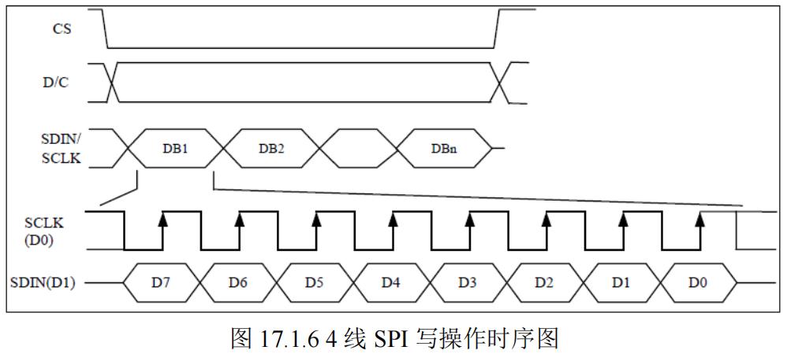
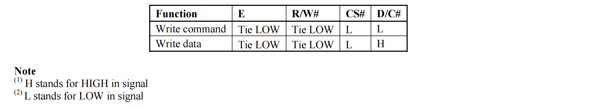

针对简单的OLED（SSD1306）封装一个简易的OLED显示函数，使用文字加代码的方式记录下来

移植时只需要改动引脚和时钟就好

#  封装一个OLED库函数

# oled.c

## 初始化函数：

GPIO的初始化和OLED的初始化，其中OLED的初始化涉及到MCU对OLED发送指令。这个函数在后面会做解释。

- 第一步：编写GPIO初始化结构体，由于我们只需要一个简单的库就行，所以我们不需要GPIO的入口参数。使用时，手动修改一下GPIO就行。由于GPIO有共阳和共阴之分，所以我们需要编写两套初始化函数。
- 第二步：复位OLED，由于RET引脚低电平有效，所以我们要先将RST引脚拉低，等待复位完毕后，再将引脚拉低。我们可以在头文件中将RST引脚拉低和拉高通过宏定义重新声明。
- 第三步：初始化OLED，通过写指令，来设置各项参数。

```c
//OLED的初始化
void OLED_Init(void)
{
	GPIO_InitTypeDef  GPIO_InitStructure;
#ifdef Front
RCC_AHB1PeriphClockCmd(RCC_AHB1Periph_GPIOB|RCC_AHB1Periph_GPIOC|RCC_AHB1Periph_GPIOD|RCC_AHB1Periph_GPIOG,ENABLE);//使能PORTD时钟
  	
	//GPIO初始化设置
	GPIO_InitStructure.GPIO_Pin = GPIO_Pin_2|GPIO_Pin_15;
	GPIO_InitStructure.GPIO_Mode = GPIO_Mode_OUT;//普通输出模式
	GPIO_InitStructure.GPIO_OType = GPIO_OType_PP;//推挽输出
	GPIO_InitStructure.GPIO_Speed = GPIO_Speed_100MHz;//100MHz
	GPIO_InitStructure.GPIO_PuPd = GPIO_PuPd_UP;//上拉
	GPIO_Init(GPIOB, &GPIO_InitStructure);//初始化
	GPIO_ResetBits(GPIOB,GPIO_Pin_15);//作为电源使用	
	
	//GPIO初始化设置
	GPIO_InitStructure.GPIO_Pin = GPIO_Pin_5|GPIO_Pin_14;
	GPIO_InitStructure.GPIO_Mode = GPIO_Mode_OUT;//普通输出模式
	GPIO_InitStructure.GPIO_OType = GPIO_OType_PP;//推挽输出
	GPIO_InitStructure.GPIO_Speed = GPIO_Speed_100MHz;//100MHz
	GPIO_InitStructure.GPIO_PuPd = GPIO_PuPd_UP;//上拉
	GPIO_Init(GPIOD, &GPIO_InitStructure);//初始化
	
	//GPIO初始化设置
	GPIO_InitStructure.GPIO_Pin = GPIO_Pin_13;
	GPIO_InitStructure.GPIO_Mode = GPIO_Mode_OUT;//普通输出模式
	GPIO_InitStructure.GPIO_OType = GPIO_OType_PP;//推挽输出
	GPIO_InitStructure.GPIO_Speed = GPIO_Speed_100MHz;//100MHz
	GPIO_InitStructure.GPIO_PuPd = GPIO_PuPd_UP;//上拉
	GPIO_Init(GPIOC, &GPIO_InitStructure);//初始化

	//GPIO初始化设置
	GPIO_InitStructure.GPIO_Pin = GPIO_Pin_12;
	GPIO_InitStructure.GPIO_Mode = GPIO_Mode_OUT;//普通输出模式
	GPIO_InitStructure.GPIO_OType = GPIO_OType_PP;//推挽输出
	GPIO_InitStructure.GPIO_Speed = GPIO_Speed_100MHz;//100MHz
	GPIO_InitStructure.GPIO_PuPd = GPIO_PuPd_UP;//上拉
	GPIO_Init(GPIOG, &GPIO_InitStructure);//初始化

#endif

#ifdef Back

	RCC_AHB1PeriphClockCmd(RCC_AHB1Periph_GPIOD|RCC_AHB1Periph_GPIOE,ENABLE);//使能PORTE,PORTD时钟
  	
	//GPIO初始化设置
	GPIO_InitStructure.GPIO_Pin = GPIO_Pin_10|GPIO_Pin_8;
	GPIO_InitStructure.GPIO_Mode = GPIO_Mode_OUT;//普通输出模式
	GPIO_InitStructure.GPIO_OType = GPIO_OType_PP;//推挽输出
	GPIO_InitStructure.GPIO_Speed = GPIO_Speed_100MHz;//100MHz
	GPIO_InitStructure.GPIO_PuPd = GPIO_PuPd_UP;//上拉
	GPIO_Init(GPIOD, &GPIO_InitStructure);//初始化
	GPIO_SetBits(GPIOD,GPIO_Pin_10);
	

	
	//GPIO初始化设置
	GPIO_InitStructure.GPIO_Pin = GPIO_Pin_8|GPIO_Pin_10|GPIO_Pin_12|GPIO_Pin_14;
	GPIO_InitStructure.GPIO_Mode = GPIO_Mode_OUT;//普通输出模式
	GPIO_InitStructure.GPIO_OType = GPIO_OType_PP;//推挽输出
	GPIO_InitStructure.GPIO_Speed = GPIO_Speed_100MHz;//100MHz
	GPIO_InitStructure.GPIO_PuPd = GPIO_PuPd_UP;//上拉
	GPIO_Init(GPIOE, &GPIO_InitStructure);//初始化

#endif
	OLED_RES_Clr();
	delay_ms(200);
	OLED_RES_Set();
	
	OLED_WR_Byte(0xAE,OLED_CMD);//--关闭屏幕显示
	OLED_WR_Byte(0x00,OLED_CMD);//---页地址模式下设置起始地址低位（00h~0Fh）
	OLED_WR_Byte(0x10,OLED_CMD);//---页地址模式下设置起始地址高位（10h~1Fh）
	OLED_WR_Byte(0x40,OLED_CMD);//--设置屏幕起始行  (40h~7Fh)64行
	OLED_WR_Byte(0x81,OLED_CMD);//--设置对比度控制寄存器
	OLED_WR_Byte(0xCF,OLED_CMD);// Set SEG Output Current Brightness
	OLED_WR_Byte(0xA1,OLED_CMD);//--设置 SEG/列映射   0xa0左右反置 0xa1正常
	OLED_WR_Byte(0xC8,OLED_CMD);//设置 COM/行扫描方向   0xc0上下反置 0xc8正常
	OLED_WR_Byte(0xA6,OLED_CMD);//--设置为正常显示
	OLED_WR_Byte(0xA8,OLED_CMD);//--设置复用率(1 to 64)
	OLED_WR_Byte(0x3f,OLED_CMD);//--1/64 duty
	//两个字节的指令
	OLED_WR_Byte(0xD3,OLED_CMD);//--设置显示偏移
	OLED_WR_Byte(0x00,OLED_CMD);//--不偏移(0x00~0x3F)
	//两个字节的指令
	OLED_WR_Byte(0xd5,OLED_CMD);//--设置显示时钟分频比/振荡器频率
	OLED_WR_Byte(0x80,OLED_CMD);//--设置分频比，设置时钟为100帧/秒
	//两个字节的指令
	OLED_WR_Byte(0xD9,OLED_CMD);//--设置预充电周期
	OLED_WR_Byte(0xF1,OLED_CMD);////两个字节的指令
	//两个字节的指令
	OLED_WR_Byte(0xDA,OLED_CMD);//--设置com管脚硬件配置
	OLED_WR_Byte(0x12,OLED_CMD);
	//两个字节的指令
	OLED_WR_Byte(0xDB,OLED_CMD);//--设置VCOM
	OLED_WR_Byte(0x40,OLED_CMD);//设置VCOM取消选择电平
	//两个字节的指令
	OLED_WR_Byte(0x20,OLED_CMD);//-Set Page Addressing Mode (0x00/0x01/0x02)
	OLED_WR_Byte(0x02,OLED_CMD);//
	//两个字节的指令
	OLED_WR_Byte(0x8D,OLED_CMD);//--设置电荷泵启用/禁用
	OLED_WR_Byte(0x14,OLED_CMD);//--设置((0x10) 禁用
	
	OLED_WR_Byte(0xA4,OLED_CMD);// 禁用整个显示开启 (0xa4/0xa5)
	OLED_WR_Byte(0xA6,OLED_CMD);// 禁用反向显示 (0xa6/a7)
	OLED_Clear();
	OLED_WR_Byte(0xAF,OLED_CMD);//--开启屏幕显示
}
```

## 写命令函数

首先我们要知道如何写一个字节。我们使用的7针0.96寸OLED支持四线SPI和IIC。由于此OLED出厂时默认为SPI，所以我们选用SPI来写字节。



- 首先判断要传输的是命令（cmd）还是数据，如果要传输的是命令则拉低DC引脚，若是数据，则拉高DC引脚。

  define OLED_CMD  0	//写命令
  define OLED_DATA 1	//写数据
  若是需要写命令则需要使入口参数cmd = 0，此时if(cmd)判断为否，执行else中的部分，即拉低(Clr)引脚。
  若是需要写数据则需要使入口参数cmd = 1，此时if(cmd)判断为是，执行if中的部分，即拉高(set)引脚
  

- 拉低片选引脚CS

- 开始传输数据。由于在时钟上升沿才开始传输数据，所以先要把CLK拉低(Clr)，确定发送哪些数据后，再拉高(set)时钟。

- 如何确定传输哪些数据：
  首先我们要知道，SPI数据传输时是高位先行。所以我们将待传输数据和 0x80(1000 0000) 做与运算，即将将待传输数据和1做与运算，通过真值表可知，1&0 = 1，0&0 = 0。取与运算为1是发送高电平(set)，取与运算为0是发送低电平(Clr),发送完成后，将数据左移一位，再拉低时钟，循环8次。

- 拉高片选引脚CS和命令引脚DC

```c
void OLED_WR_Byte(u8 dat,u8 cmd)
{	
	u8 i;			  
	if(cmd)
	  OLED_DC_Set();
	else
	  OLED_DC_Clr();
	OLED_CS_Clr();
	for(i=0;i<8;i++)
	{
		OLED_SCL_Clr();
		if(dat&0x80)
		   OLED_SDA_Set();
		else 
		   OLED_SDA_Clr();
		OLED_SCL_Set();
		dat<<=1;   
	}				 		  
	OLED_CS_Set();
	OLED_DC_Set();   	  
}
```

## 反显函数

调用反显指令。写指令到SSD1306

```c
//反显函数
void OLED_ColorTurn(u8 i)
{
	if(i==0)
		{
			OLED_WR_Byte(0xA6,OLED_CMD);//正常显示
		}
	if(i==1)
		{
			OLED_WR_Byte(0xA7,OLED_CMD);//反色显示
		}
}
```

## 屏幕旋转180度

调用指令，上下反置，左右反置

```c
//屏幕旋转180度
void OLED_DisplayTurn(u8 i)
{
	if(i==0)
		{
			OLED_WR_Byte(0xC8,OLED_CMD);//正常显示
			OLED_WR_Byte(0xA1,OLED_CMD);
		}
	if(i==1)
		{
			OLED_WR_Byte(0xC0,OLED_CMD);//反转显示
			OLED_WR_Byte(0xA0,OLED_CMD);
		}
}
```

## 开启关闭刷新OLED

```c
//开启OLED显示 
void OLED_DisPlay_On(void)
{
	OLED_WR_Byte(0x8D,OLED_CMD);//电荷泵使能
	OLED_WR_Byte(0x14,OLED_CMD);//开启电荷泵
	OLED_WR_Byte(0xAF,OLED_CMD);//点亮屏幕
}

//关闭OLED显示 
void OLED_DisPlay_Off(void)
{
	OLED_WR_Byte(0x8D,OLED_CMD);//电荷泵使能
	OLED_WR_Byte(0x10,OLED_CMD);//关闭电荷泵
	OLED_WR_Byte(0xAE,OLED_CMD);//关闭屏幕
}
```

```c
//清屏函数
void OLED_Clear(void)
{
	u8 i,n;
	for(i=0;i<8;i++)
	{
	   for(n=0;n<128;n++)
			{
			 OLED_GRAM[n][i]=0;//清除所有数据
			}
  }
	OLED_Refresh();//更新显示
}
```

```c
//更新显存到OLED	
void OLED_Refresh(void)
{
	u8 i,n;
	for(i=0;i<8;i++)
	{
	   OLED_WR_Byte(0xb0+i,OLED_CMD); //设置行起始地址
	   OLED_WR_Byte(0x00,OLED_CMD);   //设置低列起始地址
	   OLED_WR_Byte(0x10,OLED_CMD);   //设置高列起始地址
	   for(n=0;n<128;n++)
		 OLED_WR_Byte(OLED_GRAM[n][i],OLED_DATA);
  }
}
```

## 画点函数、画线函数、画圆函数

[让数据显示更直观——OLED曲线显示 - 知乎 (zhihu.com)](https://zhuanlan.zhihu.com/p/510436486#:~:text=%E7%94%BB%E7%82%B9%E5%87%BD%E6%95%B0%20%E7%94%B1%E4%BA%8E%20OLED_WR_Byte%20%28OLED_GRAM,%5Bn%5D%20%5Bi%5D%2C1%29%3B%20%E5%87%BD%E6%95%B0%E4%B8%80%E6%AC%A1%E6%93%8D%E4%BD%9C%E4%B8%80%E4%B8%AA%E5%AD%97%E8%8A%82%EF%BC%8C%E6%89%80%E4%BB%A5%E6%88%91%E4%BB%AC%E4%B8%8D%E8%83%BD%E4%B8%80%E6%AC%A1%E6%8E%A7%E5%88%B6%E4%B8%80%E4%B8%AA%E5%83%8F%E7%B4%A0%E7%82%B9%EF%BC%8C%E5%8F%AA%E8%83%BD8%E4%B8%AA%E5%83%8F%E7%B4%A0%E7%82%B9%E4%B8%80%E8%B5%B7%E6%8E%A7%E5%88%B6%EF%BC%9B%E8%80%8C%E4%B8%94%E6%98%AF%E5%9E%82%E7%9B%B4%E6%96%B9%E5%90%91%E6%89%AB%E6%8F%8F%E6%8E%A7%E5%88%B6%EF%BC%9B%E5%A6%82%E4%B8%8B%E5%9B%BE%E6%89%80%E7%A4%BA%E3%80%82%20%E5%9B%A0%E6%AD%A4%E5%9E%82%E7%9B%B4%E6%96%B9%E5%90%91%E5%9D%90%E6%A0%87%E5%8F%AF%E9%80%89%E4%B8%BA0~7%EF%BC%9B%20%288%2A8%3D64%29%EF%BC%9B%E6%B0%B4%E5%B9%B3%E6%96%B9%E5%90%91%E5%8F%AF%E9%80%89%E5%9D%90%E6%A0%870~127%E3%80%82) 

```c
//画点 
//x:0~127
//y:0~63
//t:1 填充 0,清空	
void OLED_DrawPoint(u8 x,u8 y,u8 t)
{
	u8 i,m,n;
    // 因为此OLED是按页显示，每页8个像素，所以/8用于计算待显示的点在哪页中
	i=y/8;
    // 一列中有8个像素，所以计算一下待显示的点，在当前列中的第几个点
	m=y%8;
    // 移位，让n的第m位为1
	n=1<<m;
	if(t){OLED_GRAM[x][i]|=n;}//第bx位，置1，其他位值不变
	else//第bx位，置0，其他位值不变
	{
		OLED_GRAM[x][i]=~OLED_GRAM[x][i];//"~"按位取反
		OLED_GRAM[x][i]|=n;
		OLED_GRAM[x][i]=~OLED_GRAM[x][i];
	}
}
```

```c
//画线
//x1,y1:起点坐标
//x2,y2:结束坐标
void OLED_DrawLine(u8 x1,u8 y1,u8 x2,u8 y2,u8 mode)
{
	u16 t; 
	int xerr=0,yerr=0,delta_x,delta_y,distance;
	int incx,incy,uRow,uCol;
	delta_x=x2-x1; //计算坐标增量 
	delta_y=y2-y1;
	uRow=x1;//画线起点坐标
	uCol=y1;
	if(delta_x>0)incx=1; //设置单步方向 
	else if (delta_x==0)incx=0;//垂直线 
	else {incx=-1;delta_x=-delta_x;}
    
	if(delta_y>0)incy=1;
	else if (delta_y==0)incy=0;//水平线 
	else {incy=-1;delta_y=-delta_x;}
    
	if(delta_x>delta_y)distance=delta_x; //选取基本增量坐标轴 
	else distance=delta_y;
	for(t=0;t<distance+1;t++)
	{
		OLED_DrawPoint(uRow,uCol,mode);//画点
		xerr+=delta_x;
		yerr+=delta_y;
		if(xerr>distance)
		{
			xerr-=distance;
			uRow+=incx;
		}
		if(yerr>distance)
		{
			yerr-=distance;
			uCol+=incy;
		}
	}
}
```

```c
//x,y:圆心坐标
//r:圆的半径
void OLED_DrawCircle(u8 x,u8 y,u8 r)
{
	int a, b,num;
    a = 0;
    b = r;
    while(2 * b * b >= r * r)      
    {
        OLED_DrawPoint(x + a, y - b,1);
        OLED_DrawPoint(x - a, y - b,1);
        OLED_DrawPoint(x - a, y + b,1);
        OLED_DrawPoint(x + a, y + b,1);
 
        OLED_DrawPoint(x + b, y + a,1);
        OLED_DrawPoint(x + b, y - a,1);
        OLED_DrawPoint(x - b, y - a,1);
        OLED_DrawPoint(x - b, y + a,1);
        
        a++;
        num = (a * a + b * b) - r*r;//计算画的点离圆心的距离
        if(num > 0)
        {
            b--;
            a--;
        }
    }
}
```

## 画字，画图

```c
//在指定位置显示一个字符,包括部分字符
//x:0~127
//y:0~63
//size1:选择字体 6x8/6x12/8x16/12x24
//mode:0,反色显示;1,正常显示
void OLED_ShowChar(u8 x,u8 y,u8 chr,u8 size1,u8 mode)
{
	u8 i,m,temp,size2,chr1;
	u8 x0=x,y0=y;
	if(size1==8)size2=6;
	else size2=(size1/8+((size1%8)?1:0))*(size1/2);  //得到字体一个字符对应点阵集所占的字节数
	chr1=chr-' ';  //计算偏移后的值
	for(i=0;i<size2;i++)
	{
		if(size1==8)
			  {temp=asc2_0806[chr1][i];} //调用0806字体
		else if(size1==12)
        {temp=asc2_1206[chr1][i];} //调用1206字体
		else if(size1==16)
        {temp=asc2_1608[chr1][i];} //调用1608字体
		else if(size1==24)
        {temp=asc2_2412[chr1][i];} //调用2412字体
		else return;
		for(m=0;m<8;m++)
		{
			if(temp&0x01)OLED_DrawPoint(x,y,mode);
			else OLED_DrawPoint(x,y,!mode);
			temp>>=1;
			y++;
		}
		x++;
		if((size1!=8)&&((x-x0)==size1/2))
		{x=x0;y0=y0+8;}
		y=y0;
  }
}
//显示字符串
//x,y:起点坐标  
//size1:字体大小 
//*chr:字符串起始地址 
//mode:0,反色显示;1,正常显示
void OLED_ShowString(u8 x,u8 y,u8 *chr,u8 size1,u8 mode)
{
	while((*chr>=' ')&&(*chr<='~'))//判断是不是非法字符!
	{
		OLED_ShowChar(x,y,*chr,size1,mode);
		if(size1==8)x+=6;
		else x+=size1/2;
		chr++;
  }
}

//m^n
u32 OLED_Pow(u8 m,u8 n)
{
	u32 result=1;
	while(n--)
	{
	  result*=m;
	}
	return result;
}

//显示数字
//x,y :起点坐标
//num :要显示的数字
//len :数字的位数
//size:字体大小
//mode:0,反色显示;1,正常显示

void OLED_ShowNum(u8 x,u8 y,u32 num,u8 len,u8 size1,u8 mode)
{
	u8 t,temp,m=0;
	if(size1==8)m=2;
	for(t=0;t<len;t++)
	{
		temp=(num/OLED_Pow(10,len-t-1))%10;
			if(temp==0)
			{
				OLED_ShowChar(x+(size1/2+m)*t,y,'0',size1,mode);
      }
			else 
			{
			  OLED_ShowChar(x+(size1/2+m)*t,y,temp+'0',size1,mode);
			}
  }
}
//显示带有负数的数字
void OLED_ShowSNum(u8 x,u8 y,int num,u8 len,u8 size1,u8 mode)
{
	u8 t=0,temp,m=0;
	if(size1==8)m=2;
	if(num<0)
	{
		OLED_ShowChar(x+(size1/2+m)*t,y,'-',size1,mode);
		num = -num;
	}
	else
		OLED_ShowChar(x+(size1/2+m)*t,y,' ',size1,mode);
	for(t=1;t<len+1;t++)
	{
		temp=(num/OLED_Pow(10,len-t))%10;
			if(temp==0)
			{
				OLED_ShowChar(x+(size1/2+m)*t,y,'0',size1,mode);
      }
			else 
			{
			  OLED_ShowChar(x+(size1/2+m)*t,y,temp+'0',size1,mode);
			}
  }
}

//显示带一位小数的数字
//x,y :起点坐标
//num :要显示的数字
//len :数字的位数
//size:字体大小
//mode:0,反色显示;1,正常显示
void OLED_ShowFNum(u8 x,u8 y,float num,u8 len,u8 size1,u8 mode)
{
	int32_t Num,SNum;//Num:转为整数 SNum：整数部分 
	int8_t FNum,m = 0;			//FNum：小数部分
	if(size1 == 8)	m = 2;
	if(num >= 0)
	{
		OLED_ShowChar(x,y,' ',size1,mode);
	}
	else
	{
		num = -num;
		OLED_ShowChar(x,y,'-',size1,mode);
	}
	Num = num * 10;
	SNum = Num/10;//若-1234.5  Num = -12345  SNum = -1234   FNum = 5   len = 6;
	FNum = Num % 10;
	OLED_ShowNum(x+(size1/2+m),y,SNum,len-2,size1,mode);
	OLED_ShowChar(x+(len-2+1)*(size1/2+m),y,'.',size1,mode);
	OLED_ShowNum(x+(len)*(size1/2+m),y,FNum,1,size1,mode);
}

//显示汉字
//x,y:起点坐标
//num:汉字对应的序号
//mode:0,反色显示;1,正常显示
void OLED_ShowChinese(u8 x,u8 y,u8 num,u8 size1,u8 mode)
{
	u8 m,temp;
	u8 x0=x,y0=y;
	u16 i,size3=(size1/8+((size1%8)?1:0))*size1;  //得到字体一个字符对应点阵集所占的字节数
	for(i=0;i<size3;i++)
	{
		if(size1==16)
				{temp=Hzk1[num][i];}//调用16*16字体
		else if(size1==24)
				{temp=Hzk2[num][i];}//调用24*24字体
		else if(size1==32)       
				{temp=Hzk3[num][i];}//调用32*32字体
		else if(size1==64)
				{temp=Hzk4[num][i];}//调用64*64字体
		else return;
		for(m=0;m<8;m++)
		{
			if(temp&0x01)OLED_DrawPoint(x,y,mode);
			else OLED_DrawPoint(x,y,!mode);
			temp>>=1;
			y++;
		}
		x++;
		if((x-x0)==size1)
		{x=x0;y0=y0+8;}
		y=y0;
	}
}

//num 显示汉字的个数
//space 每一遍显示的间隔
//mode:0,反色显示;1,正常显示
void OLED_ScrollDisplay(u8 num,u8 space,u8 mode)
{
	u8 i,n,t=0,m=0,r;
	while(1)
	{
		if(m==0)
		{
	    OLED_ShowChinese(128,24,t,16,mode); //写入一个汉字保存在OLED_GRAM[][]数组中
			t++;
		}
		if(t==num)
			{
				for(r=0;r<16*space;r++)      //显示间隔
				 {
					for(i=1;i<144;i++)
						{
							for(n=0;n<8;n++)
							{
								OLED_GRAM[i-1][n]=OLED_GRAM[i][n];
							}
						}
           OLED_Refresh();
				 }
        t=0;
      }
		m++;
		if(m==16){m=0;}
		for(i=1;i<144;i++)   //实现左移
		{
			for(n=0;n<8;n++)
			{
				OLED_GRAM[i-1][n]=OLED_GRAM[i][n];
			}
		}
		OLED_Refresh();
	}
}

//x,y：起点坐标
//sizex,sizey,图片长宽
//BMP[]：要写入的图片数组
//mode:0,反色显示;1,正常显示
void OLED_ShowPicture(u8 x,u8 y,u8 sizex,u8 sizey,u8 BMP[],u8 mode)
{
	u16 j=0;
	u8 i,n,temp,m;
	u8 x0=x,y0=y;
	sizey=sizey/8+((sizey%8)?1:0);
	for(n=0;n<sizey;n++)
	{
		 for(i=0;i<sizex;i++)
		 {
				temp=BMP[j];
				j++;
				for(m=0;m<8;m++)
				{
					if(temp&0x01)OLED_DrawPoint(x,y,mode);
					else OLED_DrawPoint(x,y,!mode);
					temp>>=1;
					y++;
				}
				x++;
				if((x-x0)==sizex)
				{
					x=x0;
					y0=y0+8;
				}
				y=y0;
     }
	 }
}
```