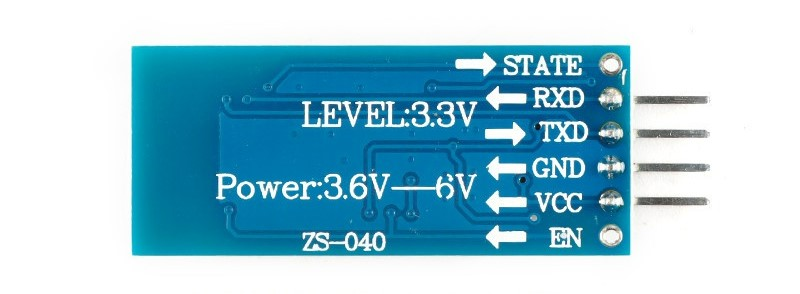

## 一、DX-ST08-B蓝牙模块介绍

（1）概述

- 遵循V2.1+EDR蓝牙规范
- 支持UART接口，支持SPP蓝牙串口协议
- 成本低、体积小、功耗低、收发灵敏性高等优点，只需配备少许的外围元件就能实现其强大功能。 
- 使用3.3V电源

（2）管脚功能



当蓝牙作为从机时，LED闪烁代表等待配对，常亮表示已经建立连接

（3）蓝牙与手机的配对

使用手机

（4）编写代码

由于使用串口收发，所以我们可以使能一个串口，并使它在接收到数据时中断。

代码如下：

```c
//PB10	PB11
void usart3_Init(u32 bound)
{
	GPIO_InitTypeDef GPIO_InitStructure;
	USART_InitTypeDef USART_InitStructure;
	NVIC_InitTypeDef NVIC_InitStructure;
	
	RCC_APB2PeriphClockCmd(RCC_APB1Periph_USART3,ENABLE);//使能 USART3 时钟
	RCC_AHB1PeriphClockCmd(RCC_AHB1Periph_GPIOB,ENABLE); //使能 GPIOB 时钟
	
	GPIO_PinAFConfig(GPIOB,GPIO_PinSource10,GPIO_AF_USART3); //PB10 复用为 USART3
	GPIO_PinAFConfig(GPIOB,GPIO_PinSource11,GPIO_AF_USART3);//PB11 复用为 USART3
	
	GPIO_InitStructure.GPIO_Pin = GPIO_Pin_10 | GPIO_Pin_11; //GPIOA10 与 GPIOA11
	GPIO_InitStructure.GPIO_Mode = GPIO_Mode_AF;//复用功能
	GPIO_InitStructure.GPIO_Speed = GPIO_Speed_50MHz; //速度 50MHz
	GPIO_InitStructure.GPIO_OType = GPIO_OType_PP; //推挽复用输出
	GPIO_InitStructure.GPIO_PuPd = GPIO_PuPd_UP; //上拉
	GPIO_Init(GPIOB,&GPIO_InitStructure); //初始化 PB10	PB11
	
	USART_InitStructure.USART_BaudRate = bound;//一般设置为 9600;
	USART_InitStructure.USART_WordLength = USART_WordLength_8b;//字长为 8 位数据格式
	USART_InitStructure.USART_StopBits = USART_StopBits_1;//一个停止位
	USART_InitStructure.USART_Parity = USART_Parity_No;//无奇偶校验位
	USART_InitStructure.USART_HardwareFlowControl = USART_HardwareFlowControl_None;//无硬件数据流控制
	USART_InitStructure.USART_Mode = USART_Mode_Rx | USART_Mode_Tx;//收发模式
	USART_Init(USART3, &USART_InitStructure); //初始化串口
	
	USART_Cmd(USART3, ENABLE); //使能串口
	
	USART_ITConfig(USART3,USART_IT_RXNE,ENABLE);//接收数据时中断
	
	NVIC_InitStructure.NVIC_IRQChannel = USART3_IRQn;//串口3中断通道
	NVIC_InitStructure.NVIC_IRQChannelPreemptionPriority=3;//抢占优先级3 数值越小优先级越高
	NVIC_InitStructure.NVIC_IRQChannelSubPriority =3; //子优先级3,响应优先级
	NVIC_InitStructure.NVIC_IRQChannelCmd = ENABLE; //IRQ通道使能
	NVIC_Init(&NVIC_InitStructure); //根据指定的参数初始化VIC寄存器
		
}


/*
0x01:前进
0x02:后退
0x03:左转
0x04:右转
*/
void USART3_IRQHandler(void)
{
	u8 Res=0;
	if(USART_GetITStatus(USART3, USART_IT_RXNE) != RESET)//接收中断(接收到的数据必须是0x0d 0x0a结尾)
		{
			Res =USART_ReceiveData(USART3);////(USART3->DR); //读取接收到的数据

			if(Res==0x01){	left_positive();right_positive();}//前进
		else if(Res==0x02){	left_negative();right_negative();}//后退
		else if(Res==0x03){left_negative();right_positive();}//左转
		else if(Res==0x04){left_positive();right_negative();}//右转
			
		}
				if((USART3_RX_STA&0x8000)==0)//接收未完成
		{
			if(USART3_RX_STA&0x4000)//接收到了0x0d
			{
				if(Res!=0x0a)USART3_RX_STA=0;//接收错误,重新开始
				else USART3_RX_STA|=0x8000; //接收完成了
			}
			else //还没收到0X0D
			{
				if(Res==0x0d)USART3_RX_STA|=0x4000;
				else
				{
					USART3_RX_buf[USART3_RX_STA&0X3FFF]=Res ;
					USART3_RX_STA++;
					if(USART3_RX_STA>(USART3_MAX_RECV_LEN-1))USART3_RX_STA=0;//接收数据错误,重新开始接收 
				} 
			}
		} 
}
```

