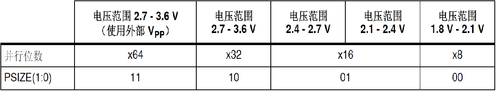

参考资料：

STM32F4开发指南-库函数版本_V1.1.pdf\第三十九章 FLASH 模拟 EEPROM 实验 

8，STM32参考资料\STM32F4xx中文参考手册.pdf\第三章 嵌入式 Flash 接口

### 一、STM32F4 FLASH操作详解

#### （1）STM32的编程方式

- 在线编程（ICP，In-Circuit Programming）：

  通过JATA/SWD协议或者系统加载程序（Bootloader）下载用户应用程序到微控制器中

- 在程序中编程（IAP，In Application Programming）：

  通过任意一种通信接口（USB、CAN、UART、IIC、SPI、IO口等）下载程序或者应用数据到储存器中。STM32允许用户在应用程序中重新烧写闪存储存器中的内容。然而，IAP需要至少有一部分程序已经使用ICP的方式烧到闪存储存器中（Bootloader）。

#### （2）闪存储存器模块组织

STM32F407ZGT6的FLASH大小为1024k = 16kb * 4 + 64kb + 128kb * 7

STM32F40x的闪存模块由：主存储器、系统存储器、OPT区域和选项字节等4部分组成。

- 主存储器

  该部分用来存放代码和数据常数（如const类型的数据）。分为12个扇区，前4个扇区为16KB大小，然后扇区4是64KB大小，扇区5~11是128K大小。

  不同容量的STM32F4，拥有的扇区数不一样，比如我们的STM32F407ZGT6，则拥有全部12个扇区。从上图可以看出主存储器的起始地址就是0X08000000， B0、B1都接GND的时候，就是从0X08000000开始运行代码的。

- 系统存储器

  这个主要用来存放STM32F4的bootloader代码，此代码是出厂的时候就固化在STM32F4里面了，专门来给主存储器下载代码的。当B0接V3.3，B1接GND的时候，从该存储器启动（即进入串口下载模式）。

- OTP区域

  即一次性可编程区域，共528字节，被分成两个部分，前面512字节（32字节为1块，分成16块），可以用来存储一些用户数据（==一次性的，写完一次，永远不可以擦除！！==），后面16字节，用于锁定对应块。

- 选项字节

  用于配置读保护、BOR级别、软件/硬件看门狗以及器件处于待机或停止模式下的复位。

#### （3）FLASH闪存的读取

STM23F4的FLASH读取是很简单的。例如，我们要从地址addr，读取一个字（字节为8位，半字为16位，字为32位），可以通过如下的语句读取：
							==data=* (vu32*)addr;==
将addr强制转换为vu32指针，然后取该指针所指向的地址的值，即得到了addr地址的值。类似的，将上面的vu32改为vu16，即可读取指定地址的一个半字。相对FLASH读取来说，STM32F4 FLASH的写就复杂一点了，下面我们介绍STM32F4闪存的编程和擦除。

STM32F4可通过内部的I-Code指令总线或D-Code数据总线访问内置闪存模块，本章我们主要讲解数据读写，即通过D-Code数据总线来访问内部闪存模块。 为了准确读取 Flash 数据，必须根据 CPU 时钟 (HCLK) 频率和器件电源电压在 Flash 存取控制寄存器 (FLASH_ACR) 中正确地设置等待周期数 (LATENCY)。当电源电压低于2.1V 时，必须关闭预取缓冲器。Flash 等待周期与CPU时钟频率之间的对应关系：

供电电压，我们一般是3.3V，所以，在我们设置168Mhz频率作为CPU时钟之前，必须先设置LATENCY为5，否则FLASH读写可能出错，导致死机。

#### （4）FLASH的编程和擦除

##### 注意事项

- 在对 STM32F4的Flash执行写入或擦除操作期间，任何读取Flash的尝试都会导致总线阻塞。只有在完成编程操作后，才能正确处理读操作。这意味着，写/擦除操作进行期间不能从Flash中执行代码或数据获取操作。

  >**STM32F4的闪存编程由6个32位寄存器控制，他们分别是：**
  >FLASH访问控制寄存器(FLASH_ACR)
  >FLASH密钥寄存器(FLASH_KEYR)
  >FLASH选项秘钥寄存器(FLASH_OPTKEYR)
  >FLASH状态寄存器(FLASH_SR)
  >FLASH控制寄存器(FLASH_CR)
  >FLASH选项控制寄存器(FLASH_OPTCR) 

- STM32F4复位后，FLASH编程操作是被保护的，不能写入FLASH_CR寄存器；通过写入特定的序列（0X45670123和0XCDEF89AB）到FLASH_KEYR寄存器才可解除写保护，只有在写保护被解除后，我们才能操作相关寄存器。通过这两个步骤，即可解锁FLASH_CR，如果写入错误，那么FLASH_CR将被锁定，直到下次复位后才可以再次解锁。

   FLASH_CR的解锁序列为：
        1）写0X45670123（KEY1)到FLASH_KEYR
        2）写0XCDEF89AB(KEY2)到FLASH_KEYR

- STM32F4闪存的编程位数可以通过FLASH_CR的PSIZE字段配置，PSIZE的设置必须和电源电压匹配，由于我们开发板用的电压是3.3V，所以PSIZE必须设置为10，即32位并行位数。擦除或者编程，都必须以32位为基础进行。 

  

- STM32F4的FLASH在编程的时候，也必须要求其写入地址的FLASH是被擦除了的（也就是其值必须是0XFFFFFFFF），否则无法写入。擦出的最小单位是扇区。

##### 编程操作

操作步骤：

- 检查FLASH_SR中的BSY位，确保当前未执行任何FLASH操作。

- 将FLASH_CR寄存器中的PG位置1，激活FLASH编程。

- 针对所需存储器地址（主存储器块或OTP区域内）执行数据写入操作：

  并行位数为x8时按字节写入（PSIZE=00）

  并行位数为x16时按半字写入（PSIZE=01）

  并行位数为x32时按字写入（PSIZE=02）

  并行位数为x64时按双字写入（PSIZE=03）

- 等待BSY位清零，完成一次编程。

- 注意事项：按以上四步操作，就可以完成一次FLASH编程。不过有几点要注意：

  编程前，要确保要写如地址的FLASH已经擦除。

  要先解锁（否则不能操作FLASH_CR）。

  编程操作对OPT区域也有效，方法一模一样。

##### 擦除操作

- 我们在STM32F4的FLASH编程的时候，要先判断缩写地址是否被擦除了，所以，我们有必要再介绍一下STM32F4的闪存擦除，STM32F4的闪存擦除分为两种：

  扇区擦除
  整片擦除

- 扇区擦除操作

  检查FLASH_CR的LOCK是否解锁，如果没有则先解锁
  检查FLASH_SR寄存器中的BSY 位，确保当前未执行任何FLASH操作
  在FLASH_CR寄存器中，将==SER==位置1，并从主存储块的12个扇区中选择要擦除的扇区 (SNB)
  将FLASH_CR寄存器中的STRT位置1，触发擦除操作
  等待BSY位清零

- 批量擦除

  检查FLASH_SR寄存器中的BSY 位，确保当前未执行任何FLASH操作
  在FLASH_CR寄存器中，将==MER==位置1 (STM32F407xx)
  将FLASH_CR寄存器中的STRT位置1，触发擦除操作
  等待BSY位清零

### 二、寄存器和库函数配置

#### （1）寄存器

##### ==FLASH访问控制寄存器(FLASH_ACR)==

##### ==FLASH密钥寄存器FLASH_KEYR)==

##### FLASH选项密钥寄存器(FLASH_OPTKEYR)

- 借助 Flash 选项密钥寄存器，可允许在用户配置扇区中执行编程和擦除操作。 
- 要将 FLASH_OPTCR 寄存器解锁并允许对其编程，必须顺序编程以下值：
  a) OPTKEY1 = 0x08192A3B 
  b) OPTKEY2 = 0x4C5D6E7F 

##### FLASH状态寄存器(FLASH_SR)

Flash 状态寄存器提供正在执行的编程和擦除操作的相关信息。 一般用来读忙。

##### ==FLASH控制寄存器(FLASH_CR)==

- LOCK位，该位用于指示FLASH_CR寄存器是否被锁住，该位在检测到正确的解锁序列后，硬件将其清零。在一次不成功的解锁操作后，在下次系统复位之前，该位将不再改变。
- STRT位，该位用于开始一次擦除操作。在该位写入1 ，将执行一次擦除操作。
- PSIZE[1:0]位，用于设置编程宽度，3.3V时，我们设置PSIZE =2即可。
- SNB[3:0]位，这4个位用于选择要擦除的扇区编号，取值范围为0~11。
- SER位，该位用于选择扇区擦除操作，在扇区擦除的时候，需要将该位置1。
- PG位，该位用于选择编程操作，在往FLASH写数据的时候，该位需要置1。

##### FLASH选项控制寄存器(FLASH_OPTCR) 

 寄存器用于修改用户选项字节。 

#### （2）库函数（文件位置在stm32f4xx_flash.c/stm32f4xx_flash.h）

常用库函数：

>锁定解锁函数：
>
>>FLASH_KEYR寄存器写入特定的序列（KEY1和KEY2）
>>
>>> ​	void FLASH_Unlock(void)；
>>
>>对FLASH写操作完成之后，我们要锁定FLASH
>>
>>> ​	void FLASH_Lock(void)；
>
>写操作函数：
>
>>写两个字（64位）：
>>FLASH_Status FLASH_ProgramDoubleWord(uint32_t Address, uint64_t Data);
>>写一个字（32位）：
>>FLASH_Status FLASH_ProgramWord(uint32_t Address, uint32_t Data);
>>写半个字（16位）：
>>FLASH_Status FLASH_ProgramHalfWord(uint32_t Address, uint16_t Data);
>>写一个字节（8位）：
>>FLASH_Status FLASH_ProgramByte(uint32_t Address, uint8_t Data);
>
>擦除函数：
>
>>擦除一个扇区：
>>FLASH_Status FLASH_EraseSector(uint32_t FLASH_Sector, uint8_t VoltageRange);
>>擦除所有扇区：
>>FLASH_Status FLASH_EraseAllSectors(uint8_t VoltageRange);
>>
>>针对STM32F42X系列和STM32F43X系列芯片的函数：
>>FLASH_Status FLASH_EraseAllBank1Sectors(uint8_t VoltageRange);
>>FLASH_Status FLASH_EraseAllBank2Sectors(uint8_t VoltageRange);
>
>状态获取函数：
>
>>FLASH_Status FLASH_GetStatus(void):
>>返回值：
>>typedef enum
>>
>>{ 
>>  FLASH_BUSY = 1,//操作忙
>>  FLASH_ERROR_RD,//读保护错误
>>  FLASH_ERROR_PGS,//编程顺序错误
>>  FLASH_ERROR_PGP,//编程并行位数错误
>>  FLASH_ERROR_PGA,//编程对齐错误
>>  FLASH_ERROR_WRP,//写保护错误
>>  FLASH_ERROR_PROGRAM,//编程错误
>>  FLASH_ERROR_OPERATION,//操作错误
>>  FLASH_COMPLETE//操作结束
>>}FLASH_Status;
>
>等待操作完成函数：
>
>>FLASH_Status FLASH_WaitForLastOperation(uint32_t Timeout);
>>
>>入口参数为等待时间，返回值是FLASH的状态。（正点原子的源码的库里，没有入口参数，如下）
>>
>>FLASH_Status FLASH_WaitForLastOperation(void); 
>>
>>函数体里的内容是，调用状态获取函数，如果是返回值不为忙，则跳出循环，返回FLASH的状态。
>>
>>这个函数本身我们在固件库中使用得不多，但是在固件库函数体中间可以多次看到。
>
>读FLASH特定地址数据函数：
>
>>正点原子写的一个函数：
>>
>>u32 STMFLASH_ReadWord(u32 faddr)
>>{
>>	return * (vu32*)faddr; 
>>}

### 三、实验程序讲解（FLASH模拟EEPROM）

FLASH和EEPROM的最大区别是FLASH按扇区操作，EEPROM则按字节操作，二者寻址方法不同，存储单元的结构也不同，FLASH的电路结构较简单，同样容量占芯片面积较小，成本自然比EEPROM低，因而适合用作程序存储器，EEPROM则更多的用作非易失的数据存储器。当然用FLASH做数据存储器也行，但操作比EEPROM麻烦的多，所以更“人性化”的MCU设计会集成FLASH和EEPROM两种非易失性存储器，而廉价型设计往往只有FLASH，早期可电擦写型MCU则都是EEPRM结构，现在已基本上停产了。 

[FLASH和EEPROM的区别 - K_Code - 博客园 (cnblogs.com)](https://www.cnblogs.com/z3286586/p/10880609.html#:~:text=FLASH%E5%92%8CEEPROM%E7%9A%84%E5%8C%BA%E5%88%AB%201%20NOR%E7%9A%84%E8%AF%BB%E9%80%9F%E5%BA%A6%E6%AF%94NAND%E7%A8%8D%E5%BF%AB%E4%B8%80%E4%BA%9B%E3%80%82%202,NAND%E7%9A%84%E5%86%99%E5%85%A5%E9%80%9F%E5%BA%A6%E6%AF%94NOR%E5%BF%AB%E5%BE%88%E5%A4%9A%E3%80%82%203%20NAND%E7%9A%844ms%E6%93%A6%E9%99%A4%E9%80%9F%E5%BA%A6%E8%BF%9C%E6%AF%94NOR%E7%9A%845s%E5%BF%AB%E3%80%82...%204%20NAND%E7%9A%84%E6%93%A6%E9%99%A4%E5%8D%95%E5%85%83%E6%9B%B4%E5%B0%8F%EF%BC%8C%E7%9B%B8%E5%BA%94%E7%9A%84%E6%93%A6%E9%99%A4%E7%94%B5%E8%B7%AF%E6%9B%B4%E5%B0%91%E3%80%82) 

讲解看视频就行

