参考资料：

STM32F4开发指南-库函数版本_V1.1.pdf\第二十八章 DMA 实验

8，STM32参考资料\STM32F4xx中文参考手册.pdf\第九章 DMA控制器

### 一、DMA原理

#### （1）DMA简介

DMA 全称Direct Memory Access，即直接存储器访问。
DMA传输将数据从一个地址空间复制到另一个地址空间。当CPU初始化这个传输动作，传输动作本身是由DMA控制器来实现和完成的。
DMA传输方式无需CPU直接控制传输，也没有中断处理方式那样保留现场和恢复现场过程，通过硬件为RAM和IO设备开辟一条直接传输数据的通道，使得CPU的效率大大提高。所以，DMA的作用是为CPU减负。

STM32F4最多有2个DMA控制器，2个DMA控制器总共有16个数据流（每个控制器8个）。每个DMA控制器都用于管理一个或者多个外设的存储器访问请求。每个数据流总共可以有多达8个通道（或请求），每个通道都有一个仲裁器，用于处理DMA请求间的优先级。

#### （2）DAM的特性

DMA 主要特性是：

- 双 AHB 主总线架构，一个用于存储器访问，另一个用于外设访问

- 仅支持 32 位访问的 AHB 从编程接口

- ==每个 DMA 控制器有 8 个数据流，每个数据流有多达 8 个通道（或称请求）==

- ==每个数据流有单独的四级 32 位先进先出存储器缓冲区 (FIFO)==，可用于 FIFO 模式或直接模式：

  FIFO 模式：可通过软件将阈值级别选取为 FIFO 大小的 1/4、1/2 或 3/4

  直接模式

  每个 DMA 请求会立即启动对存储器的传输。当在直接模式（禁止 FIFO）下将 DMA请求配置为以存储器到外设模式传输数据时，DMA 仅会将一个数据从存储器预加载到内部 FIFO，从而确保一旦外设触发 DMA 请求时则立即传输数据。

- 通过硬件可以将每个==数据流配置==为：

  支持外设到存储器、存储器到外设和存储器到存储器传输的常规通道

  也支持在存储器方双缓冲的双缓冲区通道

- 8 个数据流中的每一个都连接到专用硬件 DMA 通道（请求）

- ==DMA 数据流请求之间的优先级可用软件编程（4 个级别：非常高、高、中、低），在软件优先级相同的情况下可以通过硬件决定优先级（例如，请求 0 的优先级高于请求 1）==

- 每个数据流也==支持通过软件触发存储器到存储器==的传输（仅限 DMA2 控制器）

- 可供每个数据流选择的通道请求多达 8 个。此选择可由软件配置，允许几个外设启动 DMA请求

- 要传输的==数据项的数目可以由 DMA 控制器或外设管理==：

  DMA 流控制器：要传输的数据项的数目是 1 到 65535，可用软件编程

  外设流控制器：要传输的数据项的数目未知并由源或目标外设控制，这些外设通过硬件发出传输结束的信号

- 独立的源和目标传输宽度（字节、半字、字）：==源和目标的数据宽度不相等时，DMA 自动封装/解封必要的传输数据来优化带宽。这个特性仅在 FIFO 模式下可用==

- ==对源和目标的增量或非增量寻址==

- ==支持 4 个、8 个和 16 个节拍的增量突发传输==。突发增量的大小可由软件配置，通常等于外设 FIFO 大小的一半

- 每个数据流都支持循环缓冲区管理

	 ==5 个事件标志==（DMA 半传输、DMA 传输完成、DMA 传输错误、DMA FIFO 错误、直接模式错误），进行逻辑或运算，而产生每个数据流的单个中断请求	

#### （3）DMA原理

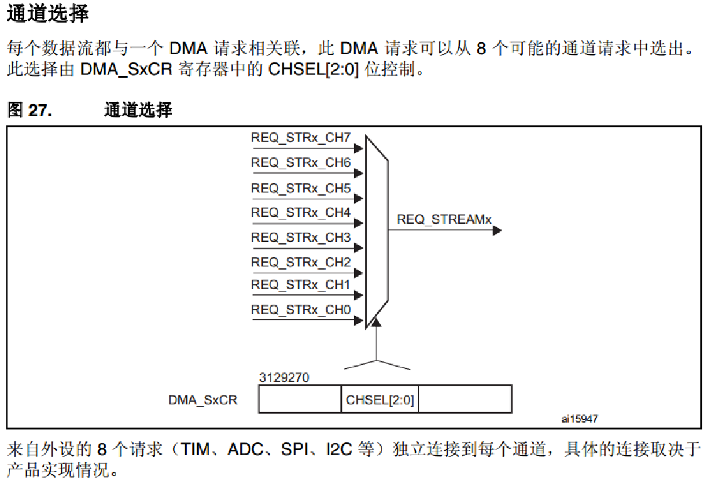

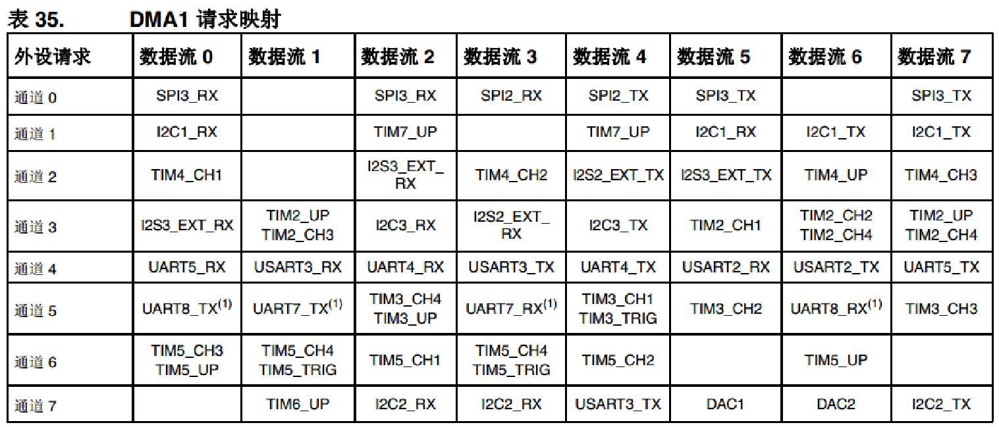

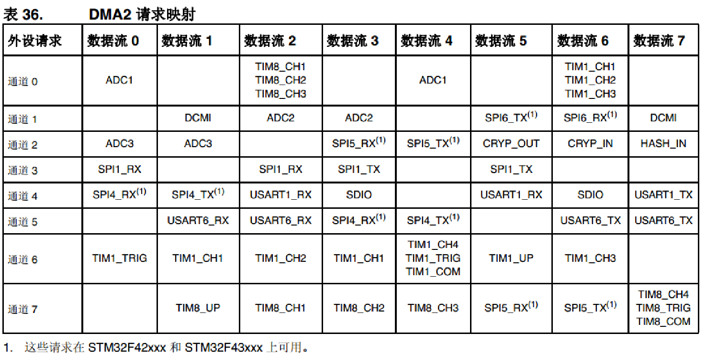

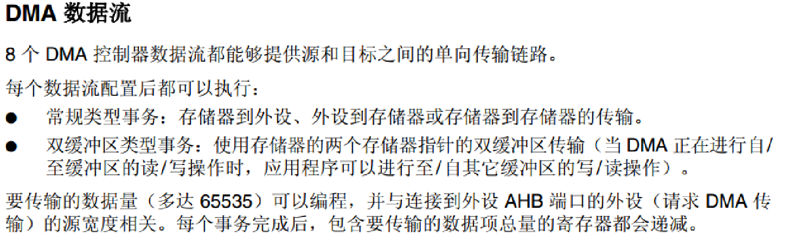

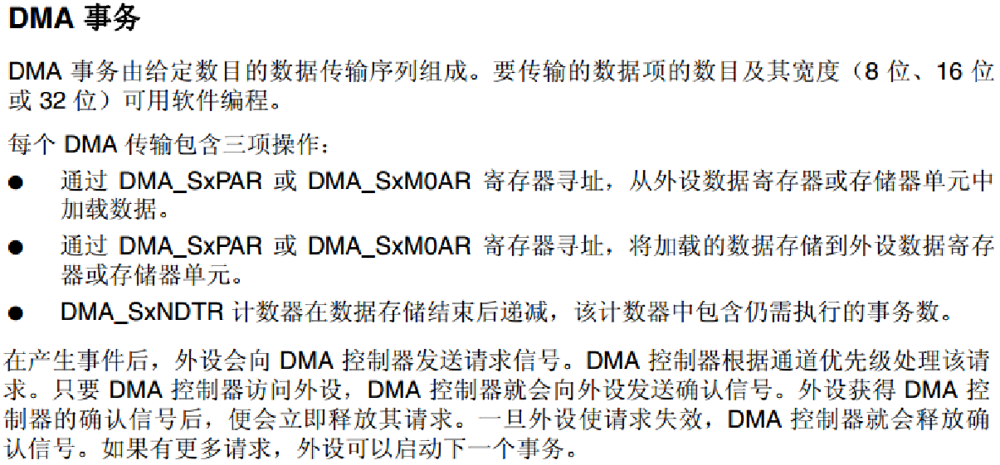

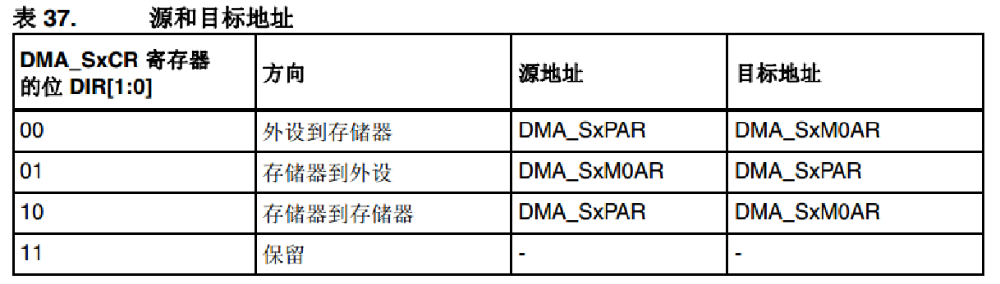

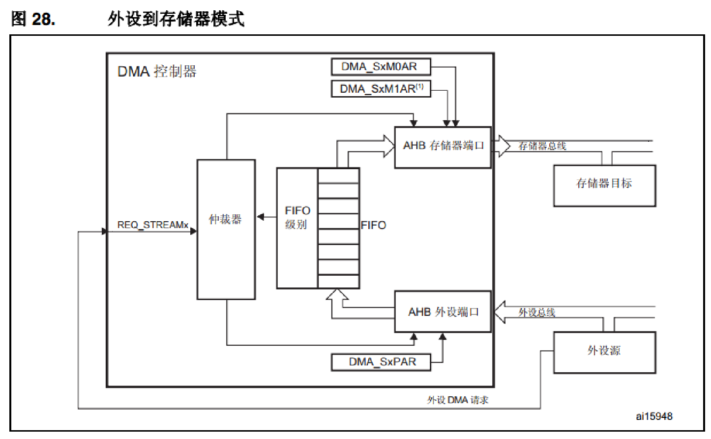

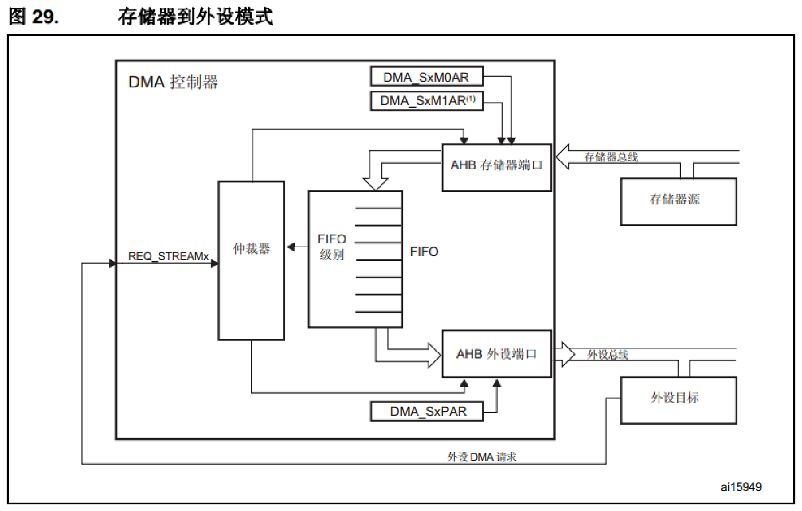

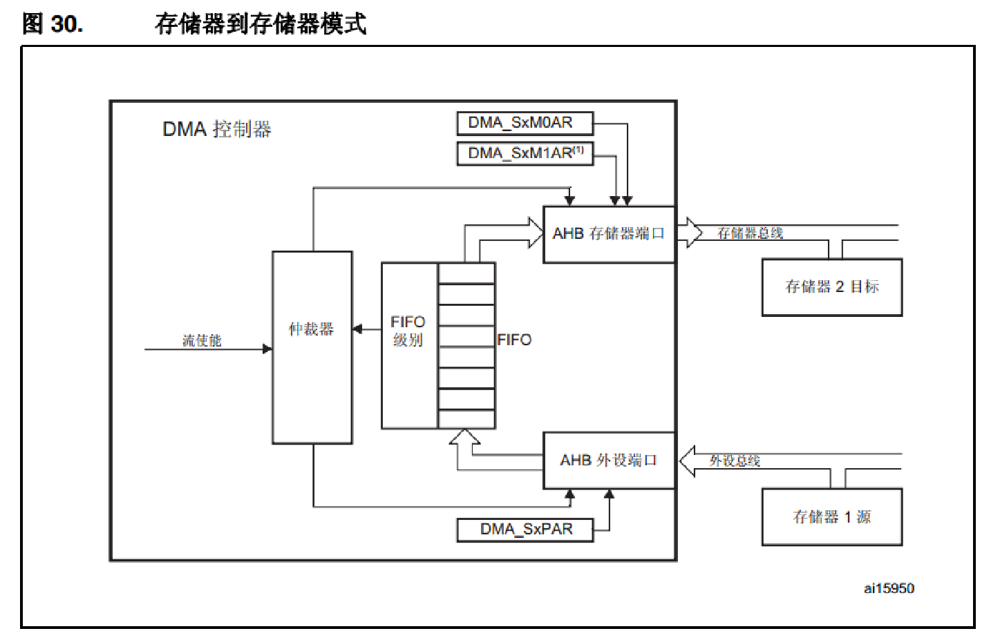

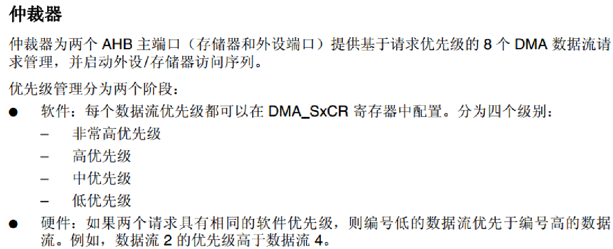
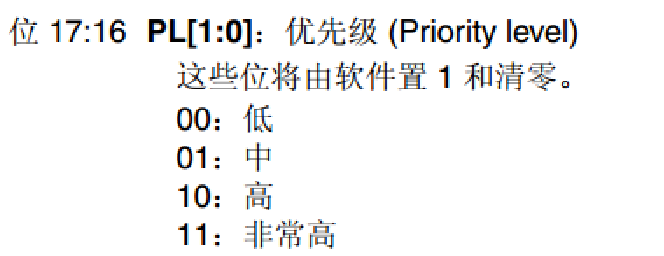

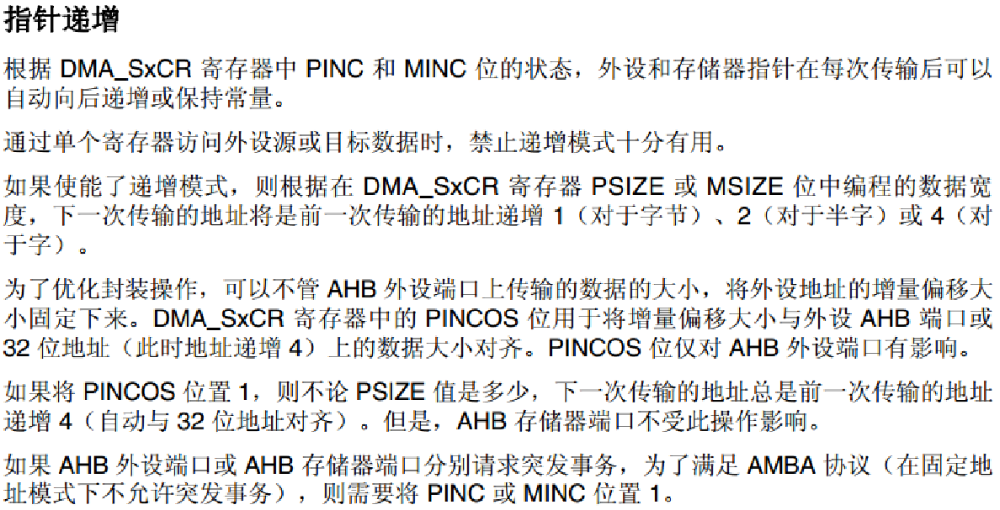
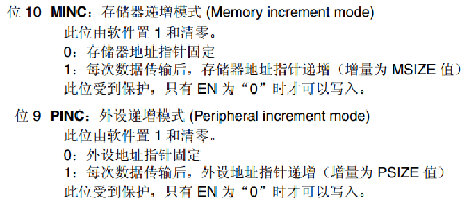

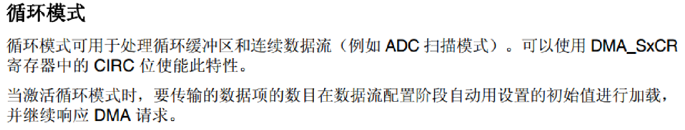
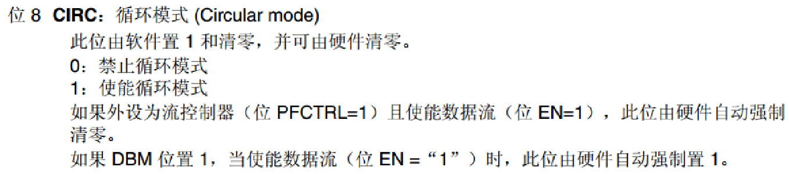

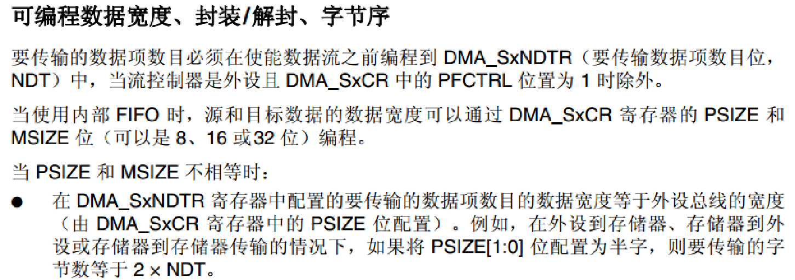

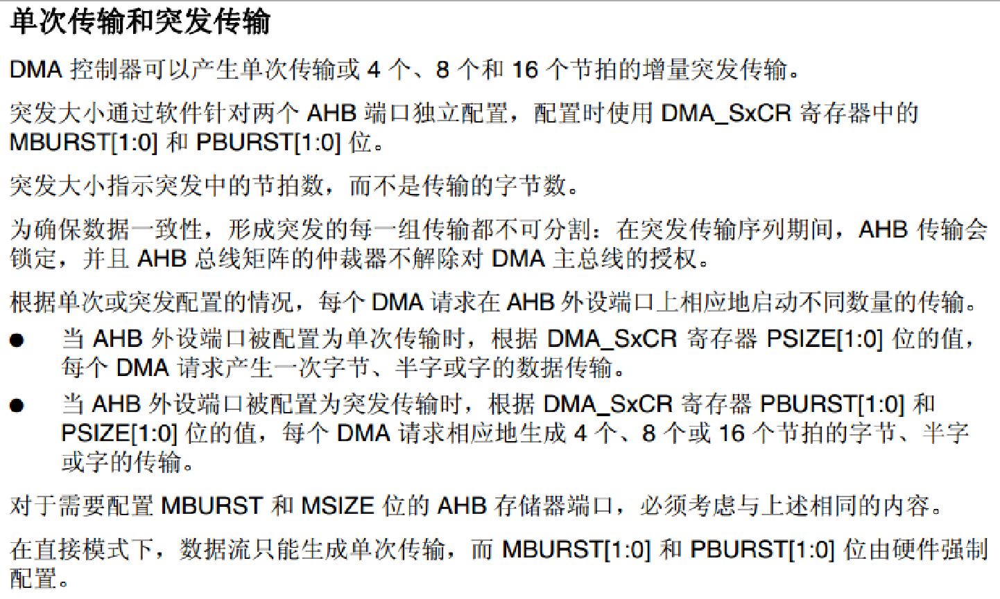

DMA传输需要用到总线矩阵，有个总线仲裁管理总线事务，由它来控制该谁谁用总线
普通的DMA传输可能传一个数据就必须跟总线仲裁提要求，总线仲裁才来安排传输
如果是==增量突发传输，就是一次性就传输4、8、16个数据，其间不被中断==
因为要求不被中断也就会产生一个问题，总线给你占用了，其他组件就没得用了

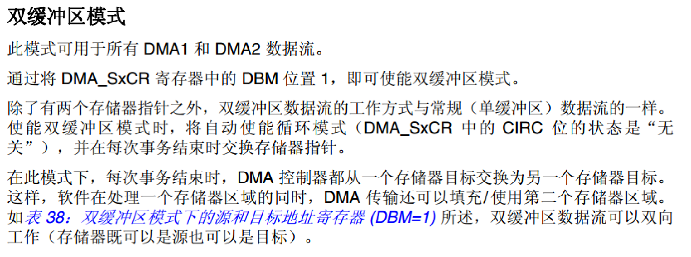

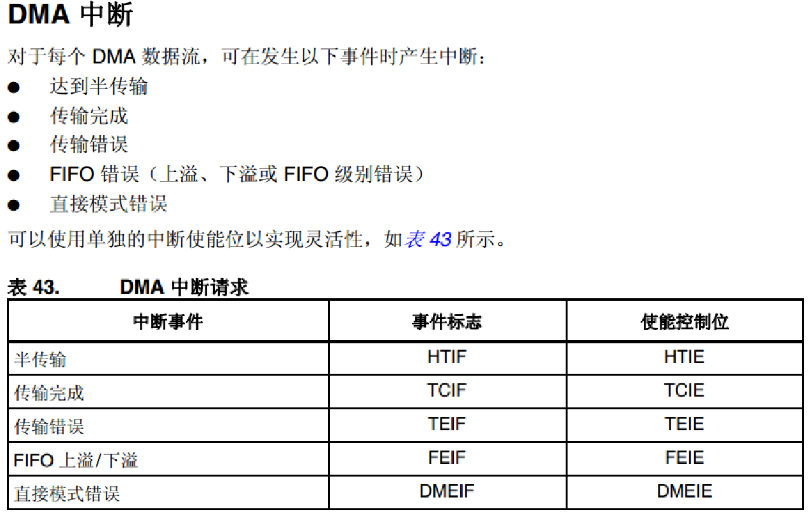

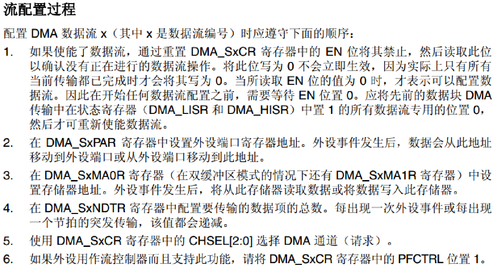
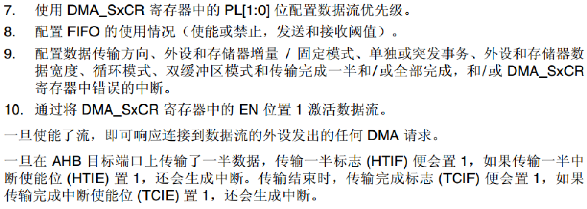

>1. 使能数据流后，先禁止DMA_SxCR寄存器中的使能位，然后确认是否有数据传输
>2. 设置源地址
>3. 设置目标地址
>4. 配置需要传输的数据总数。每触发一次传输事件，该值都会递减
>5. 选择DMA通道
>6. （可略）
>7. 配置数据流优先级
>8. 配置FIFO
>9. 配置数据传输方向、外设和存储器常量/固定模式、单独或突发事务、外设和存储器数据宽度、循环模式、双缓冲区模式和中断
>10. 使能，激活数据流

### 二、寄存器库函数配置

#### （1）寄存器

DMA 低中断状态寄存器 (DMA_LISR)
DMA 高中断状态寄存器 (DMA_HISR)
DMA 低中断标志清零寄存器 (DMA_LIFCR)
DMA 高中断标志清零寄存器 (DMA_HIFCR)
DMA 数据流 x 配置寄存器 (DMA_SxCR) (x = 0..7)
DMA 数据流 x 数据项数寄存器 (DMA_SxNDTR) (x = 0..7)
DMA 数据流 x 外设地址寄存器 (DMA_SxPAR) (x = 0..7)
DMA 数据流 x 存储器 0 地址寄存器 (DMA_SxM0AR) (x = 0..7)
DMA 数据流 x 存储器 1 地址寄存器 (DMA_SxM1AR) (x = 0..7)
DMA 数据流 x FIFO 控制寄存器 (DMA_SxFCR) (x = 0..7)

#### （2）DMA库函数（stm32f4xx_dma.c  /  stm32f4xx_dma.h）

##### 常用DMA库函数：

> > void DMA_Init(DMA_Stream_TypeDef* DMAy_Streamx, DMA_InitTypeDef* DMA_InitStruct);
> > //DMA初始化函数。入口参数：数据流选择，初始化结构体
> > void DMA_Cmd(DMA_Stream_TypeDef* DMAy_Streamx, FunctionalState NewState);
> > //使能DMA数据流。入口参数：数据流选择，是否使能。
>
> > void DMA_SetCurrDataCounter(DMA_Stream_TypeDef* DMAy_Streamx, uint16_t Counter);
> > //写入上要传输的数据单元数。 入口参数：数据流选择，要传输的数据数。
> > uint16_t DMA_GetCurrDataCounter(DMA_Stream_TypeDef* DMAy_Streamx);
> > //读取传输中剩余数据单元的数量。入口参数：数据流选择。
>
> > //双缓冲模式配置
> > void DMA_DoubleBufferModeConfig(DMA_Stream_TypeDef* DMAy_Streamx, uint32_t Memory1BaseAddr,uint32_t DMA_CurrentMemory);
> > void DMA_DoubleBufferModeCmd();
> > void DMA_MemoryTargetConfig(DMA_Stream_TypeDef* DMAy_Streamx, uint32_t MemoryBaseAddr, uint32_t DMA_MemoryTarget);
> > uint32_t DMA_GetCurrentMemoryTarget(DMA_Stream_TypeDef* DMAy_Streamx);
>
> 中断和标志管理功能：
>
> > FunctionalState DMA_GetCmdStatus(DMA_Stream_TypeDef* DMAy_Streamx);
> > //读取流当前状态
> > uint32_t DMA_GetFIFOStatus(DMA_Stream_TypeDef* DMAy_Streamx);
> > FlagStatus DMA_GetFlagStatus(DMA_Stream_TypeDef* DMAy_Streamx, uint32_t DMA_FLAG);
> > void DMA_ClearFlag(DMA_Stream_TypeDef* DMAy_Streamx, uint32_t DMA_FLAG);
> > void DMA_ITConfig(DMA_Stream_TypeDef* DMAy_Streamx, uint32_t DMA_IT, FunctionalState NewState);
> > ITStatus DMA_GetITStatus(DMA_Stream_TypeDef* DMAy_Streamx, uint32_t DMA_IT);
> > void DMA_ClearITPendingBit(DMA_Stream_TypeDef* DMAy_Streamx, uint32_t DMA_IT);

##### 常用的外设DMA使能库函数

> >void USART_DMACmd(USART_TypeDef* USARTx, uint16_t USART_DMAReq,FunctionalState NewState);
> >void ADC_DMACmd(ADC_TypeDef* ADCx, FunctionalState NewState);
> >void DAC_DMACmd(uint32_t DAC_Channel, FunctionalState NewState);
> >void I2C_DMACmd(I2C_TypeDef* I2Cx, FunctionalState NewState);
> >void SDIO_DMACmd(FunctionalState NewState);
> >void SPI_I2S_DMACmd(SPI_TypeDef* SPIx, uint16_t SPI_I2S_DMAReq, FunctionalState NewState);
>
> > void TIM_DMAConfig(TIM_TypeDef* TIMx, uint16_t TIM_DMABase, uint16_t TIM_DMABurstLength)
> > void TIM_DMACmd(TIM_TypeDef* TIMx, uint16_t TIM_DMASource,FunctionalState NewState);

##### DMA初始化结构体

> typedef struct
> {
>   uint32_t DMA_Channel;					//指定选择的流的通道
>   uint32_t DMA_PeripheralBaseAddr;			//设置外设的基地址
>   uint32_t DMA_Memory0BaseAddr;   			//设置内存基地址
>   uint32_t DMA_DIR;						//设置传输方向
>   uint32_t DMA_BufferSize;					//设置传输的数据数量
>   uint32_t DMA_PeripheralInc;				//外设地址是否递增
>   uint32_t DMA_MemoryInc;					//内存地址是否递增
>   uint32_t DMA_PeripheralDataSize;			//设置外设数据宽度
>   uint32_t DMA_MemoryDataSize; 				//设置内存数据宽度
>   uint32_t DMA_Mode;						//是否开启循环模式
>   uint32_t DMA_Priority;						//设置该通道的软件优先级
>   uint32_t DMA_FIFOMode;					//是否使用FIFO
>   uint32_t DMA_FIFOThreshold;				//设置的阈值级别，可为 FIFO 大小的 1/4、1/2 或 3/4
>   uint32_t DMA_MemoryBurst;				//配置内存的突发模式
>   uint32_t DMA_PeripheralBurst;				//配置外设的突发模式
> }DMA_InitTypeDef;

### 三、DMA实验程序讲解

- 使能DMA时钟

  `RCC_AHB1PeriphClockCmd();`

- 初始化DMA通道参数

  `DMA_Init();`

- 使能串口DMA发送，串口DMA使能函数

  `USART_DMACmd();`

- 查询DMA的使能位，确保数据流就绪，可以配置

  `DMA_GetCmdStatus();`

- 设置通道当前剩余数据量

  `DMA_SetCurrDataCounter();`

- 使能DMA1通道，启动传输

  `DMA_Cmd();`

- 查询DMA当前传输状态

  `DMA_GetFlagStatus();`

- 获取/设置通道当前剩余数据量

  `DMA_GetCurrDataCounter();`