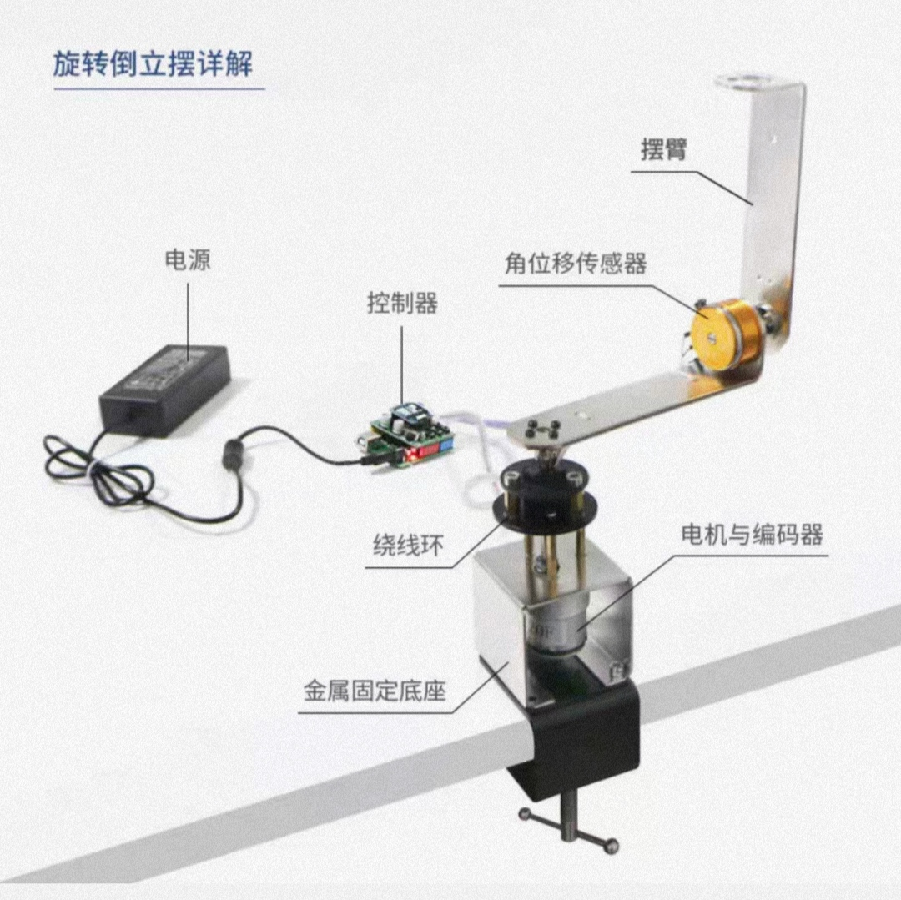
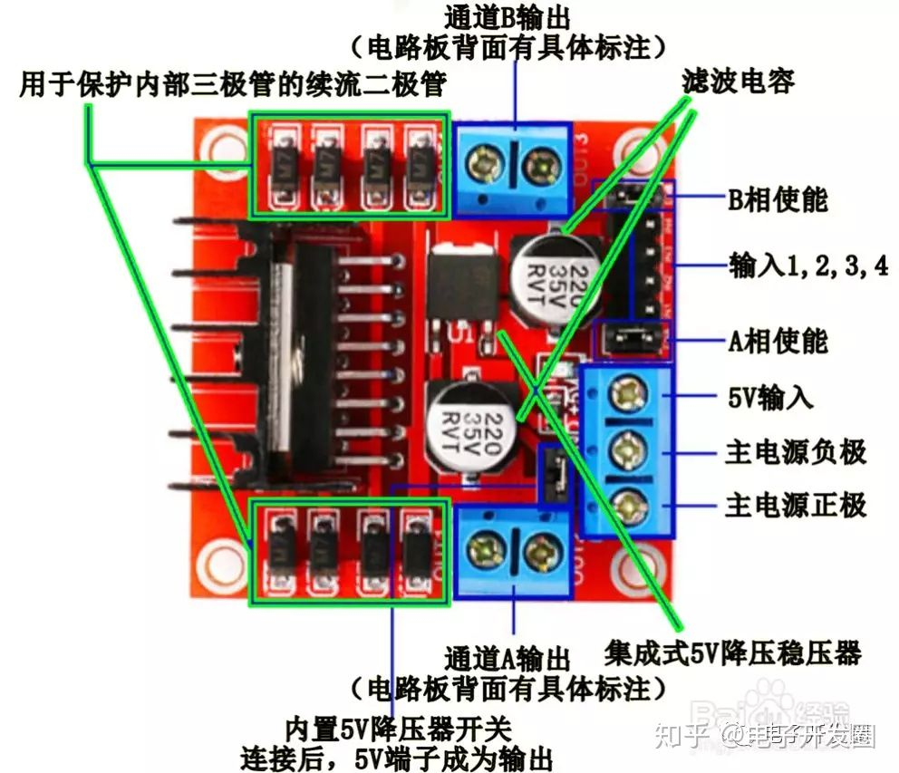

结构：

主控：STM32F407

驱动模块：L298N

 

[L298N 电机驱动板 - 详细介绍 - 知乎 (zhihu.com)](https://zhuanlan.zhihu.com/p/346930154) 

稳压模块：LM2596s

 

金属固定底座+电机 + 两个摆臂 + 角位移传感器

一、任务

设计并制作一套简易旋转倒立摆及其控制装置。旋转倒立摆的结构如图 1 所

示。电动机 A 固定在支架 B 上，通过转轴 F 驱动旋转臂 C 旋转。摆杆 E 通过转

轴 D 固定在旋转臂 C 的一端，当旋转臂 C 在电动机 A 驱动下作往复旋转运动时，

带动摆杆 E 在垂直于旋转臂 C 的平面作自由旋转。

二、要求

**1．基本要求**

（1）摆杆从处于自然下垂状态（摆角 0°）开始，驱动电机带动旋转臂作往复旋转使摆杆摆动，并尽快使摆角达到或超过-60°~ +60°； 

（2）从摆杆处于自然下垂状态开始，尽快增大摆杆的摆动幅度，直至完成圆周运动； 

（3）在摆杆处于自然下垂状态下，外力拉起摆杆至接近 165°位置，外力撤除同时，启动控制旋转臂使摆杆保持倒立状态时间不少于 5s；期间旋转臂的转动角度不大于 90°。

==6．基本要求（1）、（2）中，超过 30s视为失败；发挥部分（1）超过 90s视为失败；发挥部分（3）超过 3分钟即视为失败；以上各项，完成时间越短越好。==

**2．发挥部分**

（1）从摆杆处于自然下垂状态开始，控制旋转臂作往复旋转运动，尽快使摆杆摆起倒立，保持倒立状态时间不少于 10s； 

（2）在摆杆保持倒立状态下，施加干扰后摆杆能继续保持倒立或 2s 内恢复倒立状态；

（3）在摆杆保持倒立状态的前提下，旋转臂作圆周运动，并尽快使单方向转过角度达到或超过 360°；

（4）其他。

三、说明

1．旋转倒立摆机械部分必须自制，结构要求如下：硬质摆杆 E 通过转轴 D 连接在旋转臂 C 边缘，且距旋转臂 C 轴心距离为 20cm±5cm；摆杆的横截面为圆形或正方形，直径或边长不超过 1cm，长度在 15cm±5cm 范围内；允许使用传感器检测摆杆的状态，但不得影响摆杆的转动灵活性；图 1 中支架 B 的形状仅作参考，其余未作规定的可自行设计结构；电动机自行选型。

2．摆杆要能够在垂直平面灵活旋转，检验方法如下：将摆杆拉起至水平位置后松开，摆杆至少能够自由摆动 3 个来回。 

3．除电动机 A 之外，装置中不得有其他动力部件。 

4．摆杆自然下垂状态是指摆角为 0°位置，见图 2。 

5．摆杆倒立状态是指摆杆在-165° 至 165°范围内。 

6．基本要求（1）、（2）中，超过 30s视为失败；发挥部分（1）超过 90s视为失败；发挥部分（3）超过 3分钟即视为失败；以上各项，完成时间越短越好。 

7．摆杆倒立时施加干扰的方法是，以 15cm 长细绳栓一只 5 克砝码，在摆杆上方将砝码拉起 15°~45°，释放后用砝码沿摆杆摆动的切线方向撞击摆杆上端 1~2cm 处；以抗扰动能力强弱判定成绩。 

8．测试时，将在摆杆后 1~2cm 处固定一如图 2 所示==轻质量角器==，以方便观察摆杆的旋转角度。
