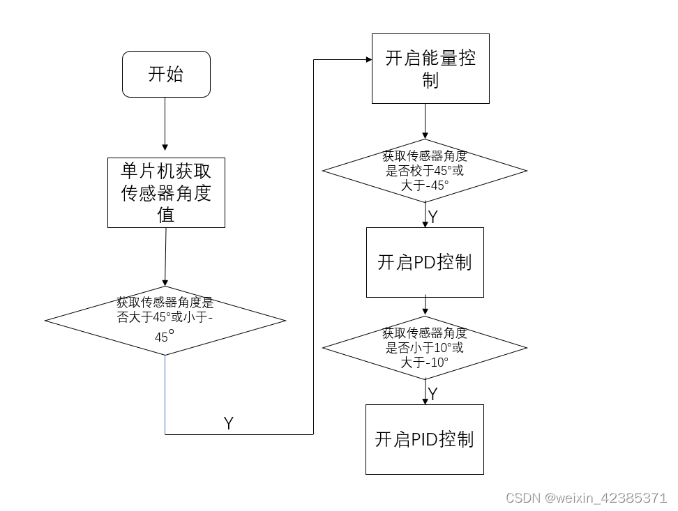
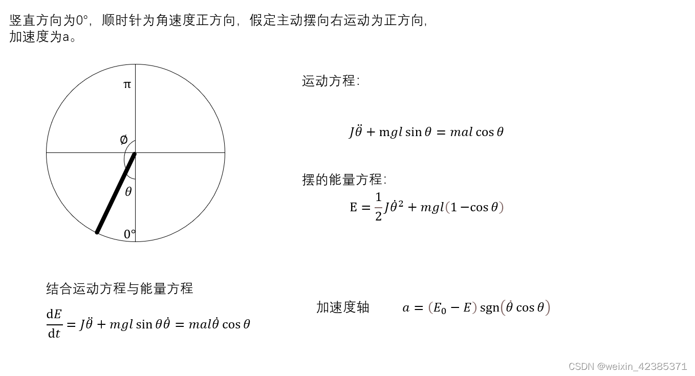

# 一、入门：

## （一）

[(1条消息) 倒立摆入门详解+pid调参_Smalld_cat的博客-CSDN博客_倒立摆](https://blog.csdn.net/small_po_kid/article/details/107659413)

##（二）

[(1条消息) 旋转倒立摆的起摆与稳摆---QYC_Rehabilitation2018的博客-CSDN博客_旋转倒立摆](https://blog.csdn.net/robot1701/article/details/124866352?spm=1001.2101.3001.6650.16&utm_medium=distribute.pc_relevant.none-task-blog-2~default~BlogCommendFromBaidu~Rate-16-124866352-blog-103267572.pc_relevant_multi_platform_whitelistv6&depth_1-utm_source=distribute.pc_relevant.none-task-blog-2~default~BlogCommendFromBaidu~Rate-16-124866352-blog-103267572.pc_relevant_multi_platform_whitelistv6&utm_relevant_index=20)

###1.关于编码器

绝对编码器：角位移传感器

相对编码器（增量式编码器）：霍尔编码器，使用STM32的编码器模式驱动

### *2.关于倒立摆模型的建立——关于自动控制理论

系统的运动方程：

 

将数值代入公式计算出传递函数

### *3.实验方案

 

关于能量控制

 

开始给摆杆一个速度，当v = 0时，给一个反方向的速度
当摆杆速度再次为 0 时，再给一个反方向的速度
如此往复，倒立摆能量就会积攒，最后达到目标位置附近。

[(1条消息) 倒立摆模型分析_-Willing-的博客-CSDN博客_倒立摆模型](https://blog.csdn.net/Cui_Hongwei/article/details/109771622)

## （三）调试：

[(1条消息) PID参数整定具体方法-圆周倒立摆_灵魂Maker的博客-CSDN博客_倒立摆pid参数整定方法](https://blog.csdn.net/qq_36720691/article/details/97249174)

进阶：基于自动控制理论以及MATLAB-simulink

目标：学会使用LQR

[电赛练习之旋转倒立摆 - YuhuaStone - 博客园 (cnblogs.com)](https://www.cnblogs.com/yuhuastone/p/12542198.html)

[(1条消息) 倒立摆的simulink模型搭建_cwdben的博客-CSDN博客_倒立摆simulink](https://blog.csdn.net/cwdben/article/details/104357491)

[(1条消息) 倒立摆状态反馈控制——分析、建模与仿真(matlab)_XieKKK-的博客-CSDN博客_倒立摆控制](https://blog.csdn.net/qq_41342525/article/details/106193258)

