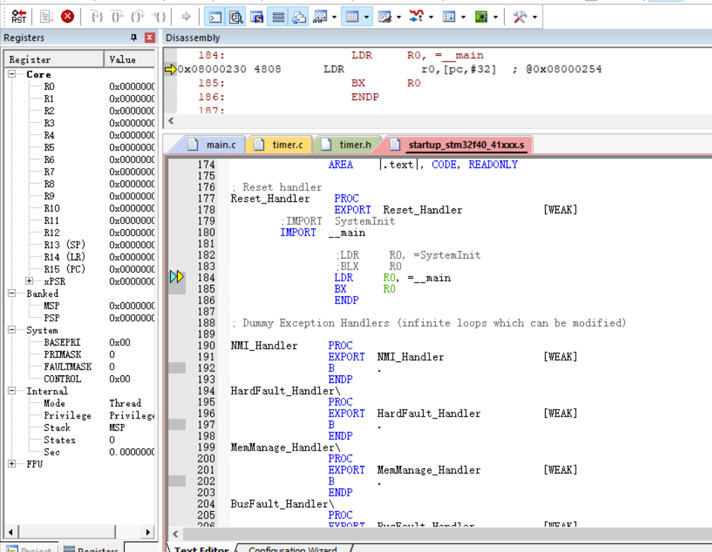
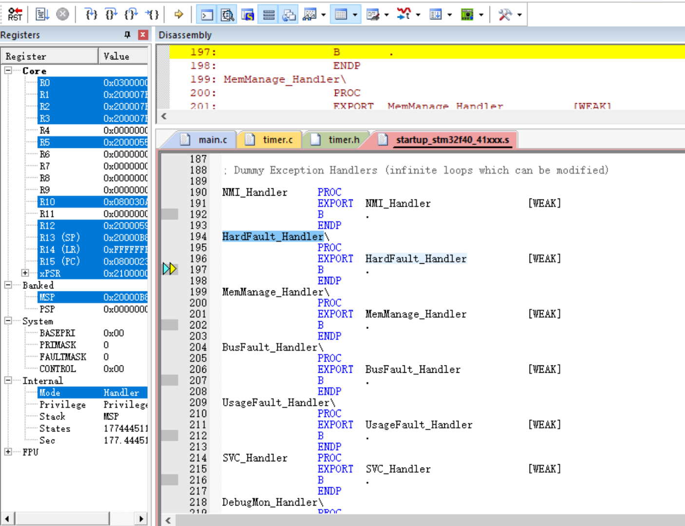

###寄存器工程不注释‘SystemInit’带来的错误

使用官方固件库里的启动文件`startup_stm32f40_41xxx.s`必须屏蔽以下代码，不然找不到SystemInit函数会报错。如果是库函数则可以不用屏蔽。

```
        ;IMPORT  SystemInit
        IMPORT  __main

                ;LDR     R0, =SystemInit
                ;BLX     R0
                LDR     R0, =__main
                BX      R0
                ENDP
```

###注释了‘SystemInit但不开启Use MicroLIB带来的错误

如果使用官方固件库里的启动文件`startup_stm32f40_41xxx.s`，若不开启Target->Target中的Use MicroLIB，会进不了主函数。

如果使用软件Debug，会发现程序卡在启动文件



终止循环后，进入HardFault_Handler



### 注释了‘SystemInit’开启Use MicroLIB后出现的问题

由于我在寄存器工程中`sys.c`、`usart.c`、`delay.c`使用的是正电原子的代码，但没有使用正电原子的启动文件。

在排除了以上问题后，发现`usart.c`里的串口不能正常初始化，printf函数也不能正常输出。

通过片上软件仿真后，发现程序跑到串口初始化后必进HardFault_Handler，然后就卡在死循环里。

通过查阅资料，大家都说需要避免使用半主机模式，但在正电原子的`usart.c`里有。

```C
#pragma import(__use_no_semihosting)             
//标准库需要的支持函数                 
struct __FILE 
{ 
	int handle; 
	/* Whatever you require here. If the only file you are using is */ 
	/* standard output using printf() for debugging, no file handling */ 
	/* is required. */ 
}; 
/* FILE is typedef’ d in stdio.h. */ 
FILE __stdout;       
//定义_sys_exit()以避免使用半主机模式    
void _sys_exit(int x) 
{ 
	x = x; 
} 
//重定义fputc函数 
int fputc(int ch, FILE *f)
{      
	while((USART1->SR&0X40)==0);//循环发送,直到发送完毕   
	USART1->DR = (u8) ch;      
	return ch;
}
```

后来尝试将启动文件里的`Heap_Size       EQU     0x00000200`改成`Heap_Size       EQU     0x00000000`，也没有变化

最终，尝试了一下使用正电原子的启动文件，以上问题都消失了，可以正常初始化串口、使用printf，也不用开启Use MicroLIB。

明明只改了一个多了一个使能浮点运算，不知道为什么差别这么大。

```
                 LDR     R0, =0xE000ED88    ; 使能浮点运算 CP10,CP11
                 LDR     R1,[R0]
                 ORR     R1,R1,#(0xF << 20)
                 STR     R1,[R0]
```

### 总结

- 寄存器工程必须注释‘SystemInit’
- 建议新手新建寄存器工程使用正电原子的启动文件

