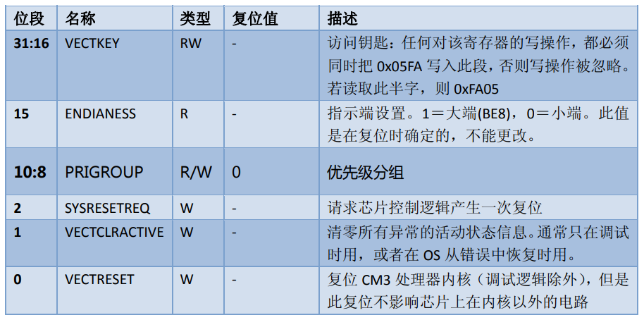

参考资料：

探索者F4 资料盘(A盘)\8，STM32参考资料\Cortex M3权威指南(中文).pdf

##  中断优先级分组

在库函数中，中断优先级分组是通过`NVIC_PriorityGroupConfig(uint32_t NVIC_PriorityGroup)`来实现的

看一下函数中的具体内容：

```c
#define AIRCR_VECTKEY_MASK    ((uint32_t)0x05FA0000)
```

```C
void NVIC_PriorityGroupConfig(uint32_t NVIC_PriorityGroup)
{
  /* Check the parameters */
  assert_param(IS_NVIC_PRIORITY_GROUP(NVIC_PriorityGroup));
  
  /* Set the PRIGROUP[10:8] bits according to NVIC_PriorityGroup value */
  SCB->AIRCR = AIRCR_VECTKEY_MASK | NVIC_PriorityGroup;
}
```

```c
#define NVIC_PriorityGroup_0         ((uint32_t)0x700) /*!< 0 bits for pre-emption priority
                                                            4 bits for subpriority */
#define NVIC_PriorityGroup_1         ((uint32_t)0x600) /*!< 1 bits for pre-emption priority
                                                            3 bits for subpriority */
#define NVIC_PriorityGroup_2         ((uint32_t)0x500) /*!< 2 bits for pre-emption priority
                                                            2 bits for subpriority */
#define NVIC_PriorityGroup_3         ((uint32_t)0x400) /*!< 3 bits for pre-emption priority
                                                            1 bits for subpriority */
#define NVIC_PriorityGroup_4         ((uint32_t)0x300) /*!< 4 bits for pre-emption priority
                                                            0 bits for subpriority */
#define IS_NVIC_PRIORITY_GROUP(GROUP) (((GROUP) == NVIC_PriorityGroup_0) || \
                                       ((GROUP) == NVIC_PriorityGroup_1) || \
                                       ((GROUP) == NVIC_PriorityGroup_2) || \
                                       ((GROUP) == NVIC_PriorityGroup_3) || \
                                       ((GROUP) == NVIC_PriorityGroup_4))
```

这三段代码分别是：

- 复位控制寄存器(AIRCR)的访问钥匙的宏定义(misc.c)
- 中断分组函数(misc.c)
- 中断分组宏定义(misc.h)

==接下来我们来详细解释一下这三段代码==

### 复位控制寄存器(AIRCR)的访问钥匙

为什么需要这个访问钥匙呢？

由于我们进行中断分组是直接调用的SCB寄存器中的AIRCR寄存器，通过查阅《Cortex‐M3 权威指南》可知：

**任何对该寄存器的写操作，都必须 同时把 ==0x05FA== 写入此段，否则写操作被忽略。**



### 中断分组函数

在中断分组操作中，我们仅会使用到`AIRCR[10:8]`3位，所以根据分组的规则，一共有5组，所以设置5个宏定义便于编写。

| **组** | AIRCR[10：8] | IP bit[7：4]分配情况 | 分配结果                     |
| ------ | ------------ | -------------------- | ---------------------------- |
| **0**  | 111          | 0：4                 | 0位抢占优先级，4位响应优先级 |
| **1**  | 110          | 1：3                 | 1位抢占优先级，3位响应优先级 |
| **2**  | 101          | 2：2                 | 2位抢占优先级，2位响应优先级 |
| **3**  | 100          | 3：1                 | 3位抢占优先级，1位响应优先级 |
| **4**  | 011          | 4：0                 | 4位抢占优先级，0位响应优先级 |

最后就是将	**分配情况**	和	**0x05FA**	通过“或”运算组合起来，写入`SCB->AIRCR`

### 寄存器写法

在寄存器工程中，是没有这些宏定义的，这个宏定义都是库函数中独有的。好在`core_cm4.h`中有SCB、AIRCR的定义，通过

```C
SCB->AIRCR = ((uint32_t)0x05FA0000) | NVIC_PriorityGroup;
```

也是可以对中断优先级进行分组的

**一般情况下，系统代码执行过程中，只设置一次中断优先级分组，比如分组2，设置好分组之后一般不会再改变分组。随意改变分组会导致中断管理混乱，程序出现意想不到的执行结果。**

