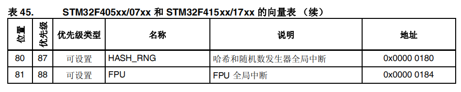

# 关于中断

- **NVIC** 是嵌套向量中断控制器
- CM4 内核支持 256 个中断，其中包含了 16 个内核中断和 240 个外部中断，并且具有256 级的可编程中断设置。
- 但 STM32F4 并没有使用 CM4 内核的全部东西，而是只用了它的一部分。
  - STM32F40xx/STM32F41xx 总共有 92 个中断
  - STM32F42xx/STM32F43xx 则总共有 96 个中断
- STM32F40xx/STM32F41xx 的 92 个中断里面，包括 10 个内核中断和 82 个可屏蔽中断，具有 16 级可编程的中断优先级，而我们常用的就是这 82 个可屏蔽中断。

==下面详细介绍一下最常用的定时器中断和外部中断的初始化==

##定时器中断初始化

由于定时器中断没有中断线需要配置，所以我们只需要直接设置它的中断向量、中断优先级就行。

### 中断向量选择

根据需要查阅资料。

如果需要复制，可以去启动文件`startup_stm32f40_41xxx.s`中的中断向量表中寻找，也可以去`stm32f4xx.h`中寻找。

在启动文件`startup_stm32f40_41xxx.s`中的是中断服务函数的函数名，在`stm32f4xx.h`中的是中断向量和IP[x]的对应

###设置中断优先级

中断优先级涉及到==抢占优先级==、==响应优先级==的配置：

>高**抢占优先级**中断	可以打断	正在进行的低**抢占优先级**的中断
>相同**抢占优先级**，高==响应优先级==	不可打断	==低响应优先级==
>
>**抢占优先级**相同的中断，比较==响应优先级==，哪个高哪个先执行
>
>**抢占优先级**和==响应优先级==都相同，哪个中断先发生就先执行

- 抢占优先级：最高位为 0 
  - 高 > 低，可以打断
  - 相同，比较响应优先级
- 响应优先级：最高位为 0 
  - 高 > 低，不可打断
  - 抢占、响应均相同，中断发生先后顺序，先发生先执行

```c
uint8_t tmppriority = 0x00, tmppre = 0x00, tmpsub = 0x0F;
/* Compute the Corresponding IRQ Priority --------------------------------*/    
tmppriority = (0x700 - ((SCB->AIRCR) & (uint32_t)0x700))>> 0x08;
tmppre = (0x4 - tmppriority);
tmpsub = tmpsub >> tmppriority;

tmppriority = NVIC_InitStruct->NVIC_IRQChannelPreemptionPriority << tmppre;
tmppriority |=  (uint8_t)(NVIC_InitStruct->NVIC_IRQChannelSubPriority & tmpsub);

tmppriority = tmppriority << 0x04;

NVIC->IP[NVIC_InitStruct->NVIC_IRQChannel] = tmppriority;

/* Enable the Selected IRQ Channels --------------------------------------*/
NVIC->ISER[NVIC_InitStruct->NVIC_IRQChannel >> 0x05] =
    (uint32_t)0x01 << (NVIC_InitStruct->NVIC_IRQChannel & (uint8_t)0x1F);
```

- 假设中断优先级分组为0x600 = 110 0000 0000。抢占优先级为 1，响应优先级为 5

- 第一行

  - 读取SCB->AIRCR中的中断优先级分组，与上 0x700 = 111 0000 0000后，得到AIRCR[10,8]的具体内容。110 0000 0000。

  - 用 0x700 = 111 0000 0000减去AIRCR[10,8]后，再左移8位后得到抢占优先级的位数==tmppriority==。==tmppriority== = 111 - 110 = 1。

  - 
    | **组** | AIRCR[10：8] | IP bit[7：4]分配情况 | 分配结果                     |
    | ------ | ------------ | -------------------- | ---------------------------- |
    | **0**  | 111          | 0：4                 | 0位抢占优先级，4位响应优先级 |
    | **1**  | 110          | 1：3                 | 1位抢占优先级，3位响应优先级 |
    | **2**  | 101          | 2：2                 | 2位抢占优先级，2位响应优先级 |
    | **3**  | 100          | 3：1                 | 3位抢占优先级，1位响应优先级 |
    | **4**  | 011          | 4：0                 | 4位抢占优先级，0位响应优先级 |

  - ```
    中断优先级分组SCB->AIRCR
    0x700	111 0000 0000
    0x600	110 0000 0000
    0x500	101 0000 0000
    0x400	100 0000 0000
    0x300	011 0000 0000
    ```

- 第二行
  - 0x4 - 抢占优先级的位数 = 响应优先级的位数**tmppre**。**tmppre** = 4 - 1 = 3。
  
- 第三行

  - 将tmpsub = 0x0F = 0000 1111右移==tmppriority==位，得到抢占优先级和响应优先级在 IP bit[7:4]中的分配情况。tmpsub = 0000 0111。
  - 在`core_cm4.h`的NVIC_Type结构体中我们可以看到`uint8_t  IP[240]`，这刚好对应了CM4 内核支持的 240 个外部中断。
  - 在`uint8_t  IP[240]`中，每一个数组都是 8 位的，其中只有高四位IP bit[7：4]会被用于存放中断优先级。
  - 每一个中断对应的数组标号可以在`stm32f4xx.h`中寻找到。

- 第四行

  - 将抢占优先级`NVIC_InitStruct->NVIC_IRQChannelPreemptionPriority`左移**tmppre**位，即响应优先级的位数，赋值给tmppriority。
  - tmppriority = 1 << 3 = 0000 1000

- 第四行

  - 将响应优先级`NVIC_InitStruct->NVIC_IRQChannelSubPriority`与上tmpsub以检查参数，0000 0101 & 0000 0111 = 0000 0101
  - 最后或给tmppriority。0000 1000 |= 0000 0101得到0000 1101

- 第五、六行

  - tmppriority左移四位，得到抢占优先级和响应优先级在 IP bit[7:4]中的分配情况，IP bit[7:4] = 1101 0000
  - 并赋值给对应的中断

- 第七、八行

  - 使能对应中断，通过操作中断设置使能寄存器`NVIC->ISER`来实现中断的使能；相反如果要清除使能，要用到中断清除使能寄存器`NVIC->ICER`
  - 
  - 
  - 假设我们需要使能中断68 = 0100 0100，左移5位后得到 10 = 2，判断使用 `NVIC->ISER[2]`
  - 将中断 68 = 0100 0100 与上 0001 1111后，判断需要在`NVIC->ISER[2]`的第 0000 0100 = 4 位写入1
  - 清除使能同理


### 定时器中断使能

仅仅在NVIC->ISCR使能是不够的，还必须使能TIM中断寄存器 TIMx_DIER

在STM32F407中，除了 TIM10/11/13/14没有 TIMx_DIER 中断使能寄存器，其他定时器都有中断使能定时器 TIMx_DIER。

在定时器中断的使能中 只需要将其 位 0 UIE：更新中断使能 置 1即可

###编写中断服务函数

编写中断函数最重要的是检查TIM中断是否已发生、清除中断标志位。

#### 检查TIM中断是否已发生

在TIM1 ~ TIM14中，每一个定时器都有 TIMx_SR 状态寄存器，通过读取其 位 0 UIF：更新中断标志，我们可以知道该定时器是否发生中断。

在库函数中，判断一个定时器是否发生中断，需要同时检查该定时器的 中断是否使能、中断更新标志是否置 1

#### 清除中断标志位

清除中断标志位只需要将 TIMx_SR 状态寄存器的 位 0 UIF：更新中断标志 置0 即可


## 外部中断初始化

### 外部中断/事件控制器(EXTI)

#### 基本特性

EXTI 控制器的主要特性如下：

- 每个中断/事件线上都具有独立的触发和屏蔽
- 每个中断线都具有专用的状态位
- 支持多达 ==23== 个软件事件/中断请求
- 检测脉冲宽度低于 APB2 时钟宽度的外部信号。

#### 外部中断/事件控制器(EXTI)框图


#### 功能说明

- 硬件中断的使用
  - 配置 23 根中断线的屏蔽位 (EXTI_IMR)
  - 配置中断线的触发选择位（EXTI_RTSR 和 EXTI_FTSR）
  - 配置对应到外部中断控制器 (EXTI) 的 NVIC 中断通道的使能和屏蔽位，使得 23 个中断线中的请求可以被正确地响应。
- 硬件事件的使用
  - 配置 23 根事件线的屏蔽位 (EXTI_EMR)
  - 配置事件线的触发选择位（EXTI_RTSR 和 EXTI_FTSR）
- 软件中断/事件的使用
  - 配置 23 根中断/事件线的屏蔽位（EXTI_IMR、EXTI_EMR）
  - 在软件中断寄存器设置相应的请求位 (EXTI_SWIER)

#### 事件映射

多达 140 个 GPIO（STM32F405xx/07xx 和 STM32F415xx/17xx）通过以下方式连接到 16 个 外部中断/事件线


另外七根 EXTI 线连接方式如下：

- EXTI 线 16 连接到 PVD 输出
- EXTI 线 17 连接到 RTC 闹钟事件
- EXTI 线 18 连接到 USB OTG FS 唤醒事件
- EXTI 线 19 连接到以太网唤醒事件
- EXTI 线 20 连接到 USB OTG HS（在 FS 中配置）唤醒事件
- EXTI 线 21 连接到 RTC 入侵和时间戳事件
- EXTI 线 22 连接到 RTC 唤醒事件


### GPIO初始化

使用普通输入模式

其他，略。

### 将GPIO连接到中断线

####系统配置控制器——SYSCFG

此时要用到系统配置控制器——SYSCFG。

系统配置控制器——SYSCFG主要用于管理对可执行代码的存储区域的地址重映射、选择以太网 PHY 接 口以及管理 GPIO 的外部中断线连接。

所以我们用它来实现将 GPIO 连接到外部中断.

在 SYSVFG 中有一下几个寄存器用于配置外部中断：(分别对应的是：==EXTI 0~3、EXTI 4~7、EXTI 8~11、EXTI 12~15==)

>- SYSCFG 外部中断配置寄存器 1 (SYSCFG_EXTICR1)
>
>  >位 15:0 EXTIx[3:0]：EXTI x 配置==（x = 0 到 3）==
>  >
>  >这些位通过软件写入，以选择 EXTIx 外部中断的源输入。
>  >
>  >0000：PA[0 ~ 3] 引脚
>  >0001：PB[0 ~ 3] 引脚
>  >0010：PC[0 ~ 3] 引脚
>  >0011：PD[0 ~ 3] 引脚
>  >0100：PE[0 ~ 3] 引脚
>  >0101：PF[0 ~ 3] 引脚
>  >0110：PG[0 ~ 3] 引脚
>  >0111：PH[0 ~ 3] 引脚
>  >1000：PI[0 ~ 3] 引脚
>
>- SYSCFG 外部中断配置寄存器 2 (SYSCFG_EXTICR2)
>
>  >EXTIx[3:0]：EXTI x 配置==（x = 4 到 7）==
>  >
>  >这些位通过软件写入，以选择 EXTIx 外部中断的源输入。
>  >
>  >0000：PA[4 ~ 7] 引脚
>  >0001：PB[4 ~ 7] 引脚
>  >0010：PC[4 ~ 7] 引脚
>  >0011：PD[4 ~ 7] 引脚
>  >0100：PE[4 ~ 7] 引脚
>  >0101：PF[4 ~ 7] 引脚
>  >0110：PG[4 ~ 7] 引脚
>  >0111：PH[4 ~ 7] 引脚
>  >1000：PI[4 ~ 7] 引脚
>
>- SYSCFG 外部中断配置寄存器 3 (SYSCFG_EXTICR3)
>
>  >EXTIx[3:0]：EXTI x 配置==（x = 8 到 11）==
>  >
>  >这些位通过软件写入，以选择 EXTIx 外部中断的源输入。
>  >
>  >0000：PA[8 ~ 11] 引脚
>  >0001：PB[8 ~ 11] 引脚
>  >0010：PC[8 ~ 11] 引脚
>  >0011：PD[8 ~ 11] 引脚
>  >0100：PE[8 ~ 11] 引脚
>  >0101：PF[8 ~ 11] 引脚
>  >0110：PG[8 ~ 11] 引脚
>  >0111：PH[8 ~ 11] 引脚
>  >1000：PI[8 ~ 11] 引脚
>
>- SYSCFG 外部中断配置寄存器 4 (SYSCFG_EXTICR4)
>
>  >EXTIx[3:0]：EXTI x 配置==（x = 12 到 15）==
>  >
>  >这些位通过软件写入，以选择 EXTIx 外部中断的源输入。
>  >
>  >0000：PA[12 ~ 15] 引脚
>  >0001：PB[12 ~ 15] 引脚
>  >0010：PC[12 ~ 15] 引脚
>  >0011：PD[12 ~ 15] 引脚
>  >0100：PE[12 ~ 15] 引脚
>  >0101：PF[12 ~ 15] 引脚
>  >0110：PG[12 ~ 15] 引脚
>  >0111：PH[12 ~ 15] 引脚
>  >1000：PI[12 ~ 15] 引脚

#### 实现代码

使能时钟

```c
RCC->APB2ENR |= RCC_APB2ENR_SYSCFGEN;
```

查阅库函数代码:

```c
void SYSCFG_EXTILineConfig(uint8_t EXTI_PortSourceGPIOx, uint8_t EXTI_PinSourcex)
{
  uint32_t tmp = 0x00;

  /* Check the parameters */
  assert_param(IS_EXTI_PORT_SOURCE(EXTI_PortSourceGPIOx));
  assert_param(IS_EXTI_PIN_SOURCE(EXTI_PinSourcex));

  tmp = ((uint32_t)0x0F) << (0x04 * (EXTI_PinSourcex & (uint8_t)0x03));
  SYSCFG->EXTICR[EXTI_PinSourcex >> 0x02] &= ~tmp;
  SYSCFG->EXTICR[EXTI_PinSourcex >> 0x02] |= (((uint32_t)EXTI_PortSourceGPIOx) << (0x04 * (EXTI_PinSourcex & (uint8_t)0x03)));
}
```

- 首先是检查参数
- 然后将对应中断线的位置清0
  - 实现过程：
  - (中断线的值 & 0011)*4 得到该中断线对应寄存器的起始地址。例如 7(0111) & 0011 = 3 ，12即为左移的位数。
  - 使用 `EXTI_PinSourcex >> 0x02` 来确定使用哪个寄存器，例如 7(0111) >> 2 = 1，即使用外部中断配置寄存器2(数组第2位) 。
  - 即将 1111 左移相应的位数，将需要的位置1，再通过判断对应中断使用的寄存器，将其中 取反再取与运算，从而清零。
- 将对应的GPIO写入其中
  - 实现过程：
  - 将 对应的GPIO 左移相应的位数，或上对应的中断配置寄存器

寄存器写法：

```c
//例: GPIOA6 连接到中断线 6
SYSCFG->EXTICR[1] &= ~SYSCFG_EXTICR2_EXTI6;     //对应位置清零(可省略)
SYSCFG->EXTICR[1] |= SYSCFG_EXTICR2_EXTI6_PA;   //GPIOA6 连接到中断线 6
```

### 配置中断触发方式

在配置中断触发方式的过程中，我们会使用到一下三个寄存器

- 中断屏蔽寄存器 (EXTI_IMR)
- 上升沿触发选择寄存器 (EXTI_RTSR)
- 下降沿触发选择寄存器 (EXTI_FTSR)

清除中断屏蔽

```c
EXTI->IMR |= (1<<Line);
```

清除触发方式(可以省略)

```c
EXTI->RTSR &= ~(1<<Line);
EXTI->FTSR &= ~(1<<Line);
```

选择触发方式

```c
EXTI->RTSR |= (1<<Line);	// 上升沿
EXTI->FTSR |= (1<<Line);	// 下降沿
```

### 配置中断优先级(不可以省略，否则不会使能中断)

略


###编写中断服务函数

中断服务函数：==7个==

- EXTI0_IRQHandler
- EXTI1_IRQHandler
- EXTI2_IRQHandler
- EXTI3_IRQHandler
- EXTI4_IRQHandler
- EXTI9_5_IRQHandler
- EXTI15_10_IRQHandler

例：外部中断，GPIOA7 连接到中断线 7

```c
//GPIOA时钟初始化（可以省略）
RCC->AHB1ENR |= RCC_AHB1ENR_GPIOAEN;
//PA7:普通输入模式、挽推、100MHz、上拉
GPIOA->MODER    |= 0x00;
GPIOA->OTYPER   |= 0x00;
GPIOA->OSPEEDR  |= GPIO_OSPEEDER_OSPEEDR7;
GPIOA->PUPDR    |= GPIO_PUPDR_PUPDR7_0;

//外部中断
//GPIOA7 连接到中断线 7
RCC->APB2ENR |= RCC_APB2ENR_SYSCFGEN;
SYSCFG->EXTICR[1] |= SYSCFG_EXTICR2_EXTI7_PA;
//中断线 7 下降沿触发
EXTI->IMR   |= (1<<7);
EXTI->FTSR  |= (1<<7);
//配置中断优先级
NVIC_Init(EXTI9_5_IRQn,0,0);

void EXTI9_5_IRQHandler(void)
{
    if (EXTI->PR & (EXTI->IMR))
    {
     EXTI->PR |= 0<<7;
    }
}
```

 

## STM32F405xx/07xx 和 STM32F415xx/17xx 的向量表：



