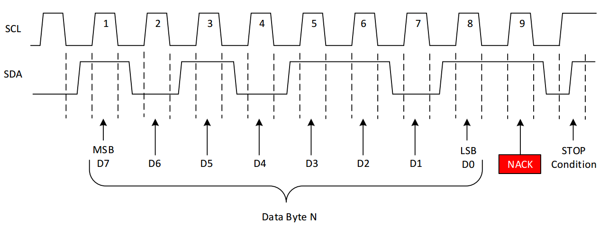
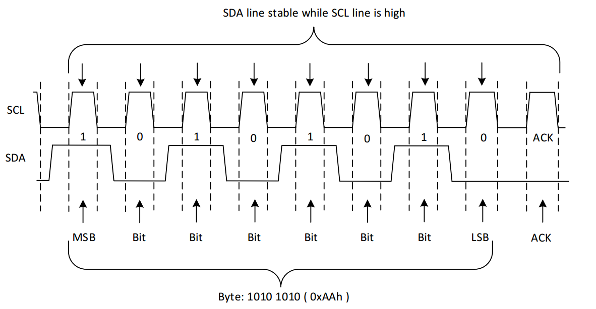
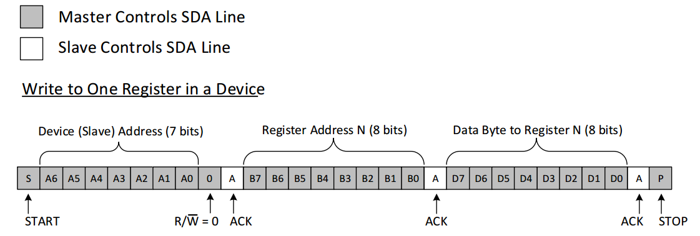
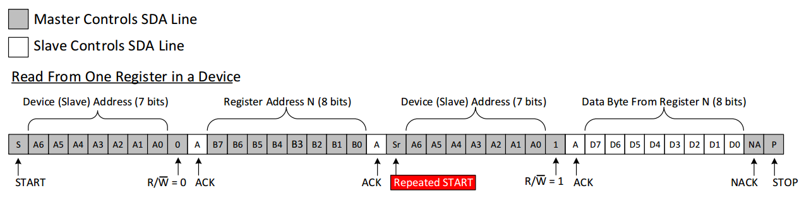

## IIC特性

| I2C  | SCL:同步时钟 SDA：数据输入输出 | 同步通信 | 半双工 |
| :--: | :--------------------------------: | :------: | :----: |

同步通信：带时钟同步信号

半双工：允许数据在两个方向上传输，但是，在某一时刻，只允许数据在一个方向上传输。它实际上是一种切换方向的单工通信。

总线要上拉

##  IIC通信过程

###  空闲状态

此时总线空闲，由总线上的上拉电阻将总线电平拉高。

###  起始信号和停止信号

- 起始信号：SCL为高时，SDA由==高==跳变到==低==

- 停止信号：SCL为高时，SDA由==低==跳变到==高==

- 即：

  SCL为高时，不允许出现SDA的变化，否则起始或停止
  SCL为低时，允许SDA的变化，用于改变电平的高低以传输数据

###  应答信号

- 接收数据的设备在接收到 8bit 数据后，向发送数据的设备发出特定的==低电平脉冲==，表示已经收到数据
- 低电平表示应答，高电平表示不应答
- **接收器在第9个时钟脉冲之前的低电平期间将SDA线拉低，并且确保在该时钟的高电平期间为稳定的低电平。**

以下四种情况IIC通信过程中会产生非应答位：

- 接收器(从机)正在处理某些实时的操作无法与主机实现IIC通信的时候，接收器(从机)会给主机反馈一个非应答位(NACK)

- 主机发送数据的过程中，从机无法解析发送的数据，接收器(从机)也会给主机反馈一个非应答位(NACK)

- 主机发送数据的过程中，从机无法再继续接收数据，接收器(从机)也会给主机反馈一个非应答位(NACK)

- 主机从从机中读取数据的过程中，主机不想再接收数据，主机会给从机反馈一个非应答位(NACK)，注意，这种情况是主机给从机反馈一个非应答位(NACK)

### 写数据

- **主机**发送一个起始信号、==从机==的的设备地址给==从机==
- **主机**发送数据给==从机==
- **主机**发送一个停止信号给==从机==

### 读数据

- **主机**发送一个起始信号、==从机==的的设备地址给==从机==
- **主机**发送一个要读取的地址给==从机==
- **主机**从==从机==接收数据
- **主机**发送一个停止信号给==从机==，结束接收

### 数据的有效传输

要进行有效的数据传输，在SCL为高电平时，SDA的电平就要保持稳定；只有在SCL为低电平时，SDA才能改变电平状态。

## 写数据

- 发送起始信号
- ==7位设备地址==+0组成8位的数据发送给从机
  - 0表示主机向从机写数据
  - 1表示主机从从机中读数据
- 发送完成后，释放SDA等待应答
- 若有效应答，主机发送要写入的寄存器的地址，完成后等待应答
- 若有效应答，发送数据，收到后从机依然会发送应答
- 若有效应答，主机发送停止信号

## 读数据

- 发送起始信号
- ==7位设备地址==+1组成8位的数据发送给从机
  - 0表示主机向从机写数据
  - 1表示主机从从机中读数据
- 发送完成后，释放SDA等待应答
- 若有效应答，从机占用SDA信号线给主机发送寄存器中的数据
- 发送完毕以后，主机再次占用SDA信号线发送一个非应答信号1给从机
- 最后发送一个停止信号

## I2C 通讯复合格式——以读操作为例

- 发送起始信号
- ==7位设备地址==+0组成8位的数据发送给从机
  - 0表示主机向从机写数据
  - 1表示主机从从机中读数据
- 发送完成后，释放SDA等待应答
- 若有效应答，主机发送要读取的寄存器的地址，完成后等待应答

- 若有效应答，再次发送一次起始信号，==7位设备地址==+1组成8位的数据发送给从机
- 发送完成后，释放SDA等待应答
- 若有效应答，从机占用SDA信号线给主机发送寄存器中的数据
- 发送完毕以后，主机再次占用SDA信号线发送一个非应答信号1给从机
- 最后发送一个停止信号

