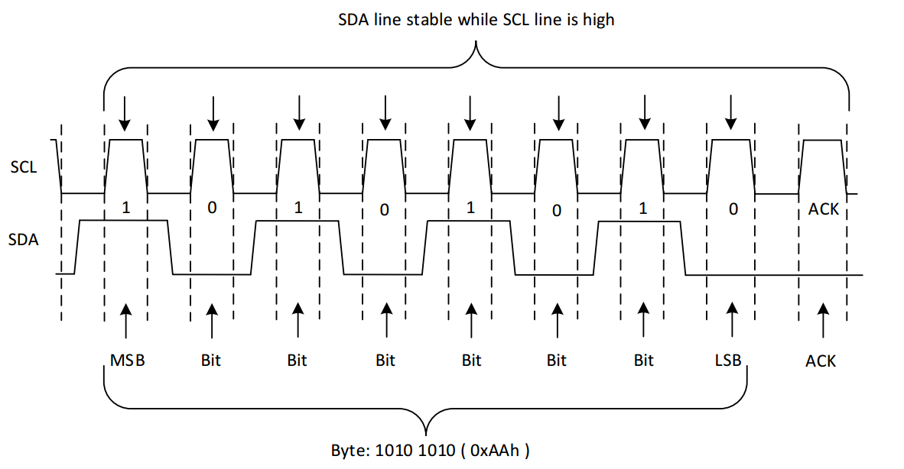
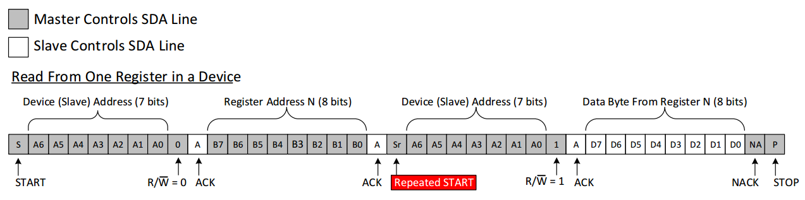
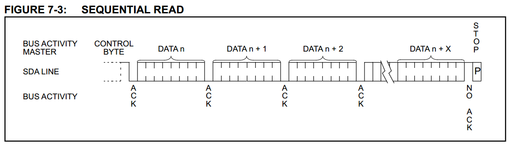

https://www.cnblogs.com/liujinggang/p/9656358.html

【接口时序】6、IIC总线的原理与Verilog实现
================================================================================

一、 软件平台与硬件平台

　　软件平台：

　　　　1、操作系统：Windows-8.1

　　　　2、开发套件：ISE14.7

　　　　3、仿真工具：ModelSim-10.4-SE 、ChipScope

　　硬件平台：

　　　　1、 FPGA型号：Xilinx公司的XC6SLX45-2CSG324

　　　　2、 EEPROM型号：Microchip公司的AT24LC04B

二、 原理介绍

　　IIC(Inter-Integrated Circuit)总线是一种由PHILIPS公司开发的两线式串行总线，用于连接微控制器及其外围设备。I2C总线产生于在80年代，最初为音频和视频设备开发，如今主要在服务器管理中使用，其中包括单个组件状态的通信。例如管理员可对各个组件进行查询，以管理系统的配置或掌握组件的功能状态，如电源和系统风扇。可随时监控内存、硬盘、网络、系统温度等多个参数，增加了系统的安全性，方便了管理。IIC数据传输速率有标准模式（100 kbps）、快速模式（400 kbps）和高速模式（3.4 Mbps），另外一些变种实现了低速模式（10 kbps）和快速+模式（1 Mbps）。

　　下图是一个嵌入式系统中处理器仅通过2根线的IIC总线控制多个IIC外设的典型应用图


　　图中处理器是IIC主机，它仅仅通过两根信号就可以控制IO扩展器，各种不同的传感器，EEPROM，AD/DAs等设备，这也是IIC总线协议相较于其他协议最有优势的地方。

　　IIC总线的特点：

　　　　1、 简单性和有效性。由于接口直接在组件之上，因此I2C总线占用的空间非常小，减少了电路板的空间和芯片管脚的数量，降低了互联成本。总线的长度可高达25英尺，并且能够以10Kbps的最大传输速率支持40个组件。

　　　　2、 支持多主控(multimastering)， 其中任何能够进行发送和接收的设备都可以成为主总线。一个主控能够控制信号的传输和时钟频率。当然，在任何时间点上只能有一个主控占用IIC总线。

　　IIC总线协议详解：

　　　　IIC总线接口是一个标准的双向传输接口，一次数据传输需要主机和从机按照IIC协议的标准进行。I2C总线是由数据线SDA和时钟SCL构成的串行总线，可发送和接收数据，并且在硬件上都需要接一个上拉电阻到VCC。各种被控制电路均并联在这条总线上，但就像电话机一样只有拨通各自的号码才能工作，所以每个电路和模块都有唯一的地址，这样，各控制电路虽然挂在同一条总线上，却彼此独立，互不相关。

　　IIC主机往从机里面写入数据的步骤如下：

　　　　1、 主机发送一个起始信号和从机的设备地址给从机

　　　　2、 主机发送数据给从机

　　　　3、 主机发送一个停止信号结束发送过程

　　IIC主机从从机里面读出数据的步骤如下：

　　　　1、 主机发送一个起始信号和从机的设备地址给从机

　　　　2、 主机发送一个要读取的地址给从机

　　　　3、 主机从从机接收数据

　　　　4、 主机发送一个停止信号给从机结束整个接收过程

　　总的来说，IIC总线在通信的过程中一共有一下几种状态：

　　1、空闲状态

　　IIC 总线的 SDA 和 SCL 两条信号线同时处于高电平时，规定为总线的空闲状态。此时各个器件的输出级场效应管均处在截止状态，即释放总线，由两条信号线各自的上拉电阻把电平拉高。

　　2、起始状态和结束状态

　　在时钟线 SCL 保持高电平期间，数据线 SDA 上的电平被拉低(即负跳变)，定义为 I2C 总线总线的起始信号，它标志着一次数据传输的开始。起始信号是由主控器主动建立的，在建立该信号之前 I2C 总线必须处于空闲状态。

　　在时钟线 SCL 保持高电平期间，数据线 SDA 被释放，使得 SDA 返回高电平(即正跳变)，称为 I2C 总线的停止信号，它标志着一次数据传输的终止。停止信号也是由主控器主动建立的，建立该信号之后，I2C 总线将返回空闲状态。

　　起始信号和结束信号如下图所示


　　3、有效的数据位传输

　　在 IIC 总线上传送的每一位数据都有一个时钟脉冲相对应(或同步控制)，即在 SCL 串行时钟的配合下，数据在 SDA 上从高位向低位依次串行传送每一位的数据。进行数据传送时，在 SCL 呈现高电平期间，SDA 上的电平必须保持稳定，低电平为数据 0，高电平为数据 1。只有在 SCL 为低电平期间，才允许 SDA 上的电平改变状态。下图是0xaa在IIC总线上有效传输(有效传输是指第9个时钟的高电平期间，从机给主机反馈了一个有效的应答位0)的图示



　　4、应答信号与非应答信号

　　　　I2C 总线上的所有数据都是以 8 位字节传送的，发送器(主机)每发送一个字节，就在第9个时钟脉冲期间释放数据线，由接收器(从机)反馈一个应答信号。应答信号为低电平时，规定为有效应答位(ACK简称应答位)，表示接收器已经成功地接收了该字节；应答信号为高电平时，规定为非应答位(NACK)，一般表示接收器接收该字节没有成功。对于反馈有效应答位 ACK 的要求是，接收器在第 9 个时钟脉冲之前的低电平期间将 SDA 线拉低，并且确保在该时钟的高电平期间为稳定的低电平。

　　　　对非应答位(NACK)还要特别说明的是，还有以下四种情况IIC通信过程中会产生非应答位：

　　　　　　1、接收器(从机)正在处理某些实时的操作无法与主机实现IIC通信的时候，接收器(从机)会给主机反馈一个非应答位(NACK)

　　　　　　2、主机发送数据的过程中，从机无法解析发送的数据，接收器(从机)也会给主机反馈一个非应答位(NACK)

　　　　　　3、主机发送数据的过程中，从机无法再继续接收数据，接收器(从机)也会给主机反馈一个非应答位(NACK)

　　　　　　4、主机从从机中读取数据的过程中，主机不想再接收数据，主机会给从机反馈一个非应答位(NACK)，注意，这种情况是主机给从机反馈一个非应答位(NACK)

　　关于有效应答位的图示在上一传输0xaa的图中可以清楚的看到，关于非应答位的图示见下图


　　了解清楚IIC总线在通信的过程中的几种状态以后接下来就具体看看IIC总线的读写过程吧。

　　1、主机通过IIC总线往从机里面写数据

　　　　主机通过IIC总线往从机中写数据的时候，主机首先会发送一个起始信号，接着把IIC从机的7位设备地址后面添一个0(设备地址后面的0表示主机向从机写数据，1表示主机从从机中读数据)组成一个8位的数据，把这个8位的数据发给从机，发完这8位的数据以后主机马上释放SDA信号线等待从机的应答，如果从机正确收到这个数据，从机就会发送一个有效应答位0给主机告诉主机自己已经收到了数据，主机收到从机的有效应答位以后 ，接下来主机会发送想要写入的寄存器地址，寄存器发送完毕以后主机同样会释放SDA信号线等待从机的应答，从机如果正确收到了主机发过来的寄存器地址，从机会再次发送一个有效应答位给主机，主机收到从机的有效应答位0以后，接下来主机就会给从机发送想要写入从机的数据，从机正确收到这个数据以后仍然像之前两次一样会给主机发送一个有效应答位，主机收到这个有效应答位以后给从机发送一个停止信号，整个传输过程就结束了。下图是整个传输过程的示意图：


　　特别注意：上图中灰色的地方表示主机正在控制SDA信号线，白色的地方表示从机正在控制SDA信号线。

　　2、主机通过IIC总线从从机里面读数据

　　　　主机通过IIC总线从从机中读数据的过程与写数据的过程有相似之处，但是读数据的过程还多了一些额外的步骤。主机从从机读数据时主机首先会发送一个起始信号，接着把IIC从机的7位设备地址后面添一个0(设备地址后面的0表示主机向从机写数据，1表示主机从从机中读数据)，把这个8位的数据发给从机，发完这8位的数据以后主机马上释放SDA信号线等待从机的应答，如果从机正确收到这个数据，从机就会发送一个有效应答位0给主机告诉主机自己已经收到了数据，主机收到从机的有效应答位以后 ，接下来主机会发送想要读的寄存器地址，寄存器发送完毕以后主机同样会释放SDA信号线等待从机的应答，从机如果正确收到了主机发过来的寄存器地址，从机会再次发送一个有效应答位给主机，主机收到从机的有效应答位0以后，主机会给从机再次发送一次起始信号，接着把IIC从机的7位设备地址后面添一个1(设备地址后面的0表示主机向从机写数据，1表示主机从从机中读数据)，注意，第一次是在设备地址后面添0，这一次是在设备地址后面添1，把这个8位的数据发给从机，发完这8位的数据以后主机马上释放SDA信号线等待从机的应答，如果从机正确收到这个数据，从机就会发送一个有效应答位0给主机告诉主机自己已经收到了数据，接着从机继续占用SDA信号线给主机发送寄存器中的数据，发送完毕以后，主机再次占用SDA信号线发送一个非应答信号1给从机，主机发送一个停止信号给从机结束整个读数据的过程。下图是整个读数据过程的示意图



　　特别注意：上图中灰色的地方表示主机正在控制SDA信号线，白色的地方表示从机正在控制SDA信号线。

三、 目标任务

　　1、编写IIC总线主机给从机发送数据的代码，实现FPGA(主机)往EEPROM(从机)的0x23这个地址写入0x45这个数据

　　2、编写IIC总线主机从从机接收数据的代码，实现FPGA(主机)从EEPROM(从机)的0x23这个地址读出0x45这个数据，并用0x45这个数据的低四位驱动4个LED

四、 设计思路与Verilog代码编写

4.1、 IIC发送模块的接口定义与整体设计

　　Verilog编写的IIC发送模块除了进行IIC通信的两根信号线(SCL和SDA)以外还要包括一些时钟、复位、使能、并行的输入输出以及完成标志位。其框图如下所示


　　其中：

　　I\_clk是系统时钟；

　　I\_rst\_n是系统复位；

　　I\_iic\_send\_en发送使能信号，当I\_iic\_send\_en为1时IIC主机(FPGA)才能给IIC从机发送数据；

　　I\_dev\_addr\[6:0\]是IIC从机的设备地址；

　　I\_word\_addr\[7:0\]是字地址，也就是我们想要操作的IIC设备的内部存储地址；

　　I\_write\_data\[7:0\]是主机(FPGA)要往IIC字地址中写入的数据；

　　O\_done\_flag是主机(FPGA)发送一个字节完成标志位，发送完成后会产生一个高脉冲；

　　O\_scl是IIC总线的串行时钟线；

　　IO\_sda是IIC总线的串行数据线；

　　要想实现iic\_send模块的功能，还是先得抽象出发送一个字节数据时序的状态机，这里把24LC04B发送过程的时序贴一遍


　　注意，上图中的控制字节(CONTROL BYTE)实际上就是代码里面定义的7-bit设备物理地址与最后1-bit的读写控制位拼接组成的。

　　通过观察上面的时序图可以看出，发送一个字节的数据之前必须要先发送起始位，然后发送控制字节，接着等待应答，然后在发送字地址，接着在等待应答。数据发送完毕以后，在等待最后一个应答，应答成功后发送停止信号结束整个过程。所以，根据这个流程，可以归纳出如下几个状态：

　　状态0：空闲状态，用来初始化各个寄存器的值

　　状态1：加载IIC设备的物理地址

　　状态2：加载IIC设备的字地址

　　状态3：加载要发送的数据

　　状态4：发送起始信号

　　状态5：发送一个字节，从高位开始发送

　　状态6：接收应答状态的应答位

　　状态7：校验应答位

　　状态8：发送停止信号

　　状态9：IIC写操作结束

　　需要注意的是上面的各个状态并不是按照顺序执行的，有些状态要复用多次，比如状态5发送字节的状态就需要复用三次用来发送三个8-bit的数据；同样，状态6和状态7也要复用多次。

　　抽象出状态机以后，写代码之前先分析一下代码中要注意的一些关键点：

　　1、由于IIC时序要求数据线SDA在串行时钟线的高电平保持不变，在串行时钟线的低电平才能变化，所以代码里面必须在串行时钟线低电平的正中间产生一个标志位，写代码的时候在这个标志位处改变SDA的值，这样就可以保证SDA在SCL的高电平期间保持稳定了。同理，由于IIC从机(24LC04)在接收到主机(FPGA)发送的有效数据以后会在SCL高电平期间产生一个有效应答信号0，所以为了保证采到的应答信号准确，必须在SCL高电平期间的正中间判断应答信号是否满足条件(0为有效应答，1为无效应答)，因此代码里面还必须在串行时钟线高电平的正中间产生一个标志位，在这个标志下接收应答位并进行校验。

　　这部分的代码通过一个计数器就很容易实现，代码如下：

[](# "复制代码")
```
parameter   C\_DIV\_SELECT        =   10'd500 ; // 分频系数选择

parameter   C\_DIV\_SELECT0       =   (C\_DIV\_SELECT >> 2)  -  1           , // 用来产生IIC总线SCL低电平最中间的标志位
            C\_DIV\_SELECT1       =   (C\_DIV\_SELECT >> 1)  -  1           ,
            C\_DIV\_SELECT2       \=   (C\_DIV\_SELECT0 + C\_DIV\_SELECT1) + 1 , // 用来产生IIC总线SCL高电平最中间的标志位
            C\_DIV\_SELECT3       =   (C\_DIV\_SELECT >> 1)  +  1           ; // 用来产生IIC总线SCL下降沿标志位
always @(posedge I\_clk or negedge I\_rst\_n)
begin
    if(!I\_rst\_n)
        R\_scl\_cnt   <=  10'd0 ; 
    else if(R\_scl\_en)   
        begin
            if(R\_scl\_cnt == C\_DIV\_SELECT - 1'b1)
                R\_scl\_cnt <= 10'd0 ;
            else
                R\_scl\_cnt <= R\_scl\_cnt + 1'b1 ;     
        end
    else
        R\_scl\_cnt   <= 10'd0 ;
end

assign O\_scl          = (R\_scl\_cnt <= C\_DIV\_SELECT1) ? 1'b1 : 1'b0 ; // 产生串行时钟信号O\_scl
assign W\_scl\_low\_mid  = (R\_scl\_cnt == C\_DIV\_SELECT2) ? 1'b1 : 1'b0 ; // 产生scl低电平正中间标志位
assign W\_scl\_high\_mid = (R\_scl\_cnt == C\_DIV\_SELECT0) ? 1'b1 : 1'b0 ; // 产生scl高电平正中间标志位
```
[](# "复制代码")

　　2、有了SCL信号低电平正中间标志位和高电平正中间标志位以后最好还产生一个下降沿的标志位。原因是在发送第一个8-bit数据以后，处理这个8-bit数据应答位的位置在SCL信号高电平的正中间，由于要复用发送8-bit数据的那个状态，所以必须在第二次进入发送8-bit数据的状态时必须提前把数据再次加载好，因此可以在这个下降沿的标志来加载第二次要发送的数据，然后在SCL下降沿的正中间把8-bit数据发出去。这里必须结合代码来理解，这里可以暂时有个印象。

　　3、IIC总线的SDA数据线是一个双向IO口，关于双向IO在Verilog代码中如何进行处理，我在《QSPI Flash的原理与QSPI时序的实现》这篇博客已经做了说明，这里不再赘述，直接给出代码如下：

[](# "复制代码")
```
module Test\_inout
(
input   I\_clk,
input   I\_rst\_n,
    .
    .
    .
inout   IO\_data,
    .
    .
    . 
)

reg     R\_data\_out  ;
wire    I\_data\_in   ;
assign  IO\_data = Control ? R\_data\_out : 1'bz ;
assign  I\_data\_in   =   IO\_data ;

always @(posedge I\_clk or negedge I\_rst\_n)
begin
    .
    .
    .
    ;
end

endmodule
```
[](# "复制代码")

　　4、发送8-bit数据的整个过程如下：加载8-bit数据->发送8-bit数据->接收应答位->校验应答位\->加载第二个8-bit数据……....。所以为了复用中间标红的这几个状态，必须在加载8-bit数据这个状态提前设置好校验应答位状态执行完毕以后的后一个状态的位置，这在代码里面通过R\_jump\_state这个变量来完成。这一点也必须对照着代码来进行理解。

　　思路理清楚以后就可以直接编写Verilog代码了，iic\_send模块的代码如下：

[](# "复制代码")
```
module iic\_send
(
    input                I\_clk           , // 系统50MHz时钟
    input                I\_rst\_n         , // 系统全局复位
    input                 I\_iic\_send\_en   , // IIC发送使能位
    
    input        \[6:0\]   I\_dev\_addr      , // IIC设备的物理地址
    input        \[7:0\]   I\_word\_addr     , // IIC设备的字地址，即我们想操作的IIC的内部地址
    input        \[7:0\]   I\_write\_data    , // 往IIC设备的字地址写入的数据
    output  reg          O\_done\_flag     , // 读或写IIC设备结束标志位
    
    // 标准的IIC设备总线
    output               O\_scl           , // IIC总线的串行时钟线
    inout                IO\_sda            // IIC总线的双向数据线
);          

parameter   C\_DIV\_SELECT        =   10'd500 ; // 分频系数选择

parameter   C\_DIV\_SELECT0       =   (C\_DIV\_SELECT >> 2)  -  1           , // 用来产生IIC总线SCL低电平最中间的标志位
            C\_DIV\_SELECT1       =   (C\_DIV\_SELECT >> 1)  -  1           ,
            C\_DIV\_SELECT2       \=   (C\_DIV\_SELECT0 + C\_DIV\_SELECT1) + 1 , // 用来产生IIC总线SCL高电平最中间的标志位
            C\_DIV\_SELECT3       =   (C\_DIV\_SELECT >> 1)  +  1           ; // 用来产生IIC总线SCL下降沿标志位


reg     \[9:0\]   R\_scl\_cnt       ; // 用来产生IIC总线SCL时钟线的计数器   
reg             R\_scl\_en        ; // IIC总线SCL时钟线使能信号
reg     \[3:0\]   R\_state         ; 
reg             R\_sda\_mode      ; // 设置SDA模式，1位输出，0为输入
reg             R\_sda\_reg       ; // SDA寄存器
reg     \[7:0\]   R\_load\_data     ; // 发送/接收过程中加载的数据，比如设备物理地址，字地址和数据等
reg     \[3:0\]   R\_bit\_cnt       ; // 发送字节状态中bit个数计数
reg             R\_ack\_flag      ; // 应答标志
reg     \[3:0\]   R\_jump\_state    ; // 跳转状态，传输一个字节成功并应答以后通过这个变量跳转到导入下一个数据的状态

wire            W\_scl\_low\_mid   ; // SCL的低电平中间标志位
wire            W\_scl\_high\_mid  ; // SCL的高电平中间标志位
wire            W\_scl\_neg        ; // SCL的下降沿标志位

assign IO\_sda  =  (R\_sda\_mode == 1'b1) ? R\_sda\_reg : 1'bz ;

always @(posedge I\_clk or negedge I\_rst\_n)
begin
    if(!I\_rst\_n)
        R\_scl\_cnt   <=  10'd0 ; 
    else if(R\_scl\_en)   
        begin
            if(R\_scl\_cnt == C\_DIV\_SELECT - 1'b1)
                R\_scl\_cnt <= 10'd0 ;
            else
                R\_scl\_cnt <= R\_scl\_cnt + 1'b1 ;     
        end
    else
        R\_scl\_cnt     <= 10'd0 ;
end

assign O\_scl           = (R\_scl\_cnt <= C\_DIV\_SELECT1) ? 1'b1 : 1'b0 ; // 产生串行时钟信号O\_scl
assign W\_scl\_low\_mid  = (R\_scl\_cnt == C\_DIV\_SELECT2) ? 1'b1 : 1'b0 ; // 产生scl低电平正中间标志位
assign W\_scl\_high\_mid = (R\_scl\_cnt == C\_DIV\_SELECT0) ? 1'b1 : 1'b0 ; // 产生scl高电平正中间标志位
assign W\_scl\_neg       = (R\_scl\_cnt == C\_DIV\_SELECT3) ? 1'b1 : 1'b0 ; // 产生scl下降沿标志位

always @(posedge I\_clk or negedge I\_rst\_n)
begin
    if(!I\_rst\_n)
        begin
            R\_state         <=  4'd0 ;
            R\_sda\_mode      <=  1'b1 ;
            R\_sda\_reg       <=  1'b1 ;
            R\_bit\_cnt       <=  4'd0 ;
            O\_done\_flag     <=  1'b0 ;
            R\_jump\_state    <=  4'd0 ;
            R\_ack\_flag        <=    1'b0 ;
        end
    else if(I\_iic\_send\_en) // 往IIC设备发送数据
        begin
            case(R\_state)
                4'd0   : // 空闲状态设置SCL与SDA均为高
                    begin
                        R\_sda\_mode      <=  1'b1 ; // 设置SDA为输出
                        R\_sda\_reg       <=  1'b1 ; // 设置SDA为高电平
                        R\_scl\_en        <=  1'b0 ; // 关闭SCL时钟线
                        R\_state         <=  4'd1 ; // 下一个状态是加载设备物理地址状态
                        R\_bit\_cnt       <=  4'd0 ; // 发送字节状态中bit个数计数清零
                        O\_done\_flag     <=  1'b0 ;
                        R\_jump\_state    <=  4'd0 ;
                    end                               
                4'd1   :  // 加载IIC设备物理地址              
                    begin                             
                        R\_load\_data     <=  {I\_dev\_addr, 1'b0}  ;
                        R\_state         <=  4'd4                ;
                        R\_jump\_state    <=  4'd2                ;
                    end                                     
                4'd2   :   // 加载IIC设备字地址                     
                    begin                                   
                        R\_load\_data     <=  I\_word\_addr         ; 
                        R\_state         <=  4'd5                ;
                        R\_jump\_state    <=  4'd3                ;
                    end                                     
                4'd3   :    // 加载要发送的数据                    
                    begin                                   
                        R\_load\_data     <=  I\_write\_data        ; 
                        R\_state         <=  4'd5                ;
                        R\_jump\_state    <=  4'd8                ;
                    end                                                         
                4'd4   :    // 发送起始信号                   
                    begin                                   
                        R\_scl\_en    <=  1'b1                ; // 打开SCL时钟线
                        R\_sda\_mode  <=  1'b1                ; // 设置SDA为输出
                        if(W\_scl\_high\_mid)                  
                            begin                           
                                R\_sda\_reg   <=  1'b0        ; // 在SCL高电平中间把SDA信号拉低,产生起始信号
                                R\_state     <=  4'd5        ; 
                            end
                        else
                            R\_state <=  4'd4                ; // 如果SCL高电平中间标志没出现就一直在这个状态等着                          
                    end
                4'd5   :    // 发送1个字节，从高位开始发
                    begin
                        R\_scl\_en    <=  1'b1                ; // 打开SCL时钟线
                        R\_sda\_mode  <=  1'b1                ; // 设置SDA为输出
                        if(W\_scl\_low\_mid)
                            begin
                                if(R\_bit\_cnt == 4'd8)
                                    begin
                                        R\_bit\_cnt   <=  4'd0            ;
                                        R\_state     <=  4'd6            ; // 字节发完以后进入应答状态
                                    end
                                else
                                    begin                                 
                                        R\_sda\_reg   <=  R\_load\_data\[7\-R\_bit\_cnt\] ; // 先发送高位
                                        R\_bit\_cnt   <=  R\_bit\_cnt + 1'b1         ; 
                                    end
                            end
                        else
                            R\_state <=  4'd5 ; // 字节没发完时在这个状态一直等待 
                    end 
                4'd6   :    // 接收应答状态的应答位
                    begin
                        R\_scl\_en    <=  1'b1  ; // 打开SCL时钟线
                        R\_sda\_mode  <=  1'b0  ; // 设置SDA为输入
                        if(W\_scl\_high\_mid)
                            begin
                                R\_ack\_flag  <=  IO\_sda  ; 
                                R\_state     <=  4'd7    ; 
                            end                            
                        else
                            R\_state <=  4'd6  ;     
                    end
                4'd7  :    // 校验应答位
                    begin
                        R\_scl\_en    <=  1'b1  ; // 打开SCL时钟线                        
                        if(R\_ack\_flag == 1'b0)    // 校验通过
                            begin
                                if(W\_scl\_neg == 1'b1) 
                                    begin
                                        R\_state <=  R\_jump\_state ;
                                        R\_sda\_mode  <=  1'b1 ; // 设置SDA的模式为输出
                                        R\_sda\_reg   <=  1'b0 ; // 读取完应答信号以后要把SDA信号设置成输出并拉低，因为如果这个状
                                                               // 态后面是停止状态的话，需要SDA信号的上升沿，所以这里提前拉低它
                                    end
                                else
                                    R\_state <= 4'd7    ;
                            end
                        else
                            R\_state <=  4'd0 ;      
                    end
                4'd8   : // 发送停止信号
                    begin
                        R\_scl\_en    <=  1'b1        ; // 打开SCL时钟线
                        R\_sda\_mode  <=  1'b1        ; // 设置SDA为输出
                        if(W\_scl\_high\_mid)
                            begin
                                R\_sda\_reg   <=  1'b1 ;
                                R\_state     <=  4'd9 ;
                            end
                    end
                4'd9    :   // IIC写操作结束
                    begin
                        R\_scl\_en    <=  1'b0 ; // 关闭SCL时钟线
                        R\_sda\_mode  <=  1'b1 ; // 设置SDA为输出
                        R\_sda\_reg   <=  1'b1 ; // 拉高SDA保持空闲状态情况
                        O\_done\_flag <=  1'b1 ;
                        R\_state     <=  4'd0 ; 
                        R\_ack\_flag  <=  1'b0 ;
                    end  
                default    : R\_state     <=  4'd0 ; 
            endcase
        end 
    else
        begin
            R\_state         <=  4'd0 ;
            R\_sda\_mode      <=  1'b1 ;
            R\_sda\_reg       <=  1'b1 ;
            R\_bit\_cnt       <=  4'd0 ;
            O\_done\_flag     <=  1'b0 ;
            R\_jump\_state    <=  4'd0 ;
            R\_ack\_flag      <=  1'b0 ;
        end
end

wire    \[35:0\]    CONTROL0 ;
wire    \[54:0\]    TRIG0 ;
icon icon\_inst (
    .CONTROL0(CONTROL0) // INOUT BUS \[35:0\]
);

ila ila\_inst (
    .CONTROL(CONTROL0), // INOUT BUS \[35:0\]
    .CLK(I\_clk), // IN
    .TRIG0(TRIG0) // IN BUS \[49:0\]
);

assign TRIG0\[0\] = O\_scl ;
assign TRIG0\[1\] = IO\_sda ;
assign TRIG0\[11:2\] = R\_scl\_cnt ;
assign TRIG0\[12\] = R\_scl\_en ;
assign TRIG0\[16:13\] = R\_state ;
assign TRIG0\[17\] = R\_sda\_mode ;
assign TRIG0\[18\] = R\_sda\_reg ;
assign TRIG0\[26:19\] = R\_load\_data ;

assign TRIG0\[30:27\] = R\_bit\_cnt ;
assign TRIG0\[31\] = R\_ack\_flag ;
assign TRIG0\[36:32\] = R\_jump\_state ;
assign TRIG0\[37\] = W\_scl\_low\_mid ;
assign TRIG0\[38\] = W\_scl\_high\_mid ;
assign TRIG0\[39\] = O\_done\_flag ;
assign TRIG0\[40\] = I\_rst\_n ;

endmodule
```
[](# "复制代码")

　　整个代码的流程与之前分析的流程完全一致。本来想写一个测试文件用ModelSim进行基本的仿真，但是由于应答信号是取决于IIC从设备的，所以还是决定用ChipScope直接抓。在用ChipScope抓之前先写一个顶层文件把上面的代码例化进去，顶层代码如下：

[](# "复制代码")
```
module iic\_send\_top
(
    input           I\_clk           , // 系统50MHz时钟
    input           I\_rst\_n         , // 系统全局复位
    
    // 标准的IIC设备总线
    output          O\_scl           , // IIC总线的串行时钟线
    inout           IO\_sda            // IIC总线的双向数据线
);

wire             W\_done\_flag ;

iic\_send U\_iic\_send
(
    .I\_clk           (I\_clk            ), // 系统50MHz时钟
    .I\_rst\_n         (I\_rst\_n          ), // 系统全局复位
    .I\_iic\_send\_en   (1'b1             ), // 发送使能位，高电平有效
    
    .I\_dev\_addr      (7'b1010\_000      ), // IIC设备的物理地址
    .I\_word\_addr     (8'h23            ), // IIC设备的字地址，即我们想操作的IIC的内部地址
    .I\_write\_data    (8'h45            ), // 往IIC设备的字地址写入的数据 
    .O\_done\_flag     (W\_done\_flag      ), // 读或写IIC设备结束标志位
    
    // 标准的IIC设备总线
    .O\_scl           (O\_scl            ), // IIC总线的串行时钟线
    .IO\_sda          (IO\_sda           )  // IIC总线的双向数据线
);

endmodule
```
[](# "复制代码")

　　绑定好管脚以后就可以生成bit文件下载到FPGA里面用ChipScope抓时序了，下面是我抓到的时序图：


　　为了更清晰的说明上面的时序，我把起始信号，停止信号，每个比特以及应答位全部框出来进一步解释如下：


　　通过上面的时序图可以清楚的看到：

　　　　1号红框是起始信号，在SCL高电平期间SDA有一个下降沿

　　　　2~9号红框是发送设备物理地址8’ha0(8’b1010\_0000)

　　　　10号红框是应答位，在这个期间R\_sda\_mode保持低电平，SDA为输入

　　　　11~18号红框是发送字地址8’h23(8’b0010\_0011)

　　　　19号红框是应答位，在这个期间R\_sda\_mode保持低电平，SDA为输入

　　　　20~27号红框是发送数据8’h45(8’b0100\_0101)

　　　　28号红框是应答位，在这个期间R\_sda\_mode保持低电平，SDA为输入

　　　　29号红框是停止信号，在SCL高电平期间SDA有一个上升沿

　　其他变量的时序细节这里不再展开，大家可以自己抓出来。至此，IIC发送模块全部设计完毕。

4.2、 IIC接收模块的接口定义与整体设计

　　Verilog编写的IIC接收模块除了进行IIC通信的两根信号线(SCL和SDA)以外还要包括一些时钟、复位、使能、并行的输入输出以及完成标志位。其框图如下所示


　　其中：

　　I\_clk是系统时钟；

　　I\_rst\_n是系统复位；

　　I\_iic\_recv\_en接收使能信号，当I\_iic\_recv\_en为1时IIC主机(FPGA)才能从IIC从机接收数据；

　　I\_dev\_addr\[6:0\]是IIC从机的设备地址；

　　I\_word\_addr\[7:0\]是字地址，也就是我们想要读取的IIC设备的内部存储地址；

　　O\_read\_data\[7:0\]是主机(FPGA)从IIC设备字地址中读取的数据；

　　O\_done\_flag是主机(FPGA)接收一个字节完成标志位，接收完成后会产生一个高脉冲；

　　O\_scl是IIC总线的串行时钟线；

　　IO\_sda是IIC总线的串行数据线；

　　要想实现iic\_send模块的功能，还是先得抽象出发送一个字节数据时序的状态机，这里把24LC04B接收过程的时序贴一遍


　　注意，上图中的控制字节(CONTROL BYTE)实际上就是代码里面定义的7-bit设备物理地址与最后1-bit读写控制位组成的。

　　通过观察上面的时序图可以看出，接收一个字节的数据的过程与发送一个字节数据相比多了一个第二次的起始信号与控制字节(CONTROL BYTE)，而且第二个控制字节(CONTROL BYTE)的最低位应该为1，表示IIC主机(FPGA)从IIC从机(24LC04)中读数据，当主机(FPGA)想结束读数据的过程时，它会给IIC设备发送一个非应答位1，最后在发送停止信号结束整个读数据的过程。所以，根据这个流程，可以归纳出如下几个状态：

　　状态0：空闲状态，用来初始化各个寄存器的值

　　状态1：加载IIC设备的物理地址

　　状态2：加载IIC设备的字地址

　　状态3：发送第一个起始信号(读过程要求发送两次起始信号)

　　状态4：发送一个字节数据，从高位开始发送

　　状态5：接收应答状态的应答位

　　状态6：校验应答位

　　状态7：发送第二个起始信号(读过程要求发送两次起始信号

　　状态8：再次加载IIC设备的物理地址，但这次物理地址最后一位应该为1，表示读操作

　　状态9：接收一个字节数据，从高位开始接收

　　状态10：主机发送一个非应答信号1给从机

　　状态11：等确定从机收到这个非应答信号1以后，初始化SDA的值为0，准备产生停止信号

　　状态12：发送停止信号

　　状态13：读操作结束

　　需要注意的是上面的各个状态和发送模块一样，并不是按照顺序执行的，有些状态也要复用多次。

　　接收模块有以下几个关键点要注意：

　　1、和发送模块一样，需要产生SCL信号高电平中间标志位，低电平中间标志位以及下降沿标志位

　　2、由于读数据的过程需要发送第二次起始位，而起始位的条件是在SCL高电平期间SDA有一个下降沿，所以一定要在处理完写设备地址与写字地址的应答位之后，在SCL的下降沿标志处把SDA信号设置成输出并拉高方便产生第二次起始信号。具体细节对照着代码理解。

　　3、第一次发送的设备物理地址的最低位是0，表示写数据；第二次发送的设备物理地址的最低位是1，表示读数据

　　4、读完一个字节数据以后，一定要记住是主机(FPGA)给从机(24LC04)发送一个非应答信号1

　　有了上面这些储备以后就可以编写接收模块的代码了，接收模块的代码如下：

[](# "复制代码")
```
module iic\_recv
(
    input                I\_clk           , // 系统50MHz时钟
    input                I\_rst\_n         , // 系统全局复位
    input                I\_iic\_recv\_en   , // IIC发送使能位
    
    input        \[6:0\]   I\_dev\_addr      , // IIC设备的物理地址
    input        \[7:0\]   I\_word\_addr     , // IIC设备的字地址，即我们想操作的IIC的内部地址
    output  reg  \[7:0\]   O\_read\_data     , // 从IIC设备的字地址读出来的数据   
    output  reg          O\_done\_flag     , // 读或写IIC设备结束标志位
    
    // 标准的IIC设备总线
    output               O\_scl           , // IIC总线的串行时钟线
    inout                IO\_sda            // IIC总线的双向数据线
);          

parameter   C\_DIV\_SELECT        =   10'd500 ; // 分频系数选择

parameter   C\_DIV\_SELECT0       =   (C\_DIV\_SELECT >> 2)  -  1           , // 用来产生IIC总线SCL低电平最中间的标志位
            C\_DIV\_SELECT1       =   (C\_DIV\_SELECT >> 1)  -  1           , // 用来产生IIC串行时钟线
            C\_DIV\_SELECT2       =   (C\_DIV\_SELECT0 + C\_DIV\_SELECT1) + 1 , // 用来产生IIC总线SCL高电平最中间的标志位
            C\_DIV\_SELECT3       =   (C\_DIV\_SELECT >> 1) + 1             ; // 用来产生IIC总线SCL下降沿标志位


reg     \[9:0\]   R\_scl\_cnt       ; // 用来产生IIC总线SCL时钟线的计数器   
reg             R\_scl\_en        ; // IIC总线SCL时钟线使能信号
reg     \[3:0\]   R\_state         ; 
reg             R\_sda\_mode      ; // 设置SDA模式，1位输出，0为输入
reg             R\_sda\_reg       ; // SDA寄存器
reg     \[7:0\]   R\_load\_data     ; // 发送/接收过程中加载的数据，比如设备物理地址，字地址和数据等
reg     \[3:0\]   R\_bit\_cnt       ; // 发送字节状态中bit个数计数
reg             R\_ack\_flag      ; // 应答标志
reg     \[3:0\]   R\_jump\_state    ; // 跳转状态，传输一个字节成功并应答以后通过这个变量跳转到导入下一个数据的状态
reg     \[7:0\]   R\_read\_data\_reg ;

wire            W\_scl\_low\_mid   ; // SCL的低电平中间标志位
wire            W\_scl\_high\_mid  ; // SCL的高电平中间标志位

assign IO\_sda  =  (R\_sda\_mode == 1'b1) ? R\_sda\_reg : 1'bz ;

always @(posedge I\_clk or negedge I\_rst\_n)
begin
    if(!I\_rst\_n)
        R\_scl\_cnt   <=  10'd0 ; 
    else if(R\_scl\_en)   
        begin
            if(R\_scl\_cnt == C\_DIV\_SELECT - 1'b1)
                R\_scl\_cnt <= 10'd0 ;
            else
                R\_scl\_cnt <= R\_scl\_cnt + 1'b1 ;     
        end
    else
        R\_scl\_cnt     <= 10'd0 ;
end

assign O\_scl           = (R\_scl\_cnt <= C\_DIV\_SELECT1) ? 1'b1 : 1'b0 ; // 产生串行时钟信号O\_scl
assign W\_scl\_low\_mid  = (R\_scl\_cnt == C\_DIV\_SELECT2) ? 1'b1 : 1'b0 ; // 产生scl低电平正中间标志位
assign W\_scl\_high\_mid = (R\_scl\_cnt == C\_DIV\_SELECT0) ? 1'b1 : 1'b0 ; // 产生scl高电平正中间标志位
assign W\_scl\_neg       = (R\_scl\_cnt == C\_DIV\_SELECT3) ? 1'b1 : 1'b0 ; // 产生scl下降沿标志位

always @(posedge I\_clk or negedge I\_rst\_n)
begin
    if(!I\_rst\_n)
        begin
            R\_state         <=  4'd0 ;
            R\_sda\_mode      <=  1'b1 ;
            R\_sda\_reg       <=  1'b1 ;
            R\_bit\_cnt       <=  4'd0 ;
            O\_done\_flag     <=  1'b0 ;
            R\_jump\_state    <=  4'd0 ;
            R\_read\_data\_reg <=  8'd0 ;
            R\_ack\_flag        <=    1'b0 ;
            O\_read\_data        <=    8'd0 ;
        end
    else if(I\_iic\_recv\_en) // 往IIC设备发送数据
        begin
            case(R\_state)
                4'd0    :   // 空闲状态，用来初始化相关所有信号
                    begin
                        R\_sda\_mode      <=  1'b1 ; // 设置SDA为输出
                        R\_sda\_reg       <=  1'b1 ; // 设置SDA为高电平
                        R\_scl\_en        <=  1'b0 ; // 关闭SCL时钟线
                        R\_state         <=  4'd1 ; // 下一个状态是加载设备物理地址状态
                        R\_bit\_cnt       <=  4'd0 ;
                        O\_done\_flag     <=  1'b0 ;
                        R\_jump\_state    <=  5'd0 ;
                        R\_read\_data\_reg <=  8'd0 ;
                    end
                4'd1    :   // 加载IIC设备物理地址 
                    begin
                        R\_load\_data <=  {I\_dev\_addr, 1'b0}  ;
                        R\_state     <=  4'd3                ; // 加载完设备物理地址以后进入起始状态
                        R\_jump\_state <=  R\_state + 1'b1     ; 
                    end
                4'd2   :   // 加载IIC设备字地址                     
                    begin                                   
                        R\_load\_data <=  I\_word\_addr         ; 
                        R\_state     <=  4'd4                ;
                        R\_jump\_state <=  R\_state + 5'd5      ; // 设置这里是为了这一轮发送并应答后跳到第二次启始位
                    end 
                4'd3    :   // 发送第一个起始信号
                    begin
                        R\_scl\_en    <=  1'b1                ; // 打开时钟
                        R\_sda\_mode  <=  1'b1                ; // 设置SDA的模式为输出
                        if(W\_scl\_high\_mid)
                            begin
                                R\_sda\_reg   <=  1'b0        ; // 在SCL高电平的正中间把SDA引脚拉低产生一个下降沿
                                R\_state     <=  4'd4        ; // 下一个状态是发送一个字节数据(IIC设备的物理地址) 
                            end
                        else
                            R\_state <=  4'd3                ;    
                    end                      
                4'd4    :   // 发送一个字节
                    begin
                        R\_scl\_en    <=  1'b1                ; // 打开时钟
                        R\_sda\_mode  <=  1'b1                ; // 设置SDA的模式为输出
                        if(W\_scl\_low\_mid)                     // 在SCL低电平的最中间改变数据
                            begin
                                if(R\_bit\_cnt == 4'd8)
                                    begin
                                        R\_bit\_cnt  <=  4'd0 ;  
                                        R\_state    <=  4'd5 ;
                                    end 
                                else
                                    begin
                                        R\_sda\_reg  <=  R\_load\_data\[7\-R\_bit\_cnt\] ;
                                        R\_bit\_cnt  <=  R\_bit\_cnt + 1'b1        ; 
                                    end     
                            end
                        else
                            R\_state <=  4'd4    ;    
                    end
                4'd5    :   // 接收应答状态应答位
                    begin
                        R\_scl\_en    <=  1'b1 ; // 打开时钟
                        R\_sda\_reg   <=  1'b0 ;
                        R\_sda\_mode  <=  1'b0 ; // 设置SDA的模式为输入
                        if(W\_scl\_high\_mid)  
                            begin
                                R\_ack\_flag  <=  IO\_sda  ;
                                R\_state     <=  4'd6    ;                                   
                            end
                        else
                            R\_state <=  4'd5    ;    
                    end                      
                4'd6    :   // 校验应答位
                    begin
                        R\_scl\_en    <=  1'b1 ; // 打开时钟 
                        if(R\_ack\_flag   == 1'b0)    // 校验通过
                            begin
                                if(W\_scl\_neg == 1'b1)
                                    begin
                                        R\_state <=  R\_jump\_state ;
                                        R\_sda\_mode  <=  1'b1 ; // 设置SDA的模式为输出
                                        R\_sda\_reg   <=  1'b1 ; // 设置SDA的引脚电平拉高，方便后面产生第二次起始位
                                    end
                                else
                                    R\_state <= 4'd6    ;
                            end
                        else
                            R\_state <=  4'd0 ;    
                    end 
                4'd7    :   // 第二次起始位(IIC读操作要求有2次起始位) 
                    begin
                        R\_scl\_en    <=  1'b1 ; // 打开时钟
                        R\_sda\_mode  <=  1'b1 ; // 设置SDA的模式为输出 
                        if(W\_scl\_high\_mid)
                            begin
                                R\_sda\_reg   <=  1'b0  ;
                                R\_state     <=  4'd8  ; 
                            end
                        else
                            R\_state <=  4'd7 ;    
                    end 
                4'd8   :   // 再次加载IIC设备物理地址 ，但这次地址最后一位应该为1，表示读操作                    
                    begin                                   
                        R\_load\_data     <=  {I\_dev\_addr, 1'b1}  ; // 前7bit是设备物理地址，最后一位1表示读操作
                        R\_state         <=  4'd4      　　　　　　;
                        R\_jump\_state    <=  4'd9      　　　　　　; // 设置这里是为了这一轮发送并应答后跳到第二次启始位
                    end
                4'd9    :   // 读一个字节数据
                    begin
                        R\_scl\_en    <=  1'b1 ; // 打开时钟
                        R\_sda\_mode  <=  1'b0 ; // 设置SDA的模式为输入
                        if(W\_scl\_high\_mid)
                            begin
                                if(R\_bit\_cnt == 4'd7)
                                    begin
                                        R\_bit\_cnt    <=  4'd0    ;
                                        R\_state      <=  4'd10   ;  
                                        O\_read\_data  <=  {R\_read\_data\_reg\[6:0\],IO\_sda}  ;                                           
                                    end
                                else
                                    begin
                                        R\_read\_data\_reg  <=  {R\_read\_data\_reg\[6:0\],IO\_sda}  ;
                                        R\_bit\_cnt        <=  R\_bit\_cnt   +   1'b1            ;  
                                    end    
                            end 
                        else
                            R\_state <=  4'd9 ;    
                    end 
                4'd10    :  // 读完一个字节数据以后进入10，主机发送一个非应答信号1
                    begin
                        R\_scl\_en    <=  1'b1 ; // 打开时钟
                        R\_sda\_mode  <=  1'b1 ; // 设置SDA的模式为输入
                        if(W\_scl\_low\_mid)
                            begin
                                R\_state     <=  4'd11   ; 
                                R\_sda\_reg    <=    1'b1     ;
                            end 
                        else
                            R\_state <=  4'd10 ;    
                    end 
                4'd11   :  
                    begin
                        R\_scl\_en    <=  1'b1 ; // 打开时钟
                        R\_sda\_mode  <=  1'b1 ; // 设置SDA的模式为输入
                        if(W\_scl\_low\_mid)
                            begin
                                R\_state     <=  4'd12   ; 
                                R\_sda\_reg    <=    1'b0     ;
                            end
                        else
                            R\_state <=  4'd11   ;    
                    end 
                4'd12   : //停止位Stop
                    begin
                        R\_scl\_en    <=  1'b1 ; // 打开时钟
                        R\_sda\_mode  <=  1'b1 ; // 设置SDA的模式为输出
                        if(W\_scl\_high\_mid)
                            begin
                                R\_sda\_reg   <=  1'b1    ;
                                R\_state     <=  4'd13   ; 
                            end
                        else
                            R\_state <=  4'd12   ;    
                    end 
                4'd13   :
                    begin
                        R\_scl\_en        <=  1'b0 ; // 关闭SCL时钟线
                        R\_sda\_mode      <=  1'b1 ; // 设置SDA为输出
                        R\_sda\_reg       <=  1'b1 ; // 拉高SDA保持空闲状态情况
                        O\_done\_flag     <=  1'b1 ;
                        R\_state         <=  4'd0 ;
                        R\_read\_data\_reg <=  8'd0 ;
                    end 
                default: R\_state         <=  4'd0 ;
            endcase
        end 
    else
        begin
            R\_state         <=  4'd0 ;
            R\_sda\_mode      <=  1'b1 ;
            R\_sda\_reg       <=  1'b1 ;
            R\_bit\_cnt       <=  4'd0 ;
            O\_done\_flag     <=  1'b0 ;
            R\_jump\_state    <=  4'd0 ;
            R\_read\_data\_reg <=  8'd0 ;
            R\_ack\_flag         <=  1'b0 ;
        end
end

wire    \[35:0\]    CONTROL0 ;
wire    \[54:0\]    TRIG0 ;
icon icon\_inst (
    .CONTROL0(CONTROL0) // INOUT BUS \[35:0\]
);

ila ila\_inst (
    .CONTROL(CONTROL0), // INOUT BUS \[35:0\]
    .CLK(I\_clk), // IN
    .TRIG0(TRIG0) // IN BUS \[49:0\]
);

assign TRIG0\[0\] = O\_scl ;
assign TRIG0\[1\] = IO\_sda ;
assign TRIG0\[11:2\] = R\_scl\_cnt ;
assign TRIG0\[12\] = R\_scl\_en ;
assign TRIG0\[16:13\] = R\_state ;
assign TRIG0\[17\] = R\_sda\_mode ;
assign TRIG0\[18\] = R\_sda\_reg ;
assign TRIG0\[26:19\] = R\_load\_data ;

assign TRIG0\[30:27\] = R\_bit\_cnt ;
assign TRIG0\[31\] = R\_ack\_flag ;
assign TRIG0\[36:32\] = R\_jump\_state ;
assign TRIG0\[37\] = W\_scl\_low\_mid ;
assign TRIG0\[38\] = W\_scl\_high\_mid ;
assign TRIG0\[39\] = O\_done\_flag ;
assign TRIG0\[40\] = I\_rst\_n ;
assign TRIG0\[48:41\] = O\_read\_data ;
assign TRIG0\[49\] = W\_scl\_neg ;

endmodule
```
[](# "复制代码")

　　整个代码的流程与之前分析的流程完全一致。在用ChipScope抓之前先写一个顶层文件把上面的代码例化进去，顶层代码如下：

[](# "复制代码")
```
module iic\_recv\_top
(
    input           I\_clk           , // 系统50MHz时钟
    input           I\_rst\_n         , // 系统全局复位
    output  \[3:0\]   O\_led\_out       , // 从IIC设备的字地址读出来的数据 
    
    // 标准的IIC设备总线
    output          O\_scl           , // IIC总线的串行时钟线
    inout           IO\_sda            // IIC总线的双向数据线
);

wire              W\_done\_flag ;
wire  \[7:0\]       W\_read\_data ; // 从IIC设备的字地址读出来的数据 

assign    O\_led\_out = W\_read\_data\[3:0\] ;

iic\_recv U\_iic\_recv
(
    .I\_clk           (I\_clk            ), // 系统50MHz时钟
    .I\_rst\_n         (I\_rst\_n          ), // 系统全局复位
    .I\_iic\_recv\_en   (1'b1             ), // 接收使能位，高电平有效
    
    .I\_dev\_addr      (7'b1010\_000     ), // IIC设备的物理地址
    .I\_word\_addr     (8'h23            ), // IIC设备的字地址，即我们想操作的IIC的内部地址
    .O\_read\_data     (W\_read\_data      ), // 从IIC设备的字地址读出来的数据   
    .O\_done\_flag     (W\_done\_flag      ), // 读或写IIC设备结束标志位
    
    // 标准的IIC设备总线
    .O\_scl           (O\_scl            ), // IIC总线的串行时钟线
    .IO\_sda          (IO\_sda           )  // IIC总线的双向数据线
);

endmodule
```
[](# "复制代码")

　　绑定好管脚以后就可以生成bit文件下载到FPGA里面用ChipScope抓时序了，由于EEPROM是一种非易失性存储器，所以做在IIC发送数据的实验中往24LC04的0x23地址中的0x45这个数据在掉电以后并不会丢失。刚好可以通过这个接收模块给读出来，并用读出数据的最低位驱动四个LED灯，如果时序正确的话，四个LED灯会间隔亮起来。下面是我抓到的接收数据时序图：


　　通过上面的时序图可以清楚的看到成功读出了EEPROM中的0x45这个数据，并且我板子上的四个LED灯也间隔亮了起来。

　　为了更清晰的说明上面的时序，我把起始信号，停止信号，每个比特，应答位和非应答位全部框出来进一步解释如下：


　　1号红框是起始信号，在SCL高电平期间SDA有一个下降沿

　　2~9号红框是发送设备物理地址8’ha0(8’b1010\_0000)

　　10号红框是应答位，在这个期间R\_sda\_mode保持低电平，SDA为输入

　　11~18号红框是发送字地址8’h23(8’b0010\_0011)

　　19号红框是应答位，在这个期间R\_sda\_mode保持低电平，SDA为输入

　　20号红框是第二次起始位，在SCL高电平期间SDA有一个下降沿

　　21~28号红框是发送数据8’ha1(8’b1010\_0001)

　　29号红框是应答位，在这个期间R\_sda\_mode保持低电平，SDA为输入

　　30~37号红框是读出的8-bit数据8’h45(8’b0100\_0101)，在这个期间R\_sda\_mode保持低电平，SDA为输入

　　38号红框是非应答位，在这个期间R\_sda\_mode保持高电平，主机(FPGA)通过SDA输出一个非应答位1

　　39号红框是停止信号，在SCL高电平期间SDA有一个上升沿

　　其他变量的时序细节这里不再展开，大家可以自己抓出来。至此，IIC接收模块全部设计完毕。

五、 进一步思考

5.1、 24LC04写数据操作要注意的地方

　　Following the start condition from the master, the device code (4 bits), the block address (3 bits), and the R/W bit which is a logic low is placed onto the bus by the master transmitter. This indicates to the addressed slave receiver that a byte with a word address will follow after it has generated an acknowledge bit during the ninth clock cycle. Therefore the next byte transmitted by the master is the word address and will be written into the address pointer of the 24LC04B/08B. After receiving another acknowledge signal from the 24LC04B/08B the master device will transmit the data word to be written into the addressed memory location.The 24LC04B/08B acknowledges again and the master generates a stop condition. This initiates the internal write cycle, and during this time the 24LC04B/08B will not generate acknowledge signals。

　　这是24LC04芯片手册对它的写操作的描述， 所以我们写进去的数据其实是放在24LC04的一个缓冲区中，等主机(FPGA)发送停止信号以后24LC04内部才开始工作把缓冲区中的数据写入它内部的ROM中，在这个过程中24LC04将不发送有效应答信号，所以当发送完停止信号又立马给一个起始信号重新发送时会出现下面的时序


　　这种情况由于24LC04内部还在处理缓冲区中的数据，所以即使主机(FPGA)发送了正确的时序，从机(24LC04)也不会有效应答。

5.2、 IIC设备多字节连续读写操作

　　24LC04支持16-Bytes的连续写操作，当超过16-Bytes是后面写入的数据会覆盖先前写入的数据，下面是关于这一段的描述：

　　The write control byte, word address and the first data byte are transmitted to the 24LC04B/08B in the same way as in a byte write. But instead of generating a stop condition the master transmits up to 16 data bytes to the 24LC04B/08B which are temporarily stored in the on-chip page buffer and will be written into the memory after the master has transmitted a stop condition. After the receipt of each word, the four lower order address pointer bits are internally incremented by one. The higher order seven bits of the word address remains constant. If the master should transmit more than 16 words prior to generating the stop condition, the address counter will roll over and the previously received data will be overwritten. As with the byte write operation, once the stop condition is received an internal write cycle will begin.

　　时序图如下所示：


　　其实要实现这个时序并不是难事，只要多增加几个加载数据的状态就可以了，大家可以直接在上面发送数据模块的基础上改。

　　24LC04支持整块存储器的连续读操作，下面是关于这一段的描述：

　　Sequential reads are initiated in the same way as a random read except that after the 24LC04B/08B transmits the first data byte, the master issues an acknowledge as opposed to a stop condition in a random read. This directs the 24LC04B/08B to transmit the next sequentially addressed 8-bit word (Figure 7-3).To provide sequential reads the 24LC04B/08B contains an internal address pointer which is incremented by one at the completion of each operation. This address pointer allows the entire memory contents to be serially read during one operation.

　　时序图如下所示：



　　有了上面接收模块的基础，实现这段时序应该也不算困难。以后有空再实现。

