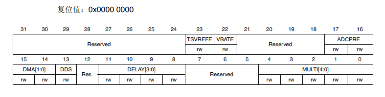
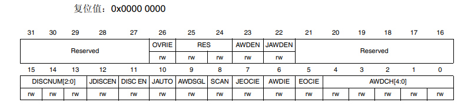
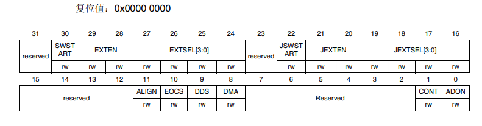
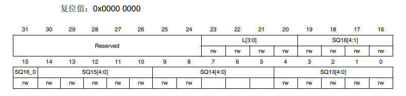
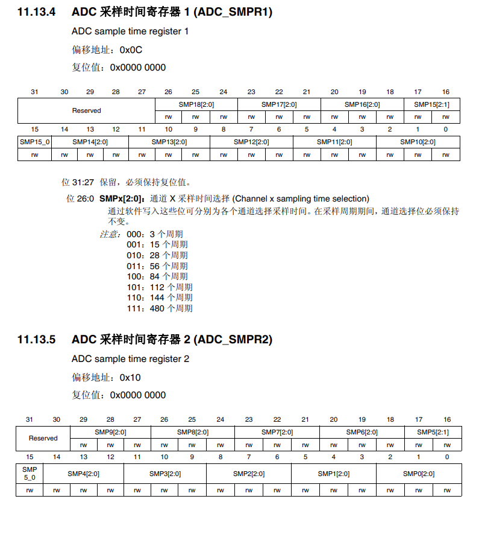
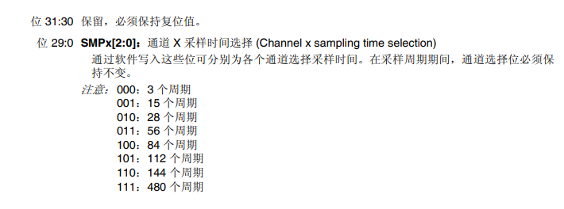
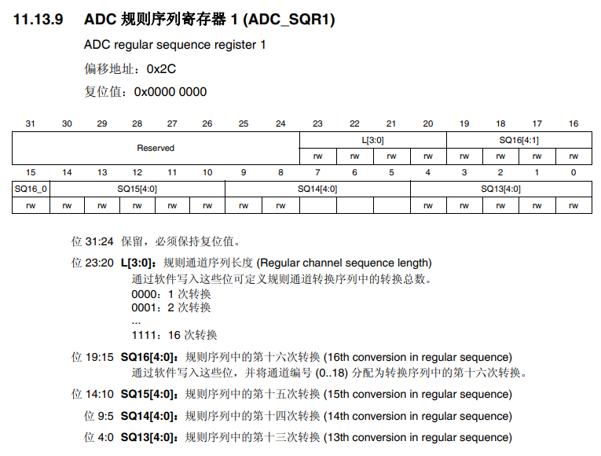
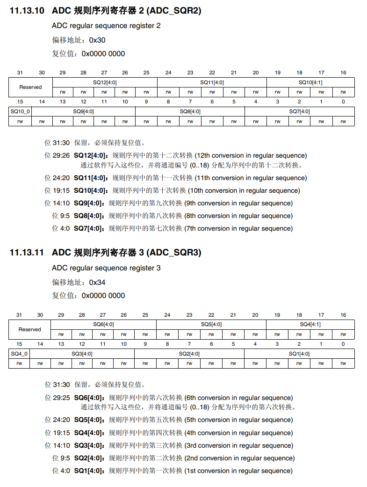

## ADC的初始化

在库函数中，初始化ADC需要两个结构体，一个是通用**ADC通用初始化结构体**，一个是**ADC初始化结构体**

### ADC通用初始化

#### ADC通用初始化结构体

该结构体可以配置ADC的采样模式，ADC时钟分频数，DMA模式，两个采样阶段之间的延迟

```C
typedef struct 
{
  uint32_t ADC_Mode;                      /*!< Configures the ADC to operate in 
                                               independent or multi mode. 
                                               This parameter can be a value of @ref ADC_Common_mode */                                              
  uint32_t ADC_Prescaler;                 /*!< Select the frequency of the clock 
                                               to the ADC. The clock is common for all the ADCs.
                                               This parameter can be a value of @ref ADC_Prescaler */
  uint32_t ADC_DMAAccessMode;             /*!< Configures the Direct memory access 
                                              mode for multi ADC mode.
                                               This parameter can be a value of 
                                               @ref ADC_Direct_memory_access_mode_for_multi_mode */
  uint32_t ADC_TwoSamplingDelay;          /*!< Configures the Delay between 2 sampling phases.
                                               This parameter can be a value of 
                                               @ref ADC_delay_between_2_sampling_phases */
  
}ADC_CommonInitTypeDef;
```

#### 库函数的初始化过程

```c
/* ADC CCR register Mask */
#define CR_CLEAR_MASK             ((uint32_t)0xFFFC30E0)


  /* Get the ADC CCR value */
  tmpreg1 = ADC->CCR;
  
  /* Clear MULTI, DELAY, DMA and ADCPRE bits */
  tmpreg1 &= CR_CLEAR_MASK;
  
  /* Configure ADCx: Multi mode, Delay between two sampling time, ADC prescaler,
     and DMA access mode for multimode */
  /* Set MULTI bits according to ADC_Mode value */
  /* Set ADCPRE bits according to ADC_Prescaler value */
  /* Set DMA bits according to ADC_DMAAccessMode value */
  /* Set DELAY bits according to ADC_TwoSamplingDelay value */    
  tmpreg1 |= (uint32_t)(ADC_CommonInitStruct->ADC_Mode | 
                        ADC_CommonInitStruct->ADC_Prescaler | 
                        ADC_CommonInitStruct->ADC_DMAAccessMode | 
                        ADC_CommonInitStruct->ADC_TwoSamplingDelay);
                        
  /* Write to ADC CCR */
  ADC->CCR = tmpreg1;
```

首先是读取CCR寄存器的值，然后通过与上	**FFFC30E0	(即 11111111  11  1111  00  00  11  0000  111  00000)**	来清除MULTI[4:0]、DELAY[3:0]、DMA[1:0]、ADCPRE的值。

这样就保留了该寄存器中的

- 位 13 DDS

- 位 22 VBATE：VBAT 使能

- 位 23 TSVREFE：温度传感器和 VREFINT 使能

然后是将配置的参数赋值给中间变量**tmpreg1**

最后将**tmpreg1**的值写入到**CCR寄存器**

#### 涉及到的寄存器

**ADC 通用控制寄存器 (ADC_CCR)**



在ADC通用初始化时仅使用这一个寄存器。在配置时各个功能和寄存器对应如下：

|     ADC的采样模式      |       ADC_Mode       | MULTI[4:0] |
| :--------------------: | :------------------: | :--------: |
|     ADC时钟分频数      |    ADC_Prescaler     |   ADCPRE   |
|        DMA模式         |  ADC_DMAAccessMode   |  DMA[1:0]  |
| 两个采样阶段之间的延迟 | ADC_TwoSamplingDelay | DELAY[3:0] |

- **位 4:0 MULTI[4:0]**：多重 ADC 模式选择
  - 所有 ADC 均独立： 00000：独立模式
  - 00001 到 01001：双重模式：ADC1 和 ADC2 一起工作，ADC3 独立
    - 00001：规则同时 + 注入同时组合模式
    - 00010：规则同时 + 交替触发组合模式
    - 00011：保留位（无模式）
    - 00101：仅注入同时模式
    - 00110：仅规则同时模式
    - 仅交错模式 01001：仅交替触发模式
  - 10001 到 11001：三重模式：ADC1、ADC2 和 ADC3 一起工作
    - 10001：规则同时 + 注入同时组合模式
    - 10010：规则同时 + 交替触发组合模式
    - 10011：Reserved
    - 10101：仅注入同时模式
    - 10110：仅规则同时模式
    - 仅交错模式 11001：仅交替触发模式
- **位 11:8 DELAY**：2 个采样阶段之间的延迟
  - 0000：5 * $T_{ADCCLK}$
  - 0001：6 * $T_{ADCCLK}$
  - 0010：7 * $T_{ADCCLK}$
  -  ...
  - 1111：20 * $T_{ADCCLK}$
- **位 15:14 DMA**：直接存储器访问模式
  - 00：禁止 DMA 模式
  - 01：使能 DMA 模式 1（依次 2/3 半字 - 1、2、3 依次进行）
  - 10：使能 DMA 模式 2（成对 2/3 半字 - 2 和 1、1 和 3、3 和 2 依次进行）
  - 11：使能 DMA 模式 3（成对 2/3 字节 - 2 和 1、1 和 3、3 和 2 依次进行）
- **位 17:16 ADCPRE**：ADC 预分频器（==该时钟为所有 ADC 所共用。==）
  - 00：PCLK2 2 分频 
  - 01：PCLK2 4 分频
  - 10：PCLK2 6 分频
  - 11：PCLK2 8 分频

#### 寄存器初始化

```c
//独立模式、延时为8个时钟周期、不使用DMA、4分频
ADC->CCR = (0x00 | (ADC_CCR_DELAY_1 | ADC_CCR_DELAY_0) | 0x00 | ADC_CCR_ADCPRE_0);
```

如果是下面的配置
```c
//独立模式、延时为5个时钟周期、不使用DMA、2分频
ADC->CCR |= (0x00 | 0x00 | 0x00 | 0x00);
```


可以直接写成

```c
ADC->CCR |=0x00;
```

### ADC初始化

#### ADC初始化结构体

该结构体可以配置ADC采集的分辨率，是否使用扫描功能，单次转换还是连续转换，ADC外部触发极性，ADC触发方式，数据对齐方式， ADC转换通道数目

```C
typedef struct
{
  uint32_t ADC_Resolution;                /*!< Configures the ADC resolution dual mode. 
                                               This parameter can be a value of @ref ADC_resolution */                                   
  FunctionalState ADC_ScanConvMode;       /*!< Specifies whether the conversion 
                                               is performed in Scan (multichannels) 
                                               or Single (one channel) mode.
                                               This parameter can be set to ENABLE or DISABLE */ 
  FunctionalState ADC_ContinuousConvMode; /*!< Specifies whether the conversion 
                                               is performed in Continuous or Single mode.
                                               This parameter can be set to ENABLE or DISABLE. */
  uint32_t ADC_ExternalTrigConvEdge;      /*!< Select the external trigger edge and
                                               enable the trigger of a regular group. 
                                               This parameter can be a value of 
                                               @ref ADC_external_trigger_edge_for_regular_channels_conversion */
  uint32_t ADC_ExternalTrigConv;          /*!< Select the external event used to trigger 
                                               the start of conversion of a regular group.
                                               This parameter can be a value of 
                                               @ref ADC_extrenal_trigger_sources_for_regular_channels_conversion */
  uint32_t ADC_DataAlign;                 /*!< Specifies whether the ADC data  alignment
                                               is left or right. This parameter can be 
                                               a value of @ref ADC_data_align */
  uint8_t  ADC_NbrOfConversion;           /*!< Specifies the number of ADC conversions
                                               that will be done using the sequencer for
                                               regular channel group.
                                               This parameter must range from 1 to 16. */
}ADC_InitTypeDef;
```

#### 库函数的初始化过程

```C
/* CR1 register Mask */
#define CR1_CLEAR_MASK            ((uint32_t)0xFCFFFEFF)
/* CR2 register Mask */
#define CR2_CLEAR_MASK            ((uint32_t)0xC0FFF7FD)
/* ADC L Mask */
#define SQR1_L_RESET              ((uint32_t)0xFF0FFFFF)


/*---------------------------- ADCx CR1 Configuration -----------------*/
  /* Get the ADCx CR1 value */
  tmpreg1 = ADCx->CR1;
  
  /* Clear RES and SCAN bits */
  tmpreg1 &= CR1_CLEAR_MASK;
  
  /* Configure ADCx: scan conversion mode and resolution */
  /* Set SCAN bit according to ADC_ScanConvMode value */
  /* Set RES bit according to ADC_Resolution value */ 
  tmpreg1 |= (uint32_t)(((uint32_t)ADC_InitStruct->ADC_ScanConvMode << 8) | \
                                   ADC_InitStruct->ADC_Resolution);
  /* Write to ADCx CR1 */
  ADCx->CR1 = tmpreg1;
  /*---------------------------- ADCx CR2 Configuration -----------------*/
  /* Get the ADCx CR2 value */
  tmpreg1 = ADCx->CR2;
  
  /* Clear CONT, ALIGN, EXTEN and EXTSEL bits */
  tmpreg1 &= CR2_CLEAR_MASK;
  
  /* Configure ADCx: external trigger event and edge, data alignment and 
     continuous conversion mode */
  /* Set ALIGN bit according to ADC_DataAlign value */
  /* Set EXTEN bits according to ADC_ExternalTrigConvEdge value */ 
  /* Set EXTSEL bits according to ADC_ExternalTrigConv value */
  /* Set CONT bit according to ADC_ContinuousConvMode value */
  tmpreg1 |= (uint32_t)(ADC_InitStruct->ADC_DataAlign | \
                        ADC_InitStruct->ADC_ExternalTrigConv | 
                        ADC_InitStruct->ADC_ExternalTrigConvEdge | \
                        ((uint32_t)ADC_InitStruct->ADC_ContinuousConvMode << 1));
                        
  /* Write to ADCx CR2 */
  ADCx->CR2 = tmpreg1;
  /*---------------------------- ADCx SQR1 Configuration -----------------*/
  /* Get the ADCx SQR1 value */
  tmpreg1 = ADCx->SQR1;
  
  /* Clear L bits */
  tmpreg1 &= SQR1_L_RESET;
  
  /* Configure ADCx: regular channel sequence length */
  /* Set L bits according to ADC_NbrOfConversion value */
  tmpreg2 |= (uint8_t)(ADC_InitStruct->ADC_NbrOfConversion - (uint8_t)1);
  tmpreg1 |= ((uint32_t)tmpreg2 << 20);
  
  /* Write to ADCx SQR1 */
  ADCx->SQR1 = tmpreg1;
```

首先是读取CR1寄存器的值，然后通过与上	**FCFFFEFF(即 111111  00  111111111111111  0  11111111)**	来清除SCAN、RES[1:0]的值。这样就保留了该寄存器中的其他不需要改变的值

- SCAN：扫描模式
- RES[1:0]：分辨率

然后是将配置的参数赋值给中间变量**tmpreg1**

最后将**tmpreg1**的值写入到**CR1寄存器**

---

CR2也是类似的，首先是读取CR2寄存器的值，然后通过与上	**C0FFF7FD(即 11  00  0000  111111111111  0 111111111  0  1)**	来清除CONT、ALIGN、EXTSEL[3:0]、EXTEN的值。这样就保留了该寄存器中的其他不需要改变的值

- CONT：连续转换
- ALIGN：数据对齐
- EXTSEL[3:0]：为规则组选择外部事件
- EXTEN：规则通道的外部触发使能

然后是将配置的参数赋值给中间变量**tmpreg1**

最后将**tmpreg1**的值写入到**CR2寄存器**

---

SQR1类似，首先是读取SQR1寄存器的值，然后通过与上	**FF0FFFFF(即 11111111  0000  11111111111111111111)**	来清除L[3:0]的值。这样就保留了该寄存器中的其他不需要改变的值

- L[3:0]：规则通道序列长度

然后是将配置的参数赋值给中间变量**tmpreg1**和**tmpreg2**

最后将**tmpreg2**的值写入到**SQR1寄存器**

#### 涉及到的寄存器



**ADC 控制寄存器 1 (ADC_CR1)**

- **位 8 SCAN：**扫描模式
  - 0：禁止扫描模式
  - 1：使能扫描模式
- **位 25:24 RES[1:0]**：分辨率
  - 00：12 位（15 ADCCLK 周期）
  - 01：10 位（13 ADCCLK 周期）
  - 10：8 位（11 ADCCLK 周期）
  - 11：6 位（9 ADCCLK 周期）



**ADC 控制寄存器 2 (ADC_CR2)**

- **位 1 CONT**：连续转换
  - 0：单次转换模式
  - 1：连续转换模式
- **位 11 ALIGN**：数据对齐
  - 0：右对齐
  - 1：左对齐
- **位 27:24 EXTSEL[3:0]**：为规则组选择外部事件
  - 0000：定时器 1 CC1 事件
  - 0001：定时器 1 CC2 事件
  - 0010：定时器 1 CC3 事件
  - 0011：定时器 2 CC2 事件
  - 0100：定时器 2 CC3 事件
  - 0101：定时器 2 CC4 事件
  - 0110：定时器 2 TRGO 事件
  - 0111：定时器 3 CC1 事件
  - 1000：定时器 3 TRGO 事件
  - 1001：定时器 4 CC4 事件
  - 1010：定时器 5 CC1 事件
  - 1011：定时器 5 CC2 事件
  - 1100：定时器 5 CC3 事件
  - 1101：定时器 8 CC1 事件
  - 1110：定时器 8 TRGO 事件
  - 1111：EXTI 线 11
- **位 29:28 EXTEN**：规则通道的外部触发使能
  - 00：禁止触发检测
  - 01：上升沿上的触发检测
  - 10：下降沿上的触发检测
  - 11：上升沿和下降沿上的触发检测



**ADC 规则序列寄存器 1 (ADC_SQR1)**

- 位 23:20 L[3:0]：规则通道序列长度
  - 0000：1 次转换 
  - 0001：2 次转换
  - ...
  - 1111：16 次转换

#### 寄存器初始化

```c
//禁止扫描模式、12位分辨率
ADC3->CR1    |= (0x00 | 0x00);
//连续转换模式、右对齐、不选择规则组外部事件，默认0x00、禁止触发检测
ADC3->CR2    |= (ADC_CR2_CONT | 0x00 | 0x00 | 0x00);
//规则通道序列长度：1
ADC3->SQR1   |= 0x00;
```

### ADC规则通道配置

在ADC采集时，我们可以配置规则通道序列，还可以单独配置每一个通道的采样时间。

在库函数中，实现这个功能的函数是`void ADC_RegularChannelConfig(ADC_TypeDef* ADCx, uint8_t ADC_Channel, uint8_t Rank, uint8_t ADC_SampleTime)`

入口参数为：

- ADCx
- ADC通道
- 规则序列中的序号，1~16
- 采样时间

#### 库函数的初始化过程

```c
  /* if ADC_Channel_10 ... ADC_Channel_18 is selected */
  if (ADC_Channel > ADC_Channel_9)
  {
    /* Get the old register value */
    tmpreg1 = ADCx->SMPR1;
    /* Calculate the mask to clear */
    tmpreg2 = SMPR1_SMP_SET << (3 * (ADC_Channel - 10));
    /* Clear the old sample time */
    tmpreg1 &= ~tmpreg2;
    /* Calculate the mask to set */
    tmpreg2 = (uint32_t)ADC_SampleTime << (3 * (ADC_Channel - 10));
    /* Set the new sample time */
    tmpreg1 |= tmpreg2;
    /* Store the new register value */
    ADCx->SMPR1 = tmpreg1;
  }
  else /* ADC_Channel include in ADC_Channel_[0..9] */
  {
    /* Get the old register value */
    tmpreg1 = ADCx->SMPR2;
    /* Calculate the mask to clear */
    tmpreg2 = SMPR2_SMP_SET << (3 * ADC_Channel);
    /* Clear the old sample time */
    tmpreg1 &= ~tmpreg2;
    /* Calculate the mask to set */
    tmpreg2 = (uint32_t)ADC_SampleTime << (3 * ADC_Channel);
    /* Set the new sample time */
    tmpreg1 |= tmpreg2;
    /* Store the new register value */
    ADCx->SMPR2 = tmpreg1;
  }

  /* For Rank 1 to 6 */
  if (Rank < 7)
  {
    /* Get the old register value */
    tmpreg1 = ADCx->SQR3;
    /* Calculate the mask to clear */
    tmpreg2 = SQR3_SQ_SET << (5 * (Rank - 1));
    /* Clear the old SQx bits for the selected rank */
    tmpreg1 &= ~tmpreg2;
    /* Calculate the mask to set */
    tmpreg2 = (uint32_t)ADC_Channel << (5 * (Rank - 1));
    /* Set the SQx bits for the selected rank */
    tmpreg1 |= tmpreg2;
    /* Store the new register value */
    ADCx->SQR3 = tmpreg1;
  }
  /* For Rank 7 to 12 */
  else if (Rank < 13)
  {
    /* Get the old register value */
    tmpreg1 = ADCx->SQR2;
    /* Calculate the mask to clear */
    tmpreg2 = SQR2_SQ_SET << (5 * (Rank - 7));
    /* Clear the old SQx bits for the selected rank */
    tmpreg1 &= ~tmpreg2;
    /* Calculate the mask to set */
    tmpreg2 = (uint32_t)ADC_Channel << (5 * (Rank - 7));
    /* Set the SQx bits for the selected rank */
    tmpreg1 |= tmpreg2;
    /* Store the new register value */
    ADCx->SQR2 = tmpreg1;
  }
  /* For Rank 13 to 16 */
  else
  {
    /* Get the old register value */
    tmpreg1 = ADCx->SQR1;
    /* Calculate the mask to clear */
    tmpreg2 = SQR1_SQ_SET << (5 * (Rank - 13));
    /* Clear the old SQx bits for the selected rank */
    tmpreg1 &= ~tmpreg2;
    /* Calculate the mask to set */
    tmpreg2 = (uint32_t)ADC_Channel << (5 * (Rank - 13));
    /* Set the SQx bits for the selected rank */
    tmpreg1 |= tmpreg2;
    /* Store the new register value */
    ADCx->SQR1 = tmpreg1;
  }
```

虽然多，但是只有两步

- 根据设置的ADC通道配置采样时间
  - 通道数大于9，读取**ADC_SMPR1**；通道数大于9，读取**ADC_SMPR2**
  - 清除该通道对应寄存器位置的值
  - 设置采样时间
  - 赋值
- 设置该通道的规则序列位置
  - 序号小于7，读取SQR3；序号小于13，读取SQR2；除此之外读取SQR1；
  - 清除该序号对应寄存器位置的值
  - 设置该序号对应的通道
  - 赋值

#### 涉及到的寄存器






#### 寄存器初始化

```C
/**********
 * ADC规则通道配置
 * 入口参数：
 *      ADCx：
 *          ADC1
 *          ADC2
 *          ADC3
 *      ADC_Channel：0x00 ~ 0x12 分别对应19个通道
 *          入口参数：
 *          0 ~ 18 或 0x00 ~ 0x12
 *      Rank：0x00 ~ 0x10 分别对应16个规则序列
 *          入口参数：
 *          1 ~ 16 或 0x00 ~ 0x10
 *      ADC_SampleTime
 *          入口参数：
 *          ADC_SampleTime_3Cycles           0x00 或 0
 *          ADC_SampleTime_15Cycles          0x01 或 1
 *          ADC_SampleTime_28Cycles          0x02 或 2
 *          ADC_SampleTime_56Cycles          0x03 或 3
 *          ADC_SampleTime_84Cycles          0x04 或 4
 *          ADC_SampleTime_112Cycles         0x05 或 5
 *          ADC_SampleTime_144Cycles         0x06 或 6
 *          ADC_SampleTime_480Cycles         0x07 或 7
**********/
void ADC_RegularChannel_Init(ADC_TypeDef* ADCx, uint8_t ADC_Channel, uint8_t Rank, uint8_t ADC_SampleTime)
{
    //根据设置的ADC通道配置采样时间
    if (ADC_Channel > 9)
        ADCx->SMPR1 |= (uint32_t)ADC_SampleTime << (3 * (ADC_Channel - 10));
    else
        ADCx->SMPR2 |= (uint32_t)ADC_SampleTime << (3 * (ADC_Channel - 10));
    
    //设置该通道的规则序列位置
    if (Rank < 7)
        ADCx->SQR3 |= (uint32_t)ADC_Channel << (5 * (Rank - 1));
    else if (Rank < 13)
        ADCx->SQR2 |= (uint32_t)ADC_Channel << (5 * (Rank - 1));
    else
        ADCx->SQR2 |= (uint32_t)ADC_Channel << (5 * (Rank - 1));
}
```

