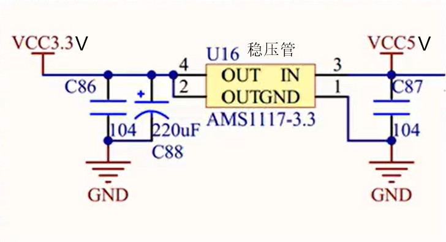
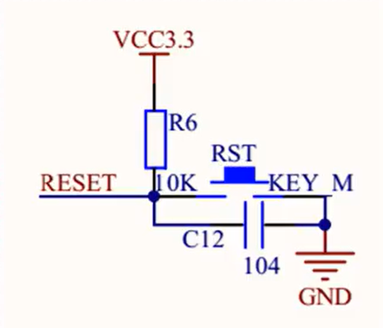
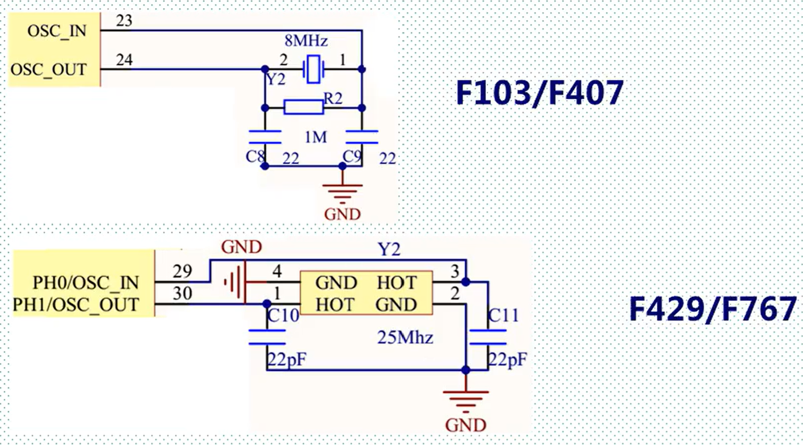
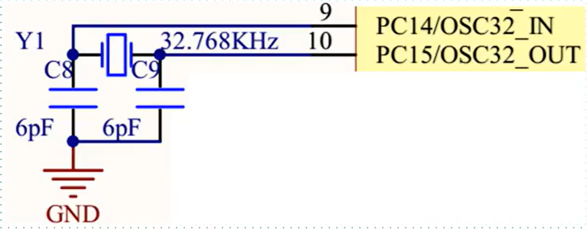
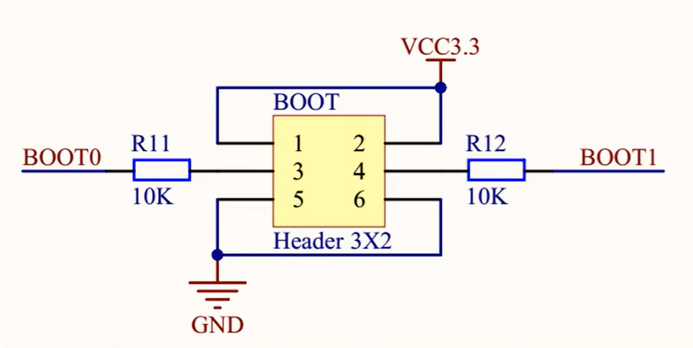
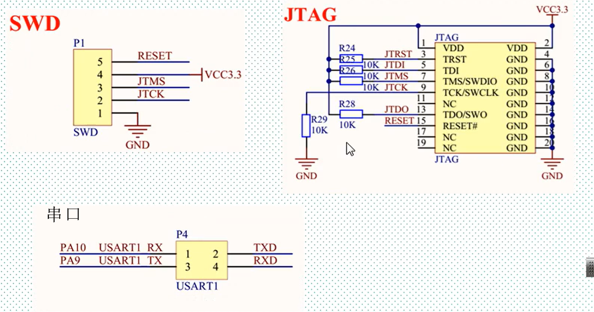
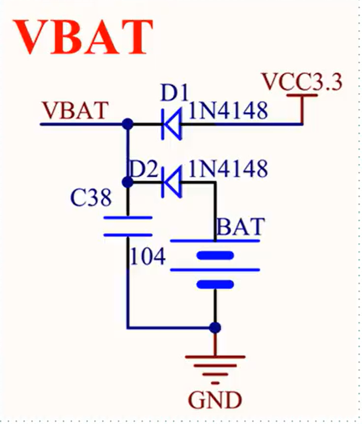

### 一、什么是最小系统

MCU最小系统：一个MCU在能正常工作，正常下载程序的前提下的最简电路

 ### 二、STM32最小系统：

（1）组成部分

- 供电
- 复位
- 时钟：外部晶振（两个）
- Boot启动模式选择
- 下载电路（串口/JTAG/SWD）
- 后备电池

（2）供电电路

**VDD和VDDA之间一般连接一个简单的低通滤波器即可（RC、兀型均可）**

| 名称         | 典型值 |
| :----------- | ------ |
| VDD数字电源  | +3.3V  |
| VSS数字地    | 0      |
| VDDA模拟电源 | +3.3V  |
| VSSA模拟地   | 0      |

（2）复位电路

**与51单片机类似**

（3）时钟电路（外部时钟）

- 高速时钟：作为系统时钟使用

- 低速时钟：给RTC和COM口使用

（4）Boot启动模式选择

**通过跳线帽选择BOOT1和BOOT2的电平，进而调整启动模式**

（5）下载电路（串口/JTAG/SWD）

最小系统一般使用SWD（可调试）

串口电路简单，不可调试

JTAG电路可调试，但复杂

（6）后备电池

使用后备电池存储部分数据

