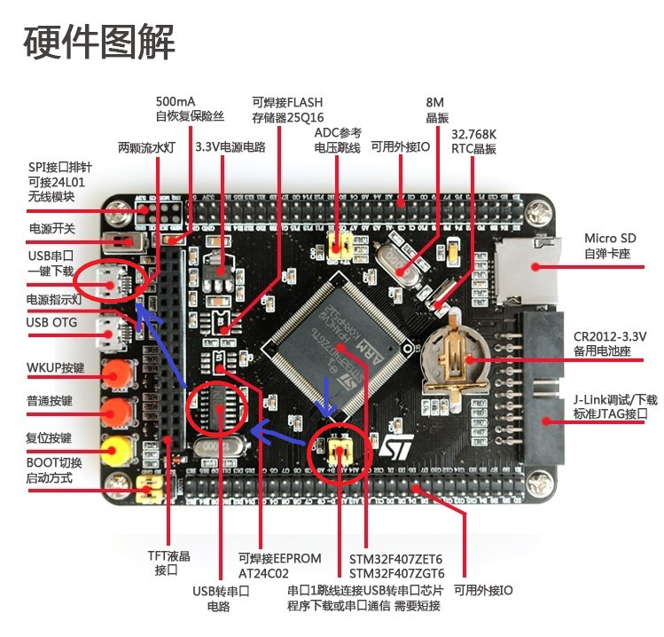

## STM32F7开发板不可使用(2017年)

参考资料：STM32F4开发指南-库函数版本_V1.1.pdf\3.4.1 STM32 串口程序下载

### 一、硬件连接

（1）原理图

（2）实物图

STM32的ISP下载，只能使用串口1，也就是对应串口发送接收引脚PA9、PA10。

不能使用其他串口。

### 二、一键下载方法

环境准备：USB串口驱动安装

详细步骤：F4开发指南-库函数版本_V1.1.pdf\3.4 程序下载与调试 

简略步骤：

- 搜索串口，选择虚拟的USB串口：COMx:空闲USB-SERIAL CH34
- 设置波特率：F4芯片使用76800，F1芯片可以更高
- 勾选“编程前重装文件”
- 选择STMISP选项卡，然后勾选：“校验”以及“编程后执行”
- 选项字节区的“编程到FLASH时写选项直接”不要勾上
- 左下方：选择第四个“DTR的低电平复位，RST高电平进BootLoader”

### 三、STM32启动模式（M3和M4）

STM32直接通过两个引脚Boot0和Boot1设置启动模式

| 启动模式选择引脚 |       |   启动模式   |            说明            |
| :--------------: | :---: | :----------: | :------------------------: |
|      BOOT1       | BOOT0 |              |                            |
|        X         |   0   | 主闪存存储器 | 主闪存存储器被选为启动区域 |
|        0         |   1   |  系统存储器  |  系统存储器被选为启动区域  |
|        1         |   1   |   内置SRAM   |   内置SRAM被选为启动区域   |

ISP下载的一般步骤：

- Boot0接3.3V，Boot1接GND
- 按复位键实现下载

程序执行的一般步骤：

- 勾选“编程后执行”，发送命令直接从FLASH启动
- 或者Boot0接GND，Boot1接任意，按一次复位

一键下载电路：

使用软件控制Boot0和复位，进而控制自动下载

