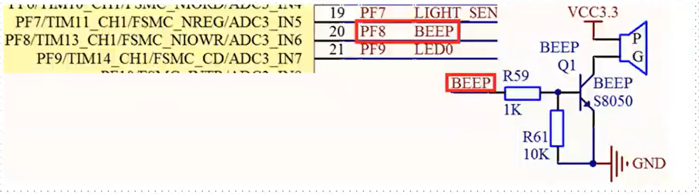
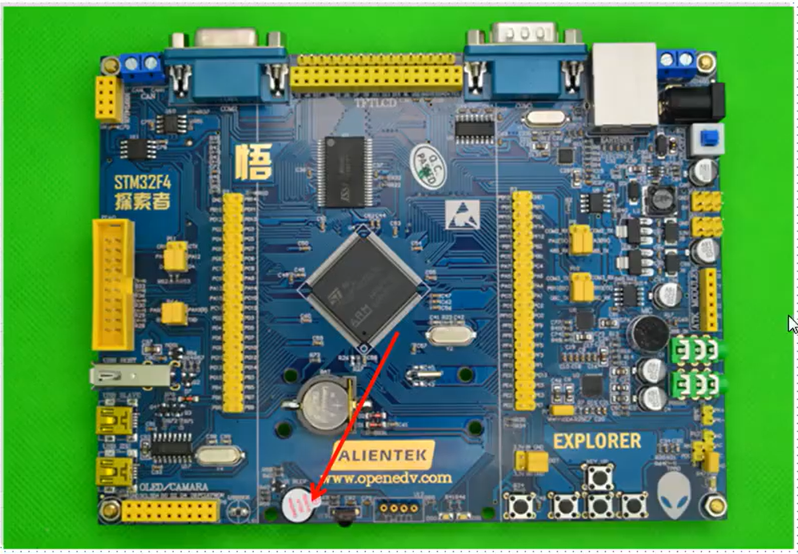

参考资料：

STM32F4开发指南-库函数版本_V1.1.pdf\第七章 蜂鸣器实验

###  一、蜂鸣器硬件连接

实物图：

实验室板子上没有，用其他板子

### 二、蜂鸣器实验讲解

（1）程序组成

- 使能时钟。调用函数RCC_AHB1PeriphClockCmd():

  ==不同的外设调用的时钟使能函数可能不一样==

- 初始化IO口模式。调用GPIO_lnit();

- 操作IO口输出高低电平。

（2）程序编写

看视频