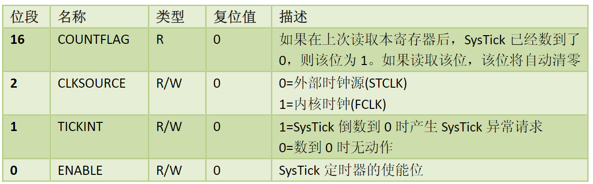
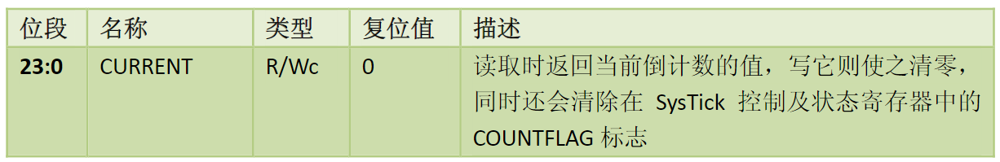
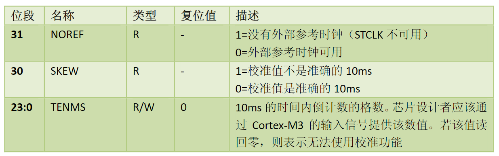
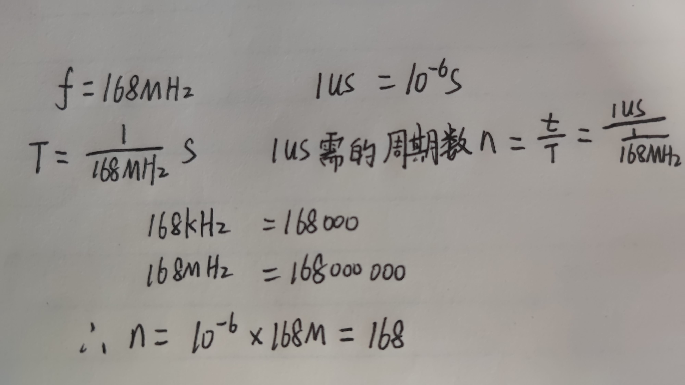

参考资料：

STM32F4开发指南-库函数版本_V1.1.pdf\5.1 delay 文件夹代码介绍 

8，STM32参考资料\Cortex M3权威指南(中文).pdf\第8章 NVIC与中断控制\最后一节 SysTick定时器 

建议Cortex M3权威指南(中文)用浏览器打开，可以显示目录

### 一、Systick定时器基础知识详解

（1）Systick定时器是什么？

- Systick定时器，是一个简单的定时器，对于 CM3,CM4内核芯片，都有Systick定时器。
- Systick定时器常用来做延时，或者实时系统的心跳时钟。这样可以节省MCU资源，不用浪费一个定时器。比如UCOS中，分时复用，需要一个最小的时间戳，一般在STM32+UCOS系统中，都采用Systick做 UCOS心跳时钟。 
- Systick定时器就是系统滴答定时器，一个24位的倒计数定时器，计到0时，将从RELOAD寄存器中自动重装载定时初值。只要不把它在SysTick控制及状态寄存器中的使能位清除，就永不停息，即使在睡眠模式下也能工作。
- SysTick定时器被捆绑在NVIC中，用于产生SYSTICK异常（即中断）（异常号：15）
- Systick中断的优先级也可以设置。
- 时钟频率一般设置为系统时钟的8分频，若系统时钟为168MHz，则其时钟频率一般为21MHz

（2）Systick相关寄存器

- SysTick控制及状态寄存器——CTRL

  

  对于STM32：

  ​	外部时钟源是HCLK（AHB总线时钟）的1/8

  ​	内部时钟是HCLK时钟（AHB总线时钟）

  配置函数：SysTick_CLKSourceConfig();

- SysTick重装载数值寄存器SysTick——LOAD

  

- SysTick当前数值寄存器——VAL

  

- SysTick校准数值寄存器（使用少）

   

### 二、Systick相关寄存器库函数

(1)库函数介绍

- 固件库中的Systick相关函数

  SysTick_CLKSourceConfig()//Systick时钟源选择	==misc.c文件中==

  SysTick_Config(uint32_t ticks)

  //初始化systick，时钟为HCLK，并开启中断

  ==//core_cm3.h/core_cm4.h文件中==

- Systick中断服务函数

  void SysTick_Handler(void);

（2）源码详解

SysTick_CLKSourceConfig()函数

```c
void SysTick_CLKSourceConfig(uint32_t SysTick_CLKSource)
{
  /* Check the parameters */
  /*选择Systick时钟源*/
  assert_param(IS_SYSTICK_CLK_SOURCE(SysTick_CLKSource));
  if (SysTick_CLKSource == SysTick_CLKSource_HCLK)
  {
    SysTick->CTRL |= SysTick_CLKSource_HCLK;
  }
  else
  {
    SysTick->CTRL &= SysTick_CLKSource_HCLK_Div8;
  }
}
```

SysTick_Config(uint32_t ticks)函数

```c
/*ticks 代表两个中断之间间隔的Systick周期*/
__STATIC_INLINE uint32_t SysTick_Config(uint32_t ticks)
{
  if ((ticks - 1) > SysTick_LOAD_RELOAD_Msk)  return (1);      /* 判断ticks值的合理性 */

  SysTick->LOAD  = ticks - 1;                                  /* 设置重装寄存器 */
  NVIC_SetPriority (SysTick_IRQn, (1<<__NVIC_PRIO_BITS) - 1);  /* 设置中断优先级 */
  SysTick->VAL   = 0;                                          /* 加载 SysTick 计数器值 */
  SysTick->CTRL  = SysTick_CTRL_CLKSOURCE_Msk |
                   SysTick_CTRL_TICKINT_Msk   |
                   SysTick_CTRL_ENABLE_Msk;                    /* 启用并使能Systick */
  return (0);                                                  /* 配置成功 */
}
```

void SysTick_Handler(void)函数


### 三、delay延时函数详解（Systick应用）

（1）void delay_init(u8 SYSCLK)函数

作用：初始化delay延时函数



```c
删去和OS有关函数后得到以下函数
void delay_init(u8 SYSCLK)				  //系统时钟频率，例如168
{
 	SysTick_CLKSourceConfig(SysTick_CLKSource_HCLK_Div8);	//选择系统时钟的为168的8分频
	fac_us=SYSCLK/8;					 //1us需要的时钟周期为168/8=21
	fac_ms=(u16)fac_us*1000;			  //将1us需要的时钟周期乘1000得到1ms需要的时钟周期
}		
```

（2）void delay_ms(u16 nms)函数

作用：延时__微秒

```c
//nus不能大于798915us
//因为2^24/21 = 798915.04761904761904761904761905
void delay_us(u32 nus)
{		
	u32 temp;	    	 
	SysTick->LOAD=nus*fac_us; 				//计算并重装初值 
	SysTick->VAL=0x00;        				//清空计数器
	SysTick->CTRL|=SysTick_CTRL_ENABLE_Msk ; //开始倒数	 
	do
	{
		temp=SysTick->CTRL;
	}while((temp&0x01)&&!(temp&(1<<16)));	//等待 
	SysTick->CTRL&=~SysTick_CTRL_ENABLE_Msk; //关闭计数器
	SysTick->VAL =0X00;       				//清空寄存器
}
```


（3）void delay_us(u32 nus)函数

作用：延时__毫秒

```c
作用：增长延时时间
void delay_ms(u16 nms)
{	 	 
	u8 repeat=nms/540;	  //使用540，是考虑超频到248M时最大可以延时的时间只有541ms
						//248/8 = 31	2^24/31000 = 541.20051612903225806451612903226ms
						//正常168M下	  2^24/21000 = 798.91504761904761904761904761905ms
	u16 remain=nms%540;
	while(repeat)
	{
		delay_xms(540);
		repeat--;
	}
	if(remain)delay_xms(remain);
} 

作用：延时
//nus不能大于798ms
//因为2^24/21000 = 798.91504761904761904761904761905
void delay_xms(u16 nms)
{	 		  	  
	u32 temp;		   
	SysTick->LOAD=(u32)nms*fac_ms;			//计算并重装初值
	SysTick->VAL =0x00;           			//清空计数器
	SysTick->CTRL|=SysTick_CTRL_ENABLE_Msk ;          //开始倒数
	do
	{
		temp=SysTick->CTRL;
	}while((temp&0x01)&&!(temp&(1<<16)));	//等待
	SysTick->CTRL&=~SysTick_CTRL_ENABLE_Msk;       //关闭计数器
	SysTick->VAL =0X00;     		  		//清空寄存器
} 
```

