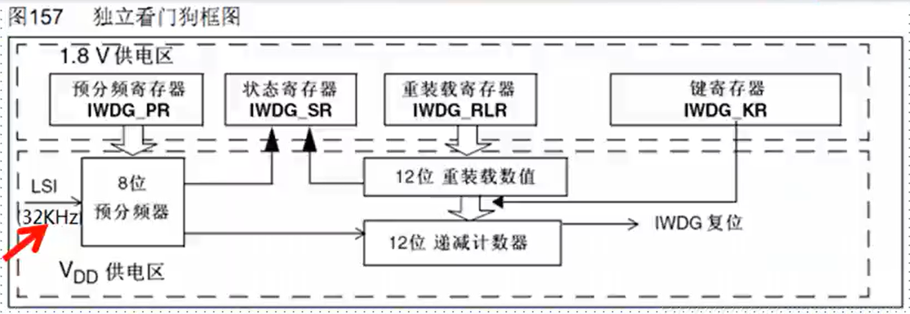
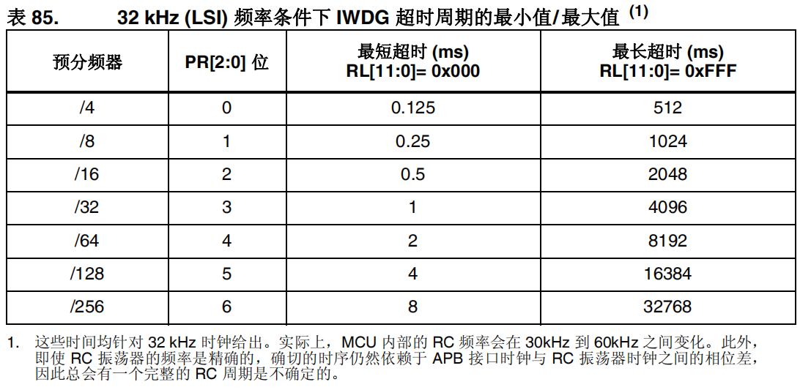
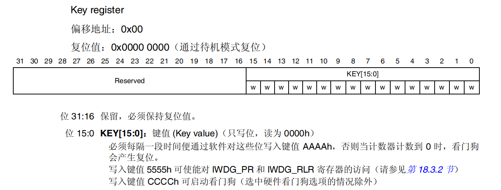
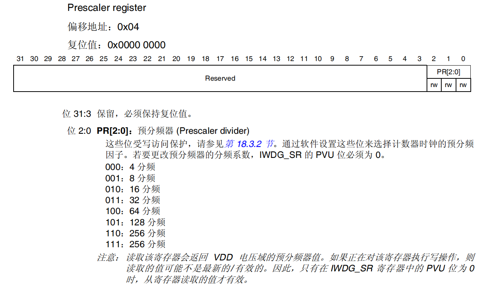
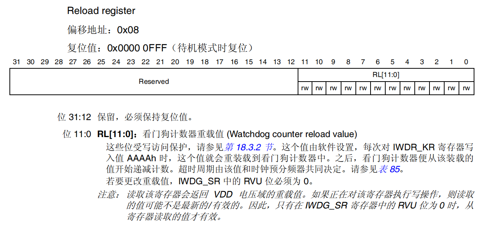
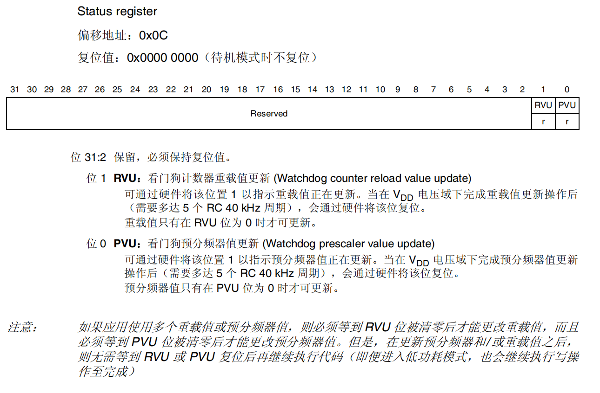

参考资料：

STM32F4开发指南-库函数版本_V1.1.pdf\第十一章 独立看门狗（IWDG）实验

8，STM32参考资料\STM32F4xx中文参考手册.pdf\第十八章 独立看门狗 (IWDG)

### 一、独立看门狗概述

（1）看门狗的作用

在由单片机构成的微型计算机系统中，由于单片机的工作常常会受到来自外界电磁场的干扰，造成程序的跑飞，而陷入死循环，程序的正常运行被打断，由单片机控制的系统无法继续工作，会造成整个系统的陷入停滞状态，发生不可预料的后果，所以出于对单片机运行状态进行实时监测的考虑，便产生了一种专门用于监测单片机程序运行状态的模块或者芯片，俗称“看门狗"(watchdog) 

在系统正常运行时，系统不能复位。在系统跑飞（程序异常执行）的情况，系统复位，程序重新执行

（2）STM32中的看门狗系统

- STM32内置两个看门狗，提供了更高的安全性，时间的精确性和使用的灵活性。两个看门狗设备（独立看门狗/窗口看门狗）可以用来检测和解决由软件错误引起的故障。当计数器达到给定的超时值时，触发一个中断（仅适用窗口看门狗）或者产生系统复位。

- 独立看门狗(IWDG)由专用的低速时钟(LS)驱动，即使主时钟发生故障它仍有效。

  ==独立看门狗适合应用于需要看门狗作为一个在主程序之外能够完全独立工作，并且对时间精度要求低的场合。==

- 窗口看门狗由从APB1时钟分频后得到时钟驱动。通过可配置的时间窗口来检测应用程序非正常的过迟或过早操作。

  ==窗口看门狗最适合那些要求看门狗在精确计时窗口起作用的程序。==

（3）独立看门狗功能描述

- 在键值寄存器(IWDG_KR)中写入0xCCCC,开始启用独立看门狗。此时计数器开始从其复位值0xFFF递减，当计数器值计数到尾值0x000时会产生一个复位信号(IWDG_RESET)。
- 无论何时，只要在键值寄存器IWDG KR中写入0xAAAA(通常说的喂狗)，自动重装载寄存器IWDG_RLR的值就会重新加载到计数器，从而避免看门狗复位。
- 如果程序异常，就无法正常喂狗，从而系统复位。

（4）独立看门狗超时时间

[(11条消息) STM32看门狗超时时间计算_警官001的博客-CSDN博客_stm32看门狗时间计算](https://blog.csdn.net/weixin_53351352/article/details/119738883) 

$T_{out}$(超时时间) = 重装载寄存器（IWDR_RLR）* 看门狗时间周期

看门狗时间周期 = 1/看门狗时钟频率 = 4 * $2^{PR}$/32

看门狗时钟频率 = 内部低速时钟 / 分频系数 = 32/4 * $2^{PR}$

分频系数 = 4 * $2^{PR}$（PR为预分频寄存器（IWDR_PR）里的值，例如，PR = 110 = 6）
==分频系数里比较特殊的是PR = 111时，其分频系数与PR = 110时相等==

内部低速时钟大小可看时钟树的配置，为32k

所以，超时时间公式为$T_{out}$ = （（4 * $2^{PR}$）*RLR）/32

### 二、常用寄存器和库函数配置

（1）寄存器

寄存器访问保护 ：

==预分频寄存器（IWDG_PR） 和重装载寄存器（ IWDG_RLR） 寄存器具有写访问保护。==若要修改寄存器，必须首先对键值寄存器 （IWDG_KR） 寄存器写入代码 0x5555。而写入其他值则会破坏该序列，从而使寄存器访问保护再次生 效。这意味着重装载操作（即写入 0xAAAA）也会启动写保护功能。状态寄存器指示预分频值和递减计数器是否正在被更新。

1. 键值寄存器（IWDG_KR）

   

2. 预分频寄存器（IWDR_PR）

   

3. 重装载寄存器（IWDR_RLR）

   

4. 状态寄存器（IWDR_SR）

   

（2）库函数

1. 取消写保护：0x5555使能

   void IWDG_WriteAccessCmd(uint16_t IWDG_WriteAccess);

   

   IWDG_WriteAccess_Enable		//(uint16_t)0x5555

   IWDG_WriteAccess_Disable		//(uint16_t)0x0000

   例：IWDG_WriteAccessCmd(IWDG_WriteAccess_Enable)	//取消写保护：0x5555使能

   

2. 设置预分频系数：写PR

   void IWDG_SetPrescaler(uint8_t IWDG_Prescaler);

   例：

   - IWDG_SetPrescaler(IWDG_Prescaler_4);//设置预分频系数为4
   - pr=4;
   - IWDG_SetPrescaler(pr)//设置预分频系数为64

   

3. 设置重装载值：写RLR

   void IWDG_SetReload(uint16_t Reload);

   RLR<=0xFFF

   例：

   - IWDG_SetReload(0xFFF);

   - rlr=500;

     IWDG_SetReload(rlr);

   

4. 喂狗：写0xAAAA到KR

   void IWDG_ReloadCounter(void);

   例：IWDG_ReloadCounter();

5. 使能看门狗：写0xCCCC到KR

   void IWDG_Enable(void);

   例：IWDG_Enable();

6. 状态：重装载/预分频更新

   FlagStatus IWDG_GetFlagStatus(uint16_t IWDG_FLAG);

   

### 三、独立看门狗实验

（1）实验步骤

- 取消寄存器写保护

  IWDG_WriteAccessCmd();

- 设置独立看门狗的预分频系数，确定时钟

  IWDG_SetPrescaler();

- 设置看门狗重装载值，确定溢出时间

  IWDG_SetReload();

- 使能看门狗

  IWDG_Enable();

- 应用程序喂狗

  IWDG_ReloadCounter();

（2）代码

见视频