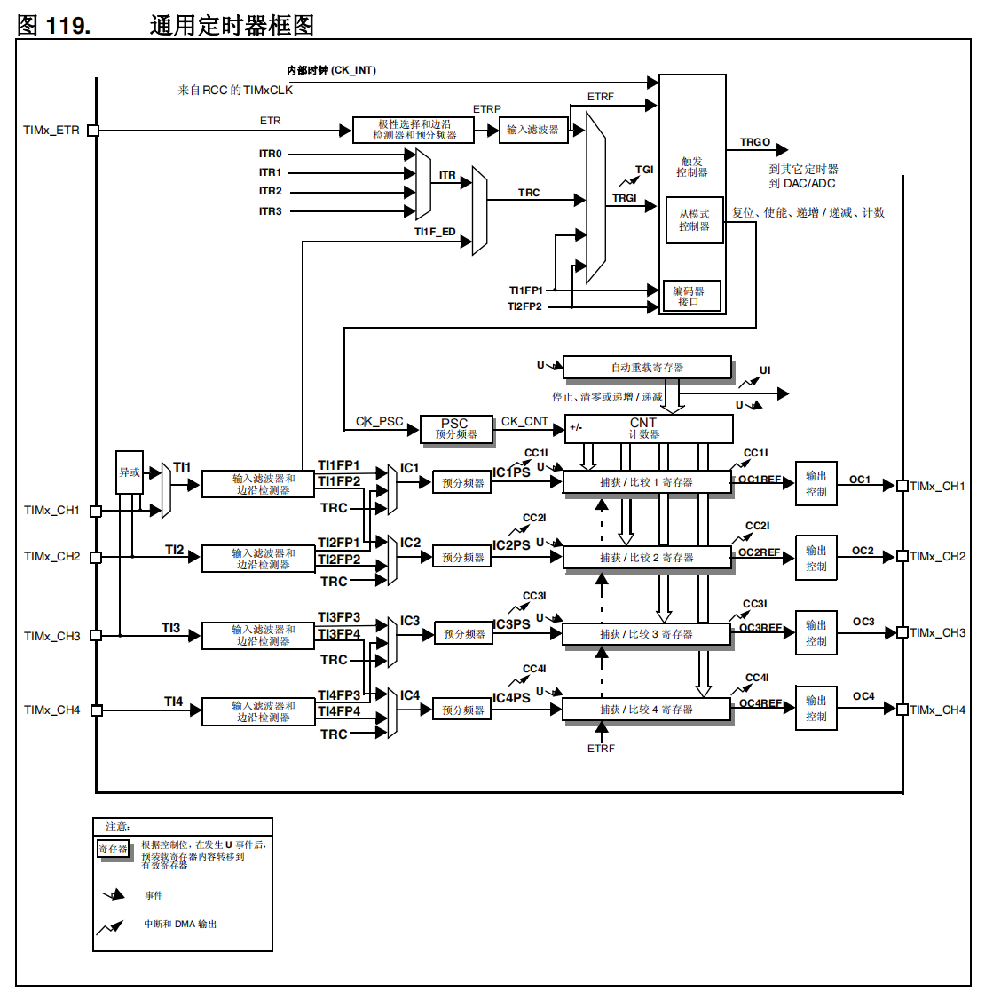
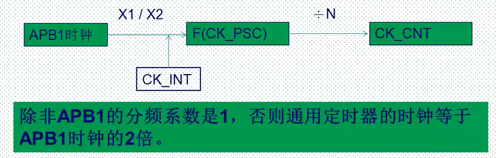
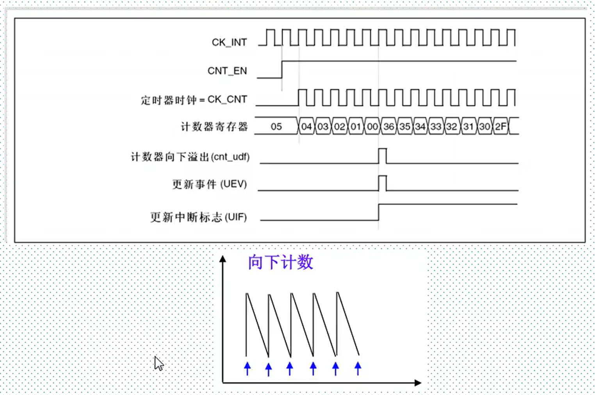
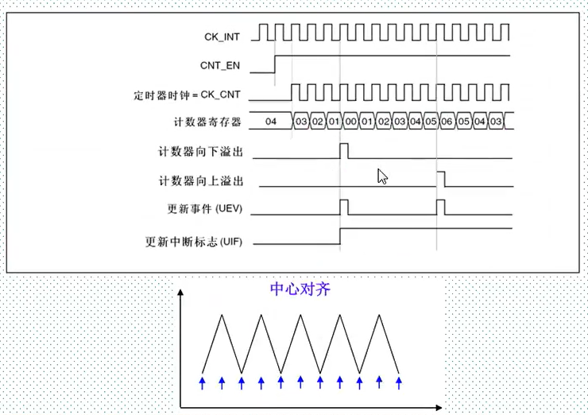
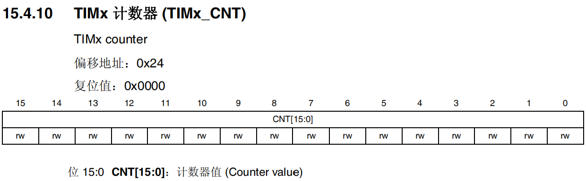
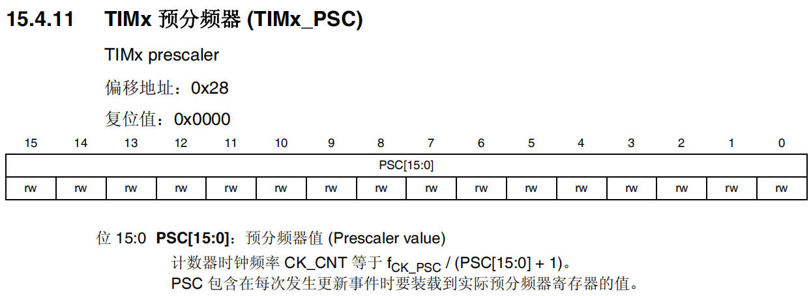
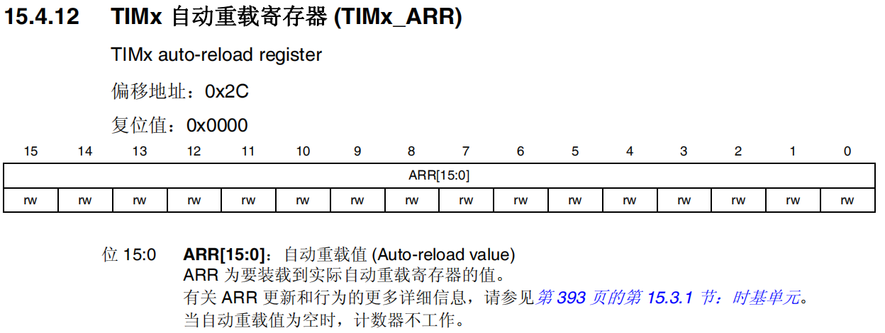
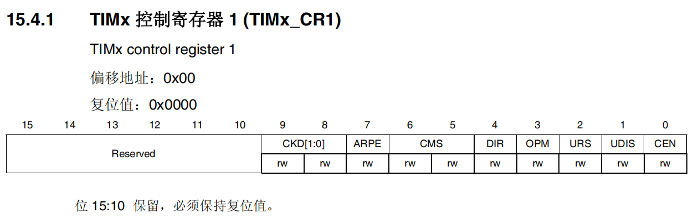
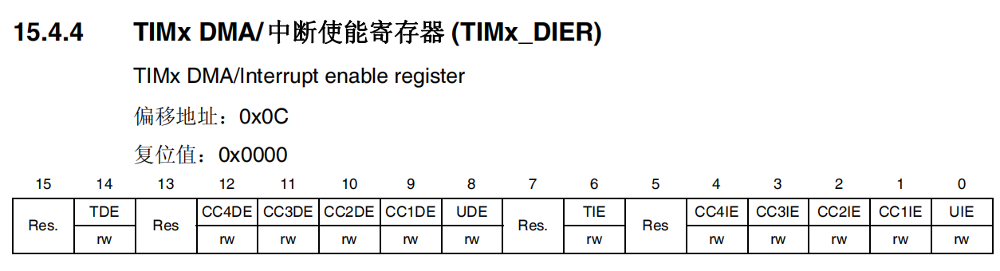

参考资料：

STM32F4开发指南-库函数版本_V1.1.pdf\第十三章 定时器中断实验

8，STM32参考资料\STM32F4xx中文参考手册.pdf\第十五章  通用定时器（TIM2 到 TIM5）

### 一、通用定时器

（1）时钟选择

- 内部时钟 (CK_INT)
- 外部时钟模式 1：外部输入引脚 (TIx)
- 外部时钟模式 2：外部触发输入 (ETR)，仅适用于 TIM2、TIM3 和 TIM4。
- 内部触发输入 (ITRx)：使用一个定时器作为另一个定时器的预分频器，例如可以将定时器1配置为定时器2的预分频器。

（2）内部时钟选择

APB1的分频系数为1时，通用计时器的时钟为APB1时钟的值
APB1的分频系数不为1时，通用计时器的时钟为APB1时钟的两倍

默认调用SystemInit函数的情况下：

SYSCLK = 168MHz
AHB时钟 = 168MHz
APB1时钟 = 42MHz（此时APB1的预分频系数为4，通用计时器的时钟等于2*42MHz）

（3）计数器模式

- 向下计数模式（时钟分频因子=1）

  

- 向上计数模式、

  

- 向上向下计数模式

  

### 二、常用寄存器和库函数配置

（1）常用寄存器

1. 计数器当前值寄存器

   

2. 预分频寄存器

   

3. 自动重装载寄存器

   

4. 控制寄存器1

   

   更多的可以查阅《STM32F4xx中文参考手册.pdf》15.4.1
   该寄存器比较重要的是位4和位0

   位4：设置方向
   位0：使能计数器

5. DMA中断使能寄存器

   

   更多的可以查阅《STM32F4xx中文参考手册.pdf》15.4.4

   位5：保留，始终为0
   位4：捕获/比较4中断，0禁止，1允许
   位3：捕获/比较3中断，0禁止，1允许
   位2：捕获/比较2中断，0禁止，1允许
   位1：捕获/比较1中断，0禁止，1允许
   位0：允许更新中断，0禁止，1允许

（2）常用库函数

常用库：stm32f4xx.tim.c/.h

1. 初始化函数：void TIM_TimeBaseInit(TIM_TypeDef* TIMx, TIM_TimeBaseInitTypeDef* TIM_TimeBaseInitStruct);

   入口参数：(时钟选择,时钟参数初始化)

2. 定时器使能函数

   void TIM_Cmd(TIM_TypeDef* TIMx, FunctionalState NewState);

3. 定时器中断使能函数

   void TIM_ITConfig(TIM_TypeDef* TIMx, uint16_t TIM_IT, FunctionalState NewState);

4. 状态标志位获取和清除

   FlagStatus TIM_GetFlagStatus(TIM_TypeDef* TIMx, uint16_t TIM_FLAG);
   void TIM_ClearFlag(TIM_TypeDef* TIMx, uint16_t TIM_FLAG);
   ITStatus TIM_GetITStatus(TIM_TypeDef* TIMx, uint16_t TIM_IT);
   void TIM_ClearITPendingBit(TIM_TypeDef* TIMx, uint16_t TIM_IT);

### 三、定时器中断实验

（1）定时器中断实验步骤 

- 使能定时器时钟

  RCC_APB1PeriphClockCmd();

- 初始化定时器，配置ARR（重装载值）、PSC（预分频系数）

  TIM_TimeBaseInit();

- 开启定时器中断，配置NVIC

  NVIC_Init();

- 使能定时器

  TIM_Cmd();

- 编写中断服务函数

  TIMx_IRQHandler();

（2）要求

通过定时器中断配置，每500ms中断一次，然后中断服务函数中控制LED实现LED状态取反（闪烁）

$T_{out}$（溢出时间）=（ARR+1）（PSC+1）/$T_{clk}$

（3）代码

看视频

