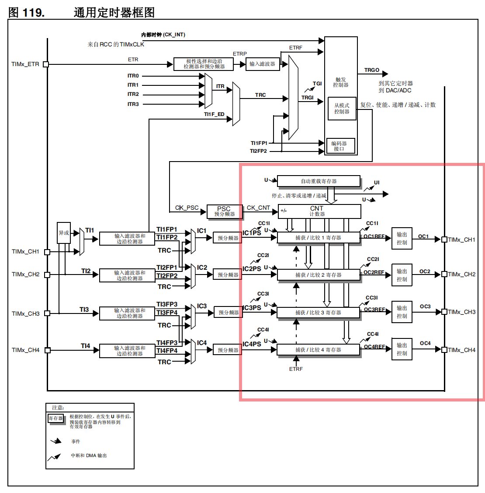
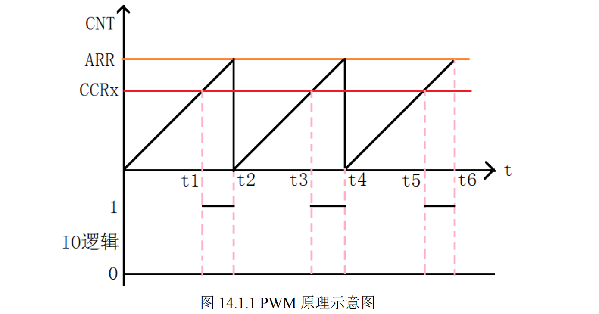
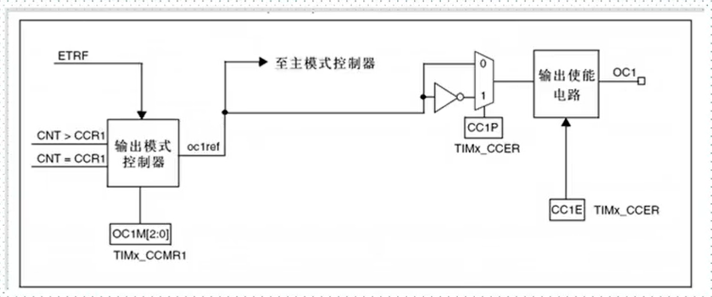
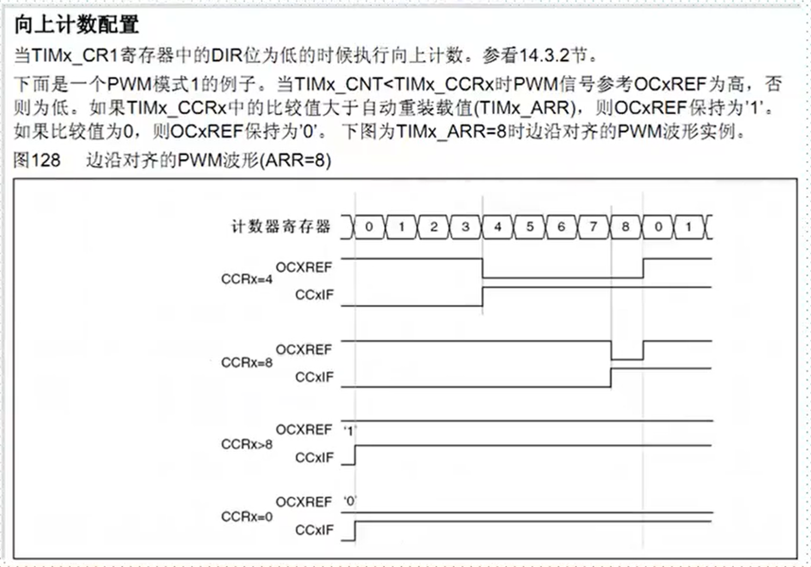

参考资料：

STM32F4开发指南-库函数版本_V1.1.pdf\第十四章 PWM 输出实验

8，STM32参考资料\STM32F4xx中文参考手册.pdf\第十六章  通用定时器（TIM9 到 TIM14） 

### 一、通用定时器PWM概述

（1）STM32 PWM工作过程

1. 原理我们假定定时器工作在向上计数 PWM模式，且当 CNT小于CCRx 时，输出 0，当 CNT>=CCRx 时输出 1。那么就可以得到如上的 PWM示意图：当 CNT 值小于 CCRx 的时候，IO 输出低电平(0)，当 CNT 值大于等于 CCRx 的时候，IO 输出高电平(1)，当 CNT 达到 ARR 值的时候，重新归零，然后重新向上计数，依次循环。改变 CCRx 的值，就可以改变 PWM 输出的占空比，改变 ARR 的值，就可以改变 PWM 输出的频率

   频率由ARR决定，占空比由CCRx决定

2. 工作过程

   

   CCR1：捕获比较（值）寄存器（x=1,2,3,4）设置比较值。
   CCMR1：OC1M[2:0]位
   对于PWM方式下，用于设置PWM模式1【110】或者PWM模式2【111】

   模式1：CNT<CCRx时为有效电平，否则为无效电平
   模式2：CNT>CCRx时为有效电平，否则为无效电平

   CCER：CC1P位：输入/捕获1输出极性。0：高电平有效，1：低电平有效。
   CCER：CC1E位：输入/捕获1输出使能。0：关闭，1：打开。

   

脉冲宽度调制模式可以生成一个信号，该信号频率由 TIMx_ARR 寄存器值决定，其占空比则由 TIMx_CCRx 寄存器值决定。通过向 TIMx_CCMRx 寄存器中的 OCxM 位写入 110 （PWM 模式 1）或 111 （PWM 模式2），可以独立选择各通道 （每个 OCx 输出对应一个 PWM）的 PWM 模式。必须通过将TIMx_CCMRx 寄存器中的 OCxPE 位置 1 使能相应预装载寄存器，最后通过将 TIMx_CR1寄存器中的 ARPE 位置 1 使能自动重载预装载寄存器（在递增计数或中心对齐模式下）。

### 二、常用寄存器和库函数配置

（1）寄存器

（2）库函数

void TIM_OCxPreloadConfig(TIM_TypeDef* TIMx, uint16_t TIM_OCPreload);	//使能输出比较预装载

void TIM_ARRPreloadConfig(TIM_TypeDef* TIMx, FunctionalState NewState);	//设置比较值函数

void TIM_ARRPreloadConfig(TIM_TypeDef* TIMx, FunctionalState NewState);	//使能自动重装载的预装载寄存器允许位

void TIM_OCxInit(TIM_TypeDef* TIMx, TIM_OCInitTypeDef* TIM_OCInitStruct);	//初始化函数

//结构体
TIM_OCInitStructure.TIM_OCMode = TIM_OCMode_PWM2; //PWM模式2
TIM_OCInitStructure.TIM_OutputState = TIM_OutputState_Enable; //比较输出使能
TIM_OCInitStructure. TIM_Pulse=100;
TIM_OCInitStructure.TIM_OCPolarity = TIM_OCPolarity_High; //输出极性:TIM输出比较极性高
TIM_OC2Init(TIM3, &TIM_OCInitStructure);  //根据T指定的参数初始化外设TIM3 OC2

ypedef struct
{
  uint16_t TIM_OCMode;  //PWM模式1或者模式2
  uint16_t TIM_OutputState; //输出使能 OR失能
  uint16_t TIM_OutputNState;
  uint16_t TIM_Pulse; //比较值，写CCRx
  uint16_t TIM_OCPolarity; //比较输出极性
  uint16_t TIM_OCNPolarity;
  uint16_t TIM_OCIdleState;
  uint16_t TIM_OCNIdleState;
} TIM_OCInitTypeDef;

### 三、PWM输出实验

（1）PWM输出配置步骤

- 使能定时器14和相关IO口时钟

  使能定时器14时钟：RCC_APB1PeriphClockCmd();

  使能GPIO时钟：RCC_AHB1PeriphClockCmd ();

- 初始化IO口为复用输出功能：GPIO_Init();

- GPIOF9复用映射到定时器F14： GPIO_PinAFConfig(GPIOF,GPIO_PinSource9,GPIO_AF_TIM14); 

- 初始化定时器：ARR，PSC等：TIM_TimeBaseInit();

- 初始化输出比较参数：TIM_OC1Init();

- 使能预装载寄存器：TIM_OC1PreloadConfig(TIM14, TIM_OCPreload_Enable); 

- 使能自动重装载的预装载寄存器允许位：TIM_ARRPreloadConfig(TIM14,ENABLE);

- 使能定时器：TIM_Cmd();

- 不断改变比较值CCRx，达到不同占空比效果：TIM_SetCompare1();

（2）代码

STM32F407高级定时器：

~~~
void TIM1_CH1_PWM_Init(u16 per,u16 psc)
{
	GPIO_InitTypeDef GPIO_InitStructure;
	TIM_TimeBaseInitTypeDef  TIM_TimeBaseStructure;
	TIM_OCInitTypeDef  TIM_OCInitStructure;
 
	RCC_APB2PeriphClockCmd(RCC_APB2Periph_TIM1, ENABLE);
 	RCC_APB2PeriphClockCmd(RCC_APB2Periph_GPIOA , ENABLE);  
	                                                                     	
	GPIO_InitStructure.GPIO_Pin = GPIO_Pin_8; 
	GPIO_InitStructure.GPIO_Mode = GPIO_Mode_AF_PP;  
	GPIO_InitStructure.GPIO_Speed = GPIO_Speed_50MHz;
	GPIO_Init(GPIOA, &GPIO_InitStructure);
	
	TIM_TimeBaseStructure.TIM_Period = per; 
	TIM_TimeBaseStructure.TIM_Prescaler =psc; 
	TIM_TimeBaseStructure.TIM_ClockDivision = 0; 
	TIM_TimeBaseStructure.TIM_CounterMode = TIM_CounterMode_Up;  
	TIM_TimeBaseInit(TIM1, &TIM_TimeBaseStructure); 

	//此处结构体必须全部配置，否则输出不了PWM波！！！！
	TIM_OCInitStructure.TIM_Pulse = 0; 		//待装入捕获比较寄存器的脉冲值
	TIM_OCInitStructure.TIM_OCMode = TIM_OCMode_PWM1;  //TIM1脉冲宽度调制模式1
	TIM_OCInitStructure.TIM_OutputState = TIM_OutputState_Enable;//使能输出比较状态
	TIM_OCInitStructure.TIM_OutputNState = TIM_OutputNState_Enable;//使能输出比较N状态
	TIM_OCInitStructure.TIM_OCPolarity = TIM_OCPolarity_High;//TIM1 输出比较极性高
	TIM_OCInitStructure.TIM_OCNPolarity = TIM_OCNPolarity_High;//TIM1 输出比较N极性高
	TIM_OCInitStructure.TIM_OCIdleState = TIM_OCIdleState_Reset;//当 MOE=0 重置 TIM1 输出比较空闲状态
	TIM_OCInitStructure.TIM_OCNIdleState = TIM_OCNIdleState_Reset;//当 MOE=0 重置 TIM1 输出比较 N 空闲状态
	TIM_OC1Init(TIM1, &TIM_OCInitStructure); //输出比较通道1初始化  
 
	TIM_OC1PreloadConfig(TIM1, TIM_OCPreload_Enable);//使能TIMx在 CCR1 上的预装 
	TIM_ARRPreloadConfig(TIM1, ENABLE);//使能预装载寄存器
	
	TIM_CtrlPWMOutputs(TIM1,ENABLE);
	TIM_Cmd(TIM1, ENABLE);  //使能定时器	
}

~~~

