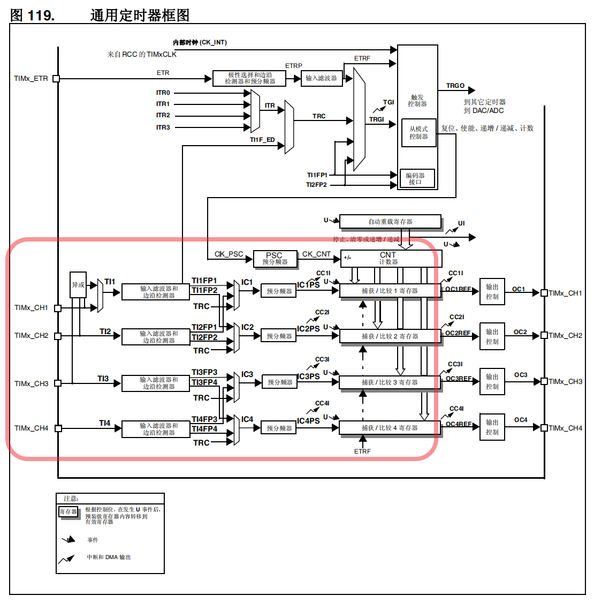
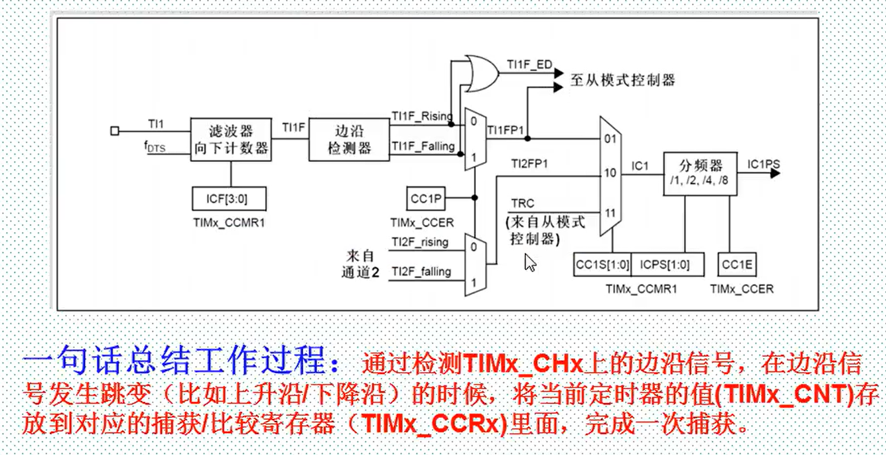
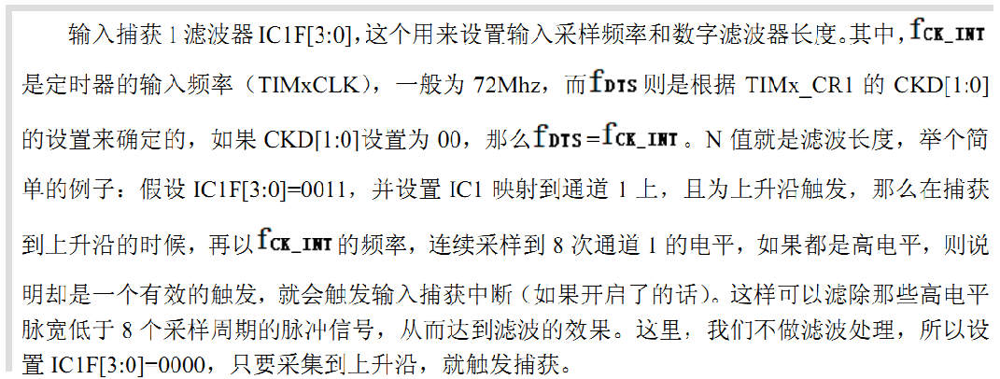
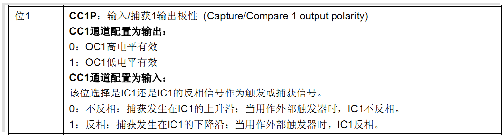
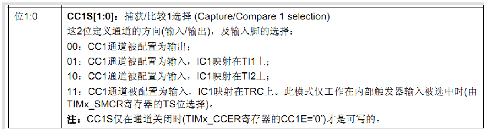
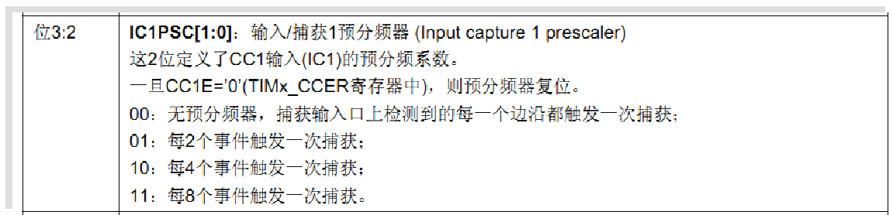
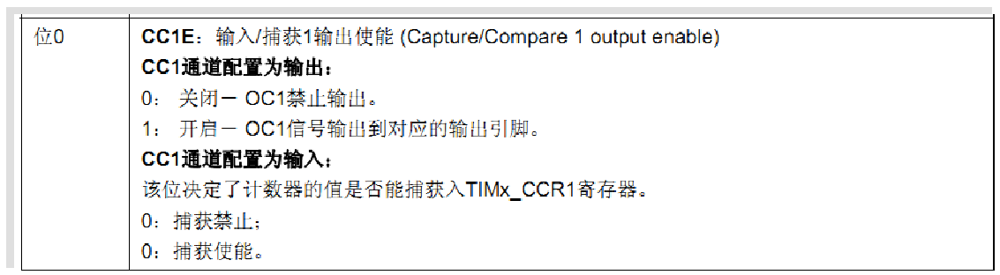
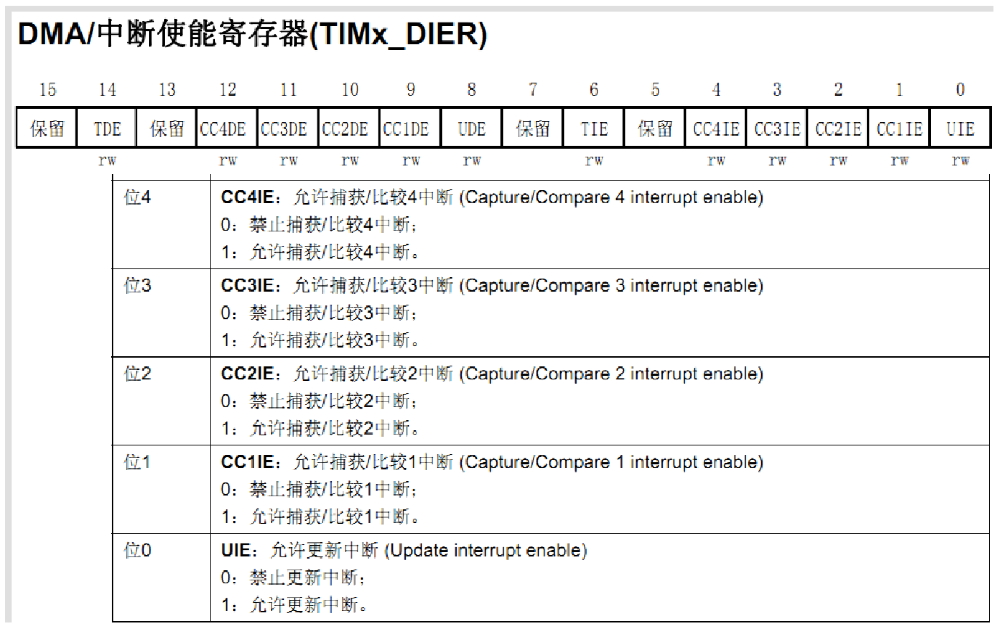

参考资料：

STM32F4开发指南-库函数版本_V1.1.pdf\第十五章 输入捕获实验 

8，STM32参考资料\STM32F4xx中文参考手册.pdf\第十五章  通用定时器（TIM2 到 TIM5）

### 一、通用定时器输入捕获概述



（1）STM32输入捕获工作过程（通道一为例）


1. 步骤一

   设置输入捕获滤波器
   

   2. 步骤二
      设置输入捕获极性
      
   3. 步骤三
      设置捕获映射通道
      
   4. 步骤四
      设置输入捕获分频器
      
      
   5. 步骤五
      捕获到有效的信号可以开启中断
      

### 二、常用寄存器和库函数配置

（1）库函数

1. 初始化函数：
   void TIM_ICInit(TIM_TypeDef* TIMx, TIM_ICInitTypeDef* TIM_ICInitStruct);

   结构体：typedef struct
   {
     uint16_t TIM_Channel; //捕获通道1-4
     uint16_t TIM_ICPolarity; //捕获极性
     uint16_t TIM_ICSelection; //映射关系
     uint16_t TIM_ICPrescaler; //分频系数
     uint16_t TIM_ICFilter;  //滤波器
   } TIM_ICInitTypeDef;

   示例：

   ```c
   TIM_TimeBaseInitTypeDef  TIM5_ICInitStructure;
   
   TIM5_ICInitStructure.TIM_Channel = TIM_Channel_1; TIM5_ICInitStructure.TIM_ICPolarity = TIM_ICPolarity_Rising;
   TIM5_ICInitStructure.TIM_ICSelection = TIM_ICSelection_DirectTI;
   TIM5_ICInitStructure.TIM_ICPrescaler = TIM_ICPSC_DIV1;
   TIM5_ICInitStructure.TIM_ICFilter = 0x00;
   TIM_ICInit(TIM5, &TIM5_ICInitStructure);
   
   TIM_TimeBaseInit(TIM5,&TIM5_ICInitStructure);
   ```

2. 通道极性设置独立函数

   void TIM_OCxPolarityConfig(TIM_TypeDef* TIMx, uint16_t TIM_OCPolarity);

3. 获取通道捕获值
   uint32_t TIM_GetCapture1(TIM_TypeDef* TIMx);

### 三、输入捕获实验

（1）输入捕获配置一般步骤

1. 初始化定时器和通道对应IO口的时钟

   RCC_APB1PeriphClockCmd();
   RCC_AHB1PeriphClockCmd();

2. 初始化IO口，模式为复用

   GPIO_Init();

3. 设置引脚复用映射

   GPIO_PinAFConfig();

4. 初始化定时器ARR，RSC

   TIM_TimeBaseInit();

5. 初始化输入捕获通道

   TIM_OC1Init();

6. 如果需要开启捕获中断

   TIM_ITConfig();
   TIM_ICInit();

7. 使能定时器

   TIM_Cmd();

8. 编写中断服务函数

    TIMx_IRQHandler();

（2）代码讲解

看视频