### 一、简介

模数转换

- 三位独立的ADC1/2/3
- 分辨率有12/10/8/6可选
- 每个ADC具有18个通道，其中外部通道16个

### 二、ADC功能框图

（1）电压输入范围

输入电压：VREF- ≤ VIN ≤ VREF+
决定输入电压的引脚：VREF-、 VREF+ 、 VDDA 、 VSSA
VSSA 和 VREF-接地，把 VREF+和 VDDA 接 3V3，得到ADC 的输入电压范围为： 0~3.3V。

如何测量-10V到+10V

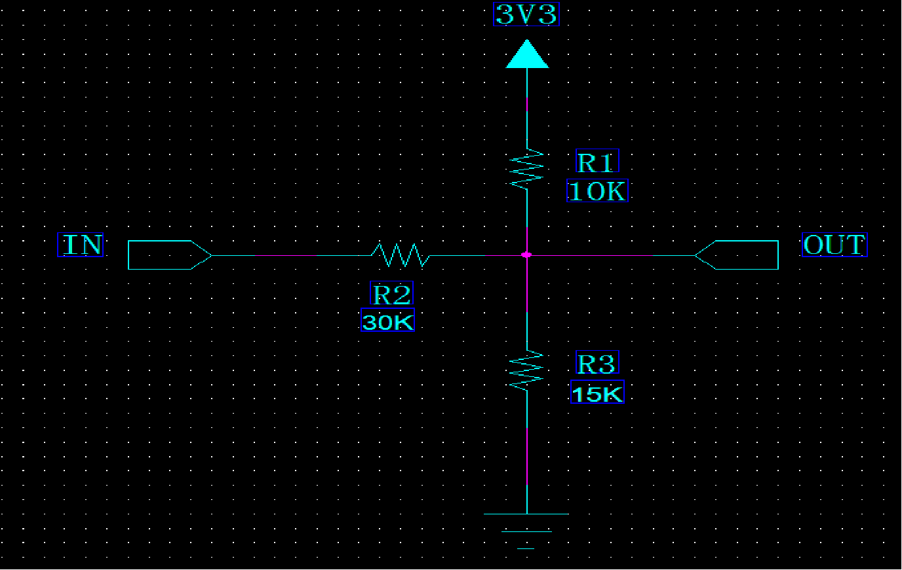

根据基尔霍夫定律（KCL），节点流入的电流等于流出的电流
(Vint – Vout)/R2 + (3V3-Vout)/R1 = Vout / R3
Vout = (Vint + 10) /6

（2）输入通道
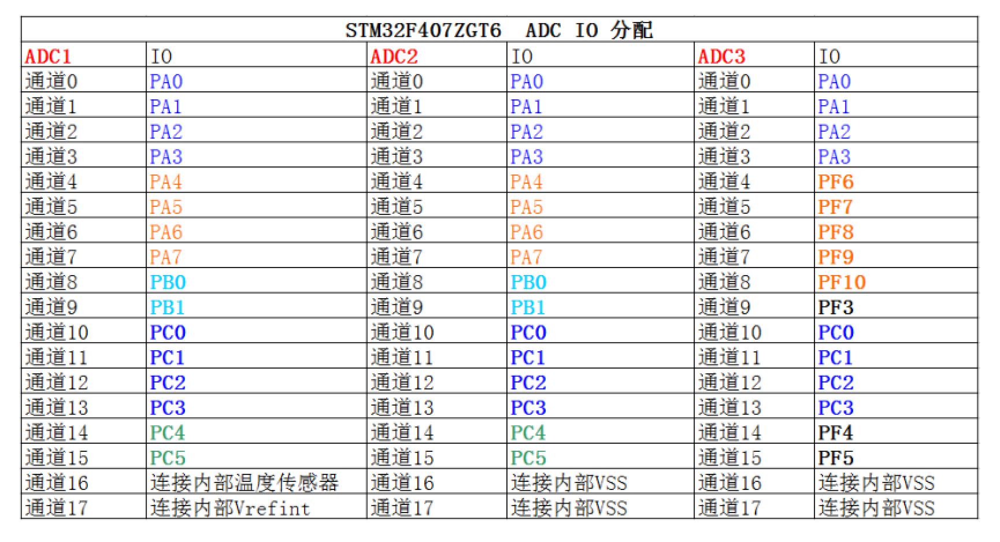

144脚芯片，24个引脚可用。小于144引脚的芯片只有16个通道。

输入通道分类：
规则通道：顾名思意，规则通道就是很规矩的意思，我们平时一般使用的就是这个通道。
注入通道：注入，可以理解为插入，插队的意思，是一种不安分的通道。它是一种在规则通道转换的时候强行插入要转换的一种。这点跟中断程序很像。所以，注入通道只有在规则通道存在时才会出现。注入又分为==触发注入和自动注入==。

有了规则通道，为什么还要注入通道：

例如你需要测算实时的温度信息，但不测算实时的湿度信息，只是每个5分钟更新一次，这时一组规则通道显然不能达到我们的需求，但是用规则通道可以完美解决这个问题，我们可每隔5分钟在测量温度的规则通道中插入一次注入通道，用于测算湿度信息。

（3）转换顺序

此处用于设置通道组，例如设置通道组转换的通道个数为3，通道组为为通道1、通道5、通道4

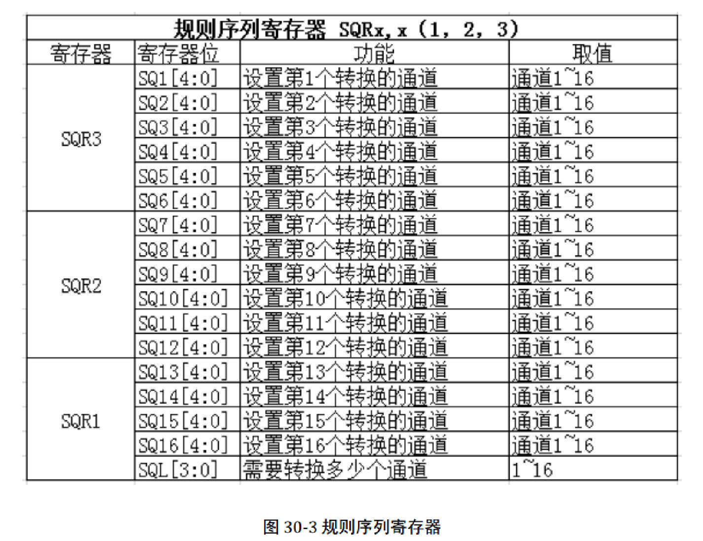
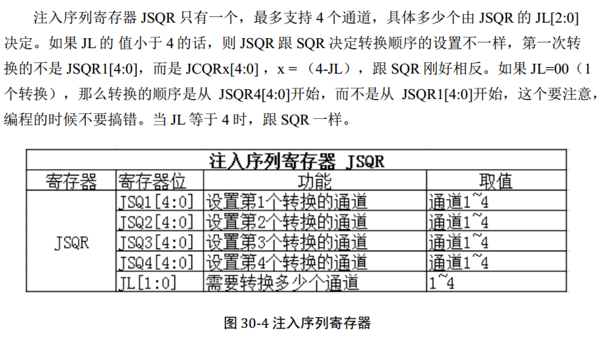

（4）触发源

1. 软件触发

   ADC 控制寄存器 2 (ADC_CR2）

   ​	SWSTART：开始转换规则通道0：复位状态  1：开始转换规则通道

   ​	JSWSTART：开始转换注入通道0：复位状态  1：开始转换注入通道

2. 外部事件触发

   内部定时器/外部IO
   ADC 控制寄存器 2 (ADC_CR2）
   	EXTSEL[3:0]：为规则组选择外部事件
   	JEXTSEL[3:0]：为注入组选择外部事件
   	EXTEN：规则通道的外部触发使能 
   	JEXTEN：注入通道的外部触发使能

（5）转换时间

转换时间：Tconv = 采样时间 + 12 个周期（12位）
ADC_CLK：ADC模拟电路时钟，最大值为36M，由PCLK2提供，还可分频，2/4/6/8，ADC_CCR 的 ADCPRE[1:0]设置。PCLK2=84M。所以一般情况下可使用的时钟为21MHz。使用144MHz，可使用36MHz。
数字时钟：RCC_APB2ENR，用于访问寄存器。

PCLK2 = 84M，ADC_CLK = 84/4 = 21M
Tconv = 3+12 = 15周期 = 15/21us=0.71us

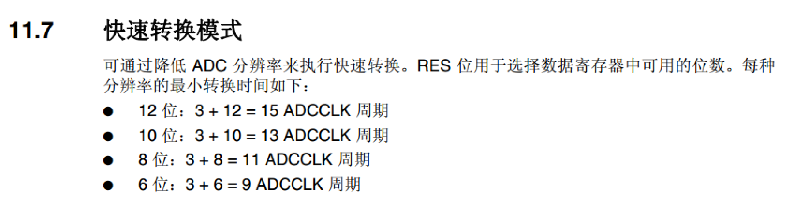

采样时间：ADC 需要若干个 ADC_CLK 周期完成对输入的模拟量进行采样，==采样的周期数可通过ADC 采样时间寄存器== ADC_SMPR1 和 ADC_SMPR2 中的 SMP[2:0]位设置， ADC_SMPR2控制的是通道 0~9， ADC_SMPR1 控制的是通道 10~17。每个通道可以分别用不同的时间采样。==其中采样周期最小是 3 个==，即如果我们要达到最快的采样，那么应该设置采样周期为 3 个周期，这里说的周期就是 1/ADC_CLK。

采样率，决定了ADC能采集多大频率的信号

（6）转换方式

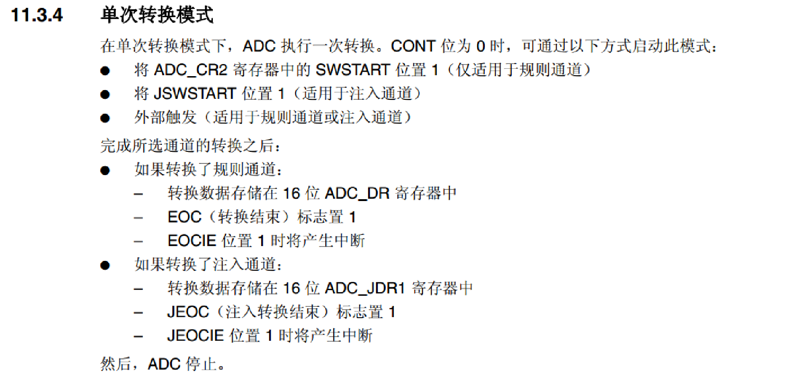

单次转换模式：转换完选定的一个通道，停止，等待下一次开启

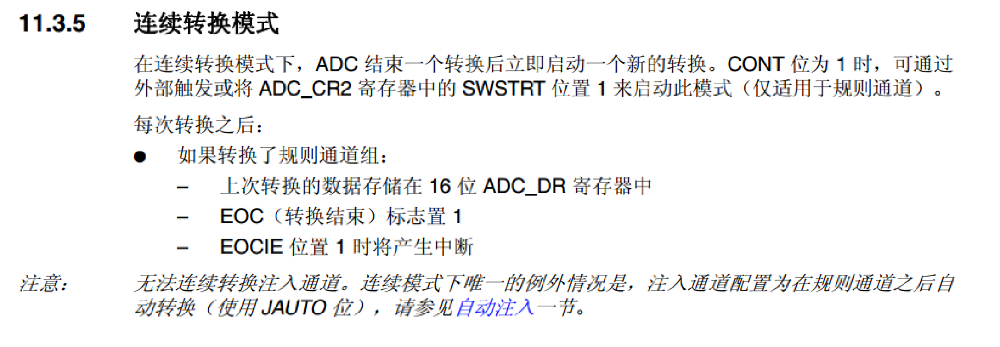

连续转换模式：转换完一个选定的通道，然后继续转换

连续转换中还要注意一个不连续采样模式[11.3.10章节]

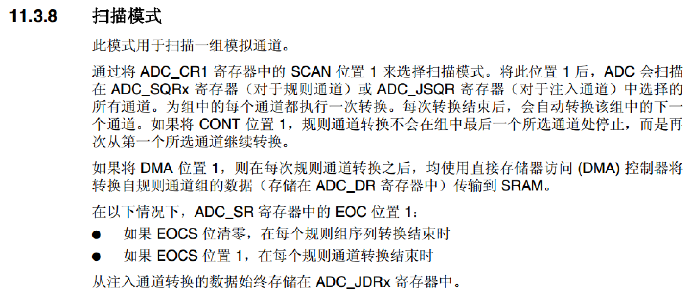

扫描单次模式：扫描完一次通道组，停止，等待下一次开始
扫描连续模式：扫描完一次通道组后，然后继续转换该通道组

（7）数据寄存器

一切准备就绪后， ADC 转换后的数据根据转换组的不同，规则组的数据放在ADC_DR 寄存器，注入组的数据放在 JDRx。 如果是使用双重或者三重模式那规矩组的数据是存放在通用规则寄存器 ADC_CDR 内的。

一般使用右对齐，多通道采集最好使用DMA，不使用中断

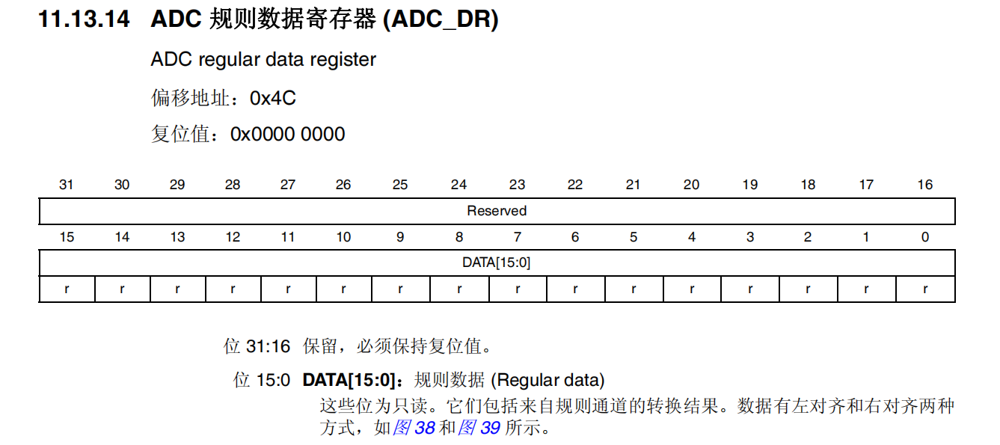

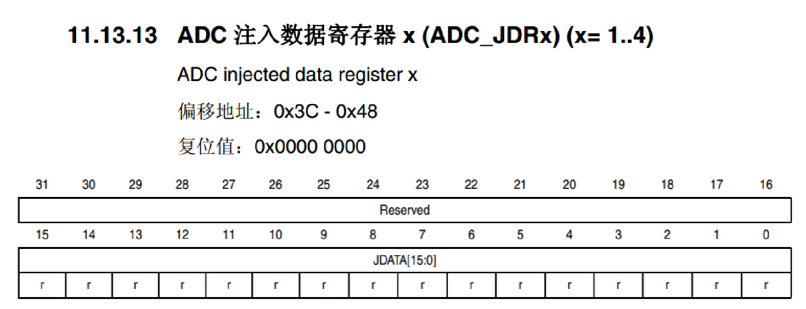

必须配合DMA使用

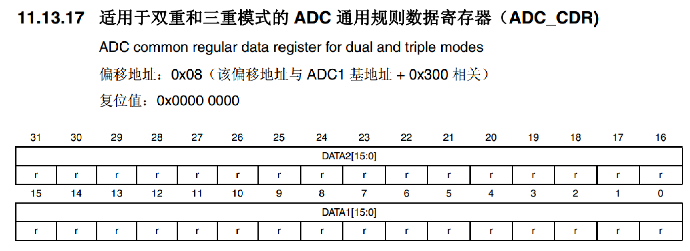

（8）中断

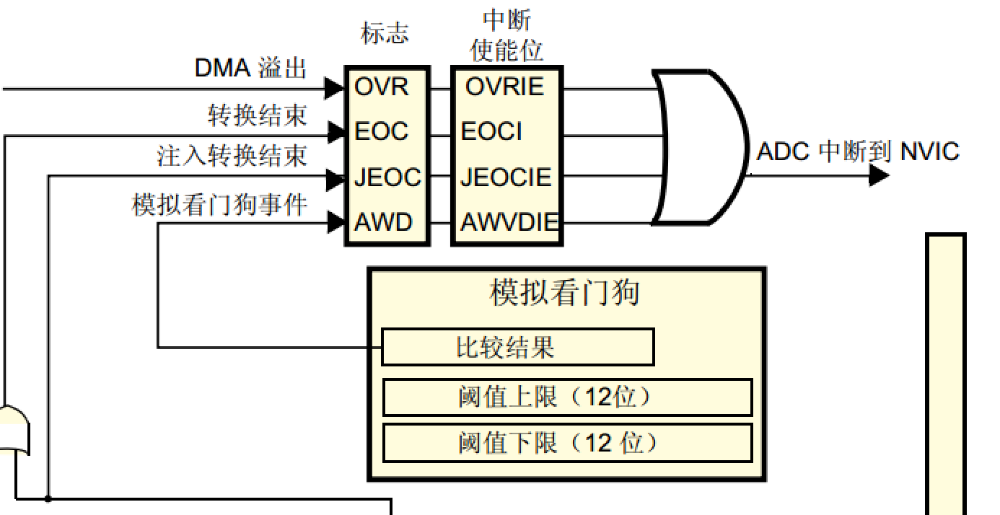

（9）看门狗

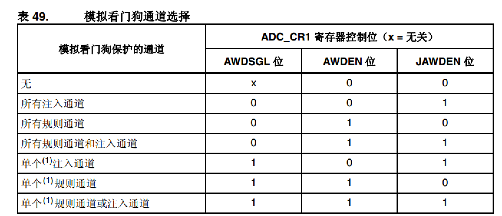

（10）电压转换

怎么根据数据量算出模拟量：
电压输入范围为：0~3.3V
分辨率为12位
最小精度为：3.3/2^12、
设数字量为X，则有模拟量 Y = (3.3 / 2^12)*X

### 三、多重ADC工作模式

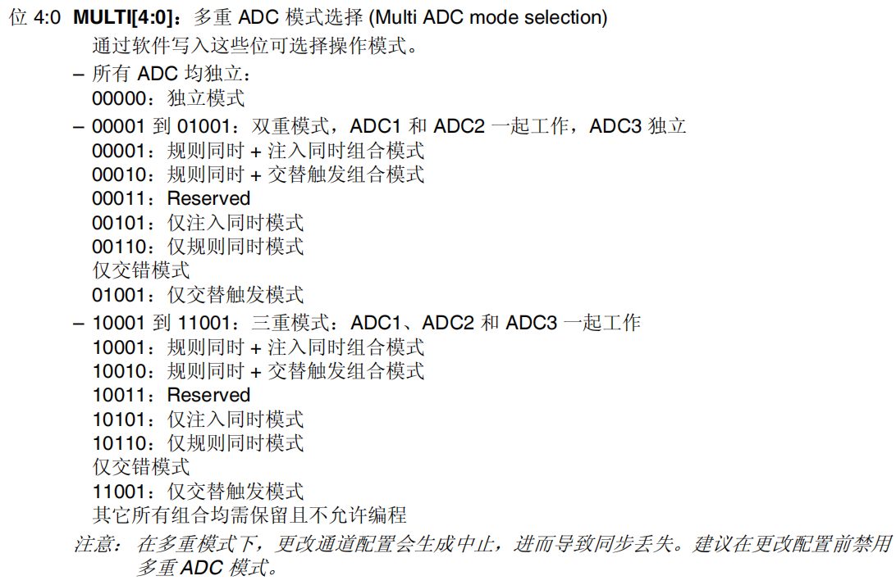

（1） 独立模式 

- 只有一个ADC工作，可以是ADC1/2/3
- 可以单通道，可以多通道
- 转换的数据放在ADC_DR数据寄存器，可以采用中断和DMA接受数据

（2）双重规则同步模式

- 规则指的是只适用于规则通道，注入通道不行
- 同步指的是两个/三个ADC同时采集多个通道，比如示波器的双通道同时采集。
- 注意：不要在同步模式时采集同一个通道

（3）多重交替模式（一般是几个ADC采集一个通道）

- 交替模式只能用于规则组，通常只有一个通道，在一个ADC转换的时候，另外一个ADC又开始采集，这样可以提高ADC的采样率，最高为6M
- 数据传输时使用DMA模式2，当有两个数据项可用时（32bit），生成一个DMA请求。

