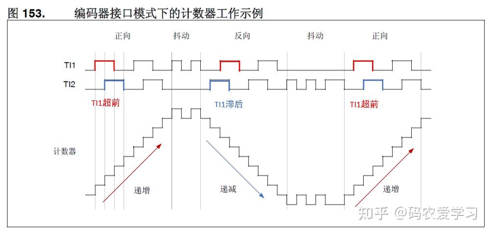
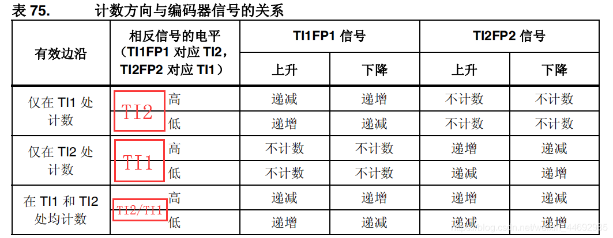
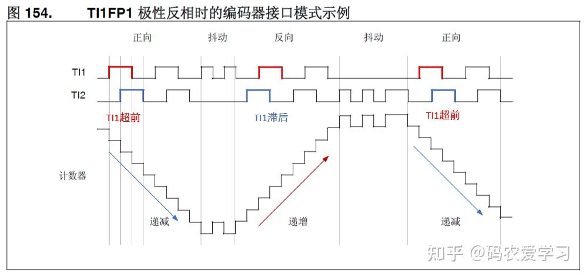
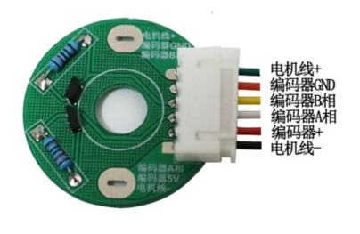

[电机控制基础——定时器编码器模式使用与转速计算 - 知乎 (zhihu.com)](https://zhuanlan.zhihu.com/p/355346491) 

[(12条消息) 带编码器的直流减速电机——基于STM32F407_谁还不是个程序猿的博客-CSDN博客_带编码器的直流电机](https://blog.csdn.net/weixin_44692935/article/details/97419594) 

8，STM32参考资料\STM32F4xx中文参考手册.pdf\15.3.12 编码器接口模式

###  一、编码器概述

（1）编码器

将电机的转动信号转换成脉冲信号的设备，可分为光电编码器、霍尔编码器。有了编码器，我们可以获取电机的转动角度、转速等信息。

（2）原理

电机带动码盘转动，码盘会在电机转动时产生A、B两相的脉冲信号，且这两路脉冲信号的相位差为90度，即正交。因此可以根据两个信号哪个先哪个后来判断方向，根据每个信号脉冲数量的多少及每圈电机产生多少脉冲数就可以算出当前行走的距离，如果再加上定时器的话还可以计算出速度。 

（3）如何使用32采集脉冲信息

如果使用GPIO直接采集信号，因为外界的干扰，可能导致信号产生不同程度的失真，所以我们可以使用32内部自带的输入捕获模块。它自带滤波，而且使用也十分简单。

```C
		//电机1编码器  PA6,PA7   TIM3
	GPIO_InitTypeDef GPIO_InitStructure;
	
	RCC_APB1PeriphClockCmd(RCC_APB1Periph_TIM3,ENABLE);//使能定时器3时钟
	RCC_APB1PeriphClockCmd(RCC_AHB1Periph_GPIOA,ENABLE);//使能PA端口
	
	GPIO_InitStructure.GPIO_Pin=GPIO_Pin_6|GPIO_Pin_7;//端口配置
	GPIO_InitStructure.GPIO_Speed=GPIO_Speed_100MHz;//端口输出速度100MHz
	GPIO_InitStructure.GPIO_Mode=GPIO_Mode_AF;//端口复用
	GPIO_InitStructure.GPIO_OType=GPIO_OType_PP;//挽推输出
	GPIO_InitStructure.GPIO_PuPd=GPIO_PuPd_NOPULL;//浮空
	GPIO_Init(GPIOA,&GPIO_InitStructure);
	
	GPIO_PinAFConfig(GPIOA, GPIO_PinSource6, GPIO_AF_TIM3);//PA6复用映射到TIM3
	GPIO_PinAFConfig(GPIOA, GPIO_PinSource7, GPIO_AF_TIM3);//PA7复用映射到TIM4
	
	TIM_EncoderInterfaceConfig(TIM3,TIM_EncoderMode_TI12,TIM_ICPolarity_Rising,TIM_ICPolarity_Rising);
	//编码器模式的配置函数，第一个入口参数为指定定时器，第二个是设置编码器的模式，第三个是设置捕获极性
	TIMx
	
	//当模式选为TIM_EncoderMode_TI1时，计数器仅在TI1的边沿处计数
	//当模式选为TIM_EncoderMode_TI2时，计数器仅在TI2的边沿处计数
	//当模式选为TIM_EncoderMode_TI12时，计数器在TI1和TI2边沿处均计数//四倍频
	
	//TIM_ICPolarity_Rising，上升沿捕获
	//TIM_ICPolarity_Falling，下降沿捕获
	//TIM_ICPolarity_BothEdge，上升下降沿均捕获
	
	TIM_SetCounter(TIM3,0);//指定计数器寄存器值为0
	TIM_Cmd(TIM3,ENABLE);//使能定时器3
```

### 二、采集信号的处理

（1）通过脉冲判断转动角度

由于电机发出的脉冲数每转都是一定的，所以我们可以使用电机产生的脉冲数除以电机电机每转产生的脉冲数，可以得到电机的转动角度。

由于在四分频是捕获的信号数量是脉冲数的四倍，所以使用捕获的信号数量除以四等于电机产生的脉冲数。

（2）通过脉冲判断电机转速

计数器的计数方向代表的电机的正转与反转，计数的大小代表了转速的大小。

如下图，电机正转时，编码器的通道A（TI1）的信号超前通道B，计数器向上计数，反转时，通道A的信号滞后，向下计数。

设置信号的极性反相，可以使向下计数代表电机正转。 



假设此时是TI1上升沿捕获，但TI1处于上升沿时，观察TI2的电平，并对照表格看。
可知，TI1上升沿捕获时，若TI2信号为低，则向上计数，以此类推，TI1下降沿捕获时，若TI2信号为高，则向上计数。

如果在CCER寄存器配置极性，我们可以确定向上计数时是正转还是反转。




### 三、通过PWM控制直流电机

直流电机的编码器上有六根线，其中编码器+和编码器GND用于给编码器供电；电机线+和电机线-用于给直流电机供电；编码器A相和编码器B相用于读取编码器此时的速度。

我们可以通过控制电机线+和电机线-的电压值来控制电机的转速。若12V时电机满速转动，那么给5V时转速就只有5/12的满速。

利用这个原理，我们可以通过PWM波控制直流电机的速度。

我们可以修改PWM波的占空比，使一个周期内的平均电压发生改变。当一个周期内平均电压高时，那么电机转的就快；当一个周期内平均电压低时，电机转的就慢。



如何实现正反转：

当电源正接时，电机正转；电源反接时，电机反转。

电机线+（1）电机线-（0），实现了电机的正转。
电机线+（0）电机线-（1），实现了电机的反转。
电机线+（0）电机线-（0），停转
电机线+（1）电机线-（1），停转
阻值小（PWM占空比大，平均电压大），转的快
阻值大（PWM占空比小，平均电压小），转的慢
注：0和1代表低电平和高电平。

但是，由于STM32输出电压太小，不足以驱动直流电机，所以我们一般使用电机驱动模块（这里我们使用L298N）来驱动电机。

[L298N 电机驱动板 - 详细介绍 - 知乎 (zhihu.com)](https://zhuanlan.zhihu.com/p/346930154) 

[(12条消息) PWM如何控制直流电机_咸鱼箘的博客-CSDN博客_pwm怎么控制电机](https://blog.csdn.net/weixin_45020839/article/details/124609925) 

[直流电机PWM频率的确定](直流电机PWM频率的确定.pdf)


