参考资料：

F407_霸天虎\[野火]《STM32库开发实战指南》\F407_霸天虎\PPT\3-高级篇\MPU6050传感器—姿态检测

F407_霸天虎\[野火]《STM32库开发实战指南》\F407_霸天虎\标准库_配套代码\52加速度陀螺仪—MPU6050（包含程序+上位机）\程序

### 一、姿态检测的基本概念

####（1）姿态角

横滚角（roll）、俯仰角（pitch）、偏航角（yaw）

姿态是“载体坐标系”和“地理坐标系”的转换关系

地球坐标系：以地球球心为原点，Z轴沿地球自转轴方向，X、Y轴在赤道平面内的坐标系。

地理坐标系：东南西北

载体坐标系：以一辆车的前后（x）、左右（y）、上下（z）、作为坐标系

https://www.bilibili.com/video/BV11541177Tb

####（2）陀螺仪检测角度

陀螺仪可以检测物体绕坐标轴旋转的角速度，通过对时间积分可以求出旋转的角度

检测缺陷：

由于测量角度时使用积分，所以会存在积分误差，若积分时间越小，则积分误差越少。所以需要提高采样频率，MPU6050的采样频率可达8KHz。

但除此自外，器件自身的误差也是一个棘手的问题。只有当正方向的误差和负方向的误差刚好能正好抵消时，才能消除。

####（3）陀螺仪检测角加速度

加速度传感器检测倾角，它通过检测器件在各个方向的形变情况而采样得到受力数据，根据F=ma转换，传感器直接输出加速度数据。当传感器的姿态不同时，它在自身各个坐标轴检测到的重力加速度是不一样的，利用各方向的测量结果，根据力的分解原理，可求出各个坐标轴与重力之间的夹角。

加速度传感器检测的缺陷：

无法检测到偏航角

加速度传感器并不会区分重力加速度与外力加速度

为了弥补加速度传感器无法检测偏航角(Yaw)的问题，我们再引入磁场检测传感器

磁场检测器的缺陷：

与指南针的缺陷一样，使用磁场传感器会受到外部磁场干扰，如载体本身的电磁场干扰，不同地理环境的磁铁矿干扰等等。

####（4）姿态融合和四元数

可以发现，使用陀螺仪检测角度时，在静止状态下存在缺陷，且受时间影响，而加速度传感器检测角度时，在运动状态下存在缺陷，且不受时间影响，刚好互补。假如我们同时使用这两种传感器，并设计一个滤波算法，当物体处于静止状态时，增大加速度数据的权重，当物体处于运动状时，增大陀螺仪数据的权重，从而获得更准确的姿态数据。（滤波算法：一般使用互补滤波或者卡尔曼滤波。 ）

同理，检测偏航角，当载体在静止状态时，可增大磁场检测器数据的权重，当载体在运动状态时，增大陀螺仪和GPS检测数据的权重。这些采用多种传感器数据来检测姿态的处理算法被称为姿态融合。

在姿态融合解算的时候常常使用“四元数”来表示姿态，它由三个实数及一个虚数组成，因而被称之为四元数。使用四元数表示姿态并不直观，但因为使用欧拉角(即前面说的偏航角、横滚角及俯仰角)表示姿态的时候会有“万向节死锁”问题，且运算比较复杂，所以一般在数据处理的时候会使用四元数，处理完毕后再把四元数转换成欧拉角。

也就是说，四元数是姿态角的另一种表示方式，感兴趣的话可自行查阅相关资料。

### 二、传感器的工作原理和及参数

####（1）传感器工作原理

传感器一般是指把物理量转化成电信号量的装置。

即

​	被测物理量$\rightarrow$敏感元件$\rightarrow$转换电路$\rightarrow$变换电路$\rightarrow$电信号量

####（2）传感器参数

传感器一般使用精度、分辨率、采样频率这些参数来进行比较

|   参数   |                    说明                    |
| :------: | :----------------------------------------: |
| 线性误差 | 指传感器测量值与真实物理量之间的拟合度误差 |
|  分辨率  |      指传感器可检测到的最小物理量单位      |
| 采样频率 |           指单位时间内的采样次数           |

####（3）物理量的表示方法

在实际应用中，常常直接用ADC每位表征的物理量值来表示分辨率，如每位代表20厘米，我们称它的分辨率为1LSB/20cm，它等效于5位表示1米：5LSB/m。其中的LSB（Least Significant Bit），意为最ADC的低有效位。

### 三、MPU6050传感器介绍

####（1）简介

能同时检测三轴加速度、三轴陀螺仪(三轴角速度)的运动数据以及温度数据。

利用MPU6050芯片内部的DMP模块（Digital Motion Processor数字运动处理器），可对传感器数据进行滤波、融合处理，它直接通过I2C接口向主控器输出姿态解算后的姿态数据，降低主控器的运算量。

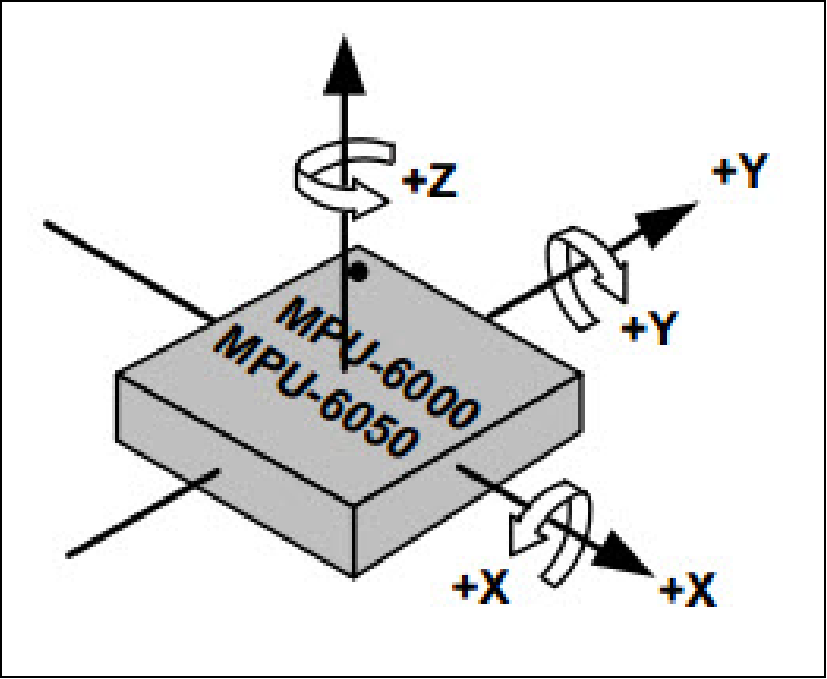

####（2）特性参数

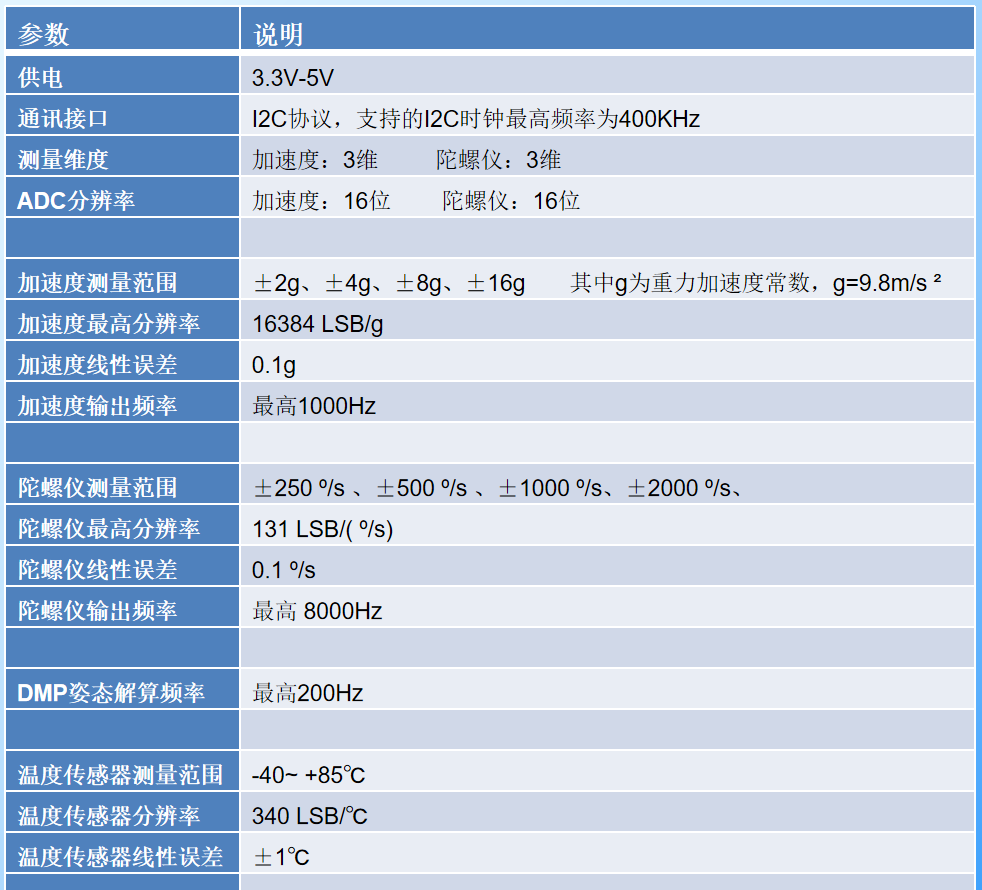

####（3）引脚和寄存器介绍

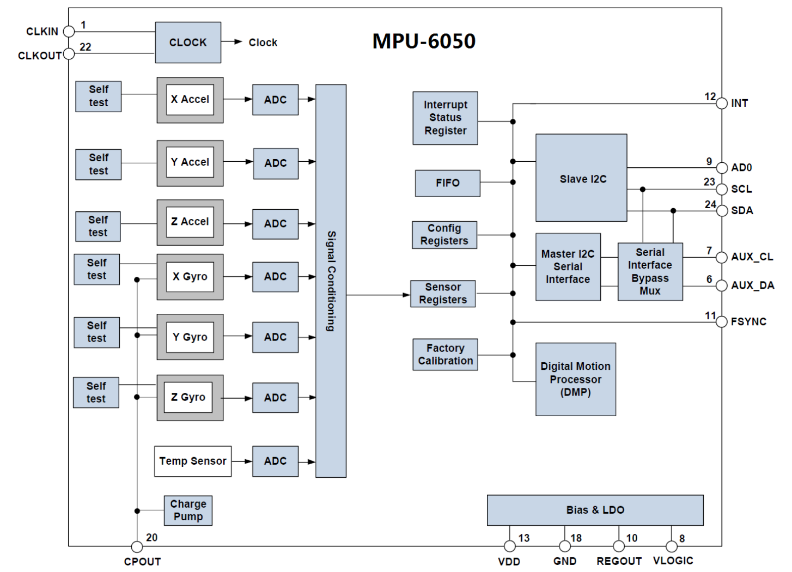

12引脚是中断输出引脚，23、24引脚是主$I^2C$，MCU通过它控制MPU6050，6、7是从$I^2C$，作用是外接其他设备，例如磁力传感器，一起构成9轴传感器。VLOGIC 是 IO 口电压，该引脚最低可以到 1.8V，我们一般直接接 VDD 即可。

9引脚的AD0决定了它的设备地址（==注：并非读写地址==），110	100__，最后一位由输入AD0的信号决定
输入高电平时地址为110	1001 = 0x69，七位地址
输入低电平时地址为110	1000 = 0x68，七位地址

##### 电源管理寄存器

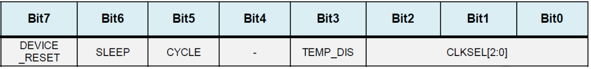

地址：0X6B 

DEVICE_RESET 位用来控制复位，设置为 1，复位 MPU6050，复位结束后，MPU硬件自动清零该位SLEEEP 位用于控制 。MPU6050 的工作模式，复位后，该位为 1，即进入了睡眠模式（低功耗），所以我们要清零该位，以进入正常工作模式。TEMP_DIS 用于设置是否使能温度传感器，设置为 0，则使能。
最后 CLKSEL[2:0]用于选择系统时钟源。
000				内部 8M RC 晶振
001				PLL，使用 X 轴陀螺作为参考
010				PLL，使用 Y 轴陀螺作为参考
011				PLL，使用 Z 轴陀螺作为参考
100				PLL，使用外部 32.768Khz 作为参考
101				PLL，使用外部 19.2Mhz 作为参考
110				保留
111				关闭时钟，保持时序产生电路复位状态

由于内部 8M RC 晶振精度不准确，所以我们一般选择 X/Y/Z 轴陀螺作为参考的 PLL 作为时钟源，一般选择001即可

##### 电源管理寄存器2

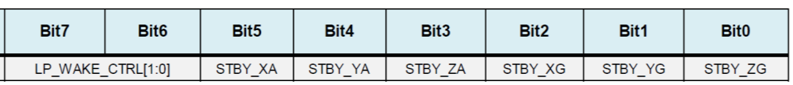

地址：0X6C

 LP_WAKE_CTRL 用于控制低功耗时的唤醒频率

剩下的 6 位，分别控制加速度和陀螺仪的 x/y/z 轴是否进入待机模式

##### 陀螺仪配置寄存器

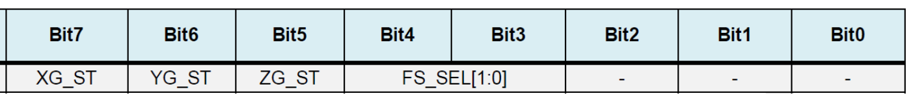

地址：0X1B 

FS_SEL[1:0]这两个位，用于设置陀螺仪的满量程范围：0，±250°/S；1，±500°/S；2，±1000°/S；3，±2000°/S

我们一般设置为 3，即±2000°/S，因为陀螺仪的 ADC 为 16 位分辨率，所以得到灵敏度为：65536/4000=16.4LSB，即每一度变化可以分为16.4份。即每一g变化可以分为16384份。

##### 加速度传感器配置寄存器

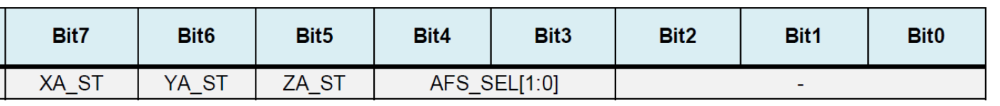

地址：0X1C

AFS_SEL[1:0]这两个位，用于设置加速度传感器的满量程范围：0，±2g；1，±4g；2，±8g；3，±16g

我们一般设置为 0，即±2g，因为加速度传感器的ADC 也是 16 位，所以得到灵敏度为：65536/4=16384LSB/g。

##### FIFO使能寄存器

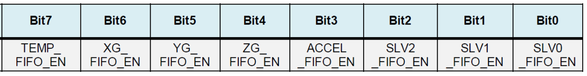

地址：0X23

在简单读取传感器数据的时候，可以不用 FIFO，设置对应位为 0 即可禁止 FIFO，设置为 1，则使能 FIFO。

注：加速度传感器的 3 个轴，全由 1 个位（ACCEL_FIFO_EN）控制，只要该位置 1，则加速度传感器的三个通道都开启 FIFO

补充资料，可以不用了解

FIFO( First Input First Output)简单说就是指先进先出。由于微电子技术的飞速发展，新一代FIFO芯片容量越来越大，体积越来越小，价格越来越便宜。作为一种新型大规模集成电路，FIFO芯片以其灵活、方便、高效的特性，逐渐在高速数据采集、高速数据处理、高速数据传输以及多机处理系统中得到越来越广泛的应用。在系统设计中，以增加数据传输率、处理大量数据流、匹配具有不同传输率的系统为目的而广泛使用FIFO存储器，从而提高了系统性能。FIFO存储器是一个先入先出的双口缓冲器，即第一个进入其内的数据第一个被移出，其中一个是存储器的输入口，另一个口是存储器的输出口。对于单片FIFO来说，主要有两种结构：触发导向结构和零导向传输结构。触发导向传输结构的FIFO是由寄存器阵列构成的，零导向传输结构的FIFO是由具有读和写地址指针的双口RAM构成。详见这篇博客：[FIFO工作原理](https://blog.csdn.net/qq_26652069/article/details/90765269)


##### 配置寄存器

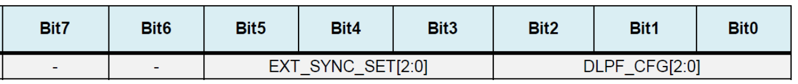

地址：0X1A

主要看数字低通滤波器（DLPF）的设置位，DLPF_CFG[2:0]
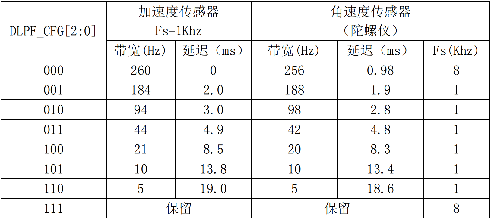

加速度传感器，输出速率（Fs）固定是 1Khz，而角速度传感器的输出速率（Fs），则根据 DLPF_CFG 的配置有所不同。

我们设置角速度传感器的带宽为其采样率的一半，如果设置采样率为 50Hz，那么带宽就应该设置为 25Hz，取近似值 20Hz，就应该设置 DLPF_CFG=100。 

##### 陀螺仪采样率分频寄存器

地址：0X19

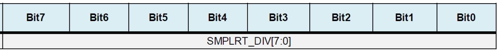

该寄存器用于设置 MPU6050 的陀螺仪采样频率，计算公式为：
**采样频率 = 陀螺仪输出频率 / (1+SMPLRT_DIV) **
陀螺仪的输出频率，是 1Khz 或者 8Khz，与数字低通滤波器（DLPF）的设置有关

采样率，我们假定设置为 50Hz，那么 SMPLRT_DIV=1000/50-1=19。

即确定了采样率为定值后，SMPLRT_DIV、DLPF_CFG都可以确定了

##### 陀螺仪数据输出寄存器

地址：0X43~0X48

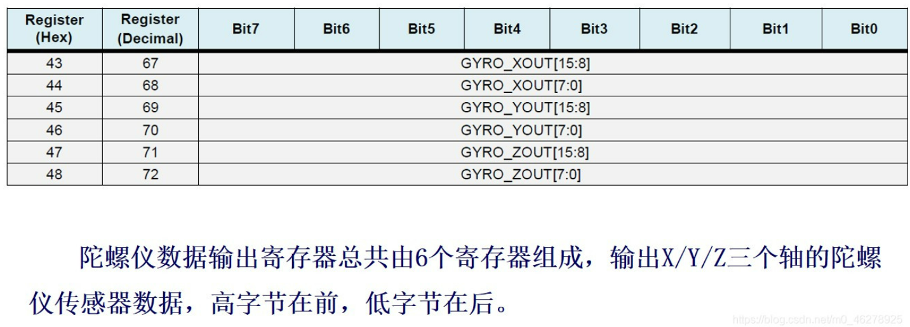

##### 加速度传感器数据输出寄存器

地址：0X3B~0X40

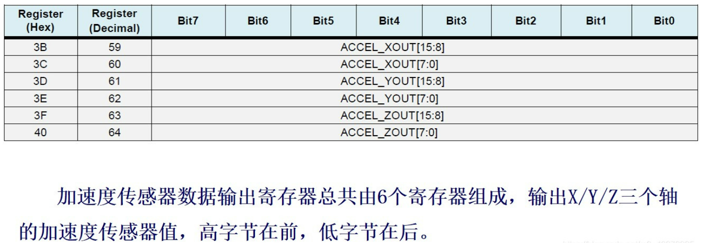

##### 温度传感器的值，可以通过读取 0X41（高 8 位）和 0X42（低 8 位）寄存器得到

地址：0X41~0X42

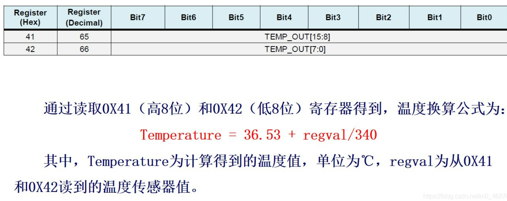

##### 用户配置寄存器

地址：0X6A

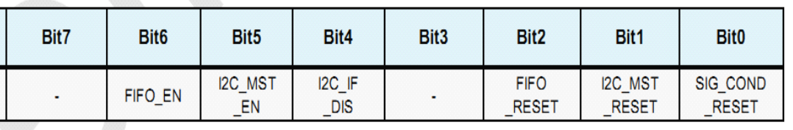

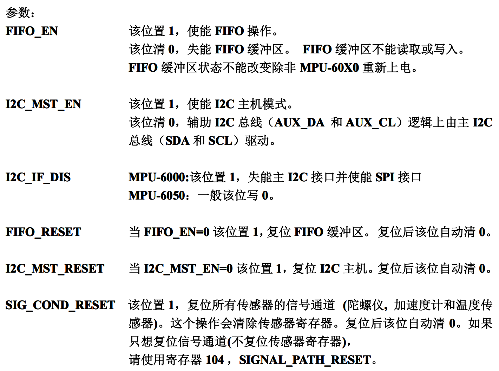

### 四、关于姿态解算

（1）DMP方式

DMP就是MPU6050内部的运动引擎，全称Digital Motion Processor，直接输出四元数，可以减轻外围微处理器的工作负担且避免了繁琐的滤波和数据融合。Motion Driver是Invensense针对其运动传感器的软件包，并非全部开源，核心的算法部分是针对ARM处理器和MSP430处理器编译成了静态链接库，适用于MPU6050、MPU6500、MPU9150、MPU9250等传感器。


（2）使用软件解算算法（在此过程中，会使用到四元数、欧拉角、轴角、方向余弦矩阵的数学知识。可以不看，太难了。）

姿态角是由旋转产生的，一般旋转有4种表示方式: 方向余弦矩阵表示、欧拉角表示、轴角表示、四元数表示。 

其中方向余弦矩阵表示适合变换向量，欧拉角最直观，轴角表示适合几何推导，而在组合旋转方面，四元数表示最佳。 

[(12条消息) 四元数完全解析及资料汇总_王者小金的博客-CSDN博客](https://blog.csdn.net/wearlee/article/details/78598217?ops_request_misc=%257B%2522request%255Fid%2522%253A%2522165745033016782246452905%2522%252C%2522scm%2522%253A%252220140713.130102334.pc%255Fblog.%2522%257D&request_id=165745033016782246452905&biz_id=0&utm_medium=distribute.pc_search_result.none-task-blog-2~blog~first_rank_ecpm_v1~rank_v31_ecpm-1-78598217-null-null.185^v2^control&utm_term=%E5%9B%9B%E5%85%83%E6%95%B0&spm=1018.2226.3001.4450) 

留个坑，以后再写：

[小马哥STM32四轴学习平台--DragonFly四轴飞行器STM32软件进阶——姿态解算课程_哔哩哔哩_bilibili](https://www.bilibili.com/video/BV1V7411g7h7?p=6&spm_id_from=pageDriver&vd_source=ba89c885857d57586a8c5ab992d5927d) 

[(12条消息) mpu6050姿态解算原理_一个渣渣的世界的博客-CSDN博客_姿态解算](https://blog.csdn.net/qq_29413829/article/details/60973915) 

### 五、实验代码

要求：使用MPU内置DMP进行姿态融合结算

[STM32 MPU6050数据获取（IIC + DMP） - 知乎 (zhihu.com)](https://zhuanlan.zhihu.com/p/191646577) 

主函数：

```c
int main(void)
{ 

    GPIO_PinRemapConfig(GPIO_Remap_SWJ_Disable,ENABLE);
    GPIO_PinRemapConfig(GPIO_Remap_SWJ_JTAGDisable,ENABLE);//禁用JTAG 启用 SWD

    MY_NVIC_PriorityGroupConfig(2); //=====设置中断分组

    delay_init();                   //=====延时函数初始化
    LED_Init();                     //=====LED初始化    程序灯
    usart3_init(9600);              //=====串口3初始化  蓝牙

    IIC_Init();                     //=====IIC初始化    读取MPU6050数据
    MPU6050_initialize();           //=====MPU6050初始化   
    DMP_Init();                     //=====初始化DMP 

    MBOT_EXTI_Init();               //=====MPU6050 5ms定时中断初始化


    while(1)
    {
        getAngle(&yaw,&yaw_acc_error); //数据获取，包含去除温漂 

        printf("%d\r\n",(int)yaw);
    } 
}
```


[(12条消息) STM32 使用DMP库处理MPU6050数据_一个旅者的博客-CSDN博客_dmp库](https://blog.csdn.net/qq_44011116/article/details/113738183) 

操作步骤： IIC初始化	$\rightarrow$	MPU的初始化	$\rightarrow$	DMP库初始化	$\rightarrow$	使用库函数读取数据

#### （1）初始化MPU6050

```c
/**  
  *  功能：初始化MPU6050
  *  入口参数：无
  *  返回值：0，成功；其他，错误
  */
u8 MPU_Init(void)
{
	u8 res;
	GPIO_InitTypeDef GPIO_InitStructure;
	
	RCC_APB2PeriphClockCmd(RCC_APB2Periph_AFIO | RCC_APB2Periph_GPIOA,ENABLE);
	
	GPIO_InitStructure.GPIO_Pin = GPIO_Pin_15;
	GPIO_InitStructure.GPIO_Mode = GPIO_Mode_Out_PP;
	GPIO_InitStructure.GPIO_Speed = GPIO_Speed_50MHz;
	GPIO_Init(GPIOA,&GPIO_InitStructure);
	
	GPIO_PinRemapConfig(GPIO_Remap_SWJ_JTAGDisable,ENABLE);//禁止JTAG，使PA15变为普通IO
	
	MPU_AD0_CTRL = 0;//控制MPU6050的AD0为低电平，从机地址=0x68；
					 //					 高电平，		  0x69；
	MPU_IIC_Init();
	MPU_Write_Byte(MPU_PWR_MGMT1_REG,0x80);//复位从机
	delay_ms(100);
	MPU_Write_Byte(MPU_PWR_MGMT1_REG,0x00);//唤醒从机
	MPU_Set_Gyro_Fsr(3);//陀螺仪传感器 +-2000dps
	MPU_Set_Accel_Fsr(0);//加速度传感器 +-2g
	MPU_Set_Rate(50);
	MPU_Write_Byte(MPU_INT_EN_REG,0x00);//关闭所有中断
	MPU_Write_Byte(MPU_USER_CTRL_REG,0x00);//IIC主模式关闭
	MPU_Write_Byte(MPU_FIFO_EN_REG,0x00);//关闭FIFO
	MPU_Write_Byte(MPU_INTBP_CFG_REG,0x80);//INT低电平有效
	res = MPU_Read_Byte(MPU_DEVICE_ID_REG);
	if(res == MPU_ADDR)
	{
		MPU_Write_Byte(MPU_PWR_MGMT1_REG,0x01);//设置CLKSEL PLL X轴为参考
		MPU_Write_Byte(MPU_PWR_MGMT2_REG,0x00);//加速度计和陀螺仪使能
		MPU_Set_Rate(50);
	}
	else
		return 1;
	return 0;
}
/**  
  *  功能：设置陀螺仪传感器满量程范围
  *  入口参数：fsr,0,+-250dps
  *				   1,+-500dps
  *				   2,+-1000dps
  *				   3,+-2000dps	
  *  返回值：0,成功；1，失败
  */
u8 MPU_Set_Gyro_Fsr(u8 fsr)
{
	return MPU_Write_Byte(MPU_GYRO_CFG_REG,fsr<<3);
}
/**  
  *  功能：设置加速度传感器满量程范围
  *  入口参数：fsr，0,+-2g
  *				    1,+-4g
  *				    2,+-8g
  *				    3,+-16g	
  *  返回值：0,成功；1，失败
  */
u8 MPU_Set_Accel_Fsr(u8 fsr)
{
	return MPU_Write_Byte(MPU_ACCEL_CFG_REG,fsr<<3);
}
/**  
  *  功能：设置数字低通滤波器
  *  入口参数：lpf，低通滤波器频率（Hz）
  *  返回值：0,成功；1，失败
  */
u8 MPU_Set_LPF(u16 lpf)
{
	u8 data=0;
	if(lpf>=188)data=1;
	else if(lpf>=98)data=2;
	else if(lpf>=42)data=3;
	else if(lpf>=20)data=4;
	else if(lpf>=10)data=5;
	else data=6;
	return MPU_Write_Byte(MPU_CFG_REG,data);
}
/**  
  *  功能：设置采样率（Fs=1KHz）
  *  入口参数：rate=[4,1000]Hz
  *  返回值：0,设置成功；1，设置失败
  */
u8 MPU_Set_Rate(u16 rate)
{
	u8 data;
	if(rate>1000)rate=1000;
	if(rate<4)rate=4;
	data=1000/rate-1;
	data=MPU_Write_Byte(MPU_SAMPLE_RATE_REG,data);
	return MPU_Set_LPF(rate/2);
}

```


#### （2）$I^2C$读写初始化

```c
/**  
  *  功能：IIC写一个字节
  *  入口参数：reg，寄存器地址；data，数据
  *  返回值：0，正常；1，错误
  */
u8 MPU_Write_Byte(u8 reg,u8 data)
{
	MPU_IIC_Start();
	MPU_IIC_Send_Byte((MPU_ADDR<<1)|0);//ADDR左移一位+写操作
	if(MPU_IIC_Wait_Ack())//等待应答
	{
		MPU_IIC_Stop();
		return 1;
	}
	MPU_IIC_Send_Byte(reg);
	MPU_IIC_Wait_Ack();
	MPU_IIC_Send_Byte(data);
	if(MPU_IIC_Wait_Ack())
	{
		MPU_IIC_Stop();
		return 1;
	}
	MPU_IIC_Stop();
	return 0;
}
  
/**  
  *  功能：IIC读一个字节
  *  入口参数：reg，寄存器地址
  *  返回值：数据
  */
u8 MPU_Read_Byte(u8 reg)
{
	u8 res;
	MPU_IIC_Start();
	MPU_IIC_Send_Byte((MPU_ADDR<<1)|0);//外设地址+写命令
	MPU_IIC_Wait_Ack();
	MPU_IIC_Send_Byte(reg);//寄存器地址
	MPU_IIC_Wait_Ack();
	MPU_IIC_Start();
	MPU_IIC_Send_Byte((MPU_ADDR<<1)|1);
	MPU_IIC_Wait_Ack();
	res = MPU_IIC_Read_Byte(0);
	MPU_IIC_Stop();
	return res;
}
/**  
  *  功能：IIC连续写
  *  入口参数：addr，外设地址；reg，寄存器地址；len，写入长度；buf，数据
  *  返回值：0，正常；1，错误
  */
u8 MPU_Write_Len(u8 addr,u8 reg,u8 len,u8 *buf)
{
	u8 i;
	MPU_IIC_Start();
	MPU_IIC_Send_Byte((addr<<1)|0);
	if(MPU_IIC_Wait_Ack())
	{
		MPU_IIC_Stop();
		return 1;
	}
	MPU_IIC_Send_Byte(reg);
	MPU_IIC_Wait_Ack();
	for(i=0;i<len;i++)
	{
		MPU_IIC_Send_Byte(buf[i]);
		if(MPU_IIC_Wait_Ack())
		{
			MPU_IIC_Stop();
			return 1;
		}
	}
	MPU_IIC_Stop();
	return 0;
}
/**  
  *  功能：IIC连续读
  *  入口参数：addr，外设地址；reg，寄存器地址；len，读取长度；buf，储存数据
  *  返回值：0,正常；1，错误
  */
u8 MPU_Read_Len(u8 addr,u8 reg,u8 len,u8 *buf)
{
	MPU_IIC_Start();
	MPU_IIC_Send_Byte((addr<<1)|0);
	if(MPU_IIC_Wait_Ack())
	{
		MPU_IIC_Stop();
		return 1;
	}
	MPU_IIC_Send_Byte(reg);
	MPU_IIC_Wait_Ack();
	MPU_IIC_Start();
	MPU_IIC_Send_Byte((addr<<1)|1);
	MPU_IIC_Wait_Ack();
	while(len)
	{
		if(len==1)
			*buf=MPU_IIC_Read_Byte(0);
		else		
			*buf=MPU_IIC_Read_Byte(1);		
		len--;
		buf++;
	}
	MPU_IIC_Stop();
	return 0;
}
```


#### （3）获取原始数据

```c
/**  
  *  功能：获取MPU内部温度
  *  入口参数：无
  *  返回值：温度*100
  */
short MPU_Get_Temperature(void)
{
	u8 buf[2];
	short raw;
	float temp;
	MPU_Read_Len(MPU_ADDR,MPU_TEMP_OUTH_REG,2,buf);
	raw=((u16)buf[0]<<8)|buf[1];
	temp = 36.53+((double)raw)/340;
	return temp*100;
}
/**  
  *  功能：获得陀螺仪原始值
  *  入口参数：gx,gy,gz,陀螺仪XYZ轴原始数据（带符号）
  *  返回值：0，成功；1，失败
  */
u8 MPU_Get_Gyroscope(short *gx,short *gy,short *gz)
{
	u8 buf[6],res;
	res=MPU_Read_Len(MPU_ADDR,MPU_GYRO_XOUTH_REG,6,buf);
	if(res == 0)
	{
		*gx=((u16)buf[0]<<8)|buf[1];
		*gy=((u16)buf[2]<<8)|buf[3];
		*gz=((u16)buf[4]<<8)|buf[5];
	}
	return res;
}
/**  
  *  功能：获得加速度原始值
  *  入口参数：ax,ay,az,加速度计XYZ的原始数据（）
  *  返回值：0，正常；1，错误
  */
u8 MPU_Get_Accelerometer(short *ax,short *ay,short *az)
{
	u8 buf[6],res;
	res=MPU_Read_Len(MPU_ADDR,MPU_ACCEL_XOUTH_REG,6,buf);
	if(res ==0)
	{
		*ax=((u16)buf[0]<<8)|buf[1];
		*ay=((u16)buf[2]<<8)|buf[3];
		*az=((u16)buf[4]<<8)|buf[5];
	}
	return res;
}

```

#### （4）调用DMP进行解算

```c
//mpu6050,dmp初始化
//返回值:0,正常
//    其他,失败
u8 mpu_dmp_init(void)
{
	u8 res=0;
	MPU_IIC_Init(); 	//初始化IIC总线
	if(mpu_init()==0)	//初始化MPU6050
	{	 
		res=mpu_set_sensors(INV_XYZ_GYRO|INV_XYZ_ACCEL);//设置所需要的传感器
		if(res)return 1; 
		res=mpu_configure_fifo(INV_XYZ_GYRO|INV_XYZ_ACCEL);//设置FIFO
		if(res)return 2; 
		res=mpu_set_sample_rate(DEFAULT_MPU_HZ);	//设置采样率
		if(res)return 3; 
		res=dmp_load_motion_driver_firmware();		//加载dmp固件
		if(res)return 4; 
		res=dmp_set_orientation(inv_orientation_matrix_to_scalar(gyro_orientation));//设置陀螺仪方向
		if(res)return 5; 
		res=dmp_enable_feature(DMP_FEATURE_6X_LP_QUAT|DMP_FEATURE_TAP|	//设置dmp功能
		    DMP_FEATURE_ANDROID_ORIENT|DMP_FEATURE_SEND_RAW_ACCEL|DMP_FEATURE_SEND_CAL_GYRO|
		    DMP_FEATURE_GYRO_CAL);
		if(res)return 6; 
		res=dmp_set_fifo_rate(DEFAULT_MPU_HZ);	//设置DMP输出速率(最大不超过200Hz)
		if(res)return 7;   
		res=run_self_test();		//自检
		if(res)return 8;    
		res=mpu_set_dmp_state(1);	//使能DMP
		if(res)return 9;     
	}else return 10;
	return 0;
}
//得到dmp处理后的数据(注意,本函数需要比较多堆栈,局部变量有点多)
//pitch:俯仰角 精度:0.1°   范围:-90.0° <---> +90.0°
//roll:横滚角  精度:0.1°   范围:-180.0°<---> +180.0°
//yaw:航向角   精度:0.1°   范围:-180.0°<---> +180.0°
//返回值:0,正常
//    其他,失败
u8 mpu_dmp_get_data(float *pitch,float *roll,float *yaw)
{
	float q0=1.0f,q1=0.0f,q2=0.0f,q3=0.0f;
	unsigned long sensor_timestamp;
	short gyro[3], accel[3], sensors;
	unsigned char more;
	long quat[4]; 
	if(dmp_read_fifo(gyro, accel, quat, &sensor_timestamp, &sensors,&more))return 1;	 
	/* Gyro and accel data are written to the FIFO by the DMP in chip frame and hardware units.
	 * This behavior is convenient because it keeps the gyro and accel outputs of dmp_read_fifo and mpu_read_fifo consistent.
	**/
	/*if (sensors & INV_XYZ_GYRO )
	send_packet(PACKET_TYPE_GYRO, gyro);
	if (sensors & INV_XYZ_ACCEL)
	send_packet(PACKET_TYPE_ACCEL, accel); */
	/* Unlike gyro and accel, quaternions are written to the FIFO in the body frame, q30.
	 * The orientation is set by the scalar passed to dmp_set_orientation during initialization. 
	**/
	if(sensors&INV_WXYZ_QUAT) 
	{
		q0 = quat[0] / q30;	//q30格式转换为浮点数
		q1 = quat[1] / q30;
		q2 = quat[2] / q30;
		q3 = quat[3] / q30; 
		//计算得到俯仰角/横滚角/航向角
		*pitch = asin(-2 * q1 * q3 + 2 * q0* q2)* 57.3;	// pitch
		*roll  = atan2(2 * q2 * q3 + 2 * q0 * q1, -2 * q1 * q1 - 2 * q2* q2 + 1)* 57.3;	// roll
		*yaw   = atan2(2*(q1*q2 + q0*q3),q0*q0+q1*q1-q2*q2-q3*q3) * 57.3;	//yaw
	}else return 2;
	return 0;
}

```

