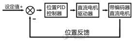
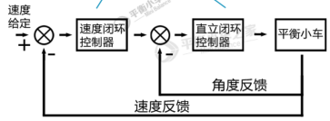

先看位置PID，选择性观看串级PID

### 1、encoder.c（编码器捕获）

初始化函数：
开启时钟、初始化GPIO、初始化定时器、配置编码器模式、初始化输入捕获、清除溢出更新中断标志位、配置溢出更新中断标志位、清零定时器计数值、开启定时器

编码器速度读取函数：
如果是定时器2，1.采集编码器的计数值并保存，2.将定时器的计数值清零
为什么读取的计数值是路程，但返回的是速度值？
因为每次读取编码器的值后都会清零，又因为每次读取的时间间隔相等，所以可以得到一个周期内的平均速度，又因为周期十分短，所以可以近似认为该速度为瞬时速度。

计数器溢出中断函数

### 2、pwm.c（PWM输出）

初始化函数：
开启时钟、初始化GPIO、初始化定时器、初始化输出比较、高级定时器的MOE主输出使能、OC1预装载寄存器使能、OC4预装载寄存器使能、TIM1在ARR上预装载寄存器使能、开定时器

### 3、exti.c（MPU6050外部中断）

初始化函数：
开启时钟、初始化GPIO、初始化外部中断

### 4.motor.c（电机）

初始化函数：
开启时钟、初始化GPIO

限幅函数：
为什么限幅到7200？72MHz / 7200 = 10kHz，10kHz刚好是电机的最大工作频率

绝对值函数

赋值函数
1.确定正反转、2.取绝对值后赋值

### 5.conctrl.c（PID控制函数）

PID种类：位置PID、串级PID、增量式PID

比例项：提高响应速度，减小静差
积分项：消除稳态误差
微分项：减小震荡以及超调

位置PID：

串级PID：

速度环
输入：1.给定速度。2.速度反馈。
输出：角度值（直立环期望角度输入）
速度环输出=Kp2 *（反馈编码器值-期望编码器值）+Ki * 编码器偏差的积分

速度环为什么用PI控制，编码器的噪声、电机的死区、电机的滑动以及电机的震动等因素会造成稳态误差，加入积分项可以消除稳态误差。

直立环：
输入：1.给定速度（速度环输出）2.角度反馈。
输出：PWM（直接控制小车）
直立环输出=Kp1 *（真实角度-期望角度+机械中值）+Kd * 角度偏差的微分

==注：==**速度环输出 = 直立环期望角度**
Kp1：直立环Kp，Kp2：速度环Kp

