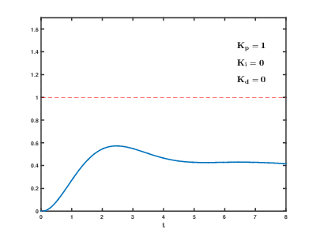

参考资料：

==必看：== [平衡小车在线编程课程视频（1~3节合集版本）（2月12日更新）_哔哩哔哩_bilibili](https://www.bilibili.com/video/BV1j7411z7uX?spm_id_from=333.851.header_right.history_list.click)

[PID算法-第一节_哔哩哔哩_bilibili](https://www.bilibili.com/video/BV1Ds411t7Hr/?spm_id_from=333.788.recommend_more_video.1&vd_source=ba89c885857d57586a8c5ab992d5927d) 

[PID算法第2节-比例控制_哔哩哔哩_bilibili](https://www.bilibili.com/video/BV1Ds411t7x4/?spm_id_from=333.788.recommend_more_video.-1&vd_source=ba89c885857d57586a8c5ab992d5927d) 

[PID算法第3节-积分算法_哔哩哔哩_bilibili](https://www.bilibili.com/video/BV1Ss411t7Z4/?spm_id_from=333.788.recommend_more_video.-1&vd_source=ba89c885857d57586a8c5ab992d5927d) 

[PID专题课程第4集_哔哩哔哩_bilibili](https://www.bilibili.com/video/BV1dy4y1G7mF/?spm_id_from=333.788.recommend_more_video.-1&vd_source=ba89c885857d57586a8c5ab992d5927d) 

[PID专题课程第5集_哔哩哔哩_bilibili](https://www.bilibili.com/video/BV1pL4y1h7bZ/?spm_id_from=333.788.recommend_more_video.-1&vd_source=ba89c885857d57586a8c5ab992d5927d) 

[PID专题课程第6集_哔哩哔哩_bilibili](https://www.bilibili.com/video/BV1gv411P77a/?spm_id_from=333.788.recommend_more_video.-1&vd_source=ba89c885857d57586a8c5ab992d5927d) 

[平衡小车从原理到实践 - 知乎 (zhihu.com)](https://zhuanlan.zhihu.com/p/206522126#:~:text=%E6%9C%BA%E6%A2%B0%E4%B8%AD%E5%80%BC%E4%B9%9F%E5%B0%B1%E6%98%AF%E4%BB%A3%E7%A0%81%E4%B8%AD%E5%8F%82%E6%95%B0%20ZHONGZHI%20%EF%BC%8C%E8%BF%99%E4%B8%AA%E5%80%BC%E6%A0%B9%E6%8D%AE%E8%87%AA%E5%B7%B1MPU6050%E7%9A%84%E5%AE%89%E8%A3%85%E4%BD%8D%E7%BD%AE%E8%80%8C%E5%AE%9A%E3%80%82%20%E5%A6%82%E6%9E%9C%E5%B0%8F%E8%BD%A6%E6%98%AF%E7%BB%95MPU6050%E7%9A%84x%E8%BD%B4%E6%97%8B%E8%BD%AC%EF%BC%8C,ZHONGZHI%20%E6%98%AF%E5%89%8D%E5%80%BE%E5%92%8C%E5%90%8E%E4%BB%B0%E4%B8%B4%E7%95%8C%E7%82%B9%E7%9A%84roll%E5%80%BC%EF%BC%88%E6%A8%AA%E6%BB%9A%E8%A7%92%EF%BC%89%20%E5%A6%82%E6%9E%9C%E5%B0%8F%E8%BD%A6%E6%98%AF%E7%BB%95MPU6050%E7%9A%84y%E8%BD%B4%E6%97%8B%E8%BD%AC%EF%BC%8C%20ZHONGZHI%20%E6%98%AF%E5%89%8D%E5%80%BE%E5%92%8C%E5%90%8E%E4%BB%B0%E4%B8%B4%E7%95%8C%E7%82%B9%E7%9A%84pitch%E5%80%BC%EF%BC%88%E4%BF%AF%E4%BB%B0%E8%A7%92%EF%BC%89) 

[(12条消息) 【平衡小车制作】（六）位置式PID、直立环与速度环编程（超详解）_鲁乎乎的博客-CSDN博客_平衡小车直立环](https://blog.csdn.net/weixin_44270218/article/details/113665051) 

**机械中值的确定方法，通过OLED上显示的陀螺仪倾角确定，存在某一个角度是前倾和后仰的临界点，这个点对应的角度就是ZHONGZHI。** 	

平衡小车的调试：

==调速度环前为什么直立环要乘以0.6：如果先调试好角度环，然后再调试速度环的时候，无论怎么调，小车都会摆动的很厉害。== 

[平衡小车调试总结 - 哔哩哔哩 (bilibili.com)](https://www.bilibili.com/read/cv8993917?spm_id_from=333.999.0.0) 

[两轮自平衡小车的制作总结 - DF创客社区 - 分享创造的喜悦 (dfrobot.com.cn)](https://mc.dfrobot.com.cn/thread-305939-1-1.html) 

## P：比例控制、I：积分控制、D：微分控制

比例控制P，将反馈值与期望值Sv的差值Ek进行放大或缩小后输出。输出信号正比于当前偏差值，即比例控制的公式为Pout=Kp * Ek。但当反馈值等于期望值时，不输出任何控制量，所以我们可以在输出后加上一个常量，使反馈值等于期望值时仍然可以输出一个控制量。所以最终的公式为Pout=Kp * Ek+OUT0。

积分控制I，将开机以来每个反馈值都依次与用户期望值Sv相减，即可得出对应的偏差序列E(1)、E(2)、E(3)、E(4)…………E(k-2)、E(k-1)、E(k)，将这些历史偏差序列求代数和得到Sk。如果历史偏差的整体情况不达标，那么积分控制器就会给正的输出量使输出继续增强；若偏差的整体情况超标，那么积分控制器就会给负的输出量使输出继续减弱，甚至输出负值。输出信号大小]正比于 过去总体偏差值，即积分控制的公式为Iout=Kp * Sk。为了避免历史偏差为0时不输出的情况，我们同样可以在公式后面加上一个常量。所以最终的公式为Iout=Kp * Sk+OUT0。

微分控制，将前一时刻的偏差E(k-1)与当前这一时刻的偏差E(k)做差值，得到两个时刻的偏差的变化趋势Dk = E(k) - E(k-1)。当Dk>0时，说明偏差为增大趋势，系统状态越来越偏离目标；当Dk<0时，说明偏差为减小趋势，系统状态越来越接近目标。我们通过偏差的趋势来调节输出量。所以微分控制的公式为Dout = Kp * Dk。微分控制器同样可通过加维持输出OUT0，以消除零输出系统失控的现象。所以最终的公式为Dout=Kp*Dk+OUT0。

我们已经得到了PID控制器的数学模型，现在开始要将PID控制器从数学模型转换到实际算法。即进行一些参数（Sk与Dk）的处理。

Ti是积分时间常数，指考察历史数据的范围大小，T是采样周期，即多长时间更新一次PID。

​									$S_k = \frac {1}{T_i}\cdot T\cdot \sum E_k$

Td是微分时间常数，指反应微分项运行的时间，T是采样周期，即多长时间更新一次PID。

​									$D_k = T_d\cdot \frac{E_k-E_{k1} }{T}$

根据以上的分析整理PID数学模型：$PID_{OUT} = (K_p \cdot E_k)+(K_p \cdot \frac {1}{T_i}\cdot T\cdot \sum E_k)+(K_p \cdot T_d\cdot \frac{E_k-E_{k1} }{T})$

比例项：提高响应速度，减小静差
积分项：消除稳态误差
微分项：减小震荡以及超调




## 一、直立环（PD控制）：

直立环输出 = Kp x 角度偏差 + Kd x 角度偏差的微分
角度偏差Ek = 真实角度 - 期望角度
角度偏差的微分Ek_D（即真实角速度）：通过MPU6050测量出来

程序：

```c
/*****************  
直立环PD控制器：Kp*Ek+Kd*Ek_D
入口：Med:机械中值(期望角度)，Angle:真实角度，gyro:真实角速度（是x轴的角速度还是y轴角速度由MPU6050的安装位置决定）
出口：直立环输出
******************/
int Vertical(float Med,float Angle,float gyro) 
{
  int PWM_out;
  
  PWM_out = Vertical_Kp*(Angle-Med)+Vertical_Kd*(gyro-0);
  
  return PWM_out;
} 

```

## 二、速度环（PI控制）：

速度环输出 = Kp x 电机速度偏差 + Ki x 电机速度偏差的积分
电机速度偏差Ek  = 真实速度 - 期望速度（真实速度：左电机速度 + 右电机速度、期望速度：0）
电机速度偏差的积分Ek_S ：电机速度偏差的累加

引入低通滤波的目的：
简单来说，这个系统是以直立环为主，速度环为辅。一般来说，速度环对直立环来说是起调整控制的效果。但由于微分控制器会对偏差的变化率（斜率）进行累加，从而产生积分器的输出。对于微分器来说，即使噪声幅度足够小，但是只要达到足够高频率，偏差的变化率一样可以变得很大。所以高频噪声会使得微分器产生较大输出，从而最终对系统造成影响。这里就需要低通滤波器将噪声滤除。 详细看以下的文章：
[PID微分器与滤波器的爱恨情仇 - 知乎 (zhihu.com)](https://zhuanlan.zhihu.com/p/257259918) 

积分限幅：通过比较限制积分在规定范围内变动，不得超出。

程序：

```c
/*****************  
速度环PI控制器：Kp*Ek+Ki*Ek_S(Ek_S：偏差的积分)
入口：期望速度，左轮的速度，右轮的速度
出口：速度环输出
******************/
int Velocity(int Target,int encoder_left,int encoder_right)
{
  // 定义成静态变量，保存在静态存储器，使得变量不丢掉
  static int PWM_out,Encoder_Err,Encoder_S,EnC_Err_Lowout,EnC_Err_Lowout_last;
  float a=0.7;
  
  // 1.计算速度偏差
  //舍去误差--我的理解：能够让速度为"0"的角度，就是机械中值。
  Encoder_Err = ((encoder_left+encoder_right)-Target);
  
  // 2.对速度偏差进行低通滤波
  //一阶滤波公式： low_out = (1-a)*Ek+a*low_out_last
  EnC_Err_Lowout = (1-a)*Encoder_Err + a*EnC_Err_Lowout_last; // 使得波形更加平滑，滤除高频干扰，放置速度突变
  EnC_Err_Lowout_last = EnC_Err_Lowout;   // 防止速度过大影响直立环的正常工作
  
  // 3.对速度偏差积分出位移
  Encoder_S+=EnC_Err_Lowout;
  
  // 4.积分限幅
  Encoder_S=Encoder_S>10000?10000:(Encoder_S<(-10000)?(-10000):Encoder_S);
  
  // 5.速度环控制输出
  PWM_out = Velocity_Kp*EnC_Err_Lowout+Velocity_Ki*Encoder_S;
  
  return PWM_out;
}

```


## 三、转向环（P控制）：

转向环输出=系数 × z轴角速度
z轴角速度由MPU6050测出

程序：

```c
/*****************  
转向环：系数*z轴角速度
入口：z轴角速度
出口：转向环输出
******************/
int Turn(int gyro_Z)
{
  int PWM_out;
  
  PWM_out = (-0.6)*gyro_Z;
  
  return PWM_out;
}

增加转向功能
/*****************  
转向环：系数*z轴角速度
入口：z轴角速度，旋转角度
出口：转向环输出
******************/
int Turn(int gyro_Z,Rotation)
{
  int PWM_out;
  
  PWM_out = Kp x gyro_Z + Kd x Rotation;
  
  return PWM_out;
}
```


