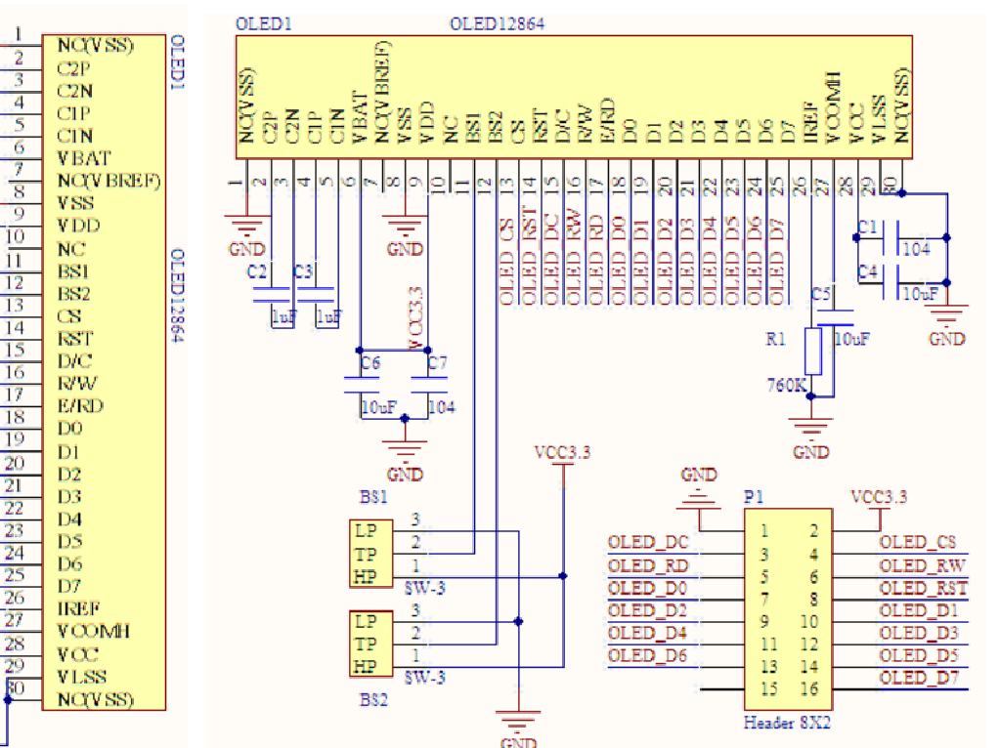
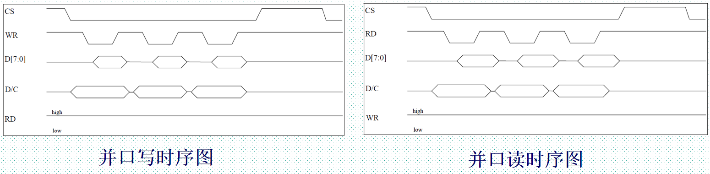
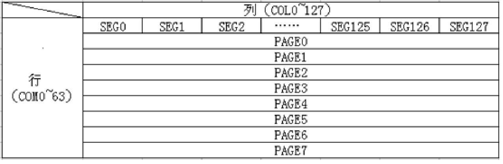
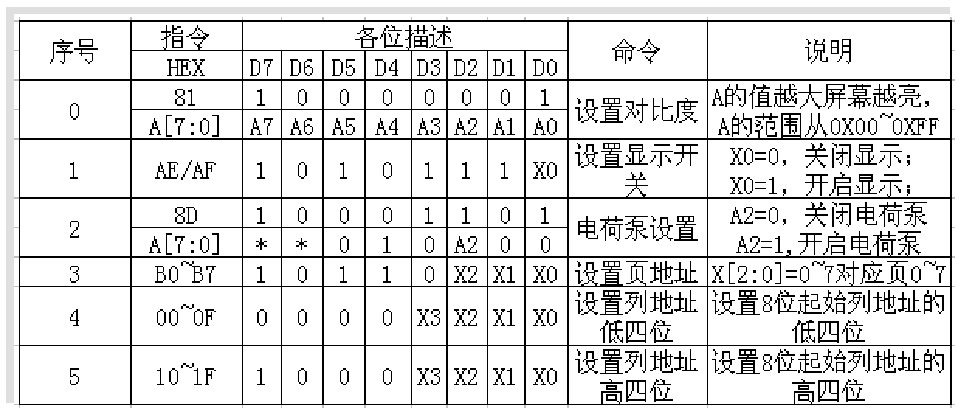
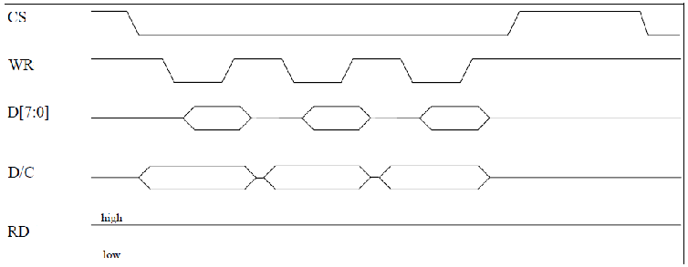
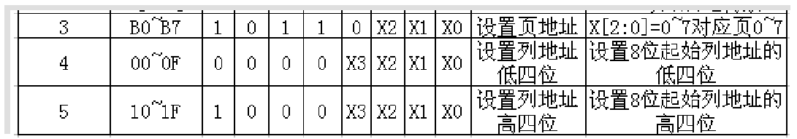
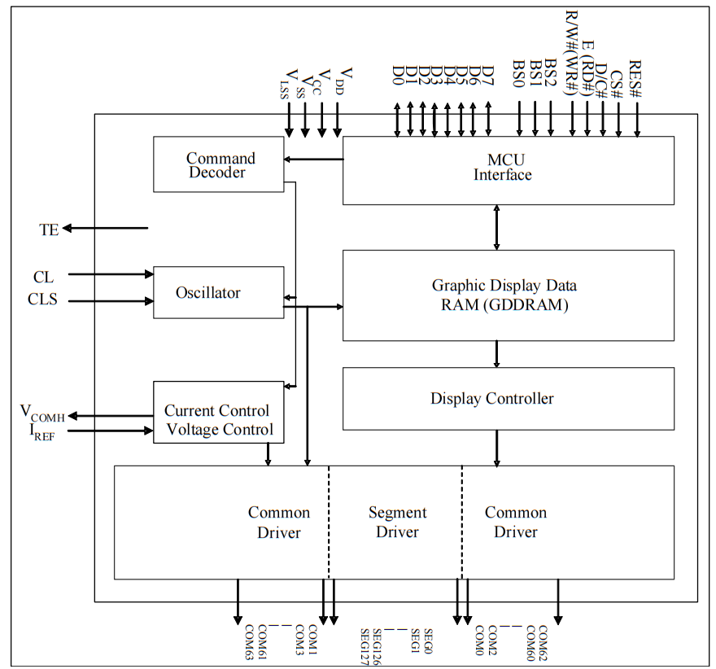

参考资料：

STM32F4开发指南-库函数版本_V1.1.pdf\第七章 蜂鸣器实验\第十七章 OLED 显示实验

### 一、OLED显示原理

（1）简介

- OLED，即有机发光二极管，又称为有机电激光显示。OLED由于同时具备自发光，不需背光源、对比度高、厚度薄、视角广、反应速度快、可用于挠曲性面板、使用温度范围广、构造及制程较简单等优异之特性，被认为是下一代的平面显示器新兴应用技术。
- OLED显示技术具有自发光的特性，采用非常薄的有机材料涂层和玻璃基板，当有电流通过时，这些有机材料就会发光，而且OLED显示屏幕可视角度大，并且能够节省电能，从2003年开始这种显示设备在MP3播放器上得到了应用。
- LCD都需要背光，而OLED不需要，因为它是自发光的。这样同样的显示，OLED效果要来得好一些。以目前的技术，OLED的尺寸还难以大型化，但是分辨率确可以做到很高。

（2）ALINETEK 0.96 寸OLED模块（小车不用这个模块，用的另一个种OLED。）

- 模块有单色和双色两种可选，单色为纯蓝色，而双色则为黄蓝双色。 单色模块每个像素点只有亮与不亮两种情况，没有颜色区分。
- 尺寸小，显示尺寸为0.96寸，而模块的尺寸仅为27mm*26mm大小。
- 高分辨率，该模块的分辨率为128*64。
- 多种接口方式，该模块提供了总共4种接口包括：6800、8080两种并行接口方式、 4线的穿行SPI接口方式，、IIC接口方式（只需要2根线就可以控制OLED了！）。
- 不需要高压，直接接3.3V就可以工作了。
- 可显示标准的国标简体（GB2312）汉字、8x16 点 ASCII 粗体字库、7x8点 ASCII 字库、5x7 点 ASCII 字库。 

（3）工作模式选择

ALIENTEK OLED模块**默认设置是BS0接GND，BS1和BS2接VCC（8080模式）**，即使用8080并口方式，如果想要设置成其他的模式，则需要在OLED的背面，用烙铁修改BS0-BS2的设置。

| 接口方式 | IIC  | 6800并行 | 8位8080并行 | 4线SPI | 3线SPI |
| :------: | :--: | :------: | :---------: | :----: | :----: |
|   BS0    |  0   |    0     |      0      |   0    |   1    |
|   BS1    |  1   |    0     |      1      |   0    |   0    |
|   BS2    |  0   |    1     |      1      |   0    |   0    |

部分OLED模块可以控制的只有BS1和BS2，BS0默认接地

| 接口方式 | 4线SPI | IIC  | 8位6800 | 8位8080 |
| -------- | ------ | ---- | ------- | ------- |
| BS1      | 0      | 1    | 0       | 1       |
| BS2      | 0      | 0    | 1       | 1       |

OLED控制器为SSD1306



（4）OLED8080并行接口信号线说明

- CS：OLED片选信号线
- WR：向OLED写数据
- RD：从OLED读取数据
- D[7 : 0]：8位双向数据线
- RST（RES）：硬复位OLED
- DC：命令数据标志（0，读写命令；1：读写数据）

（5）OLED8080并口读写过程

模块的8080并口读/写的过程为：
先根据要写入/读取的数据的类型，设置DC为高（数据）/低（命令），然后拉低片选，选中SSD1306，接着我们根据是读数据，还是要写数据置RD/WR为低，然后：

- 读数据：在RD的上升沿， 使数据锁存到数据线（D[7：0]）上；
- 写数据：在WR的上升沿，使数据写入到SSD1306里面；



（5）OLED模块显存

SSD1306的显存总共为128x64bit大小，SSD1306将这些显存分为了8页。每页包含了128个字节，总共8页，这样刚好是128x64的点阵大小。



在STM32的内部建立一个 缓存（共128*8个字节），在每次修改的时候，只是修改STM32上的缓存（实际上就是SRAM），在修改完了之后，一次性把STM32上的缓存数据写入到OLED的GRAM。当然这个方法也有坏处，就是对于那些SRAM很小的单片机（比如51系列）就比较麻烦了。

（6）SSD1306的命令



- 命令0X81：设置对比度。包含两个字节，第一个0X81为命令，随后发送的一个字节为要设置的对比度的值。这个值设置得越大屏幕就越亮。
- 命令0XAE/0XAF：0XAE为关闭显示命令；0XAF为开启显示命令。
- 命令0X8D：包含2个字节，第一个为命令字，第二个为设置值，第二个字节的BIT2表示电荷泵的开关状态，该位为1，则开启电荷泵，为0则关闭。在模块初始化的时候，这个必须要开启，否则是看不到屏幕显示的。
- 命令0XB0~B7：用于设置页地址，其低三位的值对应着GRAM的页地址。
- 命令0X00~0X0F：用于设置显示时的起始列地址低四位。
- 命令0X10~0X1F：用于设置显示时的起始列地址高四位。

### 二、实验程序

（1）OLED的初始化

- 拉低RST引脚，等待10ms后拉高，此时OLED复位完成
- 驱动IC初始化代码
- 开启显示
- 清0显存
- 开启显示

```c
//初始化SSD1306					    
void OLED_Init(void)
{
...//设置IO口模式，所有用到的IO口设置为推挽模式。
GPIO_Init();
 …//初始化代码，写相关寄存器
OLED_WR_Byte(0xAE,OLED_CMD); //关闭显示
OLED_WR_Byte(0xD5,OLED_CMD); //设置时钟分频因子,震荡频率
OLED_WR_Byte(80,OLED_CMD);   //[3:0],分频因子;[7:4],震荡频率
OLED_WR_Byte(0xA8,OLED_CMD); //设置驱动路数
OLED_WR_Byte(0X3F,OLED_CMD); //默认0X3F(1/64) 
OLED_WR_Byte(0xD3,OLED_CMD); //设置显示偏移
OLED_WR_Byte(0X00,OLED_CMD); //默认为0
…
…
OLED_Clear();
}
```

（2）控制OLED

1. 写一个字节

   

   ```c
   //向SSD1306写入一个字节。
   //dat:要写入的数据/命令
   //cmd:数据/命令标志 0,表示命令;1,表示数据;
   void OLED_WR_Byte(u8 dat,u8 cmd)
   {
   	DATAOUT(dat);	    //首先通过DATAOUT()函数将数据放到数据口，其中DATAOUT()是一个宏定义：
   						//#define DATAOUT(x) GPIO_Write(GPIOC,x);//输出  
    	OLED_RS=cmd;
   	OLED_CS=0;	   
   	OLED_WR=0;	 
   	OLED_WR=1;
   	OLED_CS=1;	  
   	OLED_RS=1;	 
   } 
   ```

2. OLED更新缓存

   

   ```c
   u8 OLED_GRAM[128][8];	
   
   void OLED_Refresh_Gram(void)
   {
      u8 i,n;		    
     for(i=0;i<8;i++)  
     {  
       OLED_WR_Byte (0xb0+i,OLED_CMD);    //设置页地址（0~7）
       OLED_WR_Byte (0x00,OLED_CMD);      //设置显示位置—列低地址
       OLED_WR_Byte (0x10,OLED_CMD);      //设置显示位置—列高地址   
       
      for(n=0;n<128;n++)
        OLED_WR_Byte(OLED_GRAM[n][i],OLED_DATA); 
     }   
   }
   ```

3. 画点函数

   ```c
   void OLED_DrawPoint(u8 x,u8 y,u8 t)
   {
      u8 pos,bx,temp=0;
      if(x>127||y>63)return;//超出范围了.
      pos=7-y/8;
      bx=y%8;
      temp=1<<(7-bx);
      if(t)OLED_GRAM[x][pos]|=temp;
      else OLED_GRAM[x][pos]&=~temp;	    
   }
   ```

4. 字符更新函数

   ```c
   //在指定位置显示一个字符,包括部分字符
   //x:0~127  y:0~63
   //mode:0,反白显示;1,            size:选择字体 12/16/24
   void OLED_ShowChar(u8 x,u8 y,u8 chr,u8 size,u8 mode)
   {      			    
      u8 temp,t,t1; u8 y0=y;
      u8 csize=(size/8+((size%8)?1:0))*(size/2);	//得到字体一个字符对应点阵集所占的字节数
      chr=chr-' ';//得到偏移后的值		 
       for(t=0;t<csize;t++)
       {   
        if(size==12)temp=asc2_1206[chr][t]; 	 	//调用1206字体
       else if(size==16)temp=asc2_1608[chr][t];	//调用1608字体
       else if(size==24)temp=asc2_2412[chr][t];	//调用2412字体
       else return;	//没有的字库
        for(t1=0;t1<8;t1++)
       {
   	if(temp&0x80)OLED_DrawPoint(x,y,mode);
   	else OLED_DrawPoint(x,y,!mode);
   	temp<<=1;
   	y++;
   	if((y-y0)==size)
   	{
   	  y=y0;
   	  x++;  break;
   	}
     }  	 
       }          
   }
   ```

5. 字符码表（字库节选）

   ```c
   const unsigned char oled_asc2_1206[95][12]={
   {0x00,0x00,0x00,0x00,0x00,0x00,0x00,0x00,0x00,0x00,0x00,0x00},/*" ",0*/
   {0x18,0x00,0x24,0xC0,0x1B,0x00,0x0D,0x80,0x32,0x40,0x01,0x80},/*"%",5*/
   {0x03,0x80,0x1C,0x40,0x27,0x40,0x1C,0x80,0x07,0x40,0x00,0x40},/*"&",6*/
   …
   {0x00,0x00,0x03,0x80,0x04,0x40,0x04,0x40,0x06,0x40,0x00,0x00},/*"c",67*/
   {0x00,0x00,0x03,0x80,0x04,0x40,0x24,0x40,0x3F,0xC0,0x00,0x40},/*"d",68*/
   …
   {0x00,0x00,0x40,0x20,0x7B,0xE0,0x04,0x00,0x00,0x00,0x00,0x00},/*"}",93*/
   {0x40,0x00,0x80,0x00,0x40,0x00,0x20,0x00,0x20,0x00,0x40,0x00},/*"~",94*/
   };
   
   
   
   const unsigned char oled_asc2_1608[95][16]={	  
   {0x00,0x00,0x00,0x00,0x00,0x00,0x00,0x00,0x00,0x00,0x00,0x00,0x00,0x00,0x00,0x00},/*" ",0*/ {0x0F,0x00,0x10,0x84,0x0F,0x38,0x00,0xC0,0x07,0x78,0x18,0x84,0x00,0x78,0x00,0x00},/*"%",5*/
   {0x00,0x78,0x0F,0x84,0x10,0xC4,0x11,0x24,0x0E,0x98,0x00,0xE4,0x00,0x84,0x00,0x08},/*"&",6*/
   …
   {0x00,0x00,0x1C,0x00,0x10,0x00,0x10,0xFC,0x13,0x00,0x1C,0x00,0x10,0x00,0x00,0x00},/*"7",23*/
   {0x00,0x00,0x0E,0x38,0x11,0x44,0x10,0x84,0x10,0x84,0x11,0x44,0x0E,0x38,0x00,0x00},/*"8",24*/
   {0x00,0x00,0x07,0x00,0x08,0x8C,0x10,0x44,0x10,0x44,0x08,0x88,0x07,0xF0,0x00,0x00},/*"9",25*/
   }
   ```

以下为拓展内容，略难，可稍作了解，便于理解程序

## 三、 基本命令

[(12条消息) SSD1306(OLED驱动芯片)指令详解_notMine的博客-CSDN博客_ssd1306命令详解](https://blog.csdn.net/notMine/article/details/79317782) 

- 00h~0Fh：页地址模式下设置起始地址低位

  在页地址模式下设置GDDRAM的列起始地址的低四位，页地址会在数据访问后递增

  

- 10h~1Fh：页地址模式下设置起始地址高位

  在页地址模式下设置GDDRAM的列起始地址的高四位，页地址会在数据访问后递增

  

- 20h：设置内存地址模式

  SSD1602中有三种地址模式：页地址模式、水平地址模式、垂直地址模式

  > > 页地址模式：（A[1:0]=10b）
  > >
  > > > 处于此模式时, 在GDDRAM访问后(读/写), 列地址指针将自动增加1。如果列地址指针到达列终止地址, 列地址指针将复位到列起始地址, 但页地址指针不会改变。
  > > >
  > > > 页地址模式下访问GDDRAM，步骤如下：
  > > >
  > > > 1. 通过命令(B0h-B7h)设置目标显示位置页起始地址
  > > > 2. 通过命令(00h-0Fh)设置列起始地址低位
  > > > 3. 通过命令(10h-1Fh)设置列起始地址高位
  > >
  > > > 水平地址模式：(A[1:0]=00b)
  > > >
  > > > 处于此模式时，在对GDDRAM访问后，列地址指针将自动加1。如果列地址指针到达列终止地址，列地址将复位到列起始地址且页地址指针将自动加1。
  > > >
  > > > 在水平地址模式下访问GDDRAM, 步骤如下：
  > > >
  > > > 1. 通过命令(21h)设置目标显示位置列起始地址以及列终止地址
  > > > 2. 通过命令(22h)设置目标显示位置页起始地址以及页终止地址
  > >
  > > > 垂直地址模式：(A[1:0]=01b)
  > > >
  > > > 处于此模式时, 在GDDRAM访问后(读/写), 页地址指针将自动增加1。如果页地址指针到达页终止地址, 页地址指针将复位到页起始地址, 且列地址指针将自动增加1。
  > > >
  > > > 在垂直地址模式下访问GDDRAM, 步骤如下：
  > > >
  > > > 1. 通过命令(21h)设置目标显示位置列起始地址以及列终止地址
  > > > 2. 通过命令(22h)设置目标显示位置页起始地址以及页终止地址

  

- 21h：设置列地址

  用于设置GDDRAM的列起始地址和列结束地址，并使列地址指针指向列起始地址（类似复位）

  

- 22h：设置页地址

  用于设置GDRAM的页起始地址和页结束地址，并使页地址指针指向页起始地址（类似复位）

  

- 40h~7Fh：设置屏幕起始行

  用于设置屏幕起始行寄存器，以设置GDDRAM起始地址，取值范围为[0, 63]。若值为0, 则RAM第0行映射至COM0, 若值为1, 则RAM第1行映射到COM0, 以此类推。

  COM0是指第一行像素点，总共有128个。像这样的行有64行，在页地址模式下，它们被分成8页。

  RAM0一般来说是映射到COM0的，即RAM0里的数据在第一行显示。但是，这也不是一成不变的，我们可以通过设置寄存器，使RAM0映射到COM0~COM63中的任何一个。

  

- 81h：设置对比度

  用于设置屏幕对比度，此芯片有256级对比度(从00h至FFh)。

  

- A0h/A1h：设置段重映射（左右反置）

  用于改变屏幕数据列地址和段驱动器间的映射关系, 这增强和OLED模块设计的可伸缩性。

  存储在GDDRAM中的数据将保持不变，屏幕数据列地址和段驱动器间的映射关系发生改变。左右颠倒，这会影响之后的数据输入。

  - A0：左右反置
  - A1：正常

  

- A4h/A5h：全屏点亮

  令A4h启用输出GDDRAM中的数据。如果命令A5h已被调用, 通过A4h指令, 可以将屏幕显示从全屏点亮状态中恢复。

  命令A5h通过忽略GDDRAM中的数据以点亮全屏

  - A5：点亮所有像素
  - A4：恢复正常模式

  

- A6h/A7h：设置正常/反转显示

  用于设置显示是否反转, 正常模式下, RAM中的数据1表示点亮像素; 在反转模式下, RAM中的数据0表示点亮像素

  - A7：反选
  - A6：正常

  

- A8h：设置复用率

  用于将默认的63复用率更改至任何范围为[16, 63]的值, COM0~COM64输出将切换到正确的输出信号

  默认显示RAM0~RAM63，64个。我们可以通过设置，使显示的数量为[17 , 64]个，例如显示RAM0~RAM55。

  或者通过改变页起始地址使之显示RAM8~RAM63

  

- AEh/AFh：设置屏幕开启或关闭

  AF：当屏幕开启时, 设置主机配置命令(Set Master Configuration)选择的电路将被连通。
  AE：当屏幕关闭时, 这些电路将被断开, 且段和公共的输出都被分别置为Vss和高阻态。

  用于开启或关闭OLED屏幕。 

  

- B0h~B7h ：页地址模式下设置页起始地址

  用于设置在页地址模式下GDDRAM的页起始地址, 取值范围为[0, 7]

  

- C0h/C8h：设置列输出扫描方向（上下反置）

  COM Normal / Remapped (C0h /  C8h）

  一般设置为C0h，从上至下扫描，即RAM0 -> COM0

  但设置为C8h时，从下之上扫描，即RAM63 -> COM0

  用于设置列输出的扫描方向, 增强了OLED模块设计的布局的伸缩性。

  

- D3h：设置显示偏移

  此命令为双字节命令，第一个字节是D3h， 第二个字节用于设置屏幕起始行为COM0~COM63之一(假设COM0为屏幕起始行, 那么屏幕起始行寄存器值为0)，值为[0 , 63]

  效果和设置页起始地址一样，不过使用的寄存器不一样

  

- D5h：设置显示时钟分频值/振荡频率

  包含两个功能：

  1. 设置显示时钟分频值(D)(A[3:0])。由于设置从CLK分频得到的DCLK(显示时钟, Display clock)的分频值, 分频值取值范围为[1, 16], 初始值为1.
  2. 设置震荡频率(A[7:4])。如果CLS脚被拉高, 可用于编程震荡频率。 默认值为1000b

  

- D9h：设置预充电周期

  用于设置预充电周期的时长, 此周期单位为一DCLK的周期, 复位值为2 DCLK

  

- DAh：设置列引脚硬件配置

  令用于设置列信号引脚配置来适应OLED面板的硬件布局。

  见数据手册[(Mcudev)096寸OLED使用说明V2--1512](assets/0.96OLED显示屏_驱动芯片手册.pdf)
  图 10-3 : COM Pins Hardware Configuration 

  

- D8h：设置VCOMH反压值

  用于调整VCOMH输出

  

- E3h：空指令

## 四、图形加速命令

- 26h/27h：水平滚动配置

  用于配置水平滚动参数和确定滚动起始页、终止页和滚动速度。

  ==需要在调用此命令前禁用(2Eh), 否则RAM中的内容将会出错。==

  SSD1306的水平滚动设计来为128列滚动, 以下是使用水平滚动的例子

  向右滚动一列

  

  向左滚动一列

  

  水平滚动配置例子

  

  

- 29h/2Ah：垂直和水平滚动配置

  用于配置垂直和水平滚动参数和确定滚动起始页、终止页、滚动速度和垂直滚动偏移。

  B[2:0], C[2:0], D[2:0]用于配置垂直滚动, E[5:0]用于配置垂直滚动偏移, 所有这些字节用于设置斜线(Diagonal, 垂直滚动+水平滚动)

  如果垂直滚动偏移为0, 那么只将发生水平滚动(和命令26/27h一样) 

  ==需要在调用此命令前禁用(2Eh), 否则RAM中的内容将会出错。==

  以下是使用垂直和水平滚动的例子:

  

  

- 2Eh：禁用滚动

  用于停止滚动, 在调用命令2Eh后, RAM的数据需要被重写

  

- 2Fh：启用滚动

  用于启动滚动, 并且只能在滚动配置参数经过调用命令26h/27h/29h/2Ah后调用。最后调用滚动参数命令时的配置将覆盖之间调用过时设置的配置

  以下操作会在启用滚动后被禁止：

  - 对RAM的访问
  - 改变水平滚动参数

  

- A3h：设置垂直滚动区

  用于设置垂直滚动区, 对于垂直滚动功能(29/2Ah), 垂直滚动的行数可以大于或小于复用率(MUX ratio)

如果对于A8h：设置复用率 、C0h/C8h：设置列输出扫描方向 、D3h：设置显示偏移 不够了解可以看以下图片


## 五、初始化代码

```c
void OLED_Init(void)
{
  GPIO_InitTypeDef  GPIO_InitStructure;
	
	RCC_AHB1PeriphClockCmd(RCC_AHB1Periph_GPIOB|RCC_AHB1Periph_GPIOD|RCC_AHB1Periph_GPIOG|RCC_AHB1Periph_GPIOC,ENABLE);//使能PORTA~E,PORTG时钟
  	
	//GPIO初始化设置
  GPIO_InitStructure.GPIO_Pin = GPIO_Pin_14|GPIO_Pin_5;
  GPIO_InitStructure.GPIO_Mode = GPIO_Mode_OUT;//普通输出模式
  GPIO_InitStructure.GPIO_OType = GPIO_OType_PP;//推挽输出
  GPIO_InitStructure.GPIO_Speed = GPIO_Speed_100MHz;//100MHz
  GPIO_InitStructure.GPIO_PuPd = GPIO_PuPd_UP;//上拉
  GPIO_Init(GPIOD, &GPIO_InitStructure);//初始化

	//GPIO初始化设置
  GPIO_InitStructure.GPIO_Pin = GPIO_Pin_13;
  GPIO_InitStructure.GPIO_Mode = GPIO_Mode_OUT;//普通输出模式
  GPIO_InitStructure.GPIO_OType = GPIO_OType_PP;//推挽输出
  GPIO_InitStructure.GPIO_Speed = GPIO_Speed_100MHz;//100MHz
  GPIO_InitStructure.GPIO_PuPd = GPIO_PuPd_UP;//上拉
  GPIO_Init(GPIOC, &GPIO_InitStructure);//初始化
	
	//GPIO初始化设置
  GPIO_InitStructure.GPIO_Pin = GPIO_Pin_12;
  GPIO_InitStructure.GPIO_Mode = GPIO_Mode_OUT;//普通输出模式
  GPIO_InitStructure.GPIO_OType = GPIO_OType_PP;//推挽输出
  GPIO_InitStructure.GPIO_Speed = GPIO_Speed_100MHz;//100MHz
  GPIO_InitStructure.GPIO_PuPd = GPIO_PuPd_UP;//上拉
  GPIO_Init(GPIOG, &GPIO_InitStructure);//初始化
	
	//GPIO初始化设置
  GPIO_InitStructure.GPIO_Pin = GPIO_Pin_2|GPIO_Pin_15;
  GPIO_InitStructure.GPIO_Mode = GPIO_Mode_OUT;//普通输出模式
  GPIO_InitStructure.GPIO_OType = GPIO_OType_PP;//推挽输出
  GPIO_InitStructure.GPIO_Speed = GPIO_Speed_100MHz;//100MHz
  GPIO_InitStructure.GPIO_PuPd = GPIO_PuPd_UP;//上拉
  GPIO_Init(GPIOB, &GPIO_InitStructure);//初始化
	GPIO_ResetBits(GPIOB,GPIO_Pin_15);
	
	OLED_RES_Clr();
	delay_ms(200);
	OLED_RES_Set();
	
	OLED_WR_Byte(0xAE,OLED_CMD);//--关闭屏幕显示
	OLED_WR_Byte(0x00,OLED_CMD);//---页地址模式下设置起始地址低位（00h~0Fh）
	OLED_WR_Byte(0x10,OLED_CMD);//---页地址模式下设置起始地址高位（10h~1Fh）
	OLED_WR_Byte(0x40,OLED_CMD);//--设置屏幕起始行  (40h~7Fh)64行
	OLED_WR_Byte(0x81,OLED_CMD);//--设置对比度控制寄存器
	OLED_WR_Byte(0xCF,OLED_CMD);// Set SEG Output Current Brightness
	OLED_WR_Byte(0xA1,OLED_CMD);//--设置 SEG/列映射   0xa0左右反置 0xa1正常
	OLED_WR_Byte(0xC8,OLED_CMD);//设置 COM/行扫描方向   0xc0上下反置 0xc8正常
	OLED_WR_Byte(0xA6,OLED_CMD);//--设置为正常显示
	OLED_WR_Byte(0xA8,OLED_CMD);//--设置复用率(1 to 64)
	OLED_WR_Byte(0x3f,OLED_CMD);//--1/64 duty
	//两个字节的指令
	OLED_WR_Byte(0xD3,OLED_CMD);//--设置显示偏移
	OLED_WR_Byte(0x00,OLED_CMD);//--不偏移(0x00~0x3F)
	//两个字节的指令
	OLED_WR_Byte(0xd5,OLED_CMD);//--设置显示时钟分频比/振荡器频率
	OLED_WR_Byte(0x80,OLED_CMD);//--设置分频比，设置时钟为100帧/秒
	//两个字节的指令
	OLED_WR_Byte(0xD9,OLED_CMD);//--设置预充电周期
	OLED_WR_Byte(0xF1,OLED_CMD);////两个字节的指令
	//两个字节的指令
	OLED_WR_Byte(0xDA,OLED_CMD);//--设置com管脚硬件配置
	OLED_WR_Byte(0x12,OLED_CMD);
	//两个字节的指令
	OLED_WR_Byte(0xDB,OLED_CMD);//--设置VCOM
	OLED_WR_Byte(0x40,OLED_CMD);//设置VCOM取消选择电平
	//两个字节的指令
	OLED_WR_Byte(0x20,OLED_CMD);//-Set Page Addressing Mode (0x00/0x01/0x02)
	OLED_WR_Byte(0x02,OLED_CMD);//
	//两个字节的指令
	OLED_WR_Byte(0x8D,OLED_CMD);//--设置电荷泵启用/禁用
	OLED_WR_Byte(0x14,OLED_CMD);//--设置((0x10) 禁用
	
	OLED_WR_Byte(0xA4,OLED_CMD);// 禁用整个显示开启 (0xa4/0xa5)
	OLED_WR_Byte(0xA6,OLED_CMD);// 禁用反向显示 (0xa6/a7)
	OLED_Clear();
	OLED_WR_Byte(0xAF,OLED_CMD);//--开启屏幕显示
}
```

## 六、字库码表显示

（1）SSD1306介绍



1. SSD1306芯片（仅可以驱动共阴的OLED）内部介绍
   MCU Interface：单片机接口，用于接受命令和数据
   Command Decoder：命令解码器
   Oscillator：振荡器，接受和发出时钟信号
   Currtent Control：电流控制
   Voltage Control：电压控制
   Graphic Display Data RAM（GDDRAM）：显示RAM
   Display Controller：显示控制器
   CommonDriver：通用驱动程序（一个控制COM1 ~ COM63，另一个控制COM60 ~ COM0）
   SegmentDriver：段驱动程序（控制SEG0~SEG127）

   由这个数据手册的图中可以看出，SSD1306里没有字库存储空间，所以在使用对OLED模块进行驱动时，我们需要写程序一个一个的控制OLED上的像素点。这样太麻烦了。更简单一点的方法是，确定自己需要的字符，通过取模软件直接算出字符的显示数据。

   更简单的方法是，我们可以在项目里建立一个字库，使用时直接调用字库里的数据，避免了取模时的麻烦。

   [LCD/OLED字模提取软件,ASCII字符8*16点阵字库 (23bei.com)](https://www.23bei.com/tool/226.html) 

（2）字符格式


（3）库函数

