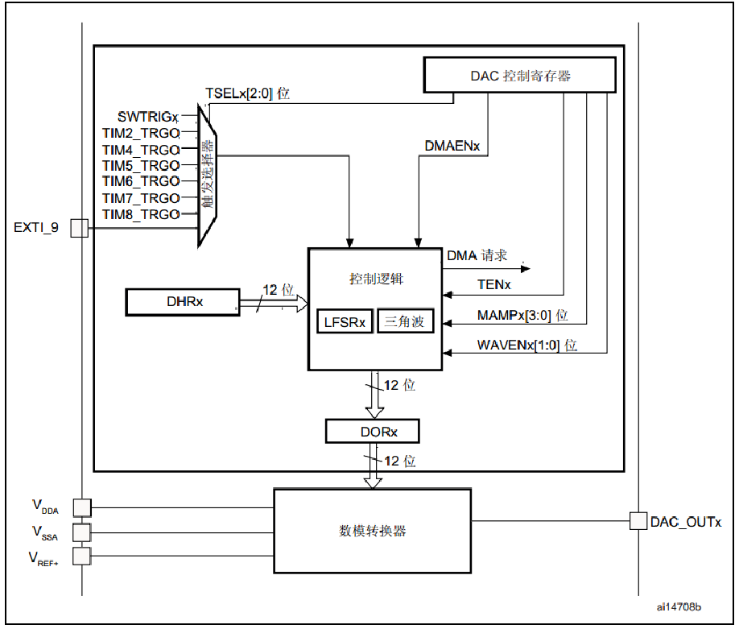
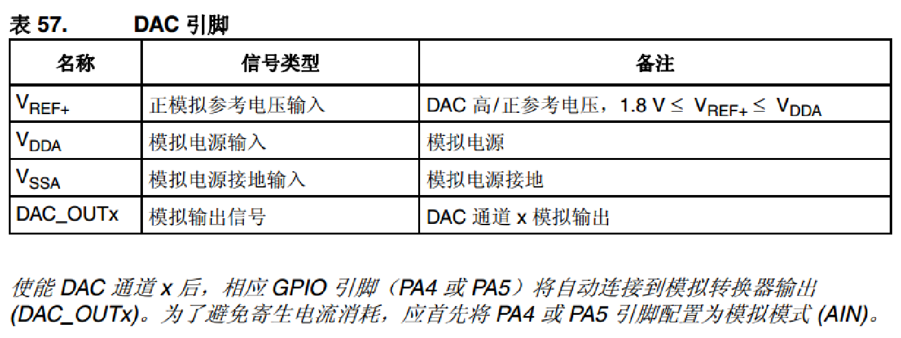
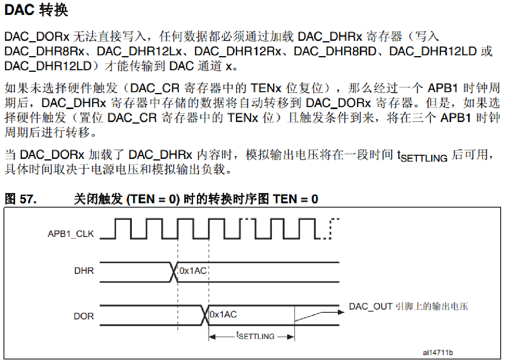
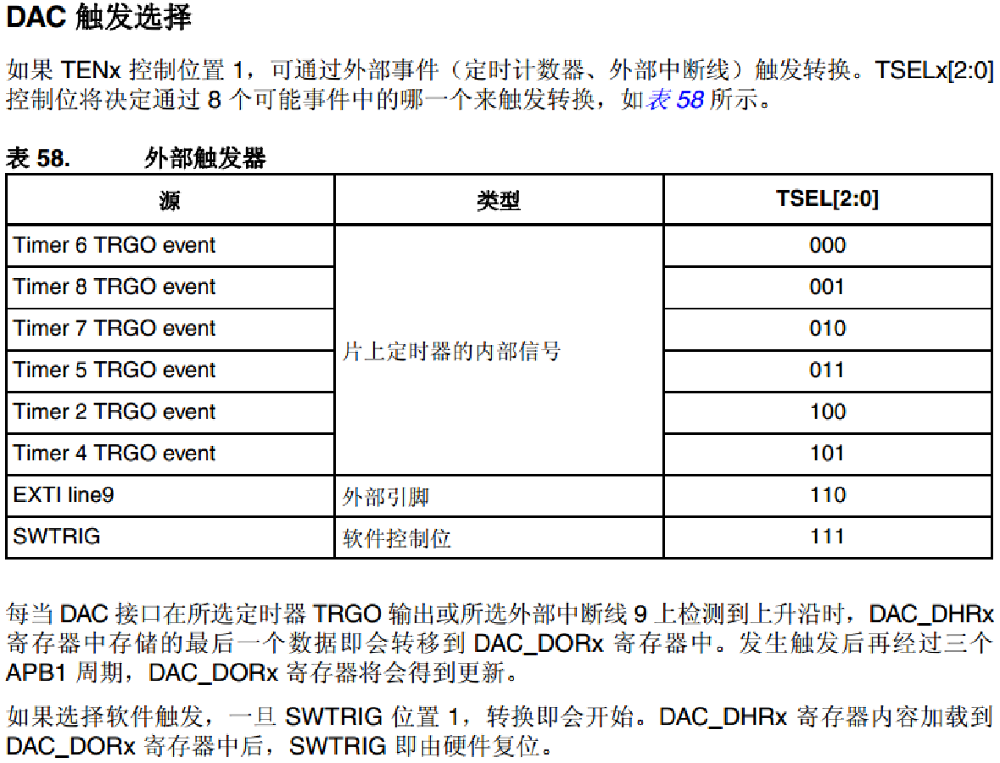
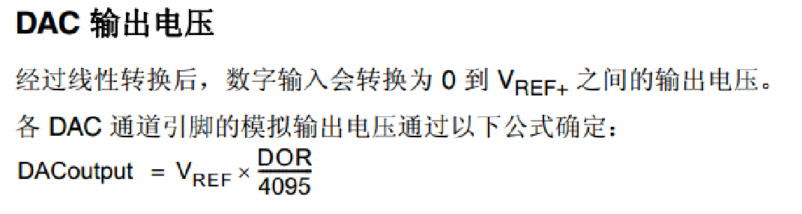
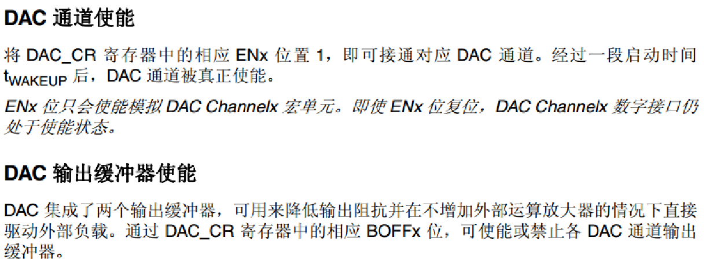
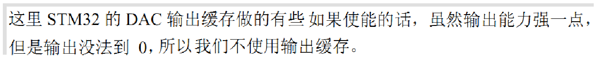
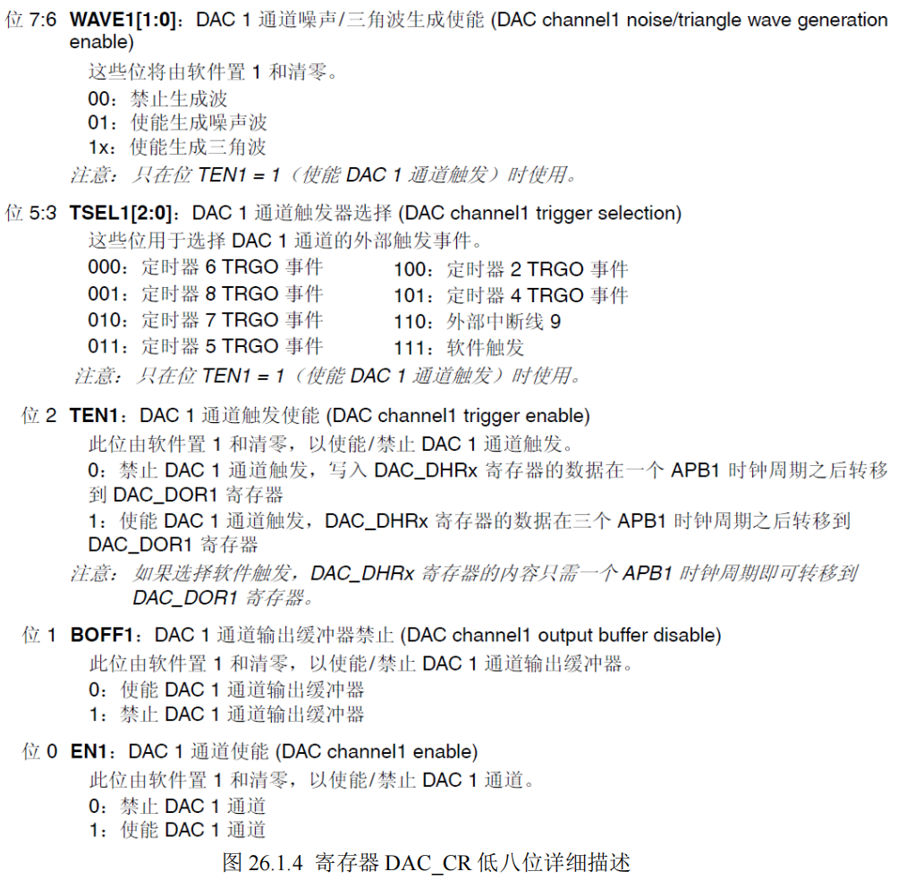

参考资料：

STM32F4开发指南-库函数版本_V1.1.pdf\第二十六章 DAC 实验

8，STM32参考资料\STM32F4xx中文参考手册.pdf\第十二章 数模转换器 (DAC)

### 一、数模转换DAC原理

####（1）概述

STM32的DAC模块(数字/模拟转换模块)是12位数字输入，电压输出型的DAC。DAC可以配置为8位或12位模式，也可以与DMA控制器配合使用。DAC工作在12位模式时，数据可以设置成左对齐或右对齐。DAC模块有2个输出通道，每个通道都有单独的转换器。在双DAC模式下，2个通道可以独立地进行转换，也可以同时进行转换并同步地更新2个通道的输出。DAC可以通过引脚输入参考电压VREF+以获得更精确的转换结果。

#### （2）特点

STM32的DAC模块主要特点有：

- 2个DAC转换器：每个转换器对应1个输出通道 
- 8位或者12位单调输出 
- 12位模式下数据左对齐或者右对齐 
- 同步更新功能 
- 噪声波形生成 
- 三角波形生成 
- 双DAC通道同时或者分别转换
- 每个通道都有DMA功能 

#### （3）DAC框图



- VDDA和VSSA为DAC模块模拟部分的供电。
- Vref+则是DAC模块的参考电压。
- DAC_OUTx就是DAC的输出通道了（对应PA4或者PA5引脚）

DAC_OUT1  ->PA4
DAC_OUT2  ->PA5








### 二、寄存器库函数配置

#### （1）寄存器

##### DAC控制寄存器 (DAC_CR)



##### DAC软件触发寄存器 (DAC_SWTRIGR)

##### DAC1通道12位右对齐数据保持寄存器(DAC_DHR12R1)

##### DAC1通道12位左对齐数据保持寄存器(DAC_DHR12L1)

##### DAC1通道8位右对齐数据保持寄存器(DAC_DHR8R1)

##### DAC2通道12位右对齐数据保持寄存器(DAC_DHR12R2)

##### DAC2通道12位左对齐数据保持寄存器(DAC_DHR12L2)

##### DAC2通道8位右对齐数据保持寄存器(DAC_DHR8R2)

##### 双DAC12位右对齐数据保持寄存器(DAC_DHR12RD)

##### 双DAC12位左对齐数据保持寄存器(DAC_DHR12LD) 

##### 双DAC8位右对齐数据保持寄存器(DAC_DHR8RD)

##### DAC1通道数据输出寄存器(DAC_DOR1)

##### DAC2通道数据输出寄存器(DAC_DOR2)

##### DAC状态寄存器(DAC_SR)

#### （2）库函数

>初始化函数
>
>> void DAC_Init(uint32_t DAC_Channel, DAC_InitTypeDef* DAC_InitStruct);
>>
>> 入口参数：
>> 选定的DAC通道。 
>> 指定 DAC 通道的配置信息，包含触发方式、是否使用波形生成、设置屏蔽/幅值选择器、是否使用输出缓存
>
>启用或禁用指定的 DAC 通道
>
>> void DAC_Cmd(uint32_t DAC_Channel, FunctionalState NewState);
>>
>> 入口参数：
>>
>> 通道。
>> 是否使能。
>
>为DAC通道1设置指定的数据保持寄存器值
>
>> void DAC_SetChannel1Data(uint32_t DAC_Align, uint16_t Data);
>>
>> 入口参数：
>> 数据对齐方式。
>> 加载到所选数据保存寄存器中的数据。 


### 三、实验程序讲解

（1）DAC配置步骤

- 开启PA口时钟，设置PA4为模拟输入

  ```c
  RCC_AHB1PeriphClockCmd(RCC_AHB1Periph_GPIOA, ENABLE);//使能 GPIOA 时 钟
   GPIO_InitStructure.GPIO_Pin = GPIO_Pin_4;
   GPIO_InitStructure.GPIO_Mode = GPIO_Mode_AN;//模拟输入
   GPIO_InitStructure.GPIO_PuPd = GPIO_PuPd_DOWN;//下拉
   GPIO_Init(GPIOA, &GPIO_InitStructure);//初始化
  ```

- 使能DAC1时钟

  ```c
   RCC_APB1PeriphClockCmd(RCC_APB1Periph_DAC, ENABLE);//使能 DAC 时钟
  ```

- 初始化DAC，设置DAC的工作模式

  ```c
  DAC_InitTypeDef DAC_InitType;
  DAC_InitType.DAC_Trigger=DAC_Trigger_None; //不使用触发功能 TEN1=0
  DAC_InitType.DAC_WaveGeneration=DAC_WaveGeneration_None;//不使用波形发生
  DAC_InitType.DAC_LFSRUnmask_TriangleAmplitude=DAC_LFSRUnmask_Bit0;//用来设置屏蔽/幅值选择器，选择0就行
  DAC_InitType.DAC_OutputBuffer=DAC_OutputBuffer_Disable ; //DAC1 输出缓存关闭
  DAC_Init(DAC_Channel_1,&DAC_InitType); //初始化 DAC 通道 1
  ```

- 使能DAC转换通道

  ```c
  DAC_Cmd(DAC_Channel_1, ENABLE); //使能 DAC 通道 1
  ```

- 设置DAC的输出值

  ```c
  DAC_SetChannel1Data(DAC_Align_12b_R, 0); //12 位右对齐数据格式设置 DAC 值
  ```

