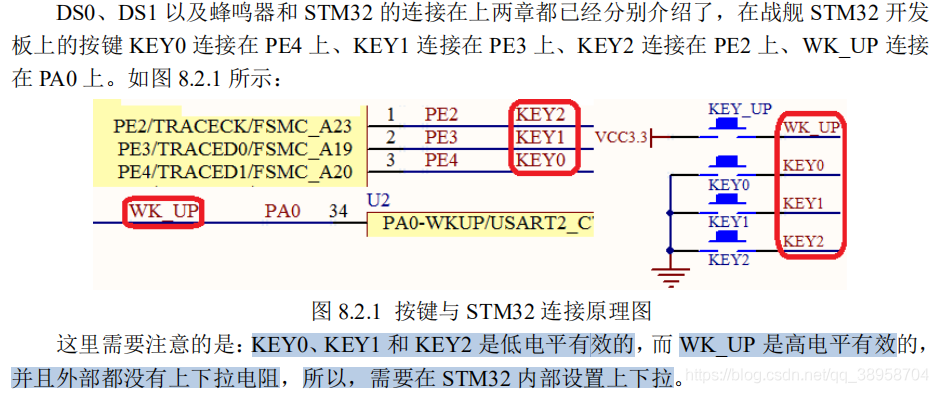

[(1条消息) STM32F1开发指南笔记9----按键输入__Amen的博客-CSDN博客](https://blog.csdn.net/qq_38958704/article/details/105345144)

# 使用的开发板上，有板载的4个按键，分别是WK_UP、KEY0、KEY1、KEY2

# WK_UP连在PA0、KEY0连在PE4、KEY1连在PE3、KEY2连在PE2

## KEY0、KEY1、KEY2低电平有效

## WK_UP高电平有效

~~~c
//按键初始化函数
void KEY_Init(void) //IO初始化
{ 
 	GPIO_InitTypeDef GPIO_InitStructure;
 
 	RCC_APB2PeriphClockCmd(RCC_APB2Periph_GPIOA|RCC_APB2Periph_GPIOE,ENABLE);//使能PORTA,PORTE时钟

	GPIO_InitStructure.GPIO_Pin  = GPIO_Pin_2|GPIO_Pin_3|GPIO_Pin_4;//KEY0-KEY2
	GPIO_InitStructure.GPIO_Mode = GPIO_Mode_IPU; //设置成上拉输入
 	GPIO_Init(GPIOE, &GPIO_InitStructure);//初始化GPIOE2,3,4

	//初始化 WK_UP-->GPIOA.0	  下拉输入
	GPIO_InitStructure.GPIO_Pin  = GPIO_Pin_0;
	GPIO_InitStructure.GPIO_Mode = GPIO_Mode_IPD; //PA0设置成输入，默认下拉	  
	GPIO_Init(GPIOA, &GPIO_InitStructure);//初始化GPIOA.0

}
//按键处理函数
//返回按键值
//mode:0,不支持连续按;1,支持连续按;
//0，没有任何按键按下
//1，KEY0按下
//2，KEY1按下
//3，KEY2按下 
//4，KEY3按下 WK_UP
//注意此函数有响应优先级,KEY0>KEY1>KEY2>KEY3!!
u8 KEY_Scan(u8 mode)
{	 
	static u8 key_up=1;//按键按松开标志
	if(mode)key_up=1;  //支持连按		  
	if(key_up&&(KEY0==0||KEY1==0||KEY2==0||WK_UP==1))
	{
		delay_ms(10);//去抖动 
		key_up=0;
		if(KEY0==0)return KEY0_PRES;
		else if(KEY1==0)return KEY1_PRES;
		else if(KEY2==0)return KEY2_PRES;
		else if(WK_UP==1)return WKUP_PRES;
	}else if(KEY0==1&&KEY1==1&&KEY2==1&&WK_UP==0)key_up=1; 	    
 	return 0;// 无按键按下
}
~~~

