# 一、入门

## （一）引入

- 传感器按时间回传的数据有一定的噪声，而滤波的作用是将回传数据中的噪声变得更加平滑，更趋于真实值。

- 图中，黑色虚线为期望的真实值，红色为传感器回传的原始数据，紫色为滤波后的数据
  -  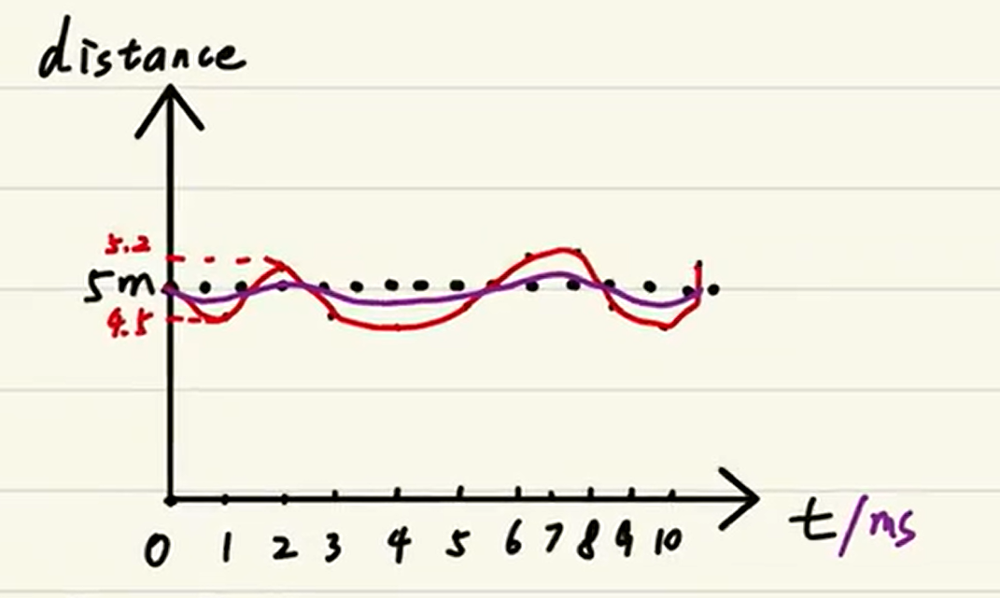 

##（二）适用系统——线性高斯系统

### 1.线性

- 叠加性
  - 已知一个系统，其输入为$x_1$、$x_2$、输出为$y$。输入$x_1$、$x_2$同时作用于该系统时输出$y$。其中$y$等价于输入$x_1$、$x_2$分别作用于两个不同的系统分别输出的$y_1$、$y_2$的和。
  -  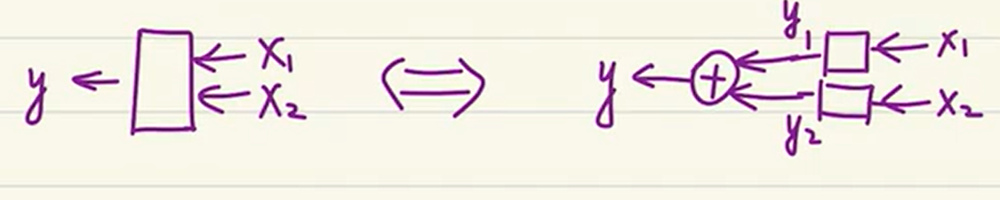 
  - 方程为$y=ax_1+bx_2$
- 齐次性
  - 已知一个系统，输入为$x$，输出为$y$。当输入$x$增大$k$倍时，输出$y$也同时增大$k$倍。
  -   

### 2.高斯

- 噪声满足正态分布
- 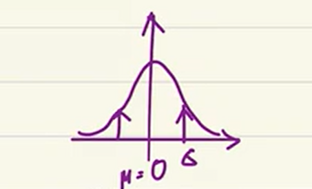 

## （三）宏观意义

- 滤波即加权
- 理想状态下，滤波时信号的加权值应该为1，噪声的加权值应该为0
- 当信号值为低频时，噪声值为高频时，我们所使用的的滤波器为低通滤波器，此时低频值的权重近似为1，高频值的权重近似为0
- 而卡尔曼滤波用于加权的值为估计值和观测值，当我们确定了这两个值的权重后，便得到滤波后的修正值
-   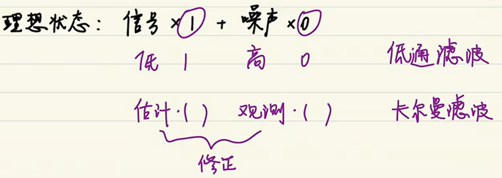

# 二、进阶

## （一）状态空间表达式

### 1.状态方程

- $x_k=Ax_{k-1}+Bu_k+w_k$
  - $x_k$：该状态量的当前值
  - $x_{k-1}$：上一个时刻该状态量的值
  - $u_k$：该状态量的输入值
  - $w_k$：`过程噪声`，被控系统受到的干扰
  - A为系统矩阵，表示系统内部变量之间的联系，取决于被控系统的作用机理、结构和各项参数
  - B为输出矩阵，表示各个输入变量如何控制状态变量

###2.观测方程

- $y_k=Cx_k+v_k$
  - $y_k$：观测量
  - $x_k$：状态量
  - $v_k$：`观测噪声`
  - C为输出矩阵，表示输出如何反应状态变量

### 3.举例

-   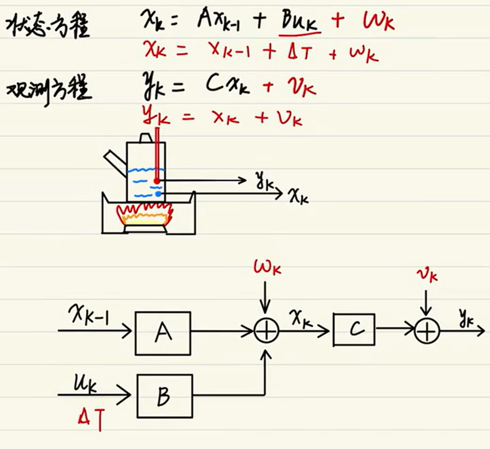

## （二）高斯分布

### 1.直观图解

-   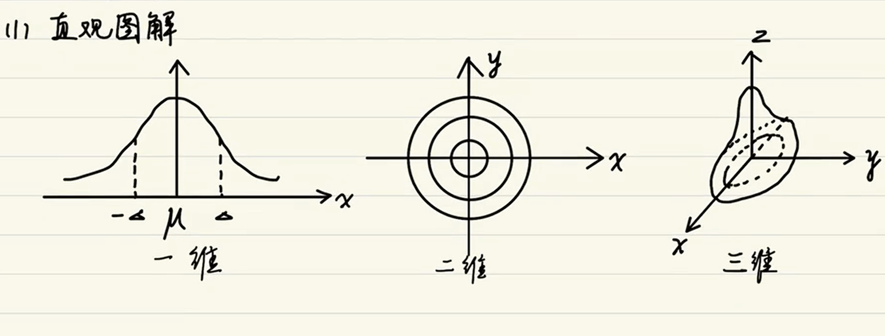

### 2.参数分析

- 噪声的解析

  - 过程噪声$w_k\in正态分布N(0;Q_k)$，数学期望（即均值）为0，方差为$Q_k$

  - 观测噪声$v_k\in正态分布N(0;R_k)$，数学期望（即均值）为0，方差为$R_k$

  - 以上统称为高斯白噪声
  - 观测噪声$v_k$符合正态分布、所以我们可以通过观测时的方差$R_k$来拟合观测噪声

- 方差

  - 一维方差，即在一维变量时，系统内部的产生的方差，包含了噪声方差和状态方差
    - 噪声方差：$Q_k$、$R_k$
    - 状态方差：估计值的方差
      -  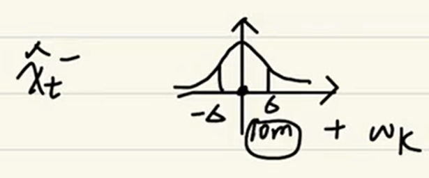
  - 二维协方差
    -  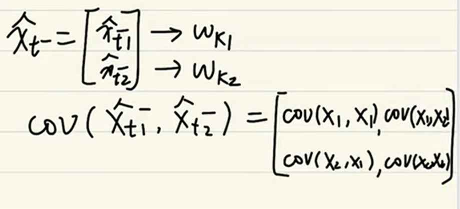
  - 三维协方差
    -  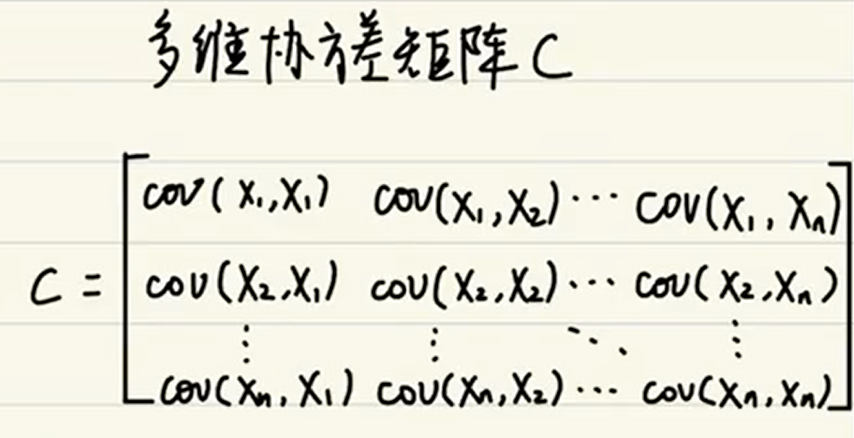

## （三）超参数

- P、I、D，PID控制时调节的参数，这类参数称为超参数。
- 同样，$Q$、$R$是卡尔曼滤波里的超参数。
  - $Q$过程噪声的方差
  - $R$观测噪声的方差

##（四）卡尔曼直观图解

- $\widehat{x}_{k-1}$：上一个时刻的最优估计值，也叫修正值，又叫后验估计值，即卡尔曼滤波最终的输出值
- $\widehat{x}_{k-1}^-$：先验估计值，通过上一个时刻的最优估计值预测出
- $y_k=x_k$：观测值，传感器回传的值
- 以上三个值均符合高斯分布，其中，先验估计值与观测值交集即为最优估计值$\widehat{x}_{k}^-$
- 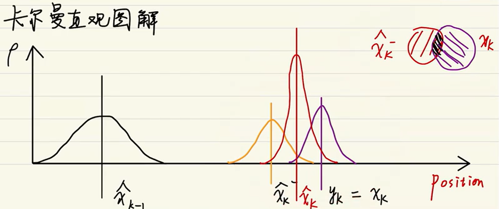

# 三、放弃

##（一）卡尔曼滤波公式回顾

### 实现过程

- 使用上一次的最优结果预测当前的值，同时使用观测值修正当前值，得到最优结果

### 公式

- 预测公式
  - $\widehat{x}_{t}^-=F\widehat{x}_{t-1}^-+Bu_{t-1}$：根据上一次的最优估计值来推导出先验估计值	
  - $P_t^-=FP_{t-1}F^T+Q$：先验估计值的协方差公式，$P_t^-$为协方差矩阵

- 更新公式
  - $K_t=P_t^-H^T(HP_t^-H^T-R)^{-1}$：$K_t$为卡尔曼增益
  - $\widehat{x}_{t}=\widehat{x}_{t}^-+K_t(z_t-H\widehat{x}_{t}^-)$：最优估计值 = 先验估计值 + 卡尔曼增益 * （观测值 - 先验估计值）
  - $P_t=(I-K_tH)P_t^-$：协方差矩阵的更新

### 预测公式模型

- 先验估计公式
  - 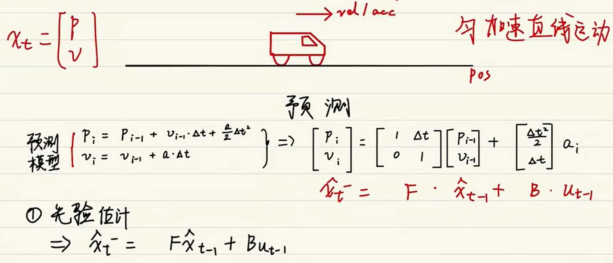
- 先验估计协方差
  -  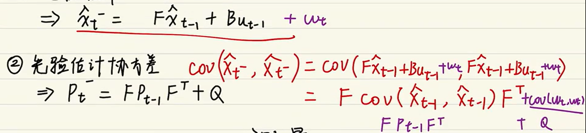
- 测量方程
  - 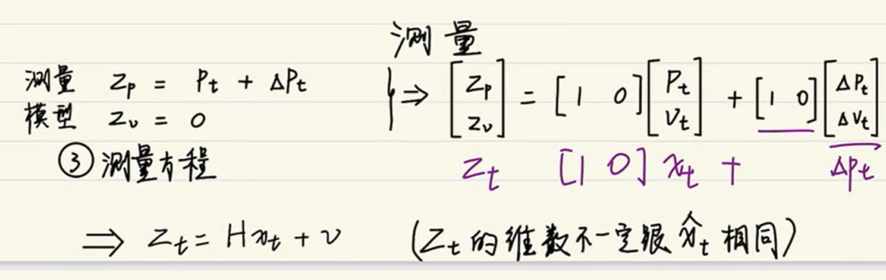

### 更新公式模型

- 更新卡尔曼增益
  - 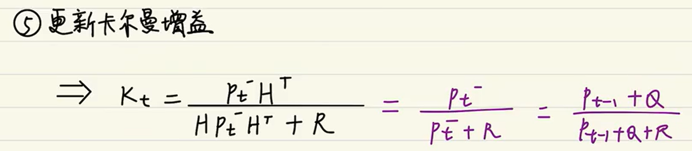
- 修正估计
  - $\widehat{x}_{t}=\widehat{x}_{t}^-+K_t(z_t-H\widehat{x}_{t}^-)$中，最优估计值 = 先验估计值 + 卡尔曼增益 * （测量值 - 测量状态量的权值矩阵 * 先验估计值）
  - 测量值 - 测量状态量的权值矩阵 * 先验估计值，为测量方程中的噪声$v$
- 更新后验估计协方差
  - $P_t=(I-K_tH)P_t^-$
  - 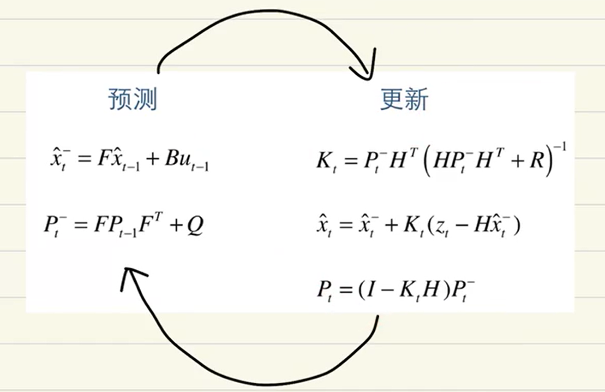

## （二）调节超参数

### $Q与R的取值$

- 公式层面理解
  - 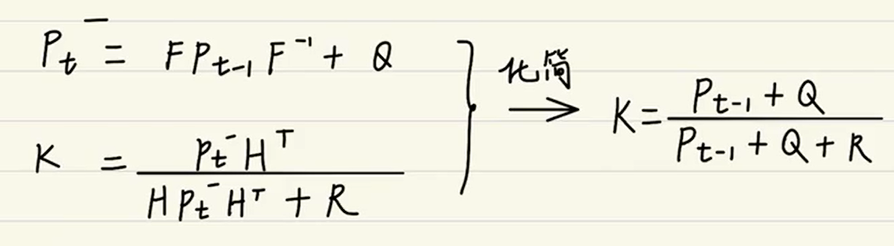
  - $Q$是过程噪声方差，$R$是观测噪声方差
  - 如果更信任观测值，可以减小$R$的值，这时，K的值就会增大。
  - 如果认为数学模型十分接近系统的变化，可以减小$Q$值，这时，K的值就会减小。
  - 即增大Ｋ值，更信任观测值；减小K值，更信任先验估计值。
- 其他层面理解
  - $Q$：建立的模型十分理想，过程噪声减小。此时，可以减小$Q$值，进而减小K值。
  - $R$：传感器精度很高，观测噪声减小。此时，可以减小$R$值，进而增大K值。

###$P_0与\widehat{x}_{0}的取值$

- $P_0$的取值：$P_0$往小取，方便收敛。==一般取1，不可为0==
- $\widehat{x}_{0}$的取值：习惯取$\widehat{x}_{0}=0$

## （三）卡尔曼滤波的使用

- 选择状态量、观测量
- 构建方程：根据运动模型和观测模型建立方程
- 初始化参数：$Q$、$R$、$P_0$、$\widehat{x}_{0}$
- 代入公式迭代：预测公式、更新公式
- 调节超参数：$Q$、$R$

# 四、精通

## （一）卡尔曼滤波公式回顾

- 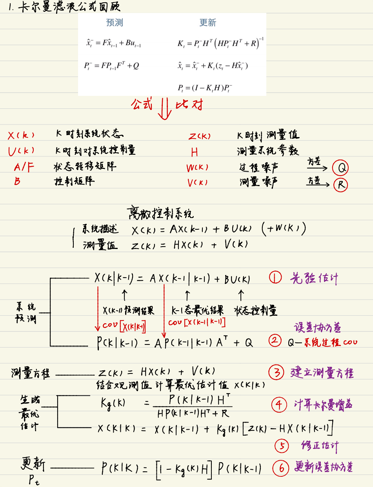

## （二）机器人应用举例

- 略

---

# 公式推导

- 真实状态矩阵：
  - $X(k)=AX(k-1)+BU(k)+w(k)$
  - $X(k)$来表示k时刻系统的真实状态矩阵
  - A是状态转移矩阵、B为控制矩阵、$U(k)$是系统的输入、$w(k)$是噪声矩阵
- 测量矩阵：$z_t=H\widehat{x}_{t}^-+v$
  - $Z(k)=HX(k)+v(k)$
  - $Z(k)$在k时刻对系统的真实值进行测量、H是测量矩阵、$v(k)$是测量误差，符合高斯分布
- $\widehat{x}_{t}^-=F\widehat{x}_{t-1}^-+Bu_{t-1}$
  - $X(k|k-1)=AX(k-1|k-1)+BU(k)$
  - 
- $z_t=H\widehat{x}_{t}^-+v$、$\widehat{x}_{t}=\widehat{x}_{t}^-+K_t(z_t-H\widehat{x}_{t}^-)$
  - $X(k|k)=X(k|k-1)+K(k)[Z(k)-HX(k|k-1)]$
- $P_t^-=FP_{t-1}F^T+Q$

未完…………

---

[(6条消息) 卡尔曼滤波原理详解及系统模型建立（simulink）_Donald�的博客-CSDN博客_simulink 卡尔曼](https://blog.csdn.net/weixin_43942325/article/details/103416681)
