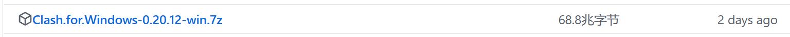
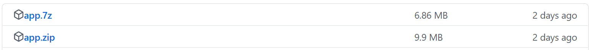
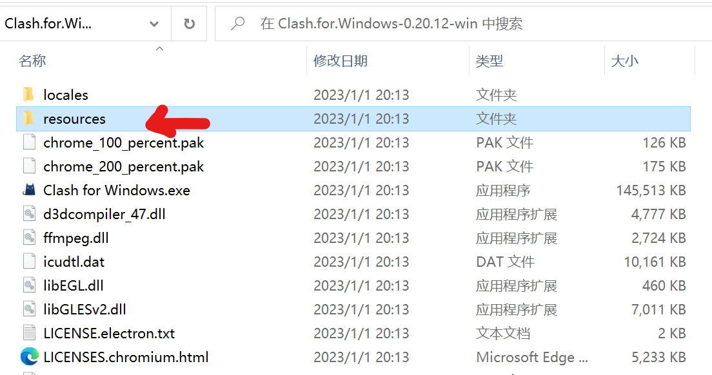
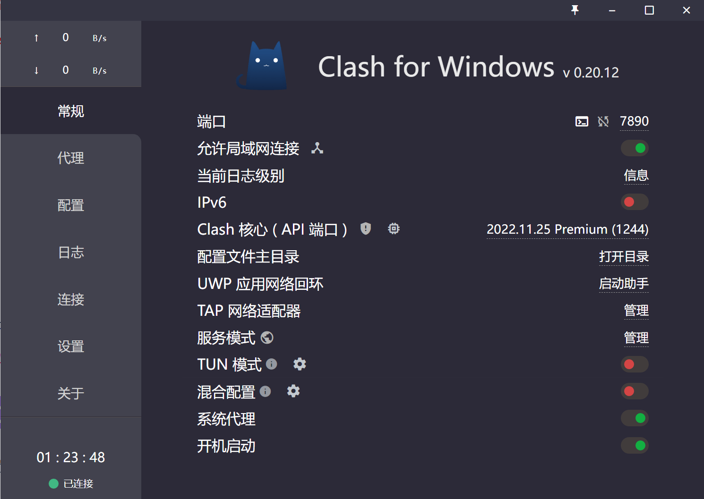
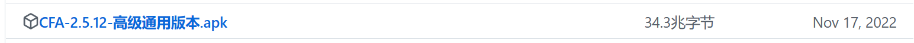
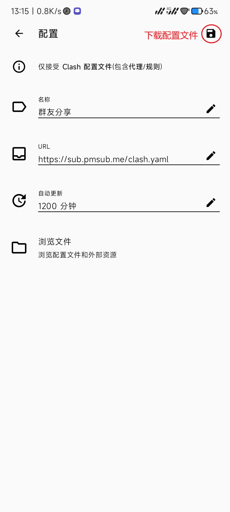

#下载Clash for Windows并汉化

##下载Clash for Windows

访问https://github.com/Fndroid/clash_for_windows_pkg/releases选择自己所需的版本，Windows选择

##下载Clash for Windows汉化包

访问https://github.com/BoyceLig/Clash_Chinese_Patch/releases任选一个压缩包下载

## 安装并汉化

将**Clash for Windows**的压缩包放置在安装文件夹，解压缩

打开此文件夹，将其中的`app.asar`文件替换为汉化包中的文件，此时再运行exe文件，界面就会变成中文的了。

**注：如果在汉化前运行过exe文件，那么需要重启一次界面才会变成中文**

# 简单的开启方式

在“配置”中输入URL：https://sub.pmsub.me/clash.yaml，然后点击下载，等待下载完成，下载完成之后，代理中就有节点使用了。

选择一个延迟低的节点，再去“常规”中开启以下几个，就可以正常使用了

**注：配置中的URL需要在使用一段时间后手动更新**

别人写的图文教程：https://clashforwindows.top/

# 添加更多的节点

将订阅链接去订阅转换网站转换成URL

>订阅转换网站：
>
>> https://sub.feng666.tk/
>>
>> https://sub.v1.mk/
>
>订阅链接：https://fank.fankfly.top/api/v1/client/subscribe?token=d18cafc2269971cf65d843074127155e
>已用上行：744.898 MB
>已用下行：10.586 GB
>剩余：133.717 GB
>总共：145.000 GB
>过期时间：2023-01-11
>剩余时间：11天23小时
>
>订阅链接：https://dddd.lol/api/v1/client/subscribe?token=b462697451f238eb01f5ebd2b6376b57
>已用上行：199.750 MB
>已用下行：24.167 GB
>剩余：75.657 GB
>总共：100.000 GB
>到期时间：没有说明捏
>
>订阅链接：https://ddddb1.cyou/api/v1/client/subscribe?token=dabdd9c86af0d95e32273bd445367944
>已用上行：2.572 GB
>已用下行：220.198 GB
>剩余：277.253 GB
>总共：500.000 GB
>到期时间：没有说明捏
>
>订阅链接：https://ddddb1.cyou/api/v1/client/subscribe?token=afa222c5b3599e4eb361bb0141ef3984
>已用上行：168.534 MB
>已用下行：34.331 GB
>剩余：165.523 GB
>总共：200.000 GB
>到期时间：没有说明捏
>
>订阅链接：https://www.efcloud.cc/api/v1/client/subscribe?token=173d7a43eafc142396a521b2a7093af1
>已用上行：54.450 MB
>已用下行：7.391 GB
>剩余：292.578 GB
>总共：300.000 GB
>过期时间：2023-01-11
>剩余时间：11天02小时
>
>订阅链接：https://www.efcloud.cc/api/v1/client/subscribe?token=32ab3e20458a9fb4f352a5c45d730446
>已用上行：61.489 MB
>已用下行：10.198 GB
>剩余：89.763 GB
>总共：100.000 GB
>过期时间：2023-01-11
>剩余时间：11天13小时
>
>订阅链接：https://jmoesub.bygcloud.com/api/v1/client/subscribe?token=ab792eaa707b6ba8597770b3fd29d273
>已用上行：178.435 KB
>已用下行：1.318 MB
>剩余：139.1022 GB
>总共：140.000 GB
>过期时间：2023-01-29
>剩余时间：29天22小时
>
>订阅链接：https://jmoesub.bygcloud.com/api/v1/client/subscribe?token=455db26395ae8ec7576a10a693c77689
>已用上行：314.624 MB
>已用下行：53.894 GB
>剩余：85.838 GB
>总共：140.000 GB
>过期时间：2023-01-17
>剩余时间：17天09小时
>
>订阅链接：https://www.xiaobaicloud.tk/api/v1/client/subscribe?token=d852bc6401171ea404d2bb8cf3dc44e3
>已用上行：3.962 MB
>已用下行：147.628 MB
>剩余：97.669 TB
>总共：97.670 TB
>过期时间：2049-01-01
>剩余时间：9498天15小时
>
>订阅链接：https://ylimly.net/api/v1/client/subscribe?token=5287c79a5365fbc9c0f74e44f07c45f6
>已用上行：13.211 MB
>已用下行：8.235 GB
>剩余：1015.775 GB
>总共：1.000 TB
>过期时间：2023-01-16
>剩余时间：16天12小时

#Clash for Android的使用方法

## 下载

下载地址：https://github.com/Kr328/ClashForAndroid/releases，根据手机选择不同的apk文件。不清楚手机型号的直接下图片中这个。

##安装

**无视风险安装**

## 使用

和**Clash for Windows**一样在配置中导入URL，下载，然后就可以在代理中寻找节点使用了

