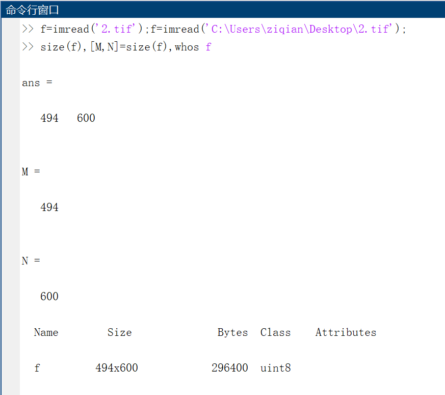
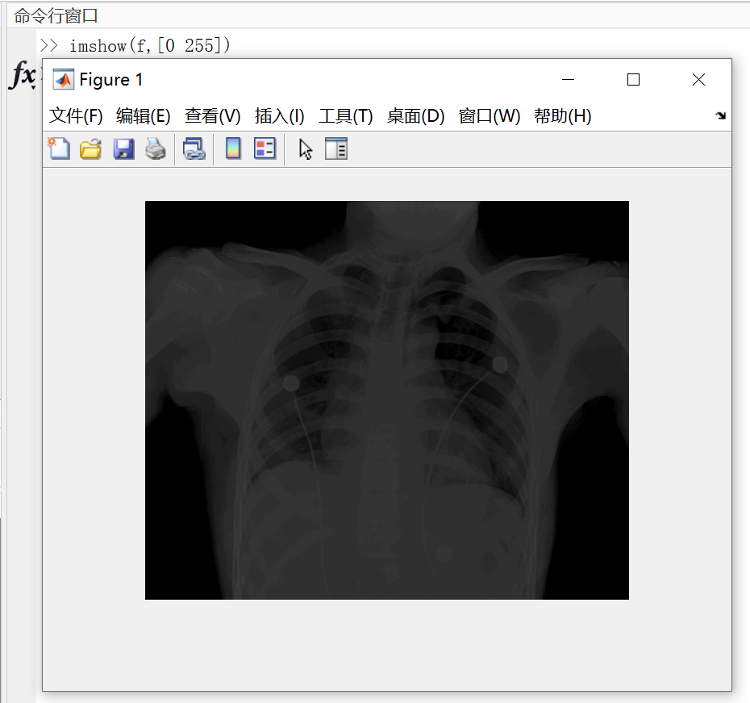
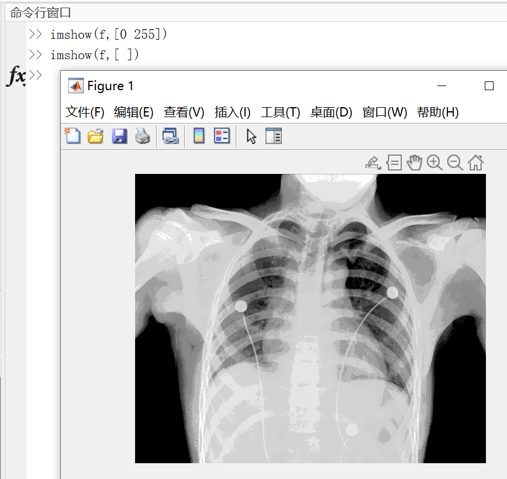
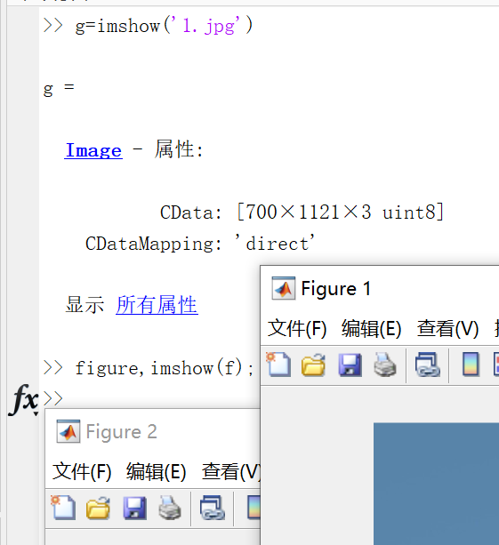

# 第一章  绪论

## 什么是数字图像处理

一幅图像可以定义为一个二维函数$f(x,y)$，其中$x$和$y$是空间坐标，而/在任意一对坐标$f(x,y)$处的幅度称为该点处图像的亮度或灰度。当$x,y$和$f$的幅值都是有限的离散值时，称该图像为数字图像。数字图像处理就是用计算机处理数字图像。

图像处理和图像分析之间的重叠之处是`图像中单个区域或对象的识别`。这样，本书中所谓的数字图像处理就包含了==其输入和输出都是图像的过程，从图像中提取特性的过程，以及对单个对象进行识别的过程==

## MATLAB

# 第二章

## 数字图像的表示

###坐标约定

### 矩阵表示

##读取图像、显示图像、保存图像

# 第三章

