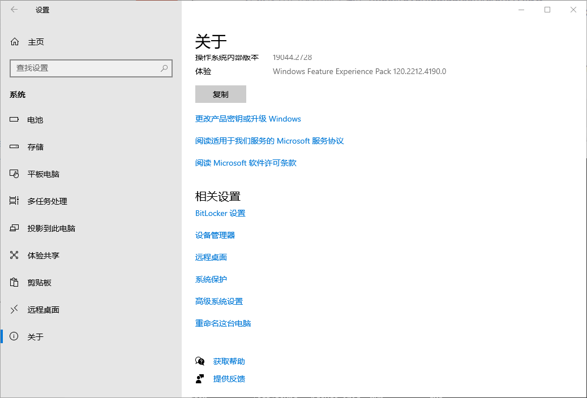

# 在windows使用adb连接V831

## 下载adb

首先在https://dl.google.com/android/repository/platform-tools-latest-windows.zip下载windows版本的adb

下载完成后解压缩到自定义的安装目录

## 配置环境变量

打开windows的设置》关于》高级系统设置》高级》环境变量》系统变量》Path




**将adb的存放路径添加进path中**


打开命令行进行校验是否安装成功：

```
adb --version
```

**显示版本信息代表安装成功**

##连接V831 

输入

```
adb shell
```

连接成功


之后 就可以像linux一样操作V831

可以输入

```
exit
```

退出


## 测试屏幕好坏

首先在V831上切换功能到“退出”，按下“退出”按键后将系统退出

输入

```
cat /dev/urandom > /dev/fb0
```

产生雪花屏，说明屏幕正常

如果没有退出系统就输入该命令V831会显示**cat: write error: No space left on device**

## 运行Python3 解释器

输入 

```
python3 
```

即可启动Python3 解释器，可直接复制代码粘贴后按回车键运行。类似于在windows终端直接调用python解释器


和在windows终端直接调用python解释器一样，输入

```
exit()
```

即可退出

也可以输入

```
python --version
```

得到python版本

